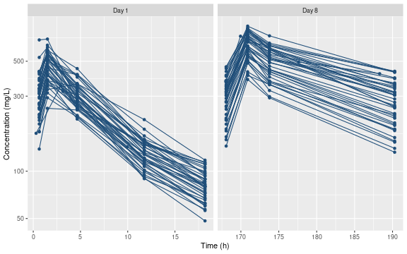
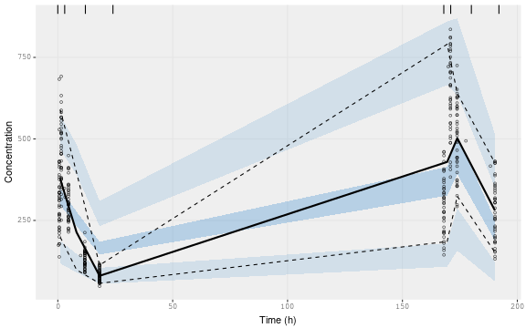
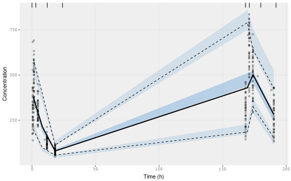

This vignette includes an updated and simplified version of the code used for the tutorial published in_Clinical Pharmacology & Therapeutics: Pharmacometrics and Systems Pharmacology_ in 2019 [https://doi.org/10.1002/psp4.12445](https://doi.org/10.1002/psp4.12445). It includes a number of updates to keep the examples working with current versions of `nlmixr2` and `rxode2`. Workflow is, on the whole, not different, although some commands and parameters have changed. 


```r

library(gridExtra)
library(rxode2)
library(MASS)
library(data.table)
library(ggplot2)
library(nlmixr2)
library(xpose)
#> Error in library(xpose): there is no package called 'xpose'
library(xpose.nlmixr2)
#> Error in library(xpose.nlmixr2): there is no package called 'xpose.nlmixr2'
library(shinyMixR)
#> Error in library(shinyMixR): there is no package called 'shinyMixR'
library(tibble)
```

## Setting up the data 

The first step is to simulate the data we will need to run the examples. For this tutorial, we'll use a two-compartmental PK model with some correlation between parameters, and covariate effects of body weight and sex. 


```r
mod <- rxode2({
  k10 = CL/V2
  k12 = Q/V2
  k21 = Q/V3
  d/dt(depot) =-KA*depot;
  d/dt(centr) = KA*depot - k10*centr - k12*centr + k21*peri;
  d/dt(peri)  =                        k12*centr - k21*peri;
  C2 = centr/V2;
  C3 = peri/V3;
  cp = C2 
})

theta <- c(TKA=1.05, TCL=0.121, TV2=1.939,
           TQ=0.282, TV3=5.65)

omegaCor <- matrix(c(1,    0.5, 0.25, 0.1,  0,
                     0.5,  1,   0.5,  0.1,  0,
                     0.25, 0.5, 1,    0.1,  0,
                     0.1,  0.1, 0.1,  1,    0,
                     0,    0,   0,    0,    1), 
                   dimnames=list(NULL,c("eta.CL",
                                        "eta.V2",
                                        "eta.V3", 
                                        "eta.Q", 
                                        "eta.KA")), nrow=5)

iiv.sd <- c(0.25, 0.25, 0.25, 0.3, 0.3) ## SDs of model parameters

iiv <- iiv.sd %*% t(iiv.sd)
omega <- iiv * omegaCor  # covariance matrix

sigma <- diag(1)*0.1
dimnames(sigma) <- list(NULL, c("cp.err"))

set.seed(740727)

mv <- mvrnorm(40, rep(0, dim(omega)[1]), omega) # Sample from covariance matrix

# Combine population parameters with IIV
params.all <-
  data.table(
    "ID" = seq(1:40),
    "CL" = theta['TCL'] * exp(mv[, 1]),
    "V2" = theta['TV2'] * exp(mv[, 2]),
    "V3" = theta['TV3'] * exp(mv[, 3]),
    "Q"  = theta['TQ']  * exp(mv[, 4]),
    "KA" = theta['TKA'] * exp(mv[, 5]),
    "WT" = round(rnorm(40,70,15)),
    "SEX" = rbinom(n = 40, prob = 0.5, size =1)
  )
#set the doses (looping through the 4 doses)
params.all[, AMT := 1200]

params.all$CL <- params.all$CL * (params.all$WT/70)^0.75
params.all$V2 <- params.all$V2 * (1 - 0.2 * params.all$SEX)

s = lapply(1:40, function(i) {
  # selects the parameters associated with the subject to be simulated
  params <- params.all[i]
  # creates an eventTable with 7 doses every 24 hours
  ev <- eventTable()
  ev$add.dosing(
    dose = params$AMT,
    nbr.doses = 28,
    dosing.to = 1,
    dosing.interval = 24,
    rate = NULL,
    start.time = 0
  )

  smp <- c(round(runif(1, 0, 1),3),
           round(runif(1, 1, 3),3),
           round(runif(1, 3, 6), 3),
           round(runif(1, 6, 12), 3),
           round(runif(1, 18, 23.9), 3),
           round(runif(1, 168, 169),3),
           round(runif(1, 169, 171),3),
           round(runif(1, 171, 180),3),
           round(runif(1, 188, 191.9),3))

  ev$add.sampling(smp)

  x <- as.data.table(mod$run(params, ev, seed=740727))
  x$rv <- rnorm(nrow(x), 0, 0.075)
  x$DV <- round(x$cp * (1 + x$rv),1)
  x$ID <- i

  x[, names(params) := params]
})

sim <- as.data.table(do.call("rbind", s))

setnames(sim, "time", "TIME")

Dose <- expand.grid(TIME = seq(0, 7 * 24, 24), ID = params.all$ID, DV=0)
Dose <- data.table(merge(Dose, params.all, by = "ID"))
Dose[, EVID := 101]

sim[, EVID := 0]
sim[, AMT := 0]

sim <- sim[,c("ID","TIME","DV","WT","SEX","AMT","EVID")]
dat <- rbind(sim, Dose[,c("ID","TIME","DV","WT","SEX","AMT","EVID")])
setkey(dat, ID, TIME)
```

Here's what the data look like, stratified by day.


```r
dat$Day <- "Day 1"
dat$Day[dat$TIME>167] <- "Day 8"

ggplot(subset(data.frame(dat), EVID==0), aes(TIME, DV)) + geom_point(col="#1F4E79") +
  geom_line(aes(group=ID), col="#1F4E79") +
  scale_x_continuous("Time (h)") +
  scale_y_log10("Concentration (mg/L)") +
  facet_wrap(~ Day, scales="free_x")
```




## Model exploration

### One-compartmental, using NLME

We start our model exploration using a one-compartmental model, fitted using the NLME method. This is known to be terrible, but let's see just how terrible. We will request NPDE and CWRES by specifying `table=tableControl(cwres=TRUE, npde=TRUE)`. 


```r
model.1cpt.cf <- function() {
  ini({
    tka <- log(1.5)
    tcl <- log(1.5)
    tv  <- log(3)
    eta.ka ~ 0.1
    eta.cl ~ 0.1
    eta.v ~ 0.1
    add.err <- 0.01
  })
  model({
    ka <- exp(tka + eta.ka)
    cl <- exp(tcl + eta.cl)
    v <- exp(tv + eta.v)
    linCmt() ~ add(add.err)
  })
}

fit.1cpt.cf.nlme <- nlmixr2(model.1cpt.cf, dat, est="nlme", table=tableControl(cwres=TRUE, npde=TRUE))
#> 
[====|====|====|====|====|====|====|====|====|====] 100%; 0:00:00 
                                                                                 
#> **Iteration 1
#> LME step: Loglik: -2367.553, nlminb iterations: 23
#> reStruct  parameters:
#>       ID1       ID2       ID3 
#> 14.151537  6.571178 14.463946 
#>  Beginning PNLS step: ..  completed fit_nlme() step.
#> PNLS step: RSS =  2858751 
#>  fixed effects: 1.028939  -2.068088  1.076662  
#>  iterations: 12 
#> Convergence crit. (must all become <= tolerance = 1e-05):
#>     fixed  reStruct 
#> 1.1960580 0.5625187 
#> 
#> **Iteration 2
#> LME step: Loglik: -2162.418, nlminb iterations: 1
#> reStruct  parameters:
#>       ID1       ID2       ID3 
#> 14.154517  5.892278 14.463463 
#>  Beginning PNLS step: ..  completed fit_nlme() step.
#> PNLS step: RSS =  2858751 
#>  fixed effects: 1.028939  -2.068088  1.076662  
#>  iterations: 1 
#> Convergence crit. (must all become <= tolerance = 1e-05):
#>        fixed     reStruct 
#> 0.000000e+00 2.806349e-08 
#> 
[=>-----------------------------------------------]  06%; 0:00:00 
[====|====|====|====|====|====|====|====|====|====] 100%; 0:00:00 
                                                                                 

[====|====|====|====|====|====|====|====|====|====] 100%; 0:00:00 
                                                                                 

>-------------------------------------------------]  00%; 0:00:00 
                                                                                 

[====|====|====|====|====|====|====|====|====|====] 100%; 0:00:00 
                                                                                 

[====|====|====|====|====|====|====|====|====|====] 100%; 0:00:00 
                                                                                 

[====|====|====|====|====|====|====|====|====|====] 100%; 0:00:00 
                                                                                 

[====|====|====|====|====|====|====|====|====|====] 100%; 0:00:00 
                                                                                 

[====|====|====|====|====|====|====|====|====|====] 100%; 0:00:00 
                                                                                 

[====|====|====|====|====|====|====|====|====|====] 100%; 0:00:00 
                                                                                 

[====|====|====|====|====|====|====|====|====|====] 100%; 0:00:00 
                                                                                 

>-------------------------------------------------]  00%; 0:00:00 
                                                                                 

[====|====|====|====|====|====|====|====|====|====] 100%; 0:00:00 
                                                                                 

[====|====|====|====|====|====|====|====|====|====] 100%; 0:00:00 
                                                                                 

[====|====|====|====|====|====|====|====|====|====] 100%; 0:00:00 
                                                                                 

[====|====|====|====|====|====|====|====|====|====] 100%; 0:00:00 
                                                                                 

[====|====|====|====|====|====|====|====|====|====] 100%; 0:00:00 
                                                                                 

[====|====|====|====|====|====|====|====|====|====] 100%; 0:00:00 
                                                                                 

[====|====|====|====|====|====|====|====|====|====] 100%; 0:00:00 
                                                                                 
```

We can see a snapshot of the results by using `print`.


```r
print(fit.1cpt.cf.nlme)
#> ── nlmixr² nlme by maximum likelihood ──
#> 
#>         OBJF      AIC      BIC Log-likelihood Condition Number
#> FOCEi 3663.2 4338.835 4366.038      -2162.418         21.79772
#> nlme  3663.2 4338.835 4366.038      -2162.418         21.79772
#> 
#> ── Time (sec $time): ──
#> 
#>            setup optimize covariance  table compress
#> elapsed 0.021381    7e-06      9e-06 12.459     0.02
#> 
#> ── Population Parameters ($parFixed or $parFixedDf): ──
#> 
#>           Est.      SE  %RSE Back-transformed(95%CI) BSV(CV%) Shrink(SD)%
#> tka      1.029  0.1185 11.52     2.798 (2.218, 3.53)  0.00635      100.% 
#> tcl     -2.068 0.04331 2.094 0.1264 (0.1161, 0.1376)     25.0      8.40% 
#> tv       1.077 0.02538 2.357    2.935 (2.792, 3.085)  0.00466      99.9% 
#> add.err  89.11                                 89.11                     
#>  
#>   Covariance Type ($covMethod): nlme
#>   No correlations in between subject variability (BSV) matrix
#>   Full BSV covariance ($omega) or correlation ($omegaR; diagonals=SDs) 
#>   Distribution stats (mean/skewness/kurtosis/p-value) available in $shrink 
#>   Censoring ($censInformation): No censoring
#> 
#> ── Fit Data (object is a modified tibble): ──
#> # A tibble: 360 × 26
#>   ID     TIME    DV EPRED  ERES   NPDE    NPD   PDE    PD  PRED   RES   WRES
#>   <fct> <dbl> <dbl> <dbl> <dbl>  <dbl>  <dbl> <dbl> <dbl> <dbl> <dbl>  <dbl>
#> 1 1     0.302  174.  244. -69.8 -0.941 -0.696 0.173 0.243  232. -57.4 -0.644
#> 2 1     2.91   348.  372. -23.6 -0.100 -0.185 0.46  0.427  366. -18.1 -0.201
#> 3 1     3.14   321.  363. -41.6 -0.496 -0.412 0.31  0.34   363. -41.2 -0.459
#> # … with 357 more rows, and 14 more variables: IPRED <dbl>, IRES <dbl>,
#> #   IWRES <dbl>, CPRED <dbl>, CRES <dbl>, CWRES <dbl>, eta.ka <dbl>,
#> #   eta.cl <dbl>, eta.v <dbl>, ka <dbl>, cl <dbl>, v <dbl>, tad <dbl>,
#> #   dosenum <dbl>
```

Now let's fit the same model using SAEM, and ordinary differential equations (ODEs).


```r
model.1cpt.ode <- function() {
  ini({
    tka <- log(1.5)
    tcl <- log(1.5)
    tv  <- log(3)
    eta.ka ~ 1
    eta.cl ~ 1
    eta.v ~ 1
    prop.err <- 0.1
  })
  model({
    ka <- exp(tka + eta.ka)
    cl <- exp(tcl + eta.cl)
    v <- exp(tv + eta.v)
    d/dt(depot) = -ka * depot
    d/dt(center) = ka * depot - cl / v * center
    cp = center / v
    cp ~ prop(prop.err)
  })
}

fit.1cpt.ode.saem <- nlmixr2(model.1cpt.ode, dat, est="saem", table=tableControl(cwres=TRUE, npde=TRUE), seed=740727)
#> 
[====|====|====|>---------------------------------]  33%; 0:00:00 
[====|====|====|====|====|====|====|====|====|====] 100%; 0:00:00 
                                                                                 

[====|====|====|====|====|====|====|====|====|====] 100%; 0:00:00 
                                                                                 
001: 0.991812	-1.543786	1.573904	0.950000	0.950000	0.950000	0.845302	
#> 002: 1.177712	-1.673530	1.536965	0.902500	0.902500	0.902500	0.699585	
#> 003: 1.172200	-1.812702	1.386223	0.857375	0.857375	0.857375	0.555542	
#> 004: 1.265072	-1.923861	1.324138	0.814506	0.814506	0.814506	0.439228	
#> 005: 1.358034	-1.946967	1.284174	0.773781	0.773781	0.773781	0.380084	
#> 006: 1.341772	-1.956018	1.245320	0.735092	0.735092	0.735092	0.352981	
#> 007: 1.390394	-1.977866	1.214045	0.698337	0.698337	0.698337	0.339285	
#> 008: 1.401140	-1.975724	1.219211	0.663420	0.663420	0.663420	0.332431	
#> 009: 1.358540	-1.976077	1.211797	0.630249	0.630249	0.630249	0.324324	
#> 010: 1.372133	-1.979182	1.213120	0.598737	0.598737	0.598737	0.326288	
#> 011: 1.387749	-1.968974	1.211480	0.568800	0.568800	0.568800	0.317367	
#> 012: 1.405834	-1.983426	1.192862	0.540360	0.540360	0.540360	0.317376	
#> 013: 1.360161	-1.983339	1.201913	0.513342	0.513342	0.513342	0.319236	
#> 014: 1.321496	-1.965498	1.192169	0.487675	0.487675	0.487675	0.325315	
#> 015: 1.335085	-1.992716	1.208043	0.463291	0.463291	0.463291	0.322107	
#> 016: 1.291291	-1.987754	1.203959	0.440127	0.440127	0.440127	0.321042	
#> 017: 1.265209	-1.994804	1.161823	0.418120	0.418120	0.418120	0.320484	
#> 018: 1.239629	-1.982599	1.184166	0.397214	0.397214	0.397214	0.316831	
#> 019: 1.300885	-1.958027	1.202090	0.377354	0.377354	0.377354	0.327300	
#> 020: 1.352925	-1.972856	1.200813	0.358486	0.358486	0.358486	0.316444	
#> 021: 1.319737	-1.965789	1.203136	0.340562	0.340562	0.340562	0.321792	
#> 022: 1.340995	-1.975941	1.215063	0.323534	0.323534	0.323534	0.320545	
#> 023: 1.349803	-1.979013	1.216125	0.307357	0.307357	0.307357	0.317449	
#> 024: 1.350858	-1.974520	1.231669	0.291989	0.291989	0.291989	0.321381	
#> 025: 1.336684	-1.994180	1.209843	0.277390	0.277390	0.277390	0.318827	
#> 026: 1.286732	-1.974597	1.195153	0.267057	0.263520	0.263520	0.323371	
#> 027: 1.303607	-1.959747	1.196477	0.253704	0.250344	0.250344	0.319020	
#> 028: 1.261824	-1.981763	1.209813	0.241019	0.237827	0.237827	0.314830	
#> 029: 1.212215	-1.992322	1.209885	0.228968	0.225936	0.225936	0.316251	
#> 030: 1.260056	-1.957642	1.206309	0.217520	0.214639	0.214639	0.320864	
#> 031: 1.257473	-1.962477	1.207768	0.206644	0.203907	0.203907	0.317665	
#> 032: 1.255208	-1.964900	1.196823	0.196311	0.193711	0.193711	0.317028	
#> 033: 1.292994	-1.989944	1.202691	0.186496	0.184026	0.184026	0.312629	
#> 034: 1.291278	-1.983355	1.185021	0.177171	0.174825	0.174825	0.304901	
#> 035: 1.245277	-2.000580	1.197361	0.168313	0.166083	0.166083	0.309889	
#> 036: 1.275054	-1.994147	1.199125	0.164430	0.157779	0.157779	0.315852	
#> 037: 1.272012	-1.980134	1.201323	0.156208	0.149890	0.149890	0.315331	
#> 038: 1.258639	-1.970948	1.195320	0.148398	0.142396	0.142396	0.317381	
#> 039: 1.309806	-1.973766	1.230793	0.141100	0.135276	0.135276	0.319561	
#> 040: 1.278412	-1.949404	1.207766	0.134045	0.128512	0.128512	0.318291	
#> 041: 1.270261	-1.971891	1.204483	0.127343	0.122087	0.122087	0.309089	
#> 042: 1.233162	-1.968189	1.223218	0.120976	0.115982	0.115982	0.315157	
#> 043: 1.244037	-1.979208	1.217063	0.114927	0.110183	0.110183	0.317113	
#> 044: 1.248815	-1.990125	1.219370	0.109180	0.104674	0.104674	0.312990	
#> 045: 1.255664	-1.987364	1.211312	0.105972	0.099440	0.099440	0.312454	
#> 046: 1.246527	-1.989405	1.215003	0.100673	0.094468	0.094468	0.312393	
#> 047: 1.248162	-1.983113	1.208726	0.114912	0.089745	0.089745	0.313334	
#> 048: 1.262254	-1.987302	1.197279	0.109167	0.085258	0.085258	0.315655	
#> 049: 1.271283	-1.985018	1.198664	0.103708	0.080995	0.080995	0.310279	
#> 050: 1.303298	-1.973831	1.200552	0.098523	0.076945	0.076945	0.312575	
#> 051: 1.320451	-1.958936	1.219082	0.093613	0.073098	0.073098	0.324311	
#> 052: 1.283385	-1.972673	1.195956	0.094683	0.069443	0.069443	0.315055	
#> 053: 1.259939	-1.980393	1.180983	0.092045	0.065971	0.065971	0.311347	
#> 054: 1.218487	-1.965190	1.195155	0.103441	0.065315	0.062672	0.315350	
#> 055: 1.224527	-1.970960	1.178936	0.098269	0.062049	0.059539	0.316510	
#> 056: 1.206727	-1.979230	1.205868	0.093356	0.058947	0.056562	0.320151	
#> 057: 1.232281	-1.955862	1.193368	0.096152	0.055999	0.053734	0.319499	
#> 058: 1.229377	-1.965695	1.203139	0.091344	0.053199	0.051047	0.320762	
#> 059: 1.238022	-1.973763	1.222167	0.086777	0.058301	0.048495	0.321831	
#> 060: 1.244342	-1.983776	1.206295	0.082438	0.059560	0.046070	0.320697	
#> 061: 1.243709	-1.964692	1.192248	0.079133	0.056582	0.043766	0.315789	
#> 062: 1.297517	-1.973525	1.208990	0.075176	0.057363	0.041578	0.315949	
#> 063: 1.273277	-1.981321	1.225672	0.074172	0.056453	0.039499	0.315104	
#> 064: 1.280553	-1.995048	1.228945	0.070463	0.054050	0.037524	0.321285	
#> 065: 1.262331	-1.963495	1.209270	0.066940	0.051348	0.035648	0.321103	
#> 066: 1.301583	-1.960970	1.229590	0.064472	0.048780	0.033866	0.322396	
#> 067: 1.287016	-1.952036	1.224324	0.062274	0.057168	0.032172	0.322383	
#> 068: 1.295017	-1.982411	1.209979	0.059161	0.055132	0.032593	0.325059	
#> 069: 1.329342	-1.967846	1.227328	0.056203	0.060816	0.030964	0.323582	
#> 070: 1.312216	-1.955770	1.220684	0.053393	0.064900	0.029415	0.325247	
#> 071: 1.296579	-1.959551	1.228361	0.053953	0.061655	0.027945	0.324746	
#> 072: 1.301065	-1.957805	1.220124	0.051255	0.058572	0.028124	0.322062	
#> 073: 1.297838	-1.954234	1.222968	0.051334	0.055644	0.026718	0.328173	
#> 074: 1.323420	-1.962599	1.234239	0.052237	0.058178	0.026040	0.324598	
#> 075: 1.292072	-1.958873	1.233498	0.050659	0.055269	0.024738	0.320404	
#> 076: 1.287713	-1.951763	1.226429	0.058518	0.052505	0.024259	0.324029	
#> 077: 1.298580	-1.966404	1.223954	0.059366	0.049880	0.023709	0.318709	
#> 078: 1.289938	-1.971842	1.236628	0.056398	0.047386	0.024071	0.324780	
#> 079: 1.299469	-1.989055	1.228475	0.054021	0.046797	0.022867	0.322791	
#> 080: 1.273393	-1.982736	1.216469	0.051320	0.051435	0.021724	0.318643	
#> 081: 1.255619	-1.962775	1.195566	0.048754	0.054726	0.020637	0.319404	
#> 082: 1.220644	-1.958076	1.182568	0.046316	0.051990	0.019659	0.315776	
#> 083: 1.223948	-1.983617	1.157212	0.044000	0.049390	0.020678	0.316830	
#> 084: 1.186053	-1.963356	1.193587	0.041800	0.046921	0.019842	0.319600	
#> 085: 1.196280	-1.968615	1.183449	0.040711	0.045136	0.020265	0.315534	
#> 086: 1.191550	-1.978061	1.184183	0.040556	0.043215	0.019252	0.318108	
#> 087: 1.179620	-1.979561	1.164253	0.044485	0.047194	0.020509	0.320178	
#> 088: 1.161901	-1.965991	1.174750	0.042260	0.048022	0.020133	0.321021	
#> 089: 1.152790	-1.961608	1.183213	0.044059	0.050129	0.019127	0.321070	
#> 090: 1.147780	-1.987511	1.181943	0.041856	0.047622	0.018170	0.319505	
#> 091: 1.153720	-1.987926	1.199563	0.039764	0.045241	0.019052	0.323654	
#> 092: 1.131941	-1.968436	1.180708	0.037775	0.042979	0.018099	0.312760	
#> 093: 1.116354	-1.988321	1.191507	0.035887	0.044733	0.017194	0.312913	
#> 094: 1.111397	-1.971295	1.190603	0.045255	0.048713	0.016335	0.315217	
#> 095: 1.086770	-1.964708	1.178182	0.042993	0.050119	0.017720	0.316756	
#> 096: 1.105290	-1.977250	1.195215	0.045491	0.053879	0.017336	0.314690	
#> 097: 1.124166	-1.992445	1.199702	0.048690	0.054412	0.016469	0.318470	
#> 098: 1.116927	-1.993775	1.196148	0.046255	0.052822	0.016876	0.319122	
#> 099: 1.130395	-1.988301	1.191684	0.043942	0.057890	0.016032	0.315549	
#> 100: 1.088311	-1.990771	1.190912	0.041745	0.054996	0.018175	0.318579	
#> 101: 1.100010	-1.990947	1.190408	0.039658	0.054518	0.018920	0.320490	
#> 102: 1.098592	-1.984867	1.192229	0.037675	0.051793	0.017974	0.319269	
#> 103: 1.099507	-1.980137	1.187604	0.035791	0.050651	0.017075	0.320468	
#> 104: 1.106313	-1.980692	1.200148	0.035113	0.049265	0.016221	0.320185	
#> 105: 1.101299	-1.984897	1.204866	0.033357	0.053140	0.015868	0.322556	
#> 106: 1.105154	-1.960338	1.201938	0.031689	0.052662	0.015440	0.324762	
#> 107: 1.119724	-1.964263	1.190869	0.030105	0.054159	0.018495	0.323758	
#> 108: 1.134704	-1.956992	1.194332	0.031498	0.051451	0.017571	0.322944	
#> 109: 1.129726	-1.958119	1.191002	0.030510	0.048878	0.018730	0.324527	
#> 110: 1.132217	-1.978975	1.190132	0.028985	0.053195	0.021439	0.314927	
#> 111: 1.131439	-1.999340	1.185250	0.027536	0.053779	0.021215	0.313875	
#> 112: 1.137350	-1.987823	1.181204	0.028483	0.051090	0.020847	0.309709	
#> 113: 1.128730	-1.989651	1.168015	0.027059	0.053331	0.021292	0.314358	
#> 114: 1.131872	-1.988314	1.182254	0.027545	0.050664	0.021059	0.311612	
#> 115: 1.135896	-1.979566	1.175582	0.029873	0.050787	0.021171	0.313596	
#> 116: 1.121028	-1.991175	1.186066	0.028379	0.052481	0.022854	0.310616	
#> 117: 1.145752	-1.977246	1.164475	0.026960	0.057972	0.023267	0.317705	
#> 118: 1.149955	-1.980083	1.179170	0.025612	0.055074	0.022104	0.314944	
#> 119: 1.162403	-1.980898	1.181763	0.024331	0.053420	0.024211	0.312574	
#> 120: 1.164405	-1.977885	1.184736	0.023187	0.050749	0.023013	0.305966	
#> 121: 1.144259	-1.994164	1.205027	0.025693	0.048212	0.022293	0.311889	
#> 122: 1.132944	-1.985197	1.208674	0.024409	0.049415	0.023017	0.317249	
#> 123: 1.129596	-1.982252	1.223128	0.023188	0.047857	0.021866	0.321973	
#> 124: 1.128744	-1.989161	1.211692	0.022029	0.053628	0.020772	0.320895	
#> 125: 1.117104	-1.980891	1.203072	0.020927	0.050946	0.022402	0.319075	
#> 126: 1.121253	-1.982006	1.198140	0.019881	0.055851	0.021595	0.319163	
#> 127: 1.130026	-1.964469	1.168096	0.019863	0.061225	0.020516	0.317640	
#> 128: 1.139870	-1.968509	1.171273	0.023550	0.058164	0.022031	0.317702	
#> 129: 1.144521	-1.977766	1.176206	0.023565	0.056715	0.022572	0.308747	
#> 130: 1.142462	-1.971462	1.199462	0.028029	0.053879	0.021443	0.314835	
#> 131: 1.148285	-1.979061	1.200038	0.033712	0.055184	0.020371	0.312357	
#> 132: 1.152229	-1.968409	1.210761	0.034752	0.052425	0.019352	0.322273	
#> 133: 1.170428	-1.959569	1.210410	0.041316	0.049804	0.022241	0.322347	
#> 134: 1.143510	-1.969387	1.215277	0.047668	0.047314	0.021129	0.317260	
#> 135: 1.141278	-1.982304	1.200174	0.046550	0.053209	0.020072	0.314945	
#> 136: 1.173536	-1.976728	1.183894	0.044223	0.054702	0.019797	0.315589	
#> 137: 1.178556	-1.952758	1.195592	0.042012	0.053721	0.018978	0.324373	
#> 138: 1.182966	-1.973930	1.197957	0.048414	0.052091	0.019349	0.324305	
#> 139: 1.212167	-1.981716	1.203808	0.045993	0.049486	0.019280	0.319204	
#> 140: 1.223414	-1.964034	1.194043	0.049008	0.050166	0.020135	0.316749	
#> 141: 1.212827	-1.989013	1.192324	0.046558	0.055115	0.019128	0.322383	
#> 142: 1.180641	-1.974295	1.188933	0.044230	0.052359	0.020843	0.320228	
#> 143: 1.213683	-1.990085	1.200910	0.042018	0.053831	0.019801	0.317795	
#> 144: 1.255660	-1.976145	1.214749	0.039917	0.051140	0.019233	0.328571	
#> 145: 1.267769	-1.965061	1.208768	0.042277	0.048583	0.018861	0.321744	
#> 146: 1.265746	-1.972836	1.207372	0.040163	0.046154	0.019551	0.320578	
#> 147: 1.269874	-1.971405	1.213397	0.038155	0.046453	0.018573	0.320023	
#> 148: 1.267647	-1.977570	1.219203	0.036248	0.051763	0.020843	0.314620	
#> 149: 1.262068	-1.974867	1.232471	0.038047	0.054319	0.020031	0.318126	
#> 150: 1.264847	-1.944648	1.231738	0.036769	0.051603	0.020779	0.322756	
#> 151: 1.237740	-1.954118	1.216437	0.037898	0.049023	0.019949	0.317665	
#> 152: 1.224914	-1.958064	1.216881	0.038783	0.051835	0.018362	0.313830	
#> 153: 1.187664	-1.978680	1.200765	0.027020	0.063638	0.022336	0.311919	
#> 154: 1.198848	-1.984229	1.206476	0.025126	0.053351	0.017094	0.315541	
#> 155: 1.189019	-1.970422	1.197439	0.033446	0.044669	0.016455	0.320919	
#> 156: 1.189123	-1.970831	1.200689	0.030787	0.045559	0.015317	0.323771	
#> 157: 1.184012	-1.991425	1.209888	0.028928	0.047154	0.016051	0.318532	
#> 158: 1.163943	-1.993834	1.192006	0.021425	0.054122	0.018506	0.314566	
#> 159: 1.177935	-1.985085	1.195750	0.027109	0.048813	0.020051	0.314062	
#> 160: 1.142510	-1.978234	1.193669	0.020909	0.045070	0.020131	0.316250	
#> 161: 1.129295	-1.979591	1.205119	0.020090	0.043301	0.016820	0.319502	
#> 162: 1.131984	-1.971151	1.193449	0.017590	0.042870	0.015368	0.318640	
#> 163: 1.127092	-1.983054	1.194668	0.020359	0.038929	0.014829	0.315202	
#> 164: 1.135256	-1.968795	1.179112	0.020002	0.042450	0.015369	0.316941	
#> 165: 1.146657	-1.977669	1.172599	0.024159	0.039263	0.013844	0.321169	
#> 166: 1.135136	-1.975923	1.182274	0.020131	0.044610	0.014781	0.321733	
#> 167: 1.136078	-1.967781	1.180196	0.016786	0.043175	0.014995	0.326167	
#> 168: 1.111459	-1.978458	1.192140	0.016529	0.043780	0.014543	0.321159	
#> 169: 1.090647	-1.978171	1.187906	0.016303	0.047994	0.013296	0.317421	
#> 170: 1.107936	-1.990331	1.190145	0.014606	0.047982	0.018694	0.319014	
#> 171: 1.112077	-1.974848	1.194566	0.009935	0.041742	0.017461	0.320144	
#> 172: 1.132196	-1.978004	1.198027	0.011500	0.038477	0.018559	0.321503	
#> 173: 1.140892	-1.961881	1.194059	0.010071	0.044486	0.020733	0.322395	
#> 174: 1.139237	-1.966968	1.192387	0.013615	0.050030	0.014417	0.324812	
#> 175: 1.138320	-1.966927	1.198410	0.015355	0.049794	0.013302	0.321485	
#> 176: 1.153389	-1.973672	1.198606	0.015025	0.050250	0.012021	0.325343	
#> 177: 1.146037	-1.959498	1.204918	0.017235	0.054118	0.012114	0.327816	
#> 178: 1.135949	-1.953053	1.210274	0.015024	0.052808	0.011828	0.333647	
#> 179: 1.146278	-1.966937	1.222613	0.013711	0.047923	0.010676	0.330108	
#> 180: 1.150535	-1.966401	1.218175	0.012108	0.050112	0.011907	0.330059	
#> 181: 1.151439	-1.979223	1.211604	0.011230	0.051648	0.014856	0.324099	
#> 182: 1.151209	-1.976211	1.196187	0.011243	0.055152	0.016483	0.321859	
#> 183: 1.157009	-1.978071	1.187069	0.010512	0.046657	0.013448	0.318136	
#> 184: 1.159880	-1.976580	1.186422	0.009995	0.053106	0.013618	0.324489	
#> 185: 1.166721	-1.982755	1.200993	0.008910	0.052820	0.014954	0.321104	
#> 186: 1.179866	-1.959345	1.197994	0.008616	0.048856	0.014445	0.323083	
#> 187: 1.175175	-1.977254	1.202296	0.009370	0.044143	0.015113	0.324037	
#> 188: 1.170913	-1.975959	1.213632	0.007454	0.043346	0.016813	0.322090	
#> 189: 1.171456	-1.980220	1.210246	0.006648	0.047247	0.014016	0.320740	
#> 190: 1.179936	-1.968460	1.212487	0.006146	0.049325	0.011760	0.323417	
#> 191: 1.191397	-1.963003	1.209979	0.006207	0.052187	0.014365	0.327373	
#> 192: 1.187412	-1.962269	1.202793	0.006137	0.055475	0.012478	0.323202	
#> 193: 1.188931	-1.984925	1.190017	0.006010	0.053187	0.014029	0.316577	
#> 194: 1.184179	-1.972754	1.194407	0.005107	0.050432	0.012538	0.322363	
#> 195: 1.177385	-1.976186	1.187076	0.005131	0.050498	0.012664	0.318062	
#> 196: 1.175301	-1.961517	1.183196	0.005256	0.052888	0.013431	0.314446	
#> 197: 1.174735	-1.979671	1.184882	0.005674	0.052200	0.011454	0.319864	
#> 198: 1.175557	-1.971211	1.178843	0.006040	0.053618	0.014306	0.316716	
#> 199: 1.171442	-1.983296	1.190377	0.005385	0.049129	0.014420	0.315942	
#> 200: 1.166597	-1.989433	1.179286	0.005885	0.052284	0.013890	0.314837	
#> 201: 1.170524	-1.986012	1.186658	0.005657	0.053890	0.014282	0.316970	
#> 202: 1.171383	-1.984462	1.189632	0.005713	0.054542	0.014121	0.318039	
#> 203: 1.172670	-1.985310	1.194579	0.005933	0.054956	0.015076	0.318447	
#> 204: 1.174323	-1.979368	1.196891	0.006002	0.053640	0.015811	0.319990	
#> 205: 1.175037	-1.979977	1.198008	0.006050	0.053914	0.016824	0.319937	
#> 206: 1.175053	-1.980183	1.198215	0.006061	0.053172	0.016954	0.319531	
#> 207: 1.174600	-1.980066	1.199636	0.006023	0.053023	0.016930	0.319150	
#> 208: 1.174444	-1.979893	1.198779	0.005920	0.053371	0.016875	0.318869	
#> 209: 1.174374	-1.977851	1.200033	0.005808	0.052830	0.017140	0.318844	
#> 210: 1.173805	-1.977518	1.199471	0.005718	0.052471	0.017335	0.318397	
#> 211: 1.173402	-1.978580	1.199725	0.005738	0.052049	0.017321	0.318090	
#> 212: 1.173687	-1.978875	1.199201	0.005804	0.051754	0.017134	0.318321	
#> 213: 1.174150	-1.979047	1.198801	0.005777	0.051443	0.017139	0.318412	
#> 214: 1.174535	-1.978340	1.199247	0.005677	0.051223	0.017217	0.318551	
#> 215: 1.174499	-1.978155	1.199659	0.005647	0.051579	0.017166	0.318674	
#> 216: 1.174462	-1.977029	1.200047	0.005661	0.051548	0.017080	0.318658	
#> 217: 1.174862	-1.977111	1.200136	0.005712	0.051662	0.017163	0.318461	
#> 218: 1.174954	-1.976757	1.200395	0.005713	0.051852	0.017141	0.318673	
#> 219: 1.174554	-1.976395	1.200357	0.005758	0.051758	0.016998	0.318884	
#> 220: 1.174371	-1.977143	1.200691	0.005731	0.051719	0.016920	0.318878	
#> 221: 1.174096	-1.977174	1.200872	0.005717	0.051727	0.016752	0.318958	
#> 222: 1.173589	-1.976474	1.200882	0.005743	0.051765	0.016734	0.319138	
#> 223: 1.173634	-1.976538	1.200559	0.005737	0.051892	0.016771	0.319032	
#> 224: 1.173483	-1.976642	1.200445	0.005731	0.052000	0.016755	0.319103	
#> 225: 1.173433	-1.976963	1.199920	0.005726	0.051880	0.016749	0.318971	
#> 226: 1.173467	-1.976751	1.199779	0.005716	0.051732	0.016872	0.319128	
#> 227: 1.173272	-1.976343	1.199400	0.005762	0.051838	0.016919	0.319186	
#> 228: 1.173051	-1.975627	1.199353	0.005791	0.051873	0.016967	0.319172	
#> 229: 1.173059	-1.975734	1.199701	0.005769	0.051928	0.016938	0.319312	
#> 230: 1.172892	-1.975909	1.199464	0.005787	0.052261	0.017030	0.319204	
#> 231: 1.173057	-1.975814	1.199215	0.005774	0.052364	0.016965	0.319218	
#> 232: 1.172976	-1.975566	1.199275	0.005746	0.052486	0.016899	0.319146	
#> 233: 1.172688	-1.975365	1.199000	0.005746	0.052510	0.016883	0.319054	
#> 234: 1.172608	-1.975242	1.198740	0.005757	0.052643	0.016951	0.319100	
#> 235: 1.172812	-1.974904	1.198681	0.005769	0.052635	0.016931	0.319245	
#> 236: 1.172833	-1.974978	1.198917	0.005783	0.052584	0.016898	0.319254	
#> 237: 1.172986	-1.975105	1.199125	0.005744	0.052489	0.016904	0.319170	
#> 238: 1.172979	-1.974820	1.199187	0.005741	0.052456	0.016977	0.319277	
#> 239: 1.172904	-1.974834	1.199201	0.005785	0.052381	0.016971	0.319397	
#> 240: 1.173067	-1.974309	1.199243	0.005787	0.052423	0.016964	0.319494	
#> 241: 1.173094	-1.974242	1.199399	0.005783	0.052469	0.016976	0.319448	
#> 242: 1.173112	-1.973813	1.199146	0.005791	0.052472	0.017020	0.319411	
#> 243: 1.173443	-1.973301	1.199167	0.005770	0.052557	0.017045	0.319521	
#> 244: 1.173384	-1.973612	1.199478	0.005750	0.052619	0.017086	0.319499	
#> 245: 1.173174	-1.973769	1.199730	0.005746	0.052787	0.017105	0.319478	
#> 246: 1.172934	-1.973721	1.199987	0.005750	0.052838	0.017141	0.319511	
#> 247: 1.172924	-1.973543	1.199835	0.005758	0.052913	0.017182	0.319553	
#> 248: 1.172898	-1.973585	1.199843	0.005742	0.052900	0.017203	0.319525	
#> 249: 1.172832	-1.973430	1.199735	0.005740	0.052990	0.017266	0.319495	
#> 250: 1.172591	-1.973337	1.199769	0.005744	0.053085	0.017307	0.319361	
#> 251: 1.172452	-1.973330	1.200080	0.005740	0.052982	0.017415	0.319253	
#> 252: 1.172248	-1.973097	1.200253	0.005747	0.052842	0.017435	0.319324	
#> 253: 1.172241	-1.973138	1.200413	0.005764	0.052803	0.017420	0.319260	
#> 254: 1.172327	-1.973174	1.200375	0.005785	0.052711	0.017397	0.319145	
#> 255: 1.172492	-1.972944	1.200412	0.005798	0.052578	0.017378	0.319167	
#> 256: 1.172492	-1.972988	1.200391	0.005814	0.052527	0.017399	0.319133	
#> 257: 1.172480	-1.973133	1.200296	0.005791	0.052558	0.017402	0.319167	
#> 258: 1.172422	-1.973353	1.200333	0.005797	0.052441	0.017445	0.319123	
#> 259: 1.172271	-1.973452	1.200268	0.005794	0.052341	0.017463	0.319107	
#> 260: 1.172087	-1.973494	1.200297	0.005791	0.052271	0.017484	0.319091	
#> 261: 1.171809	-1.973404	1.200270	0.005777	0.052275	0.017526	0.319084	
#> 262: 1.171713	-1.973080	1.200304	0.005783	0.052341	0.017565	0.319104	
#> 263: 1.171653	-1.973215	1.200299	0.005780	0.052438	0.017528	0.319110	
#> 264: 1.171527	-1.973129	1.200183	0.005783	0.052539	0.017493	0.319058	
#> 265: 1.171565	-1.973198	1.200267	0.005793	0.052663	0.017470	0.319028	
#> 266: 1.171508	-1.973453	1.200332	0.005824	0.052797	0.017485	0.319042	
#> 267: 1.171506	-1.973682	1.200389	0.005833	0.052696	0.017526	0.318995	
#> 268: 1.171541	-1.973865	1.200406	0.005825	0.052598	0.017501	0.319039	
#> 269: 1.171600	-1.973903	1.200560	0.005806	0.052521	0.017504	0.319104	
#> 270: 1.171665	-1.973835	1.200560	0.005793	0.052542	0.017522	0.319125	
#> 271: 1.171820	-1.973882	1.200616	0.005793	0.052602	0.017518	0.319112	
#> 272: 1.171787	-1.973826	1.200707	0.005786	0.052679	0.017530	0.319094	
#> 273: 1.171756	-1.973867	1.200795	0.005776	0.052692	0.017545	0.319045	
#> 274: 1.171620	-1.973850	1.200823	0.005764	0.052657	0.017560	0.319025	
#> 275: 1.171508	-1.973775	1.200669	0.005761	0.052543	0.017598	0.319066	
#> 276: 1.171498	-1.973901	1.200817	0.005751	0.052448	0.017633	0.319060	
#> 277: 1.171403	-1.974002	1.200934	0.005741	0.052525	0.017658	0.318999	
#> 278: 1.171356	-1.973909	1.200967	0.005739	0.052499	0.017633	0.318964	
#> 279: 1.171178	-1.974041	1.200905	0.005720	0.052451	0.017613	0.318873	
#> 280: 1.171123	-1.974095	1.200900	0.005708	0.052458	0.017578	0.318857	
#> 281: 1.171109	-1.974193	1.200815	0.005708	0.052452	0.017604	0.318854	
#> 282: 1.171210	-1.974330	1.200869	0.005702	0.052441	0.017610	0.318830	
#> 283: 1.171254	-1.974588	1.200708	0.005694	0.052421	0.017642	0.318749	
#> 284: 1.171206	-1.974443	1.200701	0.005691	0.052393	0.017676	0.318770	
#> 285: 1.171251	-1.974353	1.200673	0.005691	0.052359	0.017664	0.318771	
#> 286: 1.171225	-1.974357	1.200694	0.005681	0.052291	0.017648	0.318784	
#> 287: 1.171250	-1.974152	1.200540	0.005667	0.052264	0.017651	0.318775	
#> 288: 1.171136	-1.974178	1.200544	0.005661	0.052258	0.017645	0.318771	
#> 289: 1.171124	-1.974208	1.200574	0.005647	0.052210	0.017618	0.318750	
#> 290: 1.171095	-1.974092	1.200526	0.005643	0.052192	0.017676	0.318750	
#> 291: 1.171128	-1.974017	1.200429	0.005641	0.052167	0.017688	0.318832	
#> 292: 1.171201	-1.974257	1.200526	0.005633	0.052157	0.017688	0.318808	
#> 293: 1.171272	-1.974369	1.200484	0.005647	0.052132	0.017708	0.318815	
#> 294: 1.171323	-1.974507	1.200470	0.005661	0.052211	0.017697	0.318864	
#> 295: 1.171266	-1.974542	1.200426	0.005665	0.052248	0.017718	0.318902	
#> 296: 1.171178	-1.974290	1.200415	0.005669	0.052240	0.017733	0.318950	
#> 297: 1.171099	-1.974207	1.200393	0.005658	0.052163	0.017750	0.318938	
#> 298: 1.171129	-1.974124	1.200414	0.005660	0.052145	0.017752	0.318907	
#> 299: 1.171077	-1.974037	1.200455	0.005660	0.052229	0.017758	0.318923	
#> 300: 1.170993	-1.974052	1.200405	0.005677	0.052172	0.017768	0.318869	
#> 301: 1.170954	-1.974121	1.200355	0.005695	0.052229	0.017755	0.318842	
#> 302: 1.170879	-1.974260	1.200413	0.005700	0.052216	0.017713	0.318839	
#> 303: 1.170877	-1.974201	1.200462	0.005711	0.052144	0.017723	0.318869	
#> 304: 1.170829	-1.974141	1.200489	0.005726	0.052127	0.017732	0.318846	
#> 305: 1.170821	-1.974053	1.200490	0.005716	0.052154	0.017757	0.318842	
#> 306: 1.170753	-1.974104	1.200573	0.005713	0.052116	0.017777	0.318833	
#> 307: 1.170682	-1.974192	1.200561	0.005712	0.052070	0.017782	0.318831	
#> 308: 1.170693	-1.974241	1.200605	0.005704	0.052056	0.017789	0.318889	
#> 309: 1.170758	-1.974311	1.200519	0.005706	0.052020	0.017800	0.318893	
#> 310: 1.170814	-1.974331	1.200358	0.005708	0.051979	0.017799	0.318886	
#> 311: 1.170747	-1.974345	1.200323	0.005711	0.051921	0.017830	0.318849	
#> 312: 1.170766	-1.974509	1.200334	0.005706	0.051852	0.017847	0.318851	
#> 313: 1.170806	-1.974538	1.200551	0.005717	0.051866	0.017883	0.318915	
#> 314: 1.170810	-1.974526	1.200712	0.005717	0.051814	0.017891	0.318970	
#> 315: 1.170768	-1.974656	1.200740	0.005720	0.051829	0.017916	0.318949	
#> 316: 1.170722	-1.974646	1.200634	0.005730	0.051815	0.017905	0.318919	
#> 317: 1.170754	-1.974659	1.200489	0.005732	0.051825	0.017890	0.318884	
#> 318: 1.170726	-1.974677	1.200526	0.005731	0.051762	0.017874	0.318909	
#> 319: 1.170787	-1.974615	1.200420	0.005727	0.051735	0.017877	0.318918	
#> 320: 1.170826	-1.974575	1.200320	0.005724	0.051759	0.017889	0.318875	
#> 321: 1.170803	-1.974496	1.200280	0.005729	0.051761	0.017913	0.318859	
#> 322: 1.170787	-1.974618	1.200260	0.005725	0.051769	0.017927	0.318804	
#> 323: 1.170671	-1.974643	1.200197	0.005723	0.051768	0.017924	0.318766	
#> 324: 1.170669	-1.974523	1.200207	0.005717	0.051738	0.017942	0.318781	
#> 325: 1.170679	-1.974454	1.200266	0.005723	0.051741	0.017967	0.318777	
#> 326: 1.170712	-1.974301	1.200357	0.005720	0.051747	0.018004	0.318781	
#> 327: 1.170688	-1.974131	1.200559	0.005727	0.051777	0.018054	0.318785	
#> 328: 1.170644	-1.974088	1.200565	0.005729	0.051747	0.018089	0.318777	
#> 329: 1.170618	-1.974090	1.200526	0.005729	0.051742	0.018089	0.318808	
#> 330: 1.170584	-1.974120	1.200530	0.005725	0.051721	0.018086	0.318841	
#> 331: 1.170591	-1.974115	1.200511	0.005730	0.051755	0.018088	0.318817	
#> 332: 1.170578	-1.974091	1.200475	0.005725	0.051720	0.018082	0.318796	
#> 333: 1.170661	-1.974130	1.200460	0.005723	0.051696	0.018081	0.318798	
#> 334: 1.170664	-1.974138	1.200433	0.005721	0.051681	0.018063	0.318810	
#> 335: 1.170634	-1.974052	1.200568	0.005733	0.051667	0.018074	0.318819	
#> 336: 1.170559	-1.973967	1.200581	0.005736	0.051667	0.018094	0.318821	
#> 337: 1.170520	-1.973976	1.200651	0.005737	0.051638	0.018125	0.318849	
#> 338: 1.170539	-1.973913	1.200698	0.005739	0.051685	0.018153	0.318849	
#> 339: 1.170524	-1.973946	1.200712	0.005733	0.051696	0.018170	0.318836	
#> 340: 1.170580	-1.973894	1.200776	0.005723	0.051762	0.018184	0.318837	
#> 341: 1.170577	-1.973798	1.200805	0.005721	0.051824	0.018205	0.318866	
#> 342: 1.170566	-1.973883	1.200935	0.005716	0.051897	0.018233	0.318834	
#> 343: 1.170600	-1.973916	1.201044	0.005714	0.051924	0.018259	0.318824	
#> 344: 1.170629	-1.973931	1.201047	0.005715	0.051874	0.018272	0.318886	
#> 345: 1.170653	-1.973828	1.201062	0.005712	0.051846	0.018274	0.318960	
#> 346: 1.170686	-1.973906	1.201066	0.005721	0.051802	0.018298	0.318954	
#> 347: 1.170742	-1.973905	1.201150	0.005730	0.051781	0.018313	0.318979	
#> 348: 1.170686	-1.973965	1.201178	0.005730	0.051745	0.018334	0.318964	
#> 349: 1.170674	-1.973946	1.201150	0.005731	0.051721	0.018341	0.318956	
#> 350: 1.170710	-1.973943	1.201176	0.005735	0.051725	0.018339	0.318942	
#> 351: 1.170689	-1.973911	1.201141	0.005746	0.051742	0.018312	0.318928	
#> 352: 1.170703	-1.973931	1.201088	0.005763	0.051752	0.018295	0.318936	
#> 353: 1.170722	-1.973947	1.201007	0.005765	0.051752	0.018281	0.318933	
#> 354: 1.170754	-1.974006	1.200955	0.005769	0.051715	0.018274	0.318933	
#> 355: 1.170855	-1.973967	1.200945	0.005771	0.051658	0.018282	0.318945	
#> 356: 1.170883	-1.973980	1.200822	0.005763	0.051618	0.018298	0.318922	
#> 357: 1.170974	-1.973980	1.200761	0.005760	0.051575	0.018304	0.318917	
#> 358: 1.171018	-1.973964	1.200736	0.005758	0.051544	0.018306	0.318922	
#> 359: 1.171107	-1.973969	1.200712	0.005759	0.051554	0.018306	0.318907	
#> 360: 1.171220	-1.974038	1.200619	0.005764	0.051522	0.018324	0.318869	
#> 361: 1.171279	-1.973959	1.200626	0.005759	0.051532	0.018327	0.318858	
#> 362: 1.171284	-1.973909	1.200527	0.005763	0.051518	0.018339	0.318848	
#> 363: 1.171392	-1.973948	1.200422	0.005769	0.051521	0.018315	0.318842	
#> 364: 1.171355	-1.973860	1.200416	0.005770	0.051475	0.018309	0.318857	
#> 365: 1.171339	-1.973858	1.200417	0.005773	0.051402	0.018313	0.318843	
#> 366: 1.171336	-1.973852	1.200468	0.005773	0.051365	0.018311	0.318850	
#> 367: 1.171287	-1.973775	1.200521	0.005771	0.051347	0.018312	0.318882	
#> 368: 1.171324	-1.973738	1.200513	0.005771	0.051340	0.018298	0.318885	
#> 369: 1.171359	-1.973776	1.200483	0.005770	0.051342	0.018287	0.318877	
#> 370: 1.171283	-1.973834	1.200450	0.005776	0.051360	0.018265	0.318885	
#> 371: 1.171227	-1.973784	1.200464	0.005779	0.051405	0.018258	0.318905	
#> 372: 1.171230	-1.973747	1.200525	0.005776	0.051458	0.018237	0.318924	
#> 373: 1.171270	-1.973799	1.200545	0.005770	0.051492	0.018254	0.318913	
#> 374: 1.171279	-1.973765	1.200567	0.005765	0.051488	0.018272	0.318903	
#> 375: 1.171245	-1.973759	1.200560	0.005759	0.051423	0.018284	0.318915	
#> 376: 1.171198	-1.973742	1.200586	0.005757	0.051430	0.018298	0.318936	
#> 377: 1.171161	-1.973683	1.200625	0.005751	0.051428	0.018306	0.318969	
#> 378: 1.171133	-1.973741	1.200566	0.005760	0.051430	0.018294	0.318973	
#> 379: 1.171098	-1.973765	1.200608	0.005762	0.051420	0.018323	0.318972	
#> 380: 1.171142	-1.973871	1.200652	0.005765	0.051371	0.018323	0.318971	
#> 381: 1.171161	-1.973814	1.200680	0.005761	0.051331	0.018321	0.318971	
#> 382: 1.171196	-1.973790	1.200778	0.005762	0.051333	0.018326	0.318976	
#> 383: 1.171195	-1.973716	1.200833	0.005760	0.051301	0.018329	0.318999	
#> 384: 1.171229	-1.973633	1.200849	0.005763	0.051303	0.018333	0.318990	
#> 385: 1.171265	-1.973577	1.200893	0.005762	0.051285	0.018323	0.319019	
#> 386: 1.171310	-1.973564	1.200999	0.005762	0.051282	0.018323	0.319056	
#> 387: 1.171279	-1.973581	1.201110	0.005762	0.051304	0.018308	0.319081	
#> 388: 1.171263	-1.973663	1.201157	0.005769	0.051340	0.018298	0.319074	
#> 389: 1.171271	-1.973643	1.201203	0.005776	0.051323	0.018284	0.319069	
#> 390: 1.171300	-1.973617	1.201299	0.005775	0.051296	0.018279	0.319053	
#> 391: 1.171346	-1.973614	1.201236	0.005774	0.051307	0.018262	0.319057	
#> 392: 1.171374	-1.973614	1.201149	0.005783	0.051304	0.018253	0.319024	
#> 393: 1.171343	-1.973694	1.201026	0.005783	0.051261	0.018254	0.318997	
#> 394: 1.171318	-1.973661	1.200903	0.005792	0.051256	0.018263	0.318997	
#> 395: 1.171246	-1.973746	1.200878	0.005799	0.051270	0.018256	0.318977	
#> 396: 1.171229	-1.973675	1.200876	0.005805	0.051289	0.018253	0.319001	
#> 397: 1.171260	-1.973725	1.200832	0.005813	0.051342	0.018259	0.318996	
#> 398: 1.171246	-1.973742	1.200782	0.005823	0.051341	0.018266	0.319008	
#> 399: 1.171243	-1.973823	1.200760	0.005830	0.051317	0.018269	0.318996	
#> 400: 1.171241	-1.973927	1.200684	0.005833	0.051298	0.018271	0.318982	
#> 401: 1.171229	-1.973938	1.200626	0.005838	0.051311	0.018275	0.318978	
#> 402: 1.171190	-1.973929	1.200631	0.005840	0.051303	0.018270	0.318994	
#> 403: 1.171160	-1.973851	1.200598	0.005840	0.051279	0.018286	0.319017	
#> 404: 1.171149	-1.973756	1.200588	0.005844	0.051301	0.018284	0.319027	
#> 405: 1.171080	-1.973743	1.200490	0.005843	0.051316	0.018289	0.319017	
#> 406: 1.171065	-1.973670	1.200447	0.005850	0.051356	0.018283	0.319011	
#> 407: 1.171020	-1.973644	1.200480	0.005861	0.051373	0.018273	0.319038	
#> 408: 1.171045	-1.973548	1.200502	0.005864	0.051367	0.018278	0.319067	
#> 409: 1.171020	-1.973565	1.200540	0.005870	0.051350	0.018271	0.319080	
#> 410: 1.171046	-1.973509	1.200594	0.005873	0.051336	0.018263	0.319095	
#> 411: 1.171072	-1.973460	1.200602	0.005874	0.051327	0.018259	0.319113	
#> 412: 1.171084	-1.973424	1.200594	0.005871	0.051315	0.018257	0.319132	
#> 413: 1.171111	-1.973306	1.200647	0.005869	0.051312	0.018244	0.319143	
#> 414: 1.171119	-1.973298	1.200643	0.005872	0.051288	0.018237	0.319134	
#> 415: 1.171088	-1.973265	1.200627	0.005870	0.051288	0.018242	0.319157	
#> 416: 1.171109	-1.973302	1.200618	0.005872	0.051255	0.018255	0.319169	
#> 417: 1.171109	-1.973292	1.200573	0.005876	0.051272	0.018246	0.319168	
#> 418: 1.171102	-1.973295	1.200477	0.005875	0.051249	0.018231	0.319158	
#> 419: 1.171087	-1.973264	1.200455	0.005879	0.051261	0.018237	0.319146	
#> 420: 1.171085	-1.973292	1.200444	0.005879	0.051221	0.018231	0.319143	
#> 421: 1.171067	-1.973281	1.200391	0.005876	0.051222	0.018213	0.319139	
#> 422: 1.171109	-1.973231	1.200387	0.005880	0.051223	0.018192	0.319151	
#> 423: 1.171098	-1.973283	1.200486	0.005881	0.051231	0.018183	0.319151	
#> 424: 1.171102	-1.973233	1.200525	0.005882	0.051251	0.018173	0.319172	
#> 425: 1.171112	-1.973216	1.200585	0.005882	0.051251	0.018184	0.319180	
#> 426: 1.171149	-1.973183	1.200747	0.005885	0.051260	0.018184	0.319186	
#> 427: 1.171182	-1.973141	1.200809	0.005887	0.051265	0.018183	0.319218	
#> 428: 1.171228	-1.973123	1.200890	0.005894	0.051252	0.018189	0.319217	
#> 429: 1.171301	-1.973080	1.200928	0.005901	0.051248	0.018180	0.319229	
#> 430: 1.171341	-1.973038	1.200907	0.005904	0.051276	0.018188	0.319253	
#> 431: 1.171355	-1.973022	1.200939	0.005906	0.051271	0.018190	0.319264	
#> 432: 1.171396	-1.972962	1.200947	0.005904	0.051293	0.018197	0.319279	
#> 433: 1.171436	-1.973003	1.200961	0.005903	0.051295	0.018205	0.319266	
#> 434: 1.171443	-1.972937	1.200974	0.005903	0.051291	0.018207	0.319265	
#> 435: 1.171420	-1.972980	1.200968	0.005901	0.051281	0.018203	0.319282	
#> 436: 1.171389	-1.973021	1.200937	0.005896	0.051264	0.018194	0.319294	
#> 437: 1.171379	-1.972981	1.200914	0.005894	0.051248	0.018181	0.319296	
#> 438: 1.171360	-1.972962	1.200883	0.005898	0.051249	0.018177	0.319288	
#> 439: 1.171340	-1.972922	1.200873	0.005901	0.051232	0.018165	0.319305	
#> 440: 1.171381	-1.972911	1.200887	0.005900	0.051205	0.018176	0.319309	
#> 441: 1.171360	-1.972937	1.200906	0.005899	0.051223	0.018184	0.319308	
#> 442: 1.171336	-1.972912	1.200903	0.005898	0.051230	0.018184	0.319322	
#> 443: 1.171309	-1.972899	1.200939	0.005896	0.051227	0.018188	0.319342	
#> 444: 1.171304	-1.972850	1.201004	0.005897	0.051210	0.018217	0.319376	
#> 445: 1.171316	-1.972833	1.201039	0.005899	0.051196	0.018224	0.319393	
#> 446: 1.171338	-1.972838	1.201086	0.005897	0.051198	0.018221	0.319414	
#> 447: 1.171381	-1.972826	1.201006	0.005899	0.051195	0.018234	0.319406	
#> 448: 1.171346	-1.972811	1.200982	0.005902	0.051203	0.018239	0.319408	
#> 449: 1.171305	-1.972797	1.200968	0.005905	0.051219	0.018253	0.319408	
#> 450: 1.171257	-1.972892	1.200999	0.005905	0.051207	0.018258	0.319400	
#> 451: 1.171272	-1.972902	1.201010	0.005911	0.051194	0.018263	0.319419	
#> 452: 1.171208	-1.972954	1.201053	0.005913	0.051154	0.018268	0.319417	
#> 453: 1.171193	-1.973021	1.201062	0.005912	0.051165	0.018276	0.319401	
#> 454: 1.171174	-1.973057	1.201088	0.005906	0.051155	0.018279	0.319400	
#> 455: 1.171138	-1.973066	1.201109	0.005910	0.051139	0.018278	0.319405	
#> 456: 1.171113	-1.973101	1.201128	0.005912	0.051126	0.018281	0.319385	
#> 457: 1.171076	-1.973043	1.201123	0.005909	0.051133	0.018280	0.319379	
#> 458: 1.171070	-1.973061	1.201098	0.005908	0.051145	0.018289	0.319377	
#> 459: 1.171096	-1.973094	1.201077	0.005913	0.051151	0.018296	0.319373	
#> 460: 1.171075	-1.973112	1.201047	0.005920	0.051121	0.018302	0.319368	
#> 461: 1.171087	-1.973095	1.201085	0.005922	0.051102	0.018296	0.319381	
#> 462: 1.171088	-1.973100	1.201084	0.005924	0.051075	0.018292	0.319377	
#> 463: 1.171100	-1.973131	1.201081	0.005925	0.051055	0.018281	0.319380	
#> 464: 1.171112	-1.973174	1.201070	0.005933	0.051070	0.018280	0.319381	
#> 465: 1.171104	-1.973304	1.201062	0.005935	0.051056	0.018282	0.319382	
#> 466: 1.171172	-1.973365	1.201072	0.005939	0.051033	0.018286	0.319383	
#> 467: 1.171187	-1.973403	1.201065	0.005940	0.051017	0.018299	0.319399	
#> 468: 1.171157	-1.973384	1.201100	0.005945	0.050992	0.018296	0.319411	
#> 469: 1.171171	-1.973378	1.201127	0.005943	0.050958	0.018301	0.319422	
#> 470: 1.171171	-1.973377	1.201119	0.005943	0.050957	0.018289	0.319413	
#> 471: 1.171152	-1.973335	1.201138	0.005939	0.050947	0.018297	0.319410	
#> 472: 1.171153	-1.973268	1.201105	0.005936	0.050946	0.018300	0.319419	
#> 473: 1.171150	-1.973273	1.201116	0.005934	0.050951	0.018297	0.319422	
#> 474: 1.171182	-1.973259	1.201143	0.005932	0.050979	0.018291	0.319425	
#> 475: 1.171204	-1.973309	1.201087	0.005930	0.050972	0.018291	0.319406	
#> 476: 1.171197	-1.973262	1.201059	0.005927	0.050997	0.018292	0.319398	
#> 477: 1.171206	-1.973248	1.201071	0.005929	0.051030	0.018282	0.319399	
#> 478: 1.171209	-1.973262	1.201114	0.005928	0.051041	0.018281	0.319383	
#> 479: 1.171217	-1.973248	1.201094	0.005927	0.051041	0.018288	0.319380	
#> 480: 1.171240	-1.973228	1.201090	0.005925	0.051036	0.018289	0.319379	
#> 481: 1.171270	-1.973225	1.201070	0.005928	0.051045	0.018290	0.319383	
#> 482: 1.171301	-1.973230	1.201100	0.005930	0.051054	0.018293	0.319387	
#> 483: 1.171311	-1.973204	1.201111	0.005931	0.051051	0.018298	0.319387	
#> 484: 1.171365	-1.973209	1.201098	0.005931	0.051046	0.018290	0.319384	
#> 485: 1.171404	-1.973178	1.201116	0.005932	0.051036	0.018296	0.319390	
#> 486: 1.171466	-1.973212	1.201105	0.005933	0.051002	0.018291	0.319405	
#> 487: 1.171465	-1.973217	1.201123	0.005929	0.050964	0.018292	0.319422	
#> 488: 1.171452	-1.973204	1.201170	0.005927	0.050958	0.018291	0.319437	
#> 489: 1.171455	-1.973205	1.201179	0.005922	0.050950	0.018290	0.319449	
#> 490: 1.171434	-1.973184	1.201185	0.005919	0.050951	0.018285	0.319447	
#> 491: 1.171426	-1.973169	1.201208	0.005917	0.050947	0.018285	0.319447	
#> 492: 1.171426	-1.973163	1.201183	0.005917	0.050967	0.018296	0.319443	
#> 493: 1.171431	-1.973094	1.201153	0.005916	0.050947	0.018303	0.319452	
#> 494: 1.171441	-1.973101	1.201137	0.005915	0.050947	0.018304	0.319454	
#> 495: 1.171467	-1.973157	1.201083	0.005917	0.050946	0.018307	0.319440	
#> 496: 1.171451	-1.973166	1.201025	0.005915	0.050937	0.018300	0.319444	
#> 497: 1.171427	-1.973187	1.200974	0.005910	0.050926	0.018299	0.319451	
#> 498: 1.171426	-1.973191	1.200965	0.005910	0.050945	0.018300	0.319449	
#> 499: 1.171449	-1.973162	1.200994	0.005911	0.050964	0.018301	0.319452	
#> 500: 1.171472	-1.973155	1.200980	0.005912	0.050972	0.018318	0.319439	
#> 
>-------------------------------------------------]  01%; 0:00:00 
[====|====|====|====|====|====|====|====|====|====] 100%; 0:00:00 
                                                                                 

[====|====|=>-------------------------------------]  25%; 0:00:00 
[====|====|====|====|====|====|====|====|====|====] 100%; 0:00:00 
                                                                                 

[====|====|====|====|====|====|====|====|====|====] 100%; 0:00:00 
                                                                                 

[====|====|====|====|====|====|====|====|====|====] 100%; 0:00:00 
                                                                                 

[====|====|====|====|====|====|====|====|====|====] 100%; 0:00:00 
                                                                                 

[====|====|====|====|====|====|====|====|====|====] 100%; 0:00:00 
                                                                                 

[==>----------------------------------------------]  07%; 0:00:00 
[====|====|====|====|====|====|====|====|====|====] 100%; 0:00:00 
                                                                                 

[====|====|====|====|====|====|====|====|====|====] 100%; 0:00:00 
                                                                                 

[====|====|====|====|====|====|====|====|====|====] 100%; 0:00:00 
                                                                                 

[====|====|====|====|====|====|====|====|====|====] 100%; 0:00:00 
                                                                                 

[====|====|====|====|====|====|====|====|====|====] 100%; 0:00:00 
                                                                                 

[====|====|====|====|====|====|====|====|====|====] 100%; 0:00:00 
                                                                                 

[====|====|====|====|====|====|====|====|====|====] 100%; 0:00:00 
                                                                                 

[====|====|====|====|====|====|====|====|====|====] 100%; 0:00:00 
                                                                                 

[====|====|====|====|====|====|====|====|====|====] 100%; 0:00:00 
                                                                                 

[====|====|====|====|====|====|====|====|====|====] 100%; 0:00:00 
                                                                                 

>-------------------------------------------------]  00%; 0:00:00 
[==>----------------------------------------------]  08%; 0:00:01 
[====|=>------------------------------------------]  15%; 0:00:02 
[====|====|>--------------------------------------]  23%; 0:00:03 
[====|====|====>----------------------------------]  31%; 0:00:04 
[====|====|====|===>------------------------------]  39%; 0:00:05 
[====|====|====|====|==>--------------------------]  47%; 0:00:06 
[====|====|====|====|====|>-----------------------]  53%; 0:00:07 
[====|====|====|====|====|====>-------------------]  61%; 0:00:08 
[====|====|====|====|====|====|===>---------------]  69%; 0:00:09 
[====|====|====|====|====|====|====|==>-----------]  77%; 0:00:10 
[====|====|====|====|====|====|====|====|=>-------]  85%; 0:00:11 
[====|====|====|====|====|====|====|====|====|====] 100%; 0:00:12 
                                                                                

[==>----------------------------------------------]  07%; 0:00:00 
[====|====|====|====|====|====|====|====|====|====] 100%; 0:00:00 
                                                                                 

[====|====|====|====|====|====|====|====|====|====] 100%; 0:00:00 
                                                                                 

[====|====|====|====|====|====|====|====|====|====] 100%; 0:00:00 
                                                                                 

[====|====|====|====|====|====|====|====|====|====] 100%; 0:00:00 
                                                                                 

[====|====|====|====|====|====|====|====|====|====] 100%; 0:00:00 
                                                                                 

[====|====|====|====|====|====|====|====|====|====] 100%; 0:00:00 
                                                                                 

[====|====|====|====|====|====|====|====|====|====] 100%; 0:00:00 
                                                                                 

[====|====|====|====|====|====|====|====|====|====] 100%; 0:00:00 
                                                                                 

[====|====|====|====|====|====|====|====|====|====] 100%; 0:00:00 
                                                                                 

[====|====|====|====|====|====|====|====|====|====] 100%; 0:00:00 
                                                                                 
```

The default for SAEM is to run 500 iterations. 


```r
print(fit.1cpt.ode.saem)
#> ── nlmixr² SAEM OBJF by FOCEi approximation ──
#> 
#>           OBJF      AIC      BIC Log-likelihood Condition Number
#> FOCEi 3714.775 4390.411 4417.614      -2188.205         18.65243
#> 
#> ── Time (sec $time): ──
#> 
#>            setup optimize covariance    saem  table compress
#> elapsed 0.007573    8e-06   0.099009 212.417 17.445    0.059
#> 
#> ── Population Parameters ($parFixed or $parFixedDf): ──
#> 
#>           Est.     SE %RSE Back-transformed(95%CI) BSV(CV%) Shrink(SD)%
#> tka       1.17   0.15 12.8        3.23 (2.4, 4.33)     7.70      90.2% 
#> tcl      -1.97 0.0418 2.12    0.139 (0.128, 0.151)     22.9      11.7% 
#> tv         1.2  0.037 3.08       3.32 (3.09, 3.57)     13.6      32.3% 
#> prop.err 0.319                               0.319                     
#>  
#>   Covariance Type ($covMethod): linFim
#>   No correlations in between subject variability (BSV) matrix
#>   Full BSV covariance ($omega) or correlation ($omegaR; diagonals=SDs) 
#>   Distribution stats (mean/skewness/kurtosis/p-value) available in $shrink 
#>   Censoring ($censInformation): No censoring
#> 
#> ── Fit Data (object is a modified tibble): ──
#> # A tibble: 360 × 28
#>   ID     TIME    DV EPRED   ERES    NPDE    NPD   PDE    PD  PRED     RES
#>   <fct> <dbl> <dbl> <dbl>  <dbl>   <dbl>  <dbl> <dbl> <dbl> <dbl>   <dbl>
#> 1 1     0.302  174.  237. -62.4  -0.772  -0.750 0.22  0.227  223. -49.1  
#> 2 1     2.91   348.  334.  14.6   0.449   0.193 0.673 0.577  324.  24.3  
#> 3 1     3.14   321.  326.  -4.14 -0.0669  0     0.473 0.5    321.   0.674
#> # … with 357 more rows, and 17 more variables: WRES <dbl>, IPRED <dbl>,
#> #   IRES <dbl>, IWRES <dbl>, CPRED <dbl>, CRES <dbl>, CWRES <dbl>,
#> #   eta.ka <dbl>, eta.cl <dbl>, eta.v <dbl>, depot <dbl>, center <dbl>,
#> #   ka <dbl>, cl <dbl>, v <dbl>, tad <dbl>, dosenum <dbl>
```

From the output, we see the objective function - calculated using FOCEI - is **3714.775**. Let's look at some diagnostic plots.


```r
xp.1cpt.ode.saem <- xpose_data_nlmixr2(fit.1cpt.ode.saem, xp_theme = theme_xp_nlmixr2())
#> Error in xpose_data_nlmixr2(fit.1cpt.ode.saem, xp_theme = theme_xp_nlmixr2()): could not find function "xpose_data_nlmixr2"

xp1 <- dv_vs_pred(xp.1cpt.ode.saem, title = "DV vs PRED",
                  subtitle = NULL, caption = NULL) +
  coord_cartesian(ylim=c(0,1000), xlim=c(0,1000)) +
  scale_x_continuous("Population predictions") +
  scale_y_continuous("Observed concentrations")
#> Error in dv_vs_pred(xp.1cpt.ode.saem, title = "DV vs PRED", subtitle = NULL, : could not find function "dv_vs_pred"

xp2 <- dv_vs_ipred(xp.1cpt.ode.saem, title = "DV vs IPRED",
                   subtitle = NULL, caption = NULL) +
  coord_cartesian(ylim=c(0,1000), xlim=c(0,1000))+
  scale_x_continuous("Individual predictions") +
  scale_y_continuous("Observed concentrations")
#> Error in dv_vs_ipred(xp.1cpt.ode.saem, title = "DV vs IPRED", subtitle = NULL, : could not find function "dv_vs_ipred"

xp3 <- res_vs_idv(xp.1cpt.ode.saem, res = "CWRES", title = "CWRES vs time",
                  subtitle = NULL, caption = NULL) +
  coord_cartesian(ylim=c(-3.5,3.5)) +
  scale_x_continuous("Time (h)") +
  scale_y_continuous("Conditional weighted residuals")
#> Error in res_vs_idv(xp.1cpt.ode.saem, res = "CWRES", title = "CWRES vs time", : could not find function "res_vs_idv"

xp4 <- res_vs_pred(xp.1cpt.ode.saem, res = "CWRES", title = "CWRES vs PRED",
                   subtitle = NULL, caption = NULL)+
  coord_cartesian(ylim=c(-3.5,3.5))+
  scale_x_continuous("Population predictions") +
  scale_y_continuous("Conditional weighted residuals")
#> Error in res_vs_pred(xp.1cpt.ode.saem, res = "CWRES", title = "CWRES vs PRED", : could not find function "res_vs_pred"

grid.arrange(xp1, xp2, xp3, xp4, nrow=2)
#> Error in arrangeGrob(...): object 'xp1' not found
```

That's pretty horrible. What about a VPC? `nlmixr` makes VPCs quick and easy.


```r
bins <- c(0, 3, 12, 24, 168, 171, 180, 192)
vpc.1cpt <- nlmixr2::vpcPlot(fit.1cpt.ode.saem, n=400,show=list(obs_dv=T),
                        bins=bins);
#> 
>-------------------------------------------------]  00%; 0:00:00 
[=>-----------------------------------------------]  05%; 0:00:01 
[====>--------------------------------------------]  11%; 0:00:02 
[====|=>------------------------------------------]  16%; 0:00:03 
[====|====>---------------------------------------]  21%; 0:00:04 
[====|====|=>-------------------------------------]  26%; 0:00:05 
[====|====|====>----------------------------------]  31%; 0:00:06 
[====|====|====|==>-------------------------------]  36%; 0:00:07 
[====|====|====|====>-----------------------------]  42%; 0:00:08 
[====|====|====|====|==>--------------------------]  47%; 0:00:09 
[====|====|====|====|====|>-----------------------]  53%; 0:00:10 
[====|====|====|====|====|==>---------------------]  57%; 0:00:11 
[====|====|====|====|====|====|>------------------]  63%; 0:00:12 
[====|====|====|====|====|====|==>----------------]  68%; 0:00:13 
[====|====|====|====|====|====|====|>-------------]  73%; 0:00:14 
[====|====|====|====|====|====|====|===>----------]  78%; 0:00:15 
[====|====|====|====|====|====|====|====|====|====] 100%; 0:00:19 
                                                                                
vpc.1cpt +
    scale_x_continuous("Time (h)") +
    scale_y_continuous("Concentration")
```



Still horrible. 

We know that the true model is two-compartmental, because that's how we simulated it. Let's try that. 


```r
model.2cpt.ode <- function() {
  ini({
    tka <- log(1.05)
    tcl <- log(0.121)
    tv2  <- log(1.939)
    tv3  <- log(5.65)
    tq   <- log(0.282)
    eta.ka ~ 0.1
    eta.cl ~ 0.1
    eta.v2 ~ 0.1
    eta.v3 ~ 0.1
    eta.q ~ 0.1
    add.err <- 75
  })
  model({
    ka <- exp(tka + eta.ka)
    cl <- exp(tcl + eta.cl)
    v2 <- exp(tv2 + eta.v2)
    v3 <- exp(tv3 + eta.v3)
    q  <- exp(tq + eta.q)
    d/dt(depot) = -ka * depot
    d/dt(center) = ka * depot - cl / v2 * center + q/v3 * periph - q/v2 * center
    d/dt(periph) = q/v2 * center - q/v3 * periph
    cp = center / v2
    cp ~ add(add.err)
  })
}

fit.2cpt.ode.saem <- nlmixr2(model.2cpt.ode, dat, est="saem", table=tableControl(cwres=TRUE, npde=TRUE), seed=740727)
#> 
[====|====|=>-------------------------------------]  25%; 0:00:00 
[====|====|====|====|====|====|====|====|====|====] 100%; 0:00:00 
                                                                                 

[====|====|====|====|====|====|====|====|====|====] 100%; 0:00:00 
                                                                                 
001: 0.110399	-2.136912	0.575575	1.761550	-1.260310	0.095000	0.096727	0.095000	0.095000	0.095000	14.039224	
#> 002: 0.107751	-2.138449	0.578018	1.769646	-1.262666	0.090250	0.098291	0.090250	0.090250	0.090250	14.699475	
#> 003: 0.097587	-2.135498	0.574762	1.761594	-1.265954	0.085737	0.097929	0.085737	0.085737	0.085737	14.998188	
#> 004: 0.109617	-2.136003	0.582817	1.754619	-1.265118	0.081451	0.096427	0.081451	0.081451	0.081451	15.113672	
#> 005: 0.111853	-2.135334	0.580192	1.760249	-1.266369	0.077378	0.097558	0.077378	0.077378	0.077378	15.273029	
#> 006: 0.114716	-2.137354	0.576498	1.778107	-1.263303	0.073509	0.098757	0.073509	0.073509	0.073509	15.620775	
#> 007: 0.106427	-2.136167	0.579825	1.776608	-1.257663	0.072598	0.099378	0.072547	0.070354	0.075416	15.520283	
#> 008: 0.116471	-2.136598	0.583759	1.785099	-1.263519	0.071389	0.100350	0.071602	0.066837	0.071645	14.745350	
#> 009: 0.113559	-2.137381	0.582856	1.787803	-1.265683	0.069056	0.102114	0.069353	0.063589	0.079828	14.846033	
#> 010: 0.113225	-2.137562	0.584027	1.773582	-1.261269	0.067387	0.103060	0.066636	0.071265	0.081154	14.916183	
#> 011: 0.121509	-2.139902	0.584881	1.777822	-1.266449	0.066603	0.102942	0.066301	0.068352	0.085916	14.746325	
#> 012: 0.110530	-2.145987	0.584205	1.802679	-1.254789	0.063277	0.099972	0.066282	0.066114	0.081620	14.843872	
#> 013: 0.115285	-2.147739	0.583377	1.814147	-1.265665	0.063743	0.100001	0.064293	0.066258	0.077630	14.870512	
#> 014: 0.121834	-2.144653	0.588208	1.812588	-1.270148	0.062239	0.102812	0.063902	0.062945	0.077493	15.009011	
#> 015: 0.131866	-2.146548	0.586236	1.817567	-1.260481	0.063271	0.101631	0.065656	0.059798	0.077953	15.262716	
#> 016: 0.128956	-2.142319	0.592880	1.806929	-1.277074	0.063074	0.101139	0.065469	0.056808	0.085039	15.176592	
#> 017: 0.137011	-2.141531	0.595994	1.804490	-1.279602	0.059921	0.099080	0.062195	0.053968	0.080787	15.174416	
#> 018: 0.132847	-2.141848	0.590543	1.819400	-1.284030	0.064655	0.099520	0.061391	0.051269	0.080794	14.795151	
#> 019: 0.129553	-2.143048	0.595528	1.815053	-1.279473	0.069392	0.101952	0.061275	0.049189	0.076754	14.560042	
#> 020: 0.131585	-2.140828	0.591100	1.794731	-1.284903	0.068345	0.103909	0.061037	0.048765	0.072916	14.683794	
#> 021: 0.127663	-2.133878	0.591687	1.792250	-1.264322	0.065121	0.104236	0.061520	0.047278	0.070449	14.674802	
#> 022: 0.126730	-2.135245	0.586806	1.781363	-1.280118	0.065640	0.102584	0.060797	0.050551	0.073711	14.848101	
#> 023: 0.124728	-2.134751	0.589632	1.771025	-1.265797	0.062446	0.102949	0.061841	0.048024	0.076357	14.782417	
#> 024: 0.126480	-2.133428	0.594433	1.783770	-1.276915	0.065639	0.103935	0.058749	0.047904	0.077442	14.606056	
#> 025: 0.138362	-2.135699	0.594794	1.791920	-1.270884	0.066322	0.103238	0.058421	0.045901	0.078816	14.996573	
#> 026: 0.123210	-2.135419	0.590092	1.779591	-1.270929	0.068003	0.101946	0.059330	0.043606	0.074875	14.735596	
#> 027: 0.130256	-2.135814	0.589398	1.789992	-1.274935	0.068395	0.100973	0.061677	0.042434	0.081974	14.678498	
#> 028: 0.120718	-2.139730	0.586762	1.800096	-1.269174	0.069889	0.101007	0.059992	0.040312	0.078697	14.849792	
#> 029: 0.122965	-2.138535	0.594042	1.789679	-1.277241	0.070927	0.098573	0.059000	0.038297	0.080511	14.722602	
#> 030: 0.123001	-2.139827	0.591860	1.794150	-1.267534	0.073157	0.098247	0.060102	0.039220	0.076486	14.866248	
#> 031: 0.121825	-2.139326	0.589189	1.794388	-1.284083	0.072536	0.098465	0.057416	0.037876	0.080841	14.887515	
#> 032: 0.123096	-2.136506	0.580770	1.809560	-1.273307	0.069918	0.101202	0.055288	0.037931	0.077108	14.773172	
#> 033: 0.117053	-2.132085	0.585551	1.803825	-1.282259	0.073124	0.101475	0.055398	0.036034	0.077387	14.973201	
#> 034: 0.127296	-2.132572	0.589693	1.793892	-1.287674	0.075475	0.099911	0.057702	0.034233	0.073518	14.972534	
#> 035: 0.134664	-2.134028	0.592449	1.798379	-1.278537	0.071854	0.098137	0.057627	0.032521	0.078005	14.951328	
#> 036: 0.134082	-2.136893	0.596207	1.808237	-1.289163	0.071722	0.097679	0.057484	0.030895	0.075408	14.903209	
#> 037: 0.130943	-2.138709	0.593652	1.817922	-1.284352	0.076372	0.098009	0.058799	0.029350	0.072810	14.725635	
#> 038: 0.128068	-2.135274	0.594062	1.810687	-1.277837	0.077642	0.097885	0.055859	0.027883	0.073945	14.610743	
#> 039: 0.137676	-2.138887	0.598697	1.818013	-1.294780	0.075744	0.097593	0.056004	0.026489	0.077740	14.652719	
#> 040: 0.148107	-2.141150	0.601191	1.807337	-1.298711	0.080411	0.098733	0.056221	0.026127	0.079712	14.790192	
#> 041: 0.149090	-2.137307	0.604274	1.810440	-1.296513	0.076390	0.096416	0.056688	0.025865	0.082234	14.668021	
#> 042: 0.138587	-2.134085	0.604321	1.805416	-1.278381	0.075689	0.099139	0.057590	0.025904	0.083798	15.406253	
#> 043: 0.138837	-2.135008	0.598098	1.795017	-1.292420	0.079907	0.100192	0.058376	0.027011	0.088273	15.097280	
#> 044: 0.142985	-2.133259	0.599974	1.792712	-1.296797	0.075912	0.100015	0.057870	0.028171	0.085688	14.869584	
#> 045: 0.138798	-2.132828	0.593371	1.791050	-1.293259	0.072227	0.098792	0.057636	0.027070	0.089320	14.920591	
#> 046: 0.142692	-2.136590	0.603117	1.795835	-1.288800	0.075426	0.098004	0.060219	0.025717	0.084854	14.776878	
#> 047: 0.143885	-2.131080	0.596497	1.797549	-1.280241	0.076482	0.100145	0.057338	0.024431	0.080612	14.674967	
#> 048: 0.147574	-2.130316	0.600783	1.781732	-1.284944	0.072658	0.097306	0.058839	0.023901	0.085774	14.914781	
#> 049: 0.148049	-2.130317	0.603075	1.785263	-1.298196	0.069025	0.097962	0.060371	0.022706	0.087773	14.770966	
#> 050: 0.141890	-2.131700	0.602901	1.789748	-1.299623	0.069241	0.095083	0.057930	0.021571	0.084050	14.448618	
#> 051: 0.144241	-2.129996	0.602729	1.788684	-1.293725	0.068953	0.095666	0.057575	0.021821	0.082664	14.431694	
#> 052: 0.145288	-2.134047	0.605014	1.781579	-1.293205	0.067066	0.094504	0.055338	0.021172	0.078530	14.682084	
#> 053: 0.151951	-2.132166	0.603371	1.789965	-1.297529	0.066686	0.096523	0.053845	0.021240	0.078620	14.348304	
#> 054: 0.145964	-2.129877	0.602820	1.791506	-1.289135	0.065237	0.097521	0.053164	0.021362	0.080738	14.529318	
#> 055: 0.157079	-2.129191	0.602281	1.790463	-1.286964	0.065408	0.095577	0.051411	0.020625	0.085291	14.534737	
#> 056: 0.160353	-2.130257	0.604001	1.789794	-1.292331	0.064063	0.098624	0.050079	0.021259	0.091188	14.705352	
#> 057: 0.147920	-2.129044	0.603157	1.789669	-1.287863	0.065393	0.097517	0.051324	0.020196	0.086628	14.476885	
#> 058: 0.147375	-2.134230	0.606428	1.790496	-1.288777	0.063058	0.097037	0.050028	0.019250	0.094179	14.370544	
#> 059: 0.152182	-2.134767	0.605284	1.792266	-1.279677	0.064594	0.099954	0.049502	0.021186	0.090255	14.329157	
#> 060: 0.150514	-2.135082	0.604557	1.797519	-1.285735	0.064450	0.097012	0.049938	0.020127	0.090163	14.327482	
#> 061: 0.147780	-2.136800	0.599405	1.807110	-1.284356	0.064282	0.096445	0.047441	0.019120	0.096870	14.690186	
#> 062: 0.141412	-2.137011	0.599900	1.806786	-1.277340	0.067459	0.096819	0.045069	0.020568	0.094445	14.776766	
#> 063: 0.145040	-2.136242	0.593501	1.811521	-1.278105	0.076081	0.097720	0.042816	0.019539	0.089723	14.799398	
#> 064: 0.138686	-2.136948	0.597620	1.819826	-1.270264	0.073417	0.098831	0.043745	0.019596	0.085418	14.469822	
#> 065: 0.135927	-2.137697	0.589684	1.811199	-1.266778	0.075938	0.097648	0.044478	0.019861	0.084934	14.814095	
#> 066: 0.128428	-2.134249	0.584871	1.817063	-1.266213	0.079840	0.100186	0.044504	0.021274	0.090142	14.919059	
#> 067: 0.129320	-2.137688	0.590924	1.808909	-1.266013	0.079273	0.098072	0.044913	0.021352	0.085758	15.021835	
#> 068: 0.135934	-2.138231	0.588132	1.815616	-1.269980	0.079011	0.098381	0.045589	0.021465	0.084135	15.091635	
#> 069: 0.131266	-2.136225	0.592365	1.814233	-1.294958	0.080899	0.097474	0.047890	0.020392	0.081453	15.136381	
#> 070: 0.125832	-2.136243	0.589532	1.815832	-1.290140	0.081412	0.093838	0.048165	0.019372	0.081895	15.312783	
#> 071: 0.114885	-2.134358	0.586135	1.809267	-1.280981	0.082552	0.093953	0.048764	0.018404	0.081705	14.983156	
#> 072: 0.128448	-2.126907	0.589166	1.804688	-1.291063	0.078424	0.097684	0.050615	0.017483	0.079960	14.790935	
#> 073: 0.117440	-2.128068	0.585741	1.805139	-1.281220	0.074503	0.096987	0.051572	0.016609	0.080290	14.820360	
#> 074: 0.118364	-2.127896	0.589992	1.798682	-1.281972	0.078120	0.098088	0.051432	0.016830	0.080138	14.693600	
#> 075: 0.125991	-2.128072	0.590359	1.802379	-1.291056	0.074214	0.096484	0.051081	0.016663	0.078226	14.783689	
#> 076: 0.135395	-2.130562	0.591940	1.799281	-1.292805	0.072721	0.094330	0.052010	0.016718	0.077063	14.779472	
#> 077: 0.143297	-2.129755	0.593319	1.792782	-1.284032	0.078946	0.095031	0.053622	0.016390	0.074223	14.557484	
#> 078: 0.147823	-2.131911	0.598112	1.782948	-1.283743	0.075660	0.094679	0.053888	0.015883	0.076998	14.593436	
#> 079: 0.140092	-2.130391	0.603901	1.777891	-1.301066	0.076469	0.094721	0.052667	0.016033	0.080548	14.728183	
#> 080: 0.145866	-2.125582	0.604339	1.779108	-1.307289	0.075987	0.093275	0.052773	0.015231	0.079014	15.067363	
#> 081: 0.156901	-2.128027	0.608279	1.770857	-1.308562	0.074227	0.093595	0.051762	0.014470	0.075063	15.029402	
#> 082: 0.146540	-2.126766	0.603737	1.768359	-1.284791	0.075040	0.095865	0.049174	0.013956	0.078237	14.893491	
#> 083: 0.140401	-2.126248	0.599424	1.767413	-1.277256	0.072988	0.094386	0.046715	0.013815	0.076835	14.574004	
#> 084: 0.137456	-2.125309	0.600595	1.768565	-1.277103	0.069540	0.097345	0.044482	0.013124	0.083845	14.272339	
#> 085: 0.134476	-2.127002	0.596703	1.769273	-1.281771	0.068880	0.096253	0.043946	0.013413	0.079653	14.154103	
#> 086: 0.133604	-2.123059	0.596506	1.776080	-1.282955	0.072473	0.096401	0.043713	0.013023	0.088090	14.198507	
#> 087: 0.141497	-2.123425	0.595839	1.780468	-1.288766	0.072915	0.097404	0.044896	0.012864	0.084947	14.517178	
#> 088: 0.138003	-2.124372	0.602713	1.782645	-1.298209	0.069511	0.098020	0.045273	0.012221	0.084821	14.452765	
#> 089: 0.138228	-2.127156	0.602054	1.778240	-1.285294	0.068867	0.097034	0.044436	0.011610	0.091190	14.496688	
#> 090: 0.147568	-2.130383	0.605465	1.776161	-1.297859	0.069247	0.097847	0.044956	0.012179	0.086631	14.575083	
#> 091: 0.160013	-2.129026	0.606533	1.773246	-1.293397	0.067425	0.095321	0.044595	0.012125	0.082299	14.661662	
#> 092: 0.154915	-2.127764	0.608948	1.774721	-1.280095	0.070037	0.095259	0.044295	0.011519	0.078677	14.697768	
#> 093: 0.161658	-2.126655	0.610878	1.773795	-1.297289	0.072974	0.095470	0.043951	0.010943	0.080160	14.485040	
#> 094: 0.157168	-2.127160	0.608307	1.771906	-1.291911	0.072174	0.093739	0.042939	0.011584	0.085142	14.371641	
#> 095: 0.152389	-2.129713	0.606619	1.775423	-1.294811	0.070956	0.093342	0.044576	0.013014	0.094974	14.552158	
#> 096: 0.157492	-2.131321	0.612170	1.772557	-1.300067	0.069128	0.091010	0.045307	0.012972	0.093511	14.897057	
#> 097: 0.143662	-2.129424	0.607731	1.763650	-1.300341	0.065913	0.092449	0.044957	0.013086	0.088836	14.801500	
#> 098: 0.146170	-2.127583	0.603717	1.760963	-1.293124	0.063694	0.093413	0.045019	0.012431	0.091245	14.760332	
#> 099: 0.145695	-2.125434	0.603301	1.760631	-1.281326	0.064404	0.097822	0.048718	0.012271	0.086683	14.850090	
#> 100: 0.142813	-2.127396	0.601887	1.763209	-1.275038	0.061184	0.094444	0.049135	0.012324	0.082546	14.800762	
#> 101: 0.140813	-2.125740	0.599731	1.761152	-1.268870	0.063557	0.093233	0.049359	0.012856	0.084944	14.912823	
#> 102: 0.151254	-2.127614	0.600176	1.759252	-1.263707	0.064201	0.092612	0.048713	0.012941	0.089554	14.856311	
#> 103: 0.150536	-2.130069	0.599658	1.755621	-1.282448	0.069374	0.092623	0.051183	0.012407	0.085076	14.696944	
#> 104: 0.148029	-2.130276	0.600707	1.763839	-1.283047	0.067579	0.093184	0.051546	0.012409	0.083907	14.835921	
#> 105: 0.150501	-2.127986	0.605138	1.762049	-1.285156	0.068054	0.094134	0.052377	0.012079	0.088238	14.642759	
#> 106: 0.152478	-2.130899	0.604683	1.764636	-1.283984	0.068060	0.094698	0.052818	0.012547	0.083826	14.678766	
#> 107: 0.143615	-2.130846	0.604255	1.773036	-1.296424	0.069164	0.093172	0.053676	0.011919	0.084676	14.846751	
#> 108: 0.156150	-2.128786	0.609577	1.772981	-1.286446	0.068019	0.094022	0.053129	0.011323	0.084521	14.739457	
#> 109: 0.154209	-2.129794	0.606561	1.769906	-1.298896	0.064618	0.093744	0.052360	0.010757	0.084705	14.820964	
#> 110: 0.149690	-2.125345	0.605508	1.767025	-1.300831	0.064720	0.095577	0.053122	0.010219	0.085827	14.871717	
#> 111: 0.148738	-2.122346	0.603620	1.767073	-1.284252	0.065436	0.099539	0.051372	0.009708	0.085228	14.831923	
#> 112: 0.153230	-2.122614	0.603486	1.765196	-1.282841	0.062938	0.095624	0.051710	0.009223	0.081291	14.686501	
#> 113: 0.152513	-2.122646	0.602658	1.772600	-1.295441	0.064933	0.097785	0.049171	0.008762	0.088149	14.478293	
#> 114: 0.154133	-2.127787	0.607629	1.772507	-1.300672	0.069452	0.096194	0.050689	0.008500	0.085760	14.419512	
#> 115: 0.143937	-2.128565	0.605782	1.771860	-1.292413	0.069477	0.096403	0.050915	0.008909	0.090000	14.425909	
#> 116: 0.141893	-2.123926	0.602108	1.764731	-1.292600	0.070700	0.093902	0.052544	0.009708	0.088118	14.557438	
#> 117: 0.151087	-2.124178	0.601293	1.762659	-1.293314	0.070196	0.090422	0.053513	0.010856	0.084850	14.635622	
#> 118: 0.150788	-2.122573	0.604183	1.758052	-1.283973	0.072024	0.091330	0.053738	0.010791	0.080608	14.855024	
#> 119: 0.146054	-2.122603	0.601045	1.759082	-1.281463	0.071696	0.093859	0.051051	0.011618	0.081515	14.838156	
#> 120: 0.156078	-2.120674	0.602187	1.758807	-1.281041	0.068304	0.093224	0.051248	0.011038	0.079911	14.394399	
#> 121: 0.146939	-2.122881	0.600785	1.760874	-1.278613	0.068043	0.091999	0.051886	0.011924	0.076912	14.540473	
#> 122: 0.157689	-2.123305	0.603085	1.757525	-1.285892	0.070367	0.092175	0.050869	0.011328	0.073066	14.760555	
#> 123: 0.145678	-2.121419	0.601633	1.750066	-1.279343	0.072483	0.091967	0.049924	0.011069	0.077616	14.687996	
#> 124: 0.148967	-2.122678	0.601526	1.751149	-1.284262	0.072989	0.093523	0.047797	0.010515	0.073735	14.574723	
#> 125: 0.151333	-2.125718	0.603801	1.755546	-1.273117	0.071253	0.093082	0.049826	0.010479	0.072911	14.454439	
#> 126: 0.153627	-2.124294	0.604220	1.756255	-1.274572	0.072557	0.095557	0.047428	0.009971	0.069265	14.577531	
#> 127: 0.147902	-2.121414	0.601044	1.757578	-1.283012	0.069609	0.096871	0.050642	0.009472	0.071424	14.859114	
#> 128: 0.144406	-2.123173	0.604594	1.758439	-1.278847	0.074322	0.098206	0.050213	0.008999	0.072957	14.905178	
#> 129: 0.146263	-2.120424	0.601382	1.762220	-1.269831	0.075106	0.097784	0.048980	0.008749	0.074749	14.749283	
#> 130: 0.151157	-2.121764	0.602386	1.764547	-1.283162	0.071350	0.095663	0.051800	0.008942	0.072594	15.027342	
#> 131: 0.147095	-2.121503	0.602533	1.757654	-1.283249	0.076392	0.095351	0.050668	0.009471	0.072087	14.953174	
#> 132: 0.152409	-2.122851	0.601232	1.760873	-1.269148	0.080032	0.095678	0.050249	0.008998	0.074754	14.859668	
#> 133: 0.148126	-2.123504	0.600478	1.760571	-1.277820	0.076416	0.096446	0.048897	0.009819	0.071016	14.780160	
#> 134: 0.137692	-2.125577	0.600833	1.767261	-1.276432	0.076034	0.093022	0.048312	0.011456	0.067466	14.678110	
#> 135: 0.135600	-2.122839	0.599007	1.766921	-1.281068	0.075059	0.095297	0.048581	0.011220	0.071595	14.571986	
#> 136: 0.145078	-2.122758	0.599715	1.771192	-1.277135	0.079309	0.097388	0.047545	0.010806	0.071650	14.769860	
#> 137: 0.139685	-2.121732	0.591911	1.763800	-1.281952	0.077476	0.097435	0.048460	0.010366	0.081176	14.810311	
#> 138: 0.140403	-2.124159	0.593762	1.763291	-1.291856	0.077020	0.097227	0.048531	0.011616	0.077117	14.959009	
#> 139: 0.127079	-2.122492	0.594398	1.761893	-1.281105	0.073169	0.097523	0.048504	0.011094	0.081377	15.113667	
#> 140: 0.129044	-2.124247	0.595015	1.771046	-1.292729	0.069511	0.095294	0.050959	0.010539	0.084942	14.722177	
#> 141: 0.130564	-2.125234	0.599701	1.770582	-1.288882	0.066035	0.095337	0.051485	0.011691	0.086621	14.748395	
#> 142: 0.143262	-2.123342	0.598789	1.761415	-1.280242	0.071699	0.095853	0.051611	0.012329	0.082290	14.604904	
#> 143: 0.130836	-2.123272	0.597061	1.768055	-1.287141	0.068114	0.098298	0.053638	0.012771	0.079392	14.593983	
#> 144: 0.141557	-2.122537	0.599383	1.767300	-1.282231	0.064708	0.098682	0.051382	0.012132	0.080496	14.642986	
#> 145: 0.137924	-2.124625	0.595049	1.763121	-1.279804	0.063380	0.096799	0.050822	0.011526	0.083452	14.607140	
#> 146: 0.141080	-2.127529	0.599475	1.762691	-1.280235	0.062949	0.097028	0.050854	0.011658	0.083370	14.609340	
#> 147: 0.143873	-2.126774	0.600751	1.758964	-1.290275	0.068957	0.095706	0.050935	0.011320	0.089049	14.645533	
#> 148: 0.146377	-2.123217	0.602793	1.746534	-1.287173	0.069812	0.096437	0.050281	0.011445	0.086699	14.535984	
#> 149: 0.155857	-2.124110	0.603918	1.753165	-1.285978	0.070447	0.094134	0.051198	0.012206	0.082364	14.431583	
#> 150: 0.152861	-2.124225	0.601530	1.749392	-1.283968	0.070157	0.092811	0.048638	0.013177	0.081332	14.507832	
#> 151: 0.144017	-2.124391	0.603479	1.753872	-1.287959	0.068142	0.095200	0.050671	0.013739	0.080818	14.784074	
#> 152: 0.150431	-2.127553	0.604275	1.750321	-1.277492	0.072519	0.094526	0.052125	0.012732	0.073542	14.823017	
#> 153: 0.148978	-2.123653	0.607577	1.748435	-1.286296	0.072743	0.093630	0.051681	0.014208	0.074180	14.806037	
#> 154: 0.152689	-2.124738	0.605902	1.754698	-1.285486	0.071086	0.095466	0.051515	0.013111	0.074925	14.589623	
#> 155: 0.148642	-2.125132	0.603029	1.754910	-1.293763	0.070801	0.096202	0.050948	0.013665	0.077544	14.678281	
#> 156: 0.150065	-2.125412	0.604272	1.752476	-1.296782	0.070403	0.095495	0.053231	0.016450	0.080605	14.431695	
#> 157: 0.147581	-2.122920	0.601701	1.744124	-1.292365	0.074040	0.096199	0.052927	0.017787	0.071391	14.532673	
#> 158: 0.149075	-2.123771	0.601133	1.746673	-1.289575	0.075467	0.097583	0.052118	0.017126	0.076528	14.562694	
#> 159: 0.162535	-2.125296	0.607456	1.732478	-1.295915	0.070469	0.097199	0.053043	0.018986	0.075228	14.644177	
#> 160: 0.147612	-2.124146	0.601514	1.735333	-1.290224	0.067598	0.097705	0.052753	0.016214	0.068535	15.007146	
#> 161: 0.159505	-2.122272	0.604318	1.740146	-1.281808	0.076007	0.097744	0.053793	0.015375	0.068449	14.955503	
#> 162: 0.158160	-2.120913	0.602896	1.752666	-1.292265	0.075913	0.096336	0.053809	0.013756	0.073275	14.704967	
#> 163: 0.154711	-2.123643	0.602554	1.756818	-1.281596	0.071378	0.095641	0.051194	0.015301	0.071051	14.541360	
#> 164: 0.158838	-2.125398	0.600264	1.748857	-1.295762	0.072277	0.096490	0.051262	0.013914	0.075699	14.892324	
#> 165: 0.157301	-2.125824	0.604784	1.754975	-1.296244	0.073085	0.095997	0.053327	0.013147	0.080371	14.661463	
#> 166: 0.156304	-2.123904	0.603010	1.756374	-1.285860	0.068395	0.094844	0.054546	0.011836	0.077072	14.875547	
#> 167: 0.144008	-2.125389	0.597738	1.757933	-1.272847	0.068036	0.092602	0.051168	0.012250	0.079734	14.966535	
#> 168: 0.148424	-2.121486	0.600528	1.763834	-1.277041	0.067790	0.094989	0.050971	0.013227	0.083962	14.968184	
#> 169: 0.146003	-2.124856	0.603221	1.757048	-1.285493	0.071460	0.094703	0.050843	0.011265	0.088319	14.997303	
#> 170: 0.149127	-2.121599	0.605445	1.748544	-1.295523	0.065528	0.095530	0.053232	0.012039	0.084849	14.943071	
#> 171: 0.152440	-2.122658	0.601488	1.763416	-1.291654	0.066704	0.095419	0.050501	0.012379	0.081357	14.758765	
#> 172: 0.148740	-2.123200	0.604147	1.755942	-1.294483	0.067292	0.095618	0.051281	0.011694	0.083713	14.884559	
#> 173: 0.149696	-2.123043	0.604264	1.756685	-1.294963	0.060958	0.095007	0.051384	0.011768	0.087829	15.203250	
#> 174: 0.152964	-2.121314	0.604836	1.750778	-1.283703	0.064921	0.095126	0.053639	0.012688	0.080480	15.264104	
#> 175: 0.158342	-2.121809	0.600840	1.754040	-1.288747	0.068445	0.093698	0.050985	0.011497	0.082008	15.107830	
#> 176: 0.145554	-2.119862	0.598631	1.748903	-1.283643	0.066025	0.092894	0.050932	0.012618	0.085535	14.911308	
#> 177: 0.149315	-2.117797	0.603210	1.743614	-1.277215	0.064742	0.093824	0.052995	0.011994	0.086368	14.972364	
#> 178: 0.141976	-2.119275	0.599084	1.744873	-1.273932	0.060144	0.091117	0.053896	0.011486	0.089164	15.061862	
#> 179: 0.136556	-2.123464	0.600521	1.751963	-1.283429	0.069176	0.089629	0.054663	0.011517	0.088483	15.054442	
#> 180: 0.131982	-2.122798	0.591335	1.752967	-1.279457	0.067026	0.089873	0.052953	0.012499	0.084108	14.806136	
#> 181: 0.141469	-2.118881	0.593333	1.748800	-1.287944	0.069773	0.091064	0.053318	0.011444	0.077537	14.981058	
#> 182: 0.145933	-2.117640	0.596451	1.747848	-1.278427	0.070597	0.093487	0.051723	0.011320	0.080216	14.795249	
#> 183: 0.142011	-2.118835	0.598443	1.744497	-1.278902	0.068951	0.091729	0.050889	0.010659	0.079565	14.585655	
#> 184: 0.146110	-2.121514	0.598719	1.751769	-1.270547	0.067746	0.092959	0.050094	0.009576	0.077412	14.672545	
#> 185: 0.147502	-2.122535	0.602693	1.748096	-1.265595	0.072487	0.093395	0.051127	0.009335	0.083162	14.335532	
#> 186: 0.146825	-2.120990	0.601753	1.741075	-1.270882	0.069331	0.092051	0.048872	0.008665	0.079164	14.429711	
#> 187: 0.145449	-2.120131	0.599198	1.739574	-1.264090	0.066128	0.092998	0.048483	0.009656	0.078767	14.368778	
#> 188: 0.144590	-2.122092	0.597988	1.744764	-1.261370	0.067888	0.091290	0.051125	0.008693	0.076014	14.634354	
#> 189: 0.141564	-2.123924	0.600583	1.745040	-1.271452	0.068690	0.090948	0.054291	0.009430	0.077300	14.558795	
#> 190: 0.148743	-2.124056	0.604284	1.744378	-1.283054	0.065623	0.090486	0.054525	0.009919	0.076710	14.464283	
#> 191: 0.152039	-2.121923	0.603456	1.741894	-1.286776	0.066115	0.093027	0.053174	0.009721	0.076776	14.594257	
#> 192: 0.158423	-2.119780	0.605673	1.742195	-1.294810	0.066893	0.092295	0.052927	0.008843	0.069826	14.626617	
#> 193: 0.144783	-2.122865	0.600108	1.744592	-1.301702	0.063735	0.091309	0.052498	0.008461	0.072611	14.912019	
#> 194: 0.148352	-2.120673	0.602614	1.751761	-1.294254	0.063241	0.091022	0.053162	0.007648	0.073763	15.048209	
#> 195: 0.160123	-2.121913	0.606119	1.749543	-1.278007	0.068787	0.091194	0.056003	0.007822	0.064679	15.130135	
#> 196: 0.155449	-2.121409	0.608569	1.754798	-1.288072	0.070238	0.091225	0.053418	0.008231	0.065032	15.021635	
#> 197: 0.152004	-2.121626	0.610877	1.753235	-1.291398	0.068579	0.093140	0.053435	0.007617	0.077207	15.186789	
#> 198: 0.147876	-2.123510	0.604842	1.760842	-1.274604	0.063178	0.094540	0.056809	0.008007	0.080661	15.237731	
#> 199: 0.157125	-2.122542	0.602936	1.755501	-1.261217	0.066498	0.095376	0.053800	0.008746	0.079220	15.265190	
#> 200: 0.159365	-2.124897	0.606391	1.747664	-1.268449	0.065735	0.091648	0.053269	0.009470	0.080203	15.150229	
#> 201: 0.155293	-2.124274	0.604934	1.750757	-1.271024	0.061822	0.092646	0.052291	0.009345	0.081301	15.026062	
#> 202: 0.152264	-2.123830	0.603674	1.753647	-1.273344	0.061325	0.092234	0.052265	0.008694	0.084047	14.986744	
#> 203: 0.150574	-2.123631	0.603430	1.757198	-1.275329	0.061454	0.092283	0.052976	0.008358	0.083755	14.963674	
#> 204: 0.148720	-2.123399	0.602881	1.757715	-1.276267	0.061605	0.092781	0.053135	0.008281	0.082804	14.990387	
#> 205: 0.146501	-2.123400	0.602577	1.757738	-1.277531	0.062597	0.093142	0.053390	0.008322	0.081732	15.019353	
#> 206: 0.145149	-2.123689	0.602234	1.756977	-1.276418	0.063017	0.093046	0.053453	0.008412	0.081033	15.006929	
#> 207: 0.144197	-2.123299	0.601744	1.756471	-1.275291	0.063344	0.093010	0.053526	0.008594	0.080757	14.973768	
#> 208: 0.143902	-2.123038	0.601488	1.756396	-1.275856	0.063304	0.093028	0.053615	0.008725	0.080151	14.984816	
#> 209: 0.143462	-2.122892	0.601293	1.755834	-1.275077	0.063573	0.093121	0.053909	0.008786	0.079957	14.972442	
#> 210: 0.143162	-2.122770	0.601146	1.755009	-1.275432	0.063621	0.093355	0.054059	0.008854	0.079883	14.945189	
#> 211: 0.142703	-2.122522	0.600434	1.754566	-1.276268	0.063550	0.093299	0.054072	0.008917	0.079923	14.940333	
#> 212: 0.142237	-2.122419	0.600474	1.754607	-1.276500	0.063354	0.093158	0.054054	0.008966	0.079651	14.925428	
#> 213: 0.141744	-2.122630	0.600685	1.754637	-1.276675	0.063343	0.092873	0.054055	0.009106	0.079492	14.918859	
#> 214: 0.141697	-2.122521	0.600729	1.755066	-1.276849	0.063084	0.092978	0.053992	0.009218	0.080060	14.916761	
#> 215: 0.142009	-2.122514	0.600778	1.755542	-1.276615	0.062614	0.092948	0.053927	0.009337	0.080368	14.916028	
#> 216: 0.142467	-2.122650	0.601059	1.756073	-1.277019	0.062285	0.092875	0.053923	0.009424	0.080182	14.920782	
#> 217: 0.142862	-2.122639	0.601145	1.756691	-1.277893	0.062045	0.092906	0.053864	0.009570	0.080171	14.910033	
#> 218: 0.142784	-2.122724	0.601035	1.757325	-1.278785	0.062033	0.092879	0.053830	0.009611	0.080089	14.906904	
#> 219: 0.142687	-2.122733	0.601175	1.758036	-1.279555	0.061848	0.092743	0.053957	0.009610	0.079507	14.916626	
#> 220: 0.142989	-2.122616	0.601490	1.758304	-1.280229	0.061814	0.092708	0.054022	0.009555	0.079136	14.913777	
#> 221: 0.143570	-2.122442	0.601584	1.758210	-1.280986	0.061819	0.092818	0.054041	0.009455	0.078807	14.906818	
#> 222: 0.144214	-2.122331	0.602133	1.757955	-1.281581	0.061824	0.092798	0.054097	0.009402	0.078475	14.900724	
#> 223: 0.144578	-2.122331	0.602352	1.757991	-1.282313	0.061770	0.092742	0.054159	0.009342	0.078505	14.896875	
#> 224: 0.144160	-2.122163	0.602469	1.758066	-1.282728	0.061996	0.092727	0.054231	0.009304	0.078505	14.891138	
#> 225: 0.144469	-2.122175	0.602621	1.758149	-1.283001	0.062205	0.092705	0.054199	0.009241	0.078448	14.884430	
#> 226: 0.144728	-2.122221	0.602774	1.758211	-1.283806	0.062313	0.092670	0.054196	0.009197	0.078481	14.889196	
#> 227: 0.145248	-2.122283	0.602877	1.757967	-1.284432	0.062436	0.092624	0.054259	0.009123	0.078585	14.895892	
#> 228: 0.145544	-2.122354	0.603041	1.757687	-1.284696	0.062442	0.092603	0.054292	0.009092	0.078552	14.897598	
#> 229: 0.145639	-2.122382	0.603259	1.757585	-1.284912	0.062384	0.092645	0.054309	0.009079	0.078436	14.896892	
#> 230: 0.145887	-2.122304	0.603459	1.757535	-1.285520	0.062302	0.092668	0.054427	0.009060	0.078613	14.901087	
#> 231: 0.146238	-2.122313	0.603599	1.757504	-1.286042	0.062447	0.092670	0.054449	0.009066	0.078627	14.893615	
#> 232: 0.146515	-2.122264	0.603904	1.757443	-1.286695	0.062514	0.092664	0.054447	0.009082	0.078481	14.890776	
#> 233: 0.146950	-2.122215	0.604185	1.757290	-1.286933	0.062522	0.092721	0.054440	0.009080	0.078366	14.883846	
#> 234: 0.147576	-2.122226	0.604339	1.757283	-1.287163	0.062624	0.092755	0.054437	0.009102	0.078205	14.876563	
#> 235: 0.148177	-2.122261	0.604668	1.757196	-1.287326	0.062584	0.092746	0.054516	0.009072	0.078116	14.884239	
#> 236: 0.148828	-2.122281	0.604876	1.757104	-1.287450	0.062512	0.092810	0.054508	0.009049	0.078198	14.892476	
#> 237: 0.148985	-2.122257	0.604915	1.756970	-1.287403	0.062404	0.092848	0.054446	0.009034	0.078238	14.895045	
#> 238: 0.149154	-2.122279	0.604960	1.756879	-1.287499	0.062355	0.092887	0.054377	0.009032	0.078324	14.888590	
#> 239: 0.149123	-2.122339	0.604965	1.756801	-1.287529	0.062322	0.092934	0.054295	0.009040	0.078333	14.878776	
#> 240: 0.148933	-2.122365	0.604771	1.756661	-1.287419	0.062451	0.092975	0.054171	0.009035	0.078283	14.871218	
#> 241: 0.148627	-2.122512	0.604678	1.756570	-1.287396	0.062587	0.093003	0.054083	0.009019	0.078215	14.873358	
#> 242: 0.148263	-2.122599	0.604537	1.756479	-1.287154	0.062656	0.093034	0.053982	0.008995	0.078299	14.878560	
#> 243: 0.148047	-2.122665	0.604434	1.756366	-1.286961	0.062624	0.093091	0.053860	0.008976	0.078139	14.882084	
#> 244: 0.147635	-2.122568	0.604245	1.756191	-1.286708	0.062664	0.093154	0.053733	0.008953	0.078005	14.880302	
#> 245: 0.147390	-2.122487	0.604057	1.755954	-1.286395	0.062661	0.093186	0.053626	0.008928	0.078028	14.880515	
#> 246: 0.147028	-2.122382	0.603831	1.755638	-1.286137	0.062687	0.093172	0.053490	0.008908	0.078093	14.884676	
#> 247: 0.146902	-2.122327	0.603644	1.755334	-1.285867	0.062683	0.093184	0.053357	0.008897	0.078274	14.887539	
#> 248: 0.146728	-2.122295	0.603488	1.755114	-1.285578	0.062669	0.093187	0.053246	0.008872	0.078428	14.887409	
#> 249: 0.146486	-2.122281	0.603368	1.754913	-1.285318	0.062642	0.093180	0.053149	0.008845	0.078583	14.886452	
#> 250: 0.146225	-2.122309	0.603323	1.754850	-1.285494	0.062740	0.093122	0.053092	0.008837	0.078711	14.885050	
#> 251: 0.146078	-2.122213	0.603287	1.754770	-1.285900	0.062828	0.093112	0.053016	0.008824	0.078810	14.881429	
#> 252: 0.145974	-2.122086	0.603228	1.754779	-1.286161	0.062869	0.093151	0.052946	0.008800	0.078868	14.884574	
#> 253: 0.145778	-2.121995	0.603160	1.754732	-1.286070	0.062936	0.093157	0.052908	0.008773	0.078926	14.889294	
#> 254: 0.145609	-2.121977	0.603009	1.754620	-1.285871	0.063052	0.093104	0.052878	0.008754	0.079069	14.889969	
#> 255: 0.145526	-2.121926	0.602818	1.754446	-1.285680	0.063119	0.093075	0.052848	0.008757	0.079233	14.888250	
#> 256: 0.145351	-2.121898	0.602730	1.754227	-1.285609	0.063103	0.093042	0.052815	0.008740	0.079372	14.882961	
#> 257: 0.145270	-2.121835	0.602681	1.754080	-1.285744	0.063184	0.092975	0.052734	0.008714	0.079510	14.874737	
#> 258: 0.145272	-2.121784	0.602691	1.753992	-1.285945	0.063266	0.092968	0.052687	0.008691	0.079571	14.868895	
#> 259: 0.145257	-2.121774	0.602634	1.753779	-1.285993	0.063320	0.092932	0.052639	0.008682	0.079594	14.868254	
#> 260: 0.145114	-2.121742	0.602561	1.753481	-1.286081	0.063461	0.092901	0.052567	0.008691	0.079530	14.865181	
#> 261: 0.144897	-2.121660	0.602458	1.753350	-1.286087	0.063652	0.092901	0.052482	0.008712	0.079610	14.863717	
#> 262: 0.144556	-2.121625	0.602371	1.753304	-1.285902	0.063748	0.092886	0.052379	0.008733	0.079737	14.862878	
#> 263: 0.144332	-2.121498	0.602206	1.753129	-1.285785	0.063860	0.092898	0.052277	0.008731	0.079918	14.859640	
#> 264: 0.144125	-2.121419	0.601992	1.752956	-1.285549	0.064003	0.092886	0.052198	0.008730	0.080083	14.858011	
#> 265: 0.143953	-2.121311	0.601856	1.752724	-1.285307	0.064133	0.092882	0.052136	0.008711	0.080241	14.857149	
#> 266: 0.143807	-2.121235	0.601734	1.752568	-1.285162	0.064315	0.092859	0.052072	0.008693	0.080325	14.855406	
#> 267: 0.143673	-2.121150	0.601536	1.752536	-1.284934	0.064414	0.092836	0.052005	0.008676	0.080463	14.856271	
#> 268: 0.143336	-2.121050	0.601343	1.752497	-1.284775	0.064503	0.092837	0.051958	0.008678	0.080550	14.855811	
#> 269: 0.143173	-2.120935	0.601228	1.752365	-1.284653	0.064614	0.092835	0.051931	0.008670	0.080529	14.855137	
#> 270: 0.143034	-2.120858	0.601092	1.752111	-1.284593	0.064712	0.092798	0.051915	0.008671	0.080552	14.851889	
#> 271: 0.142795	-2.120787	0.601000	1.751825	-1.284611	0.064887	0.092763	0.051913	0.008672	0.080581	14.846733	
#> 272: 0.142603	-2.120742	0.600854	1.751607	-1.284417	0.065073	0.092730	0.051898	0.008677	0.080602	14.844393	
#> 273: 0.142468	-2.120707	0.600706	1.751379	-1.284230	0.065215	0.092674	0.051900	0.008677	0.080693	14.842893	
#> 274: 0.142473	-2.120667	0.600641	1.751171	-1.284190	0.065284	0.092604	0.051886	0.008683	0.080717	14.846031	
#> 275: 0.142262	-2.120588	0.600572	1.750998	-1.284100	0.065274	0.092553	0.051870	0.008685	0.080705	14.847239	
#> 276: 0.142094	-2.120499	0.600452	1.750807	-1.284099	0.065303	0.092529	0.051842	0.008691	0.080694	14.846377	
#> 277: 0.141864	-2.120409	0.600318	1.750628	-1.284041	0.065291	0.092511	0.051830	0.008696	0.080703	14.846427	
#> 278: 0.141706	-2.120344	0.600196	1.750424	-1.283924	0.065294	0.092502	0.051827	0.008688	0.080696	14.846229	
#> 279: 0.141569	-2.120335	0.600117	1.750305	-1.283753	0.065307	0.092487	0.051842	0.008681	0.080693	14.842305	
#> 280: 0.141496	-2.120312	0.600085	1.750296	-1.283688	0.065334	0.092482	0.051799	0.008666	0.080690	14.842004	
#> 281: 0.141349	-2.120323	0.599991	1.750355	-1.283518	0.065423	0.092459	0.051772	0.008648	0.080744	14.840000	
#> 282: 0.141265	-2.120348	0.599915	1.750395	-1.283492	0.065540	0.092444	0.051750	0.008631	0.080662	14.841854	
#> 283: 0.141110	-2.120348	0.599842	1.750457	-1.283537	0.065565	0.092428	0.051760	0.008626	0.080538	14.842735	
#> 284: 0.141020	-2.120345	0.599856	1.750499	-1.283637	0.065633	0.092446	0.051776	0.008643	0.080452	14.839922	
#> 285: 0.140940	-2.120351	0.599837	1.750547	-1.283674	0.065681	0.092447	0.051778	0.008657	0.080378	14.841155	
#> 286: 0.141074	-2.120356	0.599851	1.750630	-1.283663	0.065705	0.092447	0.051780	0.008665	0.080316	14.838914	
#> 287: 0.141060	-2.120381	0.599840	1.750751	-1.283598	0.065796	0.092450	0.051775	0.008679	0.080292	14.834301	
#> 288: 0.140987	-2.120422	0.599831	1.750859	-1.283755	0.065839	0.092433	0.051788	0.008690	0.080270	14.830834	
#> 289: 0.140927	-2.120452	0.599849	1.750936	-1.283747	0.065848	0.092449	0.051789	0.008696	0.080252	14.825206	
#> 290: 0.140926	-2.120510	0.599880	1.750991	-1.283616	0.065861	0.092455	0.051782	0.008692	0.080265	14.822032	
#> 291: 0.140924	-2.120522	0.599903	1.750992	-1.283487	0.065860	0.092461	0.051776	0.008679	0.080281	14.820990	
#> 292: 0.141063	-2.120547	0.599988	1.751054	-1.283520	0.065838	0.092462	0.051785	0.008667	0.080296	14.821578	
#> 293: 0.141172	-2.120598	0.600082	1.751012	-1.283598	0.065860	0.092460	0.051794	0.008657	0.080354	14.820947	
#> 294: 0.141262	-2.120640	0.600127	1.750996	-1.283608	0.065908	0.092441	0.051783	0.008646	0.080382	14.821759	
#> 295: 0.141315	-2.120620	0.600218	1.750990	-1.283670	0.065976	0.092463	0.051786	0.008644	0.080317	14.826563	
#> 296: 0.141394	-2.120618	0.600279	1.750995	-1.283855	0.066055	0.092476	0.051778	0.008642	0.080328	14.829321	
#> 297: 0.141472	-2.120658	0.600365	1.751020	-1.284031	0.066089	0.092471	0.051771	0.008647	0.080330	14.832771	
#> 298: 0.141668	-2.120725	0.600479	1.751126	-1.284292	0.066159	0.092445	0.051785	0.008647	0.080369	14.835280	
#> 299: 0.141789	-2.120791	0.600600	1.751263	-1.284457	0.066164	0.092462	0.051802	0.008645	0.080511	14.835043	
#> 300: 0.141896	-2.120878	0.600657	1.751340	-1.284480	0.066177	0.092474	0.051827	0.008647	0.080525	14.834770	
#> 301: 0.141986	-2.120918	0.600688	1.751371	-1.284611	0.066106	0.092498	0.051849	0.008647	0.080534	14.835425	
#> 302: 0.142072	-2.120939	0.600738	1.751408	-1.284622	0.066027	0.092522	0.051896	0.008642	0.080549	14.836304	
#> 303: 0.142132	-2.120941	0.600720	1.751413	-1.284694	0.065997	0.092550	0.051934	0.008640	0.080544	14.837559	
#> 304: 0.142138	-2.120983	0.600717	1.751462	-1.284707	0.066010	0.092553	0.051955	0.008638	0.080516	14.839508	
#> 305: 0.142196	-2.120979	0.600717	1.751466	-1.284678	0.066062	0.092584	0.051967	0.008644	0.080527	14.840414	
#> 306: 0.142196	-2.120947	0.600725	1.751404	-1.284643	0.066080	0.092604	0.051976	0.008644	0.080473	14.838985	
#> 307: 0.142182	-2.120924	0.600686	1.751361	-1.284599	0.066155	0.092614	0.051987	0.008637	0.080403	14.838449	
#> 308: 0.142195	-2.120933	0.600651	1.751283	-1.284545	0.066229	0.092620	0.051985	0.008628	0.080325	14.839747	
#> 309: 0.142143	-2.120935	0.600627	1.751152	-1.284366	0.066307	0.092617	0.051994	0.008618	0.080303	14.839362	
#> 310: 0.142021	-2.120906	0.600519	1.750990	-1.284149	0.066384	0.092622	0.051987	0.008629	0.080242	14.839593	
#> 311: 0.141881	-2.120912	0.600398	1.750881	-1.283982	0.066429	0.092643	0.051989	0.008649	0.080203	14.841610	
#> 312: 0.141703	-2.120868	0.600251	1.750779	-1.283959	0.066486	0.092681	0.051991	0.008662	0.080208	14.842171	
#> 313: 0.141475	-2.120838	0.600130	1.750641	-1.283908	0.066515	0.092699	0.051986	0.008680	0.080222	14.842066	
#> 314: 0.141216	-2.120816	0.600001	1.750548	-1.283857	0.066547	0.092717	0.051968	0.008685	0.080213	14.839558	
#> 315: 0.141039	-2.120771	0.599925	1.750389	-1.283819	0.066583	0.092743	0.051964	0.008692	0.080149	14.839018	
#> 316: 0.140895	-2.120715	0.599837	1.750292	-1.283751	0.066582	0.092782	0.051937	0.008703	0.080125	14.837529	
#> 317: 0.140737	-2.120679	0.599744	1.750300	-1.283696	0.066597	0.092802	0.051915	0.008704	0.080090	14.840246	
#> 318: 0.140595	-2.120643	0.599641	1.750285	-1.283583	0.066620	0.092811	0.051897	0.008701	0.080030	14.840651	
#> 319: 0.140448	-2.120603	0.599507	1.750249	-1.283465	0.066620	0.092819	0.051890	0.008698	0.079985	14.841954	
#> 320: 0.140231	-2.120550	0.599364	1.750234	-1.283277	0.066594	0.092836	0.051894	0.008690	0.079963	14.841240	
#> 321: 0.140002	-2.120487	0.599239	1.750150	-1.283262	0.066523	0.092856	0.051926	0.008697	0.079962	14.840867	
#> 322: 0.139852	-2.120415	0.599140	1.750072	-1.283162	0.066480	0.092871	0.051952	0.008698	0.079967	14.842000	
#> 323: 0.139693	-2.120369	0.599073	1.749987	-1.283094	0.066422	0.092899	0.051980	0.008692	0.079984	14.846724	
#> 324: 0.139549	-2.120320	0.598992	1.749931	-1.283060	0.066341	0.092924	0.051997	0.008682	0.080034	14.847082	
#> 325: 0.139363	-2.120284	0.598911	1.749876	-1.283108	0.066269	0.092933	0.052016	0.008676	0.080094	14.846459	
#> 326: 0.139173	-2.120242	0.598802	1.749814	-1.283033	0.066192	0.092946	0.052037	0.008675	0.080143	14.845844	
#> 327: 0.138948	-2.120227	0.598673	1.749735	-1.282938	0.066153	0.092936	0.052060	0.008679	0.080216	14.842741	
#> 328: 0.138654	-2.120171	0.598508	1.749692	-1.282869	0.066151	0.092946	0.052083	0.008682	0.080291	14.842982	
#> 329: 0.138401	-2.120116	0.598379	1.749632	-1.282759	0.066161	0.092968	0.052120	0.008692	0.080315	14.842042	
#> 330: 0.138219	-2.120057	0.598230	1.749573	-1.282690	0.066177	0.092988	0.052147	0.008699	0.080358	14.844191	
#> 331: 0.138082	-2.120035	0.598090	1.749498	-1.282614	0.066205	0.092993	0.052166	0.008703	0.080371	14.846119	
#> 332: 0.137931	-2.120015	0.597984	1.749414	-1.282587	0.066227	0.092988	0.052181	0.008710	0.080415	14.845076	
#> 333: 0.137877	-2.120011	0.597917	1.749297	-1.282537	0.066226	0.092967	0.052201	0.008707	0.080469	14.841927	
#> 334: 0.137851	-2.120009	0.597908	1.749170	-1.282503	0.066212	0.092963	0.052229	0.008703	0.080530	14.843106	
#> 335: 0.137874	-2.119996	0.597867	1.749046	-1.282478	0.066200	0.092955	0.052243	0.008696	0.080618	14.841949	
#> 336: 0.137895	-2.120001	0.597862	1.748953	-1.282461	0.066200	0.092949	0.052261	0.008696	0.080644	14.840321	
#> 337: 0.137925	-2.120019	0.597855	1.748836	-1.282468	0.066206	0.092939	0.052278	0.008700	0.080703	14.840422	
#> 338: 0.137897	-2.120009	0.597855	1.748707	-1.282503	0.066207	0.092947	0.052299	0.008707	0.080777	14.841192	
#> 339: 0.137878	-2.119981	0.597841	1.748596	-1.282472	0.066158	0.092943	0.052337	0.008711	0.080795	14.841701	
#> 340: 0.137847	-2.119951	0.597846	1.748566	-1.282495	0.066133	0.092938	0.052367	0.008713	0.080814	14.842321	
#> 341: 0.137799	-2.119915	0.597816	1.748507	-1.282531	0.066098	0.092923	0.052409	0.008711	0.080814	14.843335	
#> 342: 0.137784	-2.119893	0.597763	1.748459	-1.282469	0.066073	0.092923	0.052442	0.008715	0.080830	14.842098	
#> 343: 0.137700	-2.119871	0.597717	1.748443	-1.282467	0.066074	0.092935	0.052466	0.008734	0.080872	14.841899	
#> 344: 0.137605	-2.119849	0.597662	1.748449	-1.282376	0.066057	0.092951	0.052484	0.008749	0.080923	14.841966	
#> 345: 0.137569	-2.119826	0.597605	1.748476	-1.282313	0.066055	0.092948	0.052496	0.008765	0.080960	14.841890	
#> 346: 0.137620	-2.119826	0.597584	1.748465	-1.282281	0.066057	0.092944	0.052501	0.008775	0.081013	14.841743	
#> 347: 0.137626	-2.119819	0.597607	1.748447	-1.282234	0.066075	0.092942	0.052526	0.008782	0.081054	14.841575	
#> 348: 0.137683	-2.119789	0.597609	1.748418	-1.282213	0.066079	0.092936	0.052521	0.008783	0.081072	14.842311	
#> 349: 0.137693	-2.119785	0.597609	1.748393	-1.282157	0.066061	0.092922	0.052521	0.008785	0.081077	14.844211	
#> 350: 0.137702	-2.119796	0.597600	1.748400	-1.282050	0.066083	0.092902	0.052520	0.008788	0.081092	14.846612	
#> 351: 0.137643	-2.119812	0.597613	1.748465	-1.282055	0.066095	0.092890	0.052545	0.008785	0.081080	14.847730	
#> 352: 0.137560	-2.119834	0.597586	1.748476	-1.282093	0.066129	0.092889	0.052565	0.008786	0.081095	14.849059	
#> 353: 0.137472	-2.119844	0.597543	1.748500	-1.282086	0.066138	0.092875	0.052581	0.008786	0.081081	14.848274	
#> 354: 0.137430	-2.119838	0.597521	1.748558	-1.282072	0.066163	0.092886	0.052578	0.008788	0.081106	14.847881	
#> 355: 0.137450	-2.119869	0.597514	1.748541	-1.281997	0.066179	0.092879	0.052585	0.008784	0.081127	14.846820	
#> 356: 0.137487	-2.119876	0.597512	1.748545	-1.282006	0.066185	0.092869	0.052608	0.008778	0.081121	14.847529	
#> 357: 0.137479	-2.119883	0.597489	1.748562	-1.282013	0.066190	0.092869	0.052625	0.008773	0.081101	14.847446	
#> 358: 0.137422	-2.119894	0.597449	1.748563	-1.281938	0.066166	0.092871	0.052639	0.008765	0.081121	14.847054	
#> 359: 0.137331	-2.119893	0.597418	1.748537	-1.281862	0.066150	0.092868	0.052654	0.008757	0.081114	14.846574	
#> 360: 0.137244	-2.119896	0.597379	1.748529	-1.281739	0.066133	0.092852	0.052675	0.008748	0.081105	14.848010	
#> 361: 0.137175	-2.119895	0.597330	1.748577	-1.281655	0.066141	0.092844	0.052690	0.008743	0.081112	14.847738	
#> 362: 0.137126	-2.119905	0.597324	1.748604	-1.281610	0.066150	0.092839	0.052696	0.008745	0.081125	14.846890	
#> 363: 0.137090	-2.119924	0.597297	1.748651	-1.281542	0.066170	0.092832	0.052703	0.008742	0.081092	14.845381	
#> 364: 0.137018	-2.119941	0.597275	1.748676	-1.281469	0.066160	0.092825	0.052698	0.008748	0.081081	14.842509	
#> 365: 0.136972	-2.119954	0.597235	1.748698	-1.281467	0.066173	0.092816	0.052694	0.008752	0.081065	14.841034	
#> 366: 0.136957	-2.119940	0.597220	1.748682	-1.281388	0.066225	0.092820	0.052695	0.008759	0.081053	14.838817	
#> 367: 0.136940	-2.119926	0.597179	1.748656	-1.281333	0.066262	0.092823	0.052678	0.008765	0.081050	14.837827	
#> 368: 0.136919	-2.119914	0.597147	1.748611	-1.281199	0.066304	0.092818	0.052657	0.008767	0.081014	14.837992	
#> 369: 0.136881	-2.119884	0.597147	1.748615	-1.281144	0.066339	0.092821	0.052635	0.008766	0.081019	14.838707	
#> 370: 0.136867	-2.119873	0.597128	1.748593	-1.281167	0.066374	0.092809	0.052624	0.008766	0.081036	14.838513	
#> 371: 0.136904	-2.119852	0.597127	1.748552	-1.281129	0.066428	0.092809	0.052628	0.008767	0.081034	14.838888	
#> 372: 0.136946	-2.119853	0.597134	1.748523	-1.281061	0.066452	0.092788	0.052642	0.008773	0.081030	14.839146	
#> 373: 0.137001	-2.119879	0.597132	1.748493	-1.281001	0.066469	0.092776	0.052649	0.008779	0.081041	14.840170	
#> 374: 0.136964	-2.119897	0.597091	1.748492	-1.280987	0.066495	0.092772	0.052671	0.008783	0.081051	14.841055	
#> 375: 0.136886	-2.119926	0.597051	1.748480	-1.280945	0.066525	0.092768	0.052693	0.008791	0.081113	14.839769	
#> 376: 0.136822	-2.119926	0.597006	1.748484	-1.280861	0.066553	0.092775	0.052693	0.008799	0.081178	14.840184	
#> 377: 0.136728	-2.119927	0.596962	1.748474	-1.280821	0.066580	0.092771	0.052677	0.008809	0.081212	14.839319	
#> 378: 0.136691	-2.119927	0.596944	1.748454	-1.280800	0.066603	0.092764	0.052666	0.008815	0.081241	14.837338	
#> 379: 0.136703	-2.119913	0.596954	1.748461	-1.280764	0.066615	0.092751	0.052657	0.008820	0.081229	14.837403	
#> 380: 0.136717	-2.119901	0.596951	1.748459	-1.280816	0.066618	0.092750	0.052647	0.008822	0.081214	14.837822	
#> 381: 0.136733	-2.119903	0.596954	1.748466	-1.280827	0.066635	0.092736	0.052639	0.008826	0.081248	14.836494	
#> 382: 0.136750	-2.119915	0.596961	1.748456	-1.280817	0.066657	0.092727	0.052625	0.008829	0.081287	14.838935	
#> 383: 0.136728	-2.119917	0.596984	1.748456	-1.280812	0.066677	0.092731	0.052599	0.008827	0.081331	14.839544	
#> 384: 0.136757	-2.119937	0.596991	1.748437	-1.280861	0.066698	0.092741	0.052577	0.008824	0.081410	14.840842	
#> 385: 0.136809	-2.119954	0.597027	1.748454	-1.280878	0.066701	0.092756	0.052557	0.008822	0.081438	14.841479	
#> 386: 0.136863	-2.119975	0.597057	1.748481	-1.280961	0.066709	0.092770	0.052544	0.008820	0.081417	14.841602	
#> 387: 0.136952	-2.119993	0.597112	1.748515	-1.281019	0.066699	0.092784	0.052533	0.008821	0.081414	14.841514	
#> 388: 0.137034	-2.120003	0.597179	1.748552	-1.281069	0.066697	0.092790	0.052519	0.008822	0.081380	14.842832	
#> 389: 0.137194	-2.119999	0.597260	1.748537	-1.281152	0.066675	0.092792	0.052507	0.008822	0.081385	14.843283	
#> 390: 0.137325	-2.120010	0.597321	1.748565	-1.281170	0.066670	0.092795	0.052495	0.008818	0.081389	14.844495	
#> 391: 0.137372	-2.120005	0.597349	1.748570	-1.281151	0.066671	0.092800	0.052475	0.008812	0.081405	14.846627	
#> 392: 0.137409	-2.119995	0.597386	1.748596	-1.281222	0.066682	0.092805	0.052450	0.008811	0.081465	14.849868	
#> 393: 0.137419	-2.120002	0.597412	1.748630	-1.281194	0.066686	0.092806	0.052427	0.008809	0.081518	14.850297	
#> 394: 0.137490	-2.120011	0.597431	1.748667	-1.281174	0.066680	0.092801	0.052409	0.008805	0.081592	14.849425	
#> 395: 0.137594	-2.120010	0.597458	1.748714	-1.281204	0.066667	0.092807	0.052408	0.008805	0.081637	14.847121	
#> 396: 0.137656	-2.120006	0.597505	1.748715	-1.281237	0.066633	0.092811	0.052403	0.008811	0.081658	14.846369	
#> 397: 0.137713	-2.119994	0.597527	1.748695	-1.281231	0.066607	0.092815	0.052397	0.008814	0.081685	14.845687	
#> 398: 0.137765	-2.120002	0.597543	1.748646	-1.281244	0.066600	0.092811	0.052395	0.008810	0.081701	14.845702	
#> 399: 0.137788	-2.119994	0.597531	1.748634	-1.281284	0.066600	0.092813	0.052385	0.008811	0.081710	14.846504	
#> 400: 0.137825	-2.119986	0.597554	1.748581	-1.281333	0.066597	0.092817	0.052386	0.008818	0.081716	14.846919	
#> 401: 0.137861	-2.119982	0.597582	1.748528	-1.281362	0.066590	0.092812	0.052398	0.008824	0.081706	14.846550	
#> 402: 0.137931	-2.119980	0.597630	1.748476	-1.281425	0.066550	0.092808	0.052419	0.008825	0.081666	14.845330	
#> 403: 0.137978	-2.119982	0.597665	1.748450	-1.281558	0.066518	0.092800	0.052441	0.008828	0.081601	14.845408	
#> 404: 0.138030	-2.119985	0.597707	1.748455	-1.281587	0.066485	0.092790	0.052457	0.008827	0.081545	14.844626	
#> 405: 0.138083	-2.119980	0.597708	1.748477	-1.281610	0.066470	0.092783	0.052468	0.008822	0.081498	14.843521	
#> 406: 0.138126	-2.119978	0.597710	1.748469	-1.281691	0.066444	0.092782	0.052487	0.008816	0.081463	14.842681	
#> 407: 0.138122	-2.119974	0.597711	1.748470	-1.281759	0.066407	0.092781	0.052491	0.008816	0.081430	14.840824	
#> 408: 0.138094	-2.119953	0.597703	1.748459	-1.281765	0.066374	0.092788	0.052501	0.008816	0.081396	14.840665	
#> 409: 0.138046	-2.119939	0.597685	1.748459	-1.281781	0.066335	0.092805	0.052501	0.008817	0.081385	14.840558	
#> 410: 0.138010	-2.119926	0.597666	1.748457	-1.281732	0.066287	0.092805	0.052500	0.008813	0.081380	14.840998	
#> 411: 0.137961	-2.119915	0.597654	1.748449	-1.281760	0.066242	0.092809	0.052496	0.008810	0.081395	14.841629	
#> 412: 0.137937	-2.119912	0.597639	1.748439	-1.281775	0.066202	0.092819	0.052491	0.008807	0.081385	14.840819	
#> 413: 0.137903	-2.119912	0.597602	1.748454	-1.281729	0.066160	0.092816	0.052491	0.008804	0.081408	14.841507	
#> 414: 0.137852	-2.119912	0.597568	1.748459	-1.281709	0.066118	0.092822	0.052483	0.008801	0.081419	14.843493	
#> 415: 0.137833	-2.119901	0.597565	1.748437	-1.281712	0.066084	0.092823	0.052491	0.008797	0.081451	14.844820	
#> 416: 0.137814	-2.119895	0.597559	1.748419	-1.281651	0.066085	0.092812	0.052505	0.008797	0.081447	14.844653	
#> 417: 0.137820	-2.119879	0.597547	1.748385	-1.281594	0.066081	0.092803	0.052512	0.008801	0.081421	14.845829	
#> 418: 0.137805	-2.119863	0.597528	1.748358	-1.281588	0.066086	0.092799	0.052531	0.008805	0.081409	14.845142	
#> 419: 0.137830	-2.119854	0.597510	1.748306	-1.281552	0.066074	0.092793	0.052550	0.008807	0.081382	14.844342	
#> 420: 0.137859	-2.119834	0.597501	1.748254	-1.281522	0.066063	0.092798	0.052570	0.008814	0.081369	14.844429	
#> 421: 0.137819	-2.119823	0.597491	1.748215	-1.281523	0.066071	0.092793	0.052587	0.008819	0.081363	14.843871	
#> 422: 0.137814	-2.119811	0.597499	1.748176	-1.281543	0.066091	0.092787	0.052604	0.008826	0.081326	14.843203	
#> 423: 0.137821	-2.119804	0.597502	1.748132	-1.281544	0.066099	0.092782	0.052616	0.008830	0.081281	14.842687	
#> 424: 0.137884	-2.119790	0.597509	1.748083	-1.281537	0.066101	0.092789	0.052628	0.008834	0.081271	14.842510	
#> 425: 0.137901	-2.119781	0.597499	1.748039	-1.281532	0.066087	0.092797	0.052630	0.008842	0.081257	14.842048	
#> 426: 0.137937	-2.119777	0.597513	1.747982	-1.281480	0.066078	0.092803	0.052624	0.008851	0.081247	14.840769	
#> 427: 0.137948	-2.119781	0.597526	1.747967	-1.281496	0.066073	0.092802	0.052615	0.008856	0.081236	14.840844	
#> 428: 0.137950	-2.119774	0.597526	1.747962	-1.281517	0.066084	0.092808	0.052606	0.008855	0.081207	14.839119	
#> 429: 0.137923	-2.119760	0.597522	1.747950	-1.281525	0.066075	0.092818	0.052606	0.008852	0.081195	14.838909	
#> 430: 0.137900	-2.119748	0.597514	1.747924	-1.281555	0.066067	0.092831	0.052613	0.008853	0.081171	14.838280	
#> 431: 0.137893	-2.119747	0.597513	1.747898	-1.281567	0.066062	0.092851	0.052619	0.008853	0.081143	14.837643	
#> 432: 0.137841	-2.119741	0.597501	1.747851	-1.281591	0.066055	0.092873	0.052614	0.008857	0.081125	14.837570	
#> 433: 0.137830	-2.119733	0.597493	1.747798	-1.281658	0.066031	0.092884	0.052614	0.008865	0.081136	14.837604	
#> 434: 0.137848	-2.119720	0.597496	1.747734	-1.281636	0.066016	0.092883	0.052619	0.008870	0.081114	14.837782	
#> 435: 0.137867	-2.119698	0.597482	1.747640	-1.281596	0.065994	0.092892	0.052619	0.008880	0.081118	14.837090	
#> 436: 0.137861	-2.119688	0.597464	1.747578	-1.281553	0.065984	0.092894	0.052611	0.008893	0.081163	14.837210	
#> 437: 0.137826	-2.119676	0.597428	1.747551	-1.281480	0.065980	0.092899	0.052599	0.008900	0.081225	14.837802	
#> 438: 0.137784	-2.119676	0.597395	1.747544	-1.281422	0.065992	0.092907	0.052579	0.008907	0.081241	14.838596	
#> 439: 0.137781	-2.119680	0.597387	1.747534	-1.281416	0.066010	0.092919	0.052561	0.008915	0.081248	14.839690	
#> 440: 0.137756	-2.119685	0.597380	1.747517	-1.281417	0.066010	0.092921	0.052549	0.008923	0.081248	14.840758	
#> 441: 0.137720	-2.119687	0.597382	1.747509	-1.281467	0.066026	0.092931	0.052543	0.008927	0.081276	14.840665	
#> 442: 0.137680	-2.119690	0.597390	1.747495	-1.281512	0.066048	0.092950	0.052537	0.008930	0.081280	14.842239	
#> 443: 0.137655	-2.119694	0.597388	1.747489	-1.281508	0.066066	0.092967	0.052539	0.008927	0.081282	14.842434	
#> 444: 0.137630	-2.119691	0.597376	1.747482	-1.281466	0.066080	0.092994	0.052547	0.008928	0.081319	14.843641	
#> 445: 0.137598	-2.119690	0.597365	1.747491	-1.281421	0.066089	0.093007	0.052537	0.008927	0.081328	14.843849	
#> 446: 0.137599	-2.119698	0.597354	1.747497	-1.281388	0.066084	0.093019	0.052527	0.008927	0.081345	14.842835	
#> 447: 0.137558	-2.119706	0.597332	1.747509	-1.281380	0.066113	0.093028	0.052514	0.008929	0.081339	14.841896	
#> 448: 0.137534	-2.119720	0.597313	1.747515	-1.281353	0.066143	0.093034	0.052503	0.008927	0.081349	14.841237	
#> 449: 0.137547	-2.119722	0.597320	1.747524	-1.281367	0.066155	0.093043	0.052495	0.008924	0.081377	14.840787	
#> 450: 0.137550	-2.119728	0.597333	1.747542	-1.281389	0.066184	0.093051	0.052484	0.008922	0.081388	14.841732	
#> 451: 0.137552	-2.119740	0.597319	1.747537	-1.281356	0.066218	0.093056	0.052470	0.008920	0.081356	14.842698	
#> 452: 0.137541	-2.119745	0.597307	1.747511	-1.281336	0.066237	0.093066	0.052464	0.008922	0.081344	14.841903	
#> 453: 0.137550	-2.119755	0.597313	1.747509	-1.281314	0.066256	0.093076	0.052467	0.008922	0.081308	14.842294	
#> 454: 0.137536	-2.119765	0.597320	1.747492	-1.281311	0.066279	0.093084	0.052478	0.008919	0.081286	14.842631	
#> 455: 0.137545	-2.119776	0.597311	1.747481	-1.281271	0.066299	0.093094	0.052481	0.008919	0.081293	14.841787	
#> 456: 0.137528	-2.119779	0.597277	1.747494	-1.281228	0.066309	0.093099	0.052487	0.008919	0.081310	14.841031	
#> 457: 0.137486	-2.119789	0.597235	1.747474	-1.281215	0.066328	0.093094	0.052486	0.008920	0.081339	14.839735	
#> 458: 0.137443	-2.119790	0.597209	1.747474	-1.281208	0.066339	0.093090	0.052485	0.008920	0.081362	14.837885	
#> 459: 0.137449	-2.119789	0.597197	1.747451	-1.281250	0.066337	0.093098	0.052483	0.008926	0.081388	14.835378	
#> 460: 0.137434	-2.119786	0.597193	1.747421	-1.281252	0.066324	0.093104	0.052488	0.008929	0.081401	14.833912	
#> 461: 0.137418	-2.119779	0.597186	1.747396	-1.281264	0.066319	0.093110	0.052494	0.008930	0.081405	14.832234	
#> 462: 0.137424	-2.119774	0.597188	1.747378	-1.281285	0.066317	0.093116	0.052496	0.008927	0.081425	14.831267	
#> 463: 0.137444	-2.119772	0.597197	1.747391	-1.281346	0.066310	0.093127	0.052501	0.008922	0.081454	14.831192	
#> 464: 0.137487	-2.119765	0.597225	1.747393	-1.281350	0.066303	0.093128	0.052509	0.008917	0.081454	14.831303	
#> 465: 0.137499	-2.119762	0.597238	1.747386	-1.281294	0.066285	0.093124	0.052501	0.008916	0.081453	14.831281	
#> 466: 0.137546	-2.119753	0.597259	1.747360	-1.281262	0.066264	0.093124	0.052500	0.008917	0.081484	14.831514	
#> 467: 0.137584	-2.119749	0.597278	1.747323	-1.281223	0.066245	0.093122	0.052500	0.008917	0.081508	14.831429	
#> 468: 0.137627	-2.119747	0.597304	1.747320	-1.281235	0.066231	0.093120	0.052501	0.008915	0.081551	14.831994	
#> 469: 0.137674	-2.119758	0.597337	1.747284	-1.281292	0.066210	0.093124	0.052486	0.008911	0.081578	14.833641	
#> 470: 0.137713	-2.119767	0.597357	1.747265	-1.281320	0.066215	0.093132	0.052470	0.008910	0.081631	14.832817	
#> 471: 0.137718	-2.119776	0.597368	1.747220	-1.281315	0.066204	0.093140	0.052465	0.008913	0.081665	14.831644	
#> 472: 0.137727	-2.119769	0.597353	1.747158	-1.281293	0.066188	0.093144	0.052449	0.008918	0.081693	14.831181	
#> 473: 0.137747	-2.119765	0.597352	1.747094	-1.281308	0.066189	0.093142	0.052440	0.008921	0.081716	14.831222	
#> 474: 0.137720	-2.119758	0.597339	1.747033	-1.281289	0.066177	0.093141	0.052431	0.008929	0.081767	14.831031	
#> 475: 0.137717	-2.119754	0.597332	1.746943	-1.281286	0.066164	0.093145	0.052424	0.008932	0.081803	14.831321	
#> 476: 0.137729	-2.119745	0.597324	1.746864	-1.281271	0.066154	0.093149	0.052418	0.008937	0.081822	14.831157	
#> 477: 0.137724	-2.119734	0.597317	1.746787	-1.281266	0.066150	0.093153	0.052414	0.008938	0.081824	14.831204	
#> 478: 0.137718	-2.119716	0.597308	1.746687	-1.281293	0.066177	0.093160	0.052414	0.008939	0.081826	14.830161	
#> 479: 0.137702	-2.119705	0.597296	1.746591	-1.281283	0.066194	0.093158	0.052408	0.008940	0.081822	14.829725	
#> 480: 0.137694	-2.119694	0.597276	1.746494	-1.281274	0.066206	0.093163	0.052408	0.008948	0.081832	14.829026	
#> 481: 0.137697	-2.119684	0.597269	1.746414	-1.281296	0.066208	0.093170	0.052412	0.008950	0.081835	14.829382	
#> 482: 0.137663	-2.119674	0.597258	1.746348	-1.281298	0.066212	0.093181	0.052413	0.008948	0.081849	14.828472	
#> 483: 0.137643	-2.119663	0.597250	1.746313	-1.281294	0.066224	0.093187	0.052406	0.008947	0.081869	14.827401	
#> 484: 0.137658	-2.119660	0.597253	1.746278	-1.281311	0.066232	0.093187	0.052410	0.008947	0.081914	14.826640	
#> 485: 0.137664	-2.119656	0.597222	1.746247	-1.281267	0.066240	0.093187	0.052405	0.008951	0.081946	14.825605	
#> 486: 0.137642	-2.119647	0.597210	1.746183	-1.281256	0.066249	0.093191	0.052397	0.008954	0.081980	14.824406	
#> 487: 0.137612	-2.119630	0.597193	1.746125	-1.281225	0.066262	0.093197	0.052387	0.008954	0.081978	14.823014	
#> 488: 0.137566	-2.119616	0.597169	1.746041	-1.281161	0.066275	0.093195	0.052377	0.008955	0.081973	14.821784	
#> 489: 0.137549	-2.119597	0.597149	1.745952	-1.281117	0.066289	0.093194	0.052373	0.008956	0.081959	14.821199	
#> 490: 0.137531	-2.119573	0.597128	1.745890	-1.281122	0.066297	0.093201	0.052370	0.008956	0.081951	14.820441	
#> 491: 0.137516	-2.119551	0.597110	1.745826	-1.281094	0.066305	0.093206	0.052363	0.008959	0.081942	14.819988	
#> 492: 0.137492	-2.119533	0.597076	1.745767	-1.281041	0.066298	0.093204	0.052359	0.008962	0.081953	14.819682	
#> 493: 0.137425	-2.119517	0.597024	1.745726	-1.280982	0.066291	0.093213	0.052351	0.008967	0.081969	14.819063	
#> 494: 0.137352	-2.119520	0.596966	1.745698	-1.280916	0.066286	0.093210	0.052346	0.008966	0.081995	14.818402	
#> 495: 0.137312	-2.119527	0.596916	1.745685	-1.280834	0.066266	0.093204	0.052347	0.008965	0.082015	14.816785	
#> 496: 0.137267	-2.119524	0.596860	1.745672	-1.280772	0.066269	0.093203	0.052352	0.008969	0.082029	14.814929	
#> 497: 0.137201	-2.119526	0.596824	1.745678	-1.280710	0.066262	0.093205	0.052359	0.008971	0.082071	14.813747	
#> 498: 0.137170	-2.119528	0.596798	1.745677	-1.280647	0.066253	0.093202	0.052366	0.008973	0.082108	14.813284	
#> 499: 0.137102	-2.119524	0.596755	1.745685	-1.280612	0.066252	0.093203	0.052368	0.008972	0.082127	14.812854	
#> 500: 0.137058	-2.119538	0.596719	1.745682	-1.280590	0.066265	0.093203	0.052371	0.008969	0.082143	14.813773	
#> 
>-------------------------------------------------]  01%; 0:00:00 
[====|====|====|====|====|====|====|====|====|====] 100%; 0:00:00 
                                                                                 

[====|====|=>-------------------------------------]  25%; 0:00:00 
[====|====|====|====|====|====|====|====|====|====] 100%; 0:00:00 
                                                                                 

[====|====|====|====|====|====|====|====|====|====] 100%; 0:00:00 
                                                                                 

[====|====|====|====|====|====|====|====|====|====] 100%; 0:00:00 
                                                                                 

[====|====|====|====|====|====|====|====|====|====] 100%; 0:00:00 
                                                                                 

[>------------------------------------------------]  03%; 0:00:00 
[====|====|====|====|====|====|====|====|====|====] 100%; 0:00:00 
                                                                                 

[====|====|====|====|====|====|====|====|====|====] 100%; 0:00:00 
                                                                                 

[====|====|====|====|====|====|====|====|====|====] 100%; 0:00:00 
                                                                                 

[====|====|====|====|====|====|====|====|====|====] 100%; 0:00:00 
                                                                                 

[>------------------------------------------------]  03%; 0:00:00 
[====|====|====|====|====|====|====|====|====|====] 100%; 0:00:00 
                                                                                 

[====|====|====|====|====|====|====|====|====|====] 100%; 0:00:00 
                                                                                 

[====|====|====|====|====|====|====|====|====|====] 100%; 0:00:00 
                                                                                 

[====|====|====|====|====|====|====|====|====|====] 100%; 0:00:00 
                                                                                 

[====|====|====|====|====|====|====|====|====|====] 100%; 0:00:00 
                                                                                 

[====|====|====|====|====|====|====|====|====|====] 100%; 0:00:00 
                                                                                 

>-------------------------------------------------]  00%; 0:00:00 
[==>----------------------------------------------]  07%; 0:00:01 
[====|>-------------------------------------------]  13%; 0:00:02 
[====|====>---------------------------------------]  20%; 0:00:03 
[====|====|==>------------------------------------]  27%; 0:00:04 
[====|====|====|>---------------------------------]  33%; 0:00:05 
[====|====|====|===>------------------------------]  40%; 0:00:06 
[====|====|====|====|==>--------------------------]  47%; 0:00:07 
[====|====|====|====|====|=>----------------------]  54%; 0:00:08 
[====|====|====|====|====|====>-------------------]  61%; 0:00:09 
[====|====|====|====|====|====|==>----------------]  67%; 0:00:10 
[====|====|====|====|====|====|====|=>------------]  74%; 0:00:11 
[====|====|====|====|====|====|====|====>---------]  82%; 0:00:12 
[====|====|====|====|====|====|====|====|===>-----]  88%; 0:00:13 
[====|====|====|====|====|====|====|====|====|=>--]  94%; 0:00:14 
[====|====|====|====|====|====|====|====|====|====] 100%; 0:00:15 
                                                                                

[>------------------------------------------------]  03%; 0:00:00 
[====|====|====|====|====|====|====|====|====|====] 100%; 0:00:00 
                                                                                 

[====|====|====|====|====|====>-------------------]  60%; 0:00:00 
[====|====|====|====|====|====|====|====|====|====] 100%; 0:00:01 
                                                                                 

[====|====|====|====|====|====|====|====|====|====] 100%; 0:00:00 
                                                                                 

[====|====|====|====|====|====|====|====|====|====] 100%; 0:00:00 
                                                                                 

[>------------------------------------------------]  03%; 0:00:00 
[====|====|====|====|====|====|====|====|====|====] 100%; 0:00:00 
                                                                                 

[====|====|====|====|====|====|====|====|====|====] 100%; 0:00:00 
                                                                                 

[====|====|====|====|====|====|====|====|====|====] 100%; 0:00:00 
                                                                                 

[====|====|====|====|====|====|====|====|====|====] 100%; 0:00:00 
                                                                                 

[====|====|====|====|====|====|====|====|====|====] 100%; 0:00:00 
                                                                                 

[====|====|====|====|====|====|====|====|====|====] 100%; 0:00:00 
                                                                                 
```


```r
print(fit.2cpt.ode.saem)
#> ── nlmixr² SAEM OBJF by FOCEi approximation ──
#> 
#>           OBJF      AIC      BIC Log-likelihood Condition Number
#> FOCEi 2838.983 3522.619 3565.366       -1750.31         2.479676
#> 
#> ── Time (sec $time): ──
#> 
#>            setup optimize covariance    saem  table compress
#> elapsed 0.008763    8e-06   0.123009 286.433 19.544    0.103
#> 
#> ── Population Parameters ($parFixed or $parFixedDf): ──
#> 
#>          Est.     SE %RSE Back-transformed(95%CI) BSV(CV%) Shrink(SD)%
#> tka     0.137 0.0481 35.1       1.15 (1.04, 1.26)     26.2      10.5% 
#> tcl     -2.12 0.0493 2.33     0.12 (0.109, 0.132)     31.3    -0.857% 
#> tv2     0.597 0.0396 6.63       1.82 (1.68, 1.96)     23.2      4.33% 
#> tv3      1.75 0.0446 2.56       5.73 (5.25, 6.25)     9.49      61.8% 
#> tq      -1.28 0.0511 3.99    0.278 (0.251, 0.307)     29.3      7.09% 
#> add.err  14.8                                14.8                     
#>  
#>   Covariance Type ($covMethod): linFim
#>   No correlations in between subject variability (BSV) matrix
#>   Full BSV covariance ($omega) or correlation ($omegaR; diagonals=SDs) 
#>   Distribution stats (mean/skewness/kurtosis/p-value) available in $shrink 
#>   Censoring ($censInformation): No censoring
#> 
#> ── Fit Data (object is a modified tibble): ──
#> # A tibble: 360 × 33
#>   ID     TIME    DV EPRED  ERES   NPDE    NPD    PDE    PD  PRED   RES   WRES
#>   <fct> <dbl> <dbl> <dbl> <dbl>  <dbl>  <dbl>  <dbl> <dbl> <dbl> <dbl>  <dbl>
#> 1 1     0.302  174.  202. -27.9  0.981 -0.385 0.837  0.35   187. -12.7 -0.214
#> 2 1     2.91   348.  404. -55.5  0.981 -0.903 0.837  0.183  411. -62.7 -0.939
#> 3 1     3.14   321.  389. -67.4 -1.83  -0.967 0.0333 0.167  397. -76.0 -1.20 
#> # … with 357 more rows, and 21 more variables: IPRED <dbl>, IRES <dbl>,
#> #   IWRES <dbl>, CPRED <dbl>, CRES <dbl>, CWRES <dbl>, eta.ka <dbl>,
#> #   eta.cl <dbl>, eta.v2 <dbl>, eta.v3 <dbl>, eta.q <dbl>, depot <dbl>,
#> #   center <dbl>, periph <dbl>, ka <dbl>, cl <dbl>, v2 <dbl>, v3 <dbl>,
#> #   q <dbl>, tad <dbl>, dosenum <dbl>
```

We have reduced the OFV from **3714.775** to **2838.983**, a drop of **875.792**! Progress. 

What about the residual error? We're using an additive model. What happens when we try proportional?


```r
model.2cptp.ode <- function() {
  ini({
    tka <- log(1.05)
    tcl <- log(0.121)
    tv2  <- log(1.939)
    tv3  <- log(5.65)
    tq   <- log(0.282)
    eta.ka ~ 0.1
    eta.cl ~ 0.1
    eta.v2 ~ 0.1
    eta.v3 ~ 0.1
    eta.q ~ 0.1
    prop.err <- 0.075
  })
  model({
    ka <- exp(tka + eta.ka)
    cl <- exp(tcl + eta.cl)
    v2 <- exp(tv2 + eta.v2)
    v3 <- exp(tv3 + eta.v3)
    q  <- exp(tq + eta.q)
    d/dt(depot) = -ka * depot
    d/dt(center) = ka * depot - cl / v2 * center + q/v3 * periph - q/v2 * center
    d/dt(periph) = q/v2 * center - q/v3 * periph
    cp = center / v2
    cp ~ prop(prop.err)
  })
}

fit.2cptp.ode.saem <- nlmixr2(model.2cptp.ode, dat, est="saem", table=tableControl(cwres=TRUE, npde=TRUE), seed=740727)
#> 
[====|====|=>-------------------------------------]  25%; 0:00:00 
[====|====|====|====|====|====|====|====|====|====] 100%; 0:00:00 
                                                                                 

[====|====|====|====|====|====|====|====|====|====] 100%; 0:00:00 
                                                                                 
001: 0.048353	-1.910030	0.722569	1.866830	-1.176560	0.095000	0.095000	0.095000	0.095000	0.097844	0.437621	
#> 002: 0.062416	-2.003166	0.678451	1.820093	-1.166566	0.090250	0.090250	0.090250	0.092804	0.092952	0.295683	
#> 003: 0.072257	-2.079538	0.641179	1.799724	-1.207044	0.085737	0.085737	0.085737	0.104042	0.088304	0.206449	
#> 004: 0.080493	-2.130324	0.606679	1.761300	-1.236728	0.082707	0.081451	0.081451	0.098840	0.083889	0.153401	
#> 005: 0.062767	-2.118744	0.568940	1.760503	-1.258245	0.097288	0.080197	0.077378	0.093898	0.079694	0.125503	
#> 006: 0.053346	-2.145107	0.564687	1.792729	-1.280693	0.092423	0.085861	0.073509	0.089203	0.075710	0.102416	
#> 007: 0.038381	-2.155172	0.560523	1.794279	-1.267769	0.088124	0.089713	0.069834	0.084743	0.073086	0.087990	
#> 008: 0.067184	-2.141911	0.572736	1.806543	-1.292280	0.091139	0.085227	0.066342	0.080506	0.069431	0.078787	
#> 009: 0.061209	-2.148033	0.577614	1.823734	-1.298111	0.091985	0.085192	0.063025	0.076481	0.068070	0.074024	
#> 010: 0.077717	-2.148147	0.582081	1.822487	-1.304223	0.087386	0.086523	0.059874	0.072657	0.066031	0.069842	
#> 011: 0.107220	-2.152563	0.590270	1.833011	-1.306684	0.087094	0.086754	0.056880	0.069024	0.064365	0.064816	
#> 012: 0.105890	-2.163869	0.599911	1.851587	-1.312289	0.085851	0.088778	0.054036	0.065573	0.067118	0.061645	
#> 013: 0.119942	-2.162950	0.597816	1.859766	-1.312844	0.092865	0.086184	0.052368	0.062294	0.066182	0.058769	
#> 014: 0.118532	-2.159159	0.602673	1.861120	-1.312958	0.091607	0.089588	0.055342	0.059179	0.064788	0.057697	
#> 015: 0.135524	-2.161373	0.604339	1.858497	-1.311920	0.090242	0.089897	0.054217	0.056220	0.069164	0.055746	
#> 016: 0.138165	-2.164194	0.611777	1.863129	-1.325562	0.089133	0.089085	0.052724	0.053409	0.074302	0.053462	
#> 017: 0.153928	-2.165723	0.617866	1.870411	-1.327224	0.088931	0.093137	0.052320	0.052608	0.071866	0.052242	
#> 018: 0.142911	-2.168713	0.620037	1.881336	-1.325278	0.091042	0.094001	0.050506	0.052206	0.073578	0.052396	
#> 019: 0.148105	-2.171405	0.618910	1.883522	-1.329113	0.096840	0.093620	0.048979	0.055716	0.069899	0.050559	
#> 020: 0.158136	-2.173822	0.619752	1.868021	-1.336972	0.098428	0.097291	0.046746	0.059602	0.066404	0.049489	
#> 021: 0.157555	-2.171311	0.617954	1.865952	-1.319143	0.093506	0.098528	0.047222	0.057267	0.063279	0.050291	
#> 022: 0.152615	-2.170890	0.614223	1.858720	-1.334205	0.089354	0.097199	0.048550	0.063467	0.065845	0.049924	
#> 023: 0.151772	-2.171891	0.619006	1.863060	-1.323214	0.089002	0.099595	0.049495	0.063997	0.067768	0.049415	
#> 024: 0.157045	-2.172600	0.622074	1.874821	-1.326209	0.092605	0.100939	0.047530	0.065033	0.066093	0.048808	
#> 025: 0.156009	-2.176413	0.625346	1.889437	-1.329807	0.091785	0.105455	0.049272	0.061781	0.064778	0.048753	
#> 026: 0.162213	-2.176162	0.627361	1.890465	-1.334480	0.090441	0.102525	0.049138	0.063928	0.061539	0.048330	
#> 027: 0.168618	-2.175051	0.629295	1.893813	-1.335764	0.088254	0.100667	0.048894	0.065878	0.064743	0.047054	
#> 028: 0.168087	-2.182652	0.633615	1.899195	-1.335984	0.088244	0.101451	0.047628	0.063418	0.061506	0.046694	
#> 029: 0.167255	-2.179311	0.637475	1.892582	-1.343726	0.090932	0.100361	0.045247	0.069584	0.063225	0.046718	
#> 030: 0.154848	-2.178880	0.632266	1.900159	-1.334285	0.089544	0.101215	0.044386	0.068460	0.061584	0.047284	
#> 031: 0.158061	-2.179846	0.627974	1.894978	-1.344476	0.089594	0.100644	0.044919	0.065037	0.060976	0.047669	
#> 032: 0.158760	-2.184559	0.626320	1.913076	-1.341179	0.088360	0.106016	0.046119	0.062342	0.059288	0.047036	
#> 033: 0.159235	-2.184700	0.624328	1.906381	-1.346459	0.091444	0.104149	0.046712	0.059225	0.060728	0.047906	
#> 034: 0.173186	-2.182450	0.634032	1.898910	-1.351620	0.093377	0.102104	0.046851	0.059515	0.057692	0.047939	
#> 035: 0.189557	-2.184616	0.637621	1.902673	-1.347776	0.088708	0.101702	0.045900	0.063770	0.062610	0.047486	
#> 036: 0.187448	-2.186356	0.644265	1.911038	-1.356454	0.090798	0.101004	0.047794	0.061184	0.059480	0.045896	
#> 037: 0.183455	-2.190140	0.644670	1.919697	-1.357128	0.092836	0.101563	0.049662	0.058125	0.056506	0.045781	
#> 038: 0.186466	-2.190747	0.645847	1.922709	-1.353862	0.093257	0.104879	0.050184	0.056564	0.055442	0.045651	
#> 039: 0.192045	-2.195138	0.647301	1.930952	-1.362123	0.090710	0.107102	0.051674	0.060804	0.059387	0.045323	
#> 040: 0.201099	-2.199579	0.650547	1.930402	-1.364334	0.095850	0.110631	0.052062	0.058657	0.062948	0.045131	
#> 041: 0.197934	-2.195750	0.648812	1.930382	-1.359789	0.091533	0.107131	0.050789	0.063637	0.059801	0.045242	
#> 042: 0.194726	-2.198711	0.651935	1.938567	-1.348551	0.093075	0.111849	0.051878	0.068975	0.058362	0.046398	
#> 043: 0.200919	-2.199541	0.650630	1.931782	-1.357872	0.099525	0.109633	0.053934	0.065526	0.059861	0.045307	
#> 044: 0.208557	-2.197596	0.654029	1.937994	-1.358902	0.094549	0.110675	0.053646	0.066542	0.062494	0.043518	
#> 045: 0.206402	-2.197295	0.651553	1.930259	-1.359645	0.093512	0.109039	0.053574	0.068421	0.063425	0.044100	
#> 046: 0.211270	-2.197530	0.659169	1.925975	-1.348903	0.094890	0.109461	0.052476	0.071832	0.061278	0.043418	
#> 047: 0.210088	-2.189440	0.653742	1.918062	-1.343211	0.090387	0.106047	0.051257	0.068240	0.065594	0.043450	
#> 048: 0.205465	-2.188015	0.652669	1.913805	-1.348676	0.090111	0.106676	0.052607	0.064828	0.063316	0.044582	
#> 049: 0.203928	-2.190354	0.653568	1.918230	-1.349568	0.089876	0.107894	0.054233	0.062262	0.064155	0.044958	
#> 050: 0.201332	-2.188510	0.651053	1.928728	-1.357726	0.093540	0.104426	0.053469	0.062860	0.065695	0.044477	
#> 051: 0.202913	-2.191664	0.654044	1.927796	-1.358167	0.097929	0.105671	0.054097	0.069285	0.062410	0.043520	
#> 052: 0.195873	-2.193702	0.652347	1.926076	-1.357658	0.093033	0.106811	0.051392	0.067704	0.059289	0.043931	
#> 053: 0.205302	-2.190759	0.650459	1.928529	-1.352452	0.088765	0.106433	0.051057	0.071467	0.059074	0.043979	
#> 054: 0.193103	-2.192609	0.649244	1.927614	-1.345183	0.086925	0.107058	0.049687	0.076621	0.057005	0.044010	
#> 055: 0.203330	-2.190419	0.648701	1.920049	-1.348849	0.088255	0.106471	0.050400	0.076462	0.058262	0.045065	
#> 056: 0.201156	-2.194939	0.643111	1.925855	-1.350571	0.092378	0.107227	0.048634	0.080881	0.059565	0.044107	
#> 057: 0.184791	-2.196194	0.645009	1.927840	-1.342372	0.087759	0.108049	0.052288	0.085255	0.060008	0.043071	
#> 058: 0.187699	-2.200917	0.644141	1.943150	-1.350517	0.083372	0.108349	0.051183	0.085247	0.063595	0.042684	
#> 059: 0.193216	-2.205360	0.644945	1.946511	-1.339329	0.084766	0.111740	0.051568	0.086293	0.064666	0.042748	
#> 060: 0.189746	-2.208314	0.643952	1.954077	-1.340381	0.081841	0.110815	0.049868	0.083634	0.065922	0.043580	
#> 061: 0.184225	-2.207477	0.643917	1.957324	-1.347343	0.081781	0.109890	0.047540	0.084137	0.066321	0.043716	
#> 062: 0.181968	-2.208449	0.642931	1.950568	-1.336738	0.087760	0.109971	0.045163	0.084986	0.066977	0.044526	
#> 063: 0.187194	-2.206066	0.644089	1.955659	-1.335388	0.091039	0.110110	0.043932	0.087236	0.065579	0.044664	
#> 064: 0.182504	-2.208804	0.644503	1.954063	-1.331470	0.092667	0.111767	0.042346	0.082874	0.066215	0.044739	
#> 065: 0.180815	-2.207993	0.640812	1.940406	-1.325558	0.092290	0.110194	0.043920	0.083476	0.067280	0.044792	
#> 066: 0.182451	-2.205289	0.636862	1.945756	-1.332807	0.090428	0.112237	0.043880	0.081431	0.063916	0.044771	
#> 067: 0.186698	-2.205223	0.645281	1.941529	-1.336596	0.090868	0.112951	0.045451	0.086181	0.062145	0.044032	
#> 068: 0.187402	-2.205029	0.643999	1.945184	-1.339907	0.092253	0.113055	0.046254	0.089330	0.061355	0.044334	
#> 069: 0.182715	-2.205107	0.644432	1.939160	-1.348882	0.089346	0.113968	0.047444	0.086517	0.061255	0.044823	
#> 070: 0.183230	-2.203083	0.638582	1.940550	-1.348093	0.092504	0.109461	0.045187	0.090131	0.063630	0.045883	
#> 071: 0.174576	-2.203088	0.638739	1.946484	-1.342801	0.087879	0.111156	0.046810	0.085625	0.060448	0.045838	
#> 072: 0.187710	-2.204053	0.643684	1.947536	-1.347353	0.083485	0.110933	0.050629	0.081343	0.057426	0.044717	
#> 073: 0.174429	-2.204190	0.635890	1.941838	-1.343371	0.083185	0.115195	0.051011	0.083787	0.058227	0.044667	
#> 074: 0.178471	-2.203356	0.641160	1.942574	-1.347210	0.082454	0.116419	0.049306	0.080689	0.059531	0.044192	
#> 075: 0.174248	-2.200623	0.638818	1.936793	-1.353953	0.078506	0.112987	0.049905	0.077546	0.057764	0.043747	
#> 076: 0.184576	-2.198792	0.643881	1.939214	-1.357717	0.084455	0.110202	0.051652	0.076520	0.059957	0.044376	
#> 077: 0.203072	-2.198602	0.643941	1.929527	-1.347670	0.095962	0.111443	0.052109	0.078019	0.056959	0.042987	
#> 078: 0.198675	-2.202076	0.650746	1.923537	-1.355300	0.091164	0.112833	0.052899	0.076206	0.060589	0.044213	
#> 079: 0.197911	-2.197753	0.656094	1.924651	-1.353688	0.088277	0.112859	0.050326	0.074529	0.060930	0.044428	
#> 080: 0.209807	-2.192976	0.659369	1.923382	-1.351768	0.091406	0.112575	0.048288	0.075846	0.060090	0.045076	
#> 081: 0.221683	-2.193187	0.662110	1.922102	-1.352869	0.092294	0.111511	0.048588	0.080054	0.057086	0.044240	
#> 082: 0.217260	-2.193595	0.657953	1.919335	-1.338977	0.091918	0.110258	0.047499	0.076051	0.055729	0.043970	
#> 083: 0.211208	-2.196506	0.656050	1.927629	-1.346839	0.092422	0.110677	0.047901	0.082550	0.056635	0.044809	
#> 084: 0.204878	-2.195855	0.657068	1.928741	-1.348411	0.088225	0.109251	0.048348	0.080275	0.061539	0.044873	
#> 085: 0.198975	-2.199674	0.649117	1.923775	-1.349958	0.086166	0.109948	0.048157	0.080357	0.060359	0.044481	
#> 086: 0.192621	-2.199975	0.646520	1.938296	-1.352269	0.086905	0.108849	0.047668	0.085974	0.064125	0.044698	
#> 087: 0.199934	-2.201439	0.645065	1.942048	-1.358041	0.085724	0.109028	0.047929	0.081675	0.060919	0.044315	
#> 088: 0.191220	-2.202115	0.648993	1.950085	-1.352672	0.081438	0.109080	0.049441	0.085140	0.061026	0.044009	
#> 089: 0.191736	-2.201068	0.648861	1.938987	-1.353495	0.086151	0.111629	0.049298	0.084441	0.065152	0.043914	
#> 090: 0.206141	-2.200909	0.652849	1.941454	-1.353799	0.091608	0.109686	0.048186	0.080734	0.061894	0.043436	
#> 091: 0.197302	-2.195458	0.649192	1.928667	-1.345945	0.091899	0.109460	0.045777	0.083113	0.059848	0.043945	
#> 092: 0.193775	-2.199154	0.652775	1.929777	-1.338999	0.091596	0.113006	0.047340	0.085950	0.058492	0.044382	
#> 093: 0.199706	-2.199439	0.647537	1.934531	-1.350994	0.094264	0.113033	0.049345	0.084685	0.057125	0.044602	
#> 094: 0.194321	-2.200632	0.646603	1.930621	-1.347066	0.095176	0.110100	0.048656	0.087084	0.057764	0.043676	
#> 095: 0.199520	-2.195845	0.649154	1.935726	-1.345969	0.092433	0.105778	0.051347	0.082730	0.060204	0.043814	
#> 096: 0.200773	-2.199164	0.656335	1.938276	-1.340157	0.087811	0.107592	0.051383	0.078593	0.060482	0.043456	
#> 097: 0.203174	-2.197312	0.652941	1.935968	-1.346417	0.083421	0.106202	0.052412	0.082342	0.057458	0.043355	
#> 098: 0.194373	-2.195829	0.651145	1.931281	-1.349172	0.082404	0.104683	0.050919	0.078225	0.059639	0.044401	
#> 099: 0.191876	-2.198219	0.650200	1.937860	-1.348183	0.082193	0.106472	0.051154	0.076573	0.056821	0.044257	
#> 100: 0.193338	-2.199176	0.650361	1.944312	-1.344861	0.081344	0.104873	0.048596	0.078321	0.057888	0.043914	
#> 101: 0.195980	-2.199074	0.649844	1.941041	-1.336250	0.084466	0.105356	0.047360	0.074405	0.057957	0.043640	
#> 102: 0.203511	-2.201395	0.652090	1.944591	-1.338135	0.085534	0.106042	0.048006	0.073874	0.061322	0.044313	
#> 103: 0.203655	-2.201817	0.655917	1.945320	-1.352628	0.092867	0.104194	0.051864	0.071154	0.060022	0.044511	
#> 104: 0.197847	-2.201397	0.655414	1.942465	-1.356280	0.091924	0.106558	0.050342	0.076386	0.059654	0.044228	
#> 105: 0.208718	-2.199767	0.656245	1.944411	-1.359002	0.091927	0.107437	0.048914	0.075457	0.065058	0.044032	
#> 106: 0.216160	-2.200973	0.656541	1.952643	-1.359153	0.092700	0.109376	0.048568	0.071684	0.062261	0.043728	
#> 107: 0.212102	-2.204821	0.659309	1.957454	-1.365273	0.092060	0.109387	0.048825	0.075551	0.065286	0.043997	
#> 108: 0.216365	-2.203195	0.663909	1.955882	-1.366340	0.087457	0.110486	0.049562	0.075694	0.065231	0.045205	
#> 109: 0.210804	-2.199214	0.662732	1.948596	-1.359807	0.083084	0.107578	0.050074	0.072018	0.064452	0.044164	
#> 110: 0.212362	-2.198754	0.657307	1.938250	-1.354434	0.083248	0.108836	0.047897	0.071314	0.063474	0.043394	
#> 111: 0.205693	-2.203395	0.654834	1.940288	-1.342425	0.081018	0.114720	0.049108	0.077978	0.060301	0.043492	
#> 112: 0.209674	-2.201548	0.653579	1.944595	-1.345510	0.080623	0.112848	0.050036	0.077186	0.061294	0.043891	
#> 113: 0.213955	-2.200124	0.655583	1.941267	-1.338569	0.078092	0.112862	0.047759	0.075860	0.065774	0.043498	
#> 114: 0.224998	-2.201165	0.660721	1.939103	-1.345351	0.081375	0.114305	0.048558	0.081407	0.064219	0.043236	
#> 115: 0.212887	-2.200913	0.660167	1.936252	-1.351159	0.080918	0.111020	0.048617	0.081704	0.063912	0.043201	
#> 116: 0.212802	-2.200189	0.654793	1.937978	-1.348680	0.082534	0.108047	0.048131	0.081434	0.063296	0.044303	
#> 117: 0.216202	-2.197952	0.660295	1.934374	-1.350510	0.081065	0.107678	0.048822	0.077362	0.064814	0.045874	
#> 118: 0.213565	-2.197421	0.654988	1.931926	-1.339927	0.084677	0.107981	0.046978	0.079383	0.064498	0.045380	
#> 119: 0.203026	-2.196460	0.651693	1.933196	-1.343610	0.091567	0.108683	0.045237	0.082395	0.061274	0.043501	
#> 120: 0.207845	-2.198575	0.650527	1.936408	-1.339436	0.093280	0.111039	0.047618	0.078276	0.062497	0.043462	
#> 121: 0.204131	-2.199897	0.650694	1.939762	-1.340650	0.089443	0.109396	0.045520	0.079329	0.059372	0.043530	
#> 122: 0.201618	-2.202315	0.649956	1.940582	-1.338598	0.087235	0.111853	0.045019	0.080300	0.062625	0.043747	
#> 123: 0.203261	-2.200803	0.650572	1.945261	-1.333172	0.088198	0.109160	0.043789	0.080029	0.066645	0.043269	
#> 124: 0.199686	-2.205909	0.647991	1.948497	-1.341893	0.089230	0.114919	0.043437	0.081953	0.063313	0.042854	
#> 125: 0.204151	-2.205702	0.649334	1.945030	-1.339593	0.090181	0.112694	0.045687	0.077855	0.060630	0.044069	
#> 126: 0.209226	-2.204258	0.654294	1.937132	-1.345403	0.094646	0.113707	0.045412	0.082599	0.058679	0.043715	
#> 127: 0.199284	-2.200514	0.650338	1.947472	-1.346730	0.089914	0.110522	0.046943	0.078469	0.058736	0.044865	
#> 128: 0.200614	-2.202618	0.654231	1.945995	-1.343576	0.088858	0.115517	0.048494	0.076524	0.060746	0.043690	
#> 129: 0.203959	-2.198683	0.654612	1.938411	-1.336483	0.086630	0.112383	0.046070	0.074633	0.063104	0.043141	
#> 130: 0.206824	-2.197359	0.655945	1.931899	-1.352287	0.082298	0.115881	0.047425	0.077032	0.060145	0.044076	
#> 131: 0.206102	-2.198786	0.655334	1.936372	-1.340219	0.090998	0.114129	0.048359	0.081390	0.059874	0.043983	
#> 132: 0.199848	-2.199450	0.652153	1.940032	-1.341153	0.090522	0.115786	0.048637	0.079078	0.061401	0.042966	
#> 133: 0.197659	-2.198308	0.650690	1.935220	-1.338231	0.088422	0.116014	0.046403	0.079312	0.058331	0.043418	
#> 134: 0.197641	-2.198491	0.653234	1.929292	-1.339024	0.088559	0.118499	0.045734	0.081199	0.056686	0.043159	
#> 135: 0.193882	-2.197769	0.650920	1.930863	-1.337622	0.087399	0.117570	0.047123	0.079864	0.060323	0.042602	
#> 136: 0.198896	-2.199723	0.649708	1.931056	-1.333398	0.087850	0.119618	0.046035	0.078321	0.060467	0.044125	
#> 137: 0.199335	-2.200135	0.646236	1.937823	-1.341982	0.089436	0.119889	0.046276	0.076507	0.062379	0.045643	
#> 138: 0.199263	-2.209811	0.648009	1.941206	-1.344490	0.086799	0.121956	0.045563	0.085217	0.060580	0.044187	
#> 139: 0.188899	-2.209490	0.644503	1.942089	-1.332714	0.082459	0.122144	0.046869	0.087823	0.061076	0.043630	
#> 140: 0.194066	-2.207076	0.648236	1.945781	-1.342141	0.080806	0.121782	0.049204	0.086909	0.061751	0.043220	
#> 141: 0.194434	-2.208478	0.652452	1.948884	-1.339788	0.076766	0.120466	0.049368	0.084764	0.060191	0.043153	
#> 142: 0.204338	-2.208364	0.654145	1.950656	-1.344144	0.079177	0.120416	0.047259	0.083374	0.061666	0.042398	
#> 143: 0.191298	-2.208497	0.652431	1.950131	-1.346744	0.075218	0.119925	0.049700	0.084695	0.062512	0.042957	
#> 144: 0.196071	-2.207605	0.649760	1.953622	-1.342400	0.077396	0.119095	0.049818	0.080460	0.062203	0.043621	
#> 145: 0.195378	-2.205566	0.651257	1.949641	-1.340782	0.075775	0.119572	0.051192	0.079730	0.062298	0.043324	
#> 146: 0.195856	-2.211290	0.653722	1.952368	-1.344684	0.071986	0.120453	0.050565	0.080636	0.061725	0.043355	
#> 147: 0.199726	-2.209574	0.652004	1.949348	-1.343309	0.073379	0.119313	0.050338	0.081184	0.067627	0.043557	
#> 148: 0.200033	-2.206664	0.656313	1.941655	-1.337691	0.072578	0.116440	0.050302	0.082811	0.064685	0.043176	
#> 149: 0.204169	-2.205004	0.656581	1.947571	-1.337666	0.075031	0.115926	0.050956	0.084828	0.061701	0.042667	
#> 150: 0.204199	-2.209300	0.654827	1.944421	-1.343935	0.077607	0.115275	0.048408	0.087572	0.060236	0.043139	
#> 151: 0.202827	-2.211718	0.655194	1.955396	-1.347685	0.073726	0.117336	0.052312	0.083613	0.058911	0.043957	
#> 152: 0.205995	-2.213399	0.656583	1.951817	-1.345588	0.078044	0.118534	0.051129	0.084142	0.052122	0.043379	
#> 153: 0.211081	-2.211235	0.663098	1.957370	-1.355982	0.076722	0.116456	0.050248	0.083189	0.053900	0.043445	
#> 154: 0.214880	-2.213960	0.663069	1.969030	-1.346194	0.075125	0.119126	0.050295	0.082661	0.053778	0.043458	
#> 155: 0.205417	-2.217173	0.660887	1.967575	-1.355311	0.074082	0.122781	0.050821	0.081742	0.056535	0.044215	
#> 156: 0.209286	-2.214915	0.660621	1.964689	-1.356951	0.078705	0.123630	0.048063	0.083991	0.059878	0.042962	
#> 157: 0.214042	-2.214015	0.662373	1.959610	-1.352861	0.079577	0.122928	0.046910	0.086297	0.054992	0.043583	
#> 158: 0.211242	-2.213346	0.661509	1.959280	-1.356428	0.079812	0.121879	0.046799	0.084441	0.059202	0.044195	
#> 159: 0.213764	-2.211127	0.661053	1.949140	-1.361634	0.079719	0.123985	0.047873	0.086123	0.054751	0.045457	
#> 160: 0.212659	-2.211557	0.661129	1.954103	-1.364569	0.076547	0.126607	0.049248	0.079490	0.053032	0.045981	
#> 161: 0.219693	-2.210114	0.660517	1.946628	-1.360315	0.083682	0.124459	0.050246	0.085227	0.053643	0.044836	
#> 162: 0.214779	-2.210648	0.657416	1.958798	-1.355690	0.086239	0.123535	0.050619	0.085995	0.054422	0.044454	
#> 163: 0.217756	-2.209391	0.660473	1.956011	-1.346501	0.085212	0.120819	0.047073	0.088188	0.055348	0.044560	
#> 164: 0.225760	-2.211197	0.659215	1.946441	-1.356297	0.088707	0.123054	0.048144	0.092148	0.057941	0.044178	
#> 165: 0.221175	-2.215987	0.664528	1.958945	-1.354062	0.087576	0.123863	0.048549	0.088764	0.056561	0.044376	
#> 166: 0.221601	-2.213111	0.664282	1.956679	-1.352357	0.086470	0.124673	0.050190	0.090385	0.057929	0.044308	
#> 167: 0.206840	-2.211568	0.661009	1.958632	-1.348282	0.087336	0.121208	0.049507	0.090115	0.060413	0.043428	
#> 168: 0.212315	-2.216704	0.661868	1.967283	-1.344121	0.092583	0.123214	0.048347	0.091733	0.063350	0.044203	
#> 169: 0.211303	-2.219672	0.659487	1.968386	-1.350280	0.089717	0.123263	0.049227	0.089763	0.060644	0.043768	
#> 170: 0.217441	-2.221102	0.661024	1.966859	-1.347058	0.082955	0.121128	0.052166	0.087398	0.059647	0.044358	
#> 171: 0.213387	-2.218995	0.658065	1.972870	-1.352136	0.084230	0.124434	0.051999	0.083175	0.056812	0.044148	
#> 172: 0.210182	-2.218738	0.657832	1.969012	-1.361006	0.081042	0.125599	0.053402	0.084145	0.055811	0.044637	
#> 173: 0.209730	-2.218512	0.660634	1.965805	-1.355379	0.080702	0.128126	0.050880	0.085795	0.056925	0.043677	
#> 174: 0.214514	-2.215592	0.660615	1.960293	-1.358733	0.084488	0.125338	0.050956	0.089791	0.057240	0.044702	
#> 175: 0.220685	-2.214208	0.658266	1.962818	-1.358205	0.088998	0.123691	0.051278	0.090982	0.059349	0.045093	
#> 176: 0.212086	-2.219745	0.660535	1.958456	-1.360990	0.080979	0.123534	0.050734	0.087234	0.055915	0.045334	
#> 177: 0.204847	-2.211921	0.658180	1.947148	-1.346692	0.074226	0.122825	0.054499	0.088369	0.059733	0.044240	
#> 178: 0.194355	-2.212036	0.652136	1.953230	-1.339297	0.074457	0.122875	0.056412	0.086859	0.062965	0.045158	
#> 179: 0.188339	-2.215197	0.647685	1.958251	-1.350444	0.075886	0.124694	0.053959	0.090442	0.060806	0.043896	
#> 180: 0.194426	-2.216124	0.648099	1.960716	-1.346533	0.076061	0.125216	0.053433	0.091910	0.060506	0.043563	
#> 181: 0.199994	-2.214253	0.649149	1.962694	-1.351354	0.083316	0.121644	0.053976	0.086033	0.059904	0.044032	
#> 182: 0.205047	-2.216467	0.654923	1.959651	-1.354442	0.084151	0.124966	0.053763	0.085334	0.059755	0.044266	
#> 183: 0.197615	-2.212195	0.653378	1.960893	-1.352355	0.086393	0.124004	0.051569	0.083289	0.062630	0.043939	
#> 184: 0.197785	-2.211046	0.653106	1.962851	-1.346547	0.083851	0.122193	0.049201	0.081087	0.058176	0.043761	
#> 185: 0.201274	-2.213646	0.655880	1.959821	-1.342609	0.091242	0.126160	0.049258	0.080450	0.057056	0.042730	
#> 186: 0.204001	-2.212921	0.658155	1.959221	-1.351725	0.086956	0.123876	0.048485	0.079537	0.056976	0.042462	
#> 187: 0.204273	-2.210248	0.659963	1.947337	-1.344510	0.079276	0.122166	0.048183	0.083101	0.057453	0.043234	
#> 188: 0.212946	-2.209440	0.660702	1.947206	-1.344347	0.081581	0.124216	0.049383	0.081543	0.058379	0.043741	
#> 189: 0.212302	-2.209444	0.658931	1.943034	-1.350223	0.081617	0.125682	0.049151	0.085849	0.058921	0.043737	
#> 190: 0.215321	-2.213899	0.665339	1.948690	-1.354941	0.078909	0.129264	0.049930	0.086871	0.057040	0.044371	
#> 191: 0.225173	-2.217372	0.664878	1.956010	-1.355882	0.080556	0.128858	0.048424	0.083448	0.057713	0.044110	
#> 192: 0.223589	-2.215244	0.666356	1.959776	-1.359231	0.080430	0.128401	0.048056	0.082449	0.056871	0.043539	
#> 193: 0.214856	-2.213074	0.661463	1.955271	-1.362497	0.077705	0.124308	0.049913	0.086169	0.058288	0.043961	
#> 194: 0.212135	-2.210452	0.656627	1.960334	-1.361529	0.076500	0.124553	0.049528	0.083030	0.058433	0.044467	
#> 195: 0.213603	-2.217389	0.658727	1.959861	-1.356556	0.078802	0.126509	0.048712	0.081617	0.053636	0.044130	
#> 196: 0.220206	-2.215744	0.666918	1.966347	-1.362403	0.084113	0.124323	0.048464	0.080243	0.051046	0.044855	
#> 197: 0.226068	-2.216092	0.670038	1.960477	-1.369594	0.080812	0.126780	0.049620	0.085011	0.056345	0.045422	
#> 198: 0.225626	-2.220009	0.666100	1.970760	-1.352362	0.079349	0.132571	0.050797	0.086084	0.058177	0.044543	
#> 199: 0.221818	-2.219758	0.663688	1.958350	-1.338238	0.078752	0.132259	0.049552	0.084109	0.058486	0.044975	
#> 200: 0.230685	-2.218091	0.666077	1.952634	-1.349898	0.077665	0.127475	0.048813	0.086022	0.056815	0.043974	
#> 201: 0.226663	-2.217078	0.667792	1.955524	-1.354789	0.074674	0.127959	0.048427	0.084959	0.056693	0.043885	
#> 202: 0.225316	-2.215362	0.667537	1.956916	-1.354901	0.075264	0.127411	0.048356	0.084968	0.058264	0.043806	
#> 203: 0.225415	-2.215084	0.668093	1.957679	-1.356652	0.076751	0.127909	0.048341	0.085429	0.058900	0.043831	
#> 204: 0.225594	-2.214541	0.667718	1.954932	-1.357221	0.076540	0.128205	0.047970	0.085388	0.058441	0.043898	
#> 205: 0.223973	-2.214492	0.667102	1.954088	-1.357422	0.077175	0.128769	0.047824	0.086088	0.057973	0.043912	
#> 206: 0.221433	-2.214377	0.666389	1.953760	-1.356288	0.076981	0.129116	0.047834	0.086319	0.057654	0.044012	
#> 207: 0.221233	-2.213721	0.666279	1.953403	-1.354630	0.077965	0.129383	0.047728	0.087244	0.057422	0.043936	
#> 208: 0.221492	-2.212952	0.666273	1.953097	-1.354392	0.078912	0.129204	0.047633	0.087710	0.057179	0.043916	
#> 209: 0.221913	-2.212288	0.666009	1.952787	-1.353351	0.079649	0.128738	0.047558	0.087115	0.057386	0.043971	
#> 210: 0.221992	-2.212247	0.665952	1.952207	-1.352669	0.079882	0.129151	0.047576	0.086639	0.057586	0.043925	
#> 211: 0.221429	-2.212324	0.665147	1.952146	-1.352518	0.080210	0.129353	0.047612	0.086716	0.057827	0.043879	
#> 212: 0.220821	-2.212286	0.664940	1.952641	-1.352711	0.080260	0.129092	0.047650	0.086657	0.057824	0.043768	
#> 213: 0.220543	-2.212285	0.664901	1.953396	-1.352486	0.080361	0.128833	0.047699	0.086998	0.057995	0.043738	
#> 214: 0.220128	-2.212379	0.664789	1.954042	-1.352567	0.080095	0.128900	0.047828	0.087377	0.058509	0.043699	
#> 215: 0.219583	-2.212771	0.664340	1.954731	-1.352541	0.079765	0.128885	0.048014	0.087697	0.058672	0.043685	
#> 216: 0.218626	-2.213118	0.663876	1.955710	-1.352988	0.079924	0.128786	0.048287	0.087839	0.058625	0.043664	
#> 217: 0.218235	-2.213215	0.663665	1.956422	-1.353396	0.079732	0.128691	0.048444	0.087945	0.058738	0.043647	
#> 218: 0.217910	-2.213383	0.663383	1.957419	-1.353671	0.079942	0.128399	0.048534	0.088029	0.058896	0.043661	
#> 219: 0.217189	-2.213687	0.663174	1.958361	-1.354026	0.080043	0.128214	0.048731	0.088136	0.058684	0.043664	
#> 220: 0.216527	-2.213955	0.663156	1.958739	-1.354590	0.080231	0.128080	0.048892	0.087966	0.058319	0.043683	
#> 221: 0.216241	-2.214098	0.662992	1.959031	-1.354885	0.080472	0.127850	0.049026	0.087651	0.058222	0.043650	
#> 222: 0.216190	-2.214174	0.662964	1.959611	-1.355262	0.080842	0.127592	0.049113	0.087449	0.058145	0.043644	
#> 223: 0.215997	-2.214234	0.663018	1.959988	-1.355612	0.081056	0.127310	0.049194	0.087147	0.058217	0.043674	
#> 224: 0.215698	-2.214139	0.663029	1.960111	-1.355573	0.081339	0.127011	0.049315	0.086749	0.058399	0.043657	
#> 225: 0.215834	-2.214075	0.662918	1.960115	-1.355692	0.081566	0.126664	0.049345	0.086614	0.058415	0.043642	
#> 226: 0.216015	-2.213927	0.662838	1.959974	-1.356190	0.081918	0.126277	0.049380	0.086496	0.058365	0.043692	
#> 227: 0.215911	-2.213741	0.662753	1.959773	-1.356205	0.082261	0.125972	0.049420	0.086208	0.058386	0.043751	
#> 228: 0.215911	-2.213530	0.662587	1.959631	-1.356317	0.082669	0.125718	0.049439	0.086086	0.058342	0.043798	
#> 229: 0.215659	-2.213499	0.662467	1.959185	-1.356578	0.082825	0.125543	0.049482	0.086002	0.058256	0.043827	
#> 230: 0.215575	-2.213375	0.662343	1.959046	-1.356626	0.082932	0.125366	0.049556	0.085865	0.058312	0.043845	
#> 231: 0.215728	-2.213168	0.662304	1.958909	-1.356893	0.083013	0.125136	0.049621	0.085806	0.058280	0.043892	
#> 232: 0.215945	-2.213013	0.662559	1.958962	-1.357246	0.083270	0.124943	0.049654	0.085608	0.058166	0.043918	
#> 233: 0.216030	-2.212863	0.662771	1.958608	-1.357250	0.083478	0.124813	0.049684	0.085324	0.058103	0.043927	
#> 234: 0.216474	-2.212829	0.662848	1.958614	-1.357442	0.083681	0.124709	0.049776	0.085217	0.058021	0.043934	
#> 235: 0.216890	-2.212766	0.663022	1.958651	-1.357530	0.083737	0.124575	0.049856	0.085148	0.057957	0.043926	
#> 236: 0.217417	-2.212739	0.663226	1.958698	-1.357788	0.083752	0.124495	0.049927	0.085246	0.058033	0.043944	
#> 237: 0.217577	-2.212668	0.663365	1.958801	-1.358064	0.083666	0.124318	0.049958	0.085261	0.058085	0.043961	
#> 238: 0.217590	-2.212664	0.663361	1.958752	-1.358202	0.083570	0.124136	0.050009	0.085285	0.058122	0.043962	
#> 239: 0.217519	-2.212620	0.663422	1.958884	-1.358211	0.083404	0.123918	0.050107	0.085396	0.058039	0.043954	
#> 240: 0.217586	-2.212626	0.663395	1.959179	-1.358166	0.083437	0.123722	0.050147	0.085377	0.057904	0.043947	
#> 241: 0.217469	-2.212747	0.663351	1.959443	-1.358248	0.083439	0.123532	0.050136	0.085267	0.057824	0.043974	
#> 242: 0.217141	-2.212859	0.663199	1.959662	-1.358286	0.083535	0.123433	0.050102	0.085184	0.057716	0.043984	
#> 243: 0.217112	-2.212906	0.663141	1.959724	-1.358197	0.083702	0.123330	0.050056	0.085148	0.057657	0.043990	
#> 244: 0.217076	-2.212914	0.663118	1.959876	-1.358059	0.083887	0.123185	0.050019	0.085051	0.057649	0.043986	
#> 245: 0.216962	-2.212928	0.663036	1.959935	-1.357884	0.083935	0.123041	0.049955	0.085005	0.057605	0.043973	
#> 246: 0.216786	-2.212967	0.662937	1.960058	-1.357842	0.083942	0.122944	0.049892	0.084980	0.057554	0.043986	
#> 247: 0.216911	-2.213067	0.662929	1.960344	-1.357759	0.083844	0.122885	0.049844	0.084930	0.057607	0.044001	
#> 248: 0.216897	-2.213126	0.663013	1.960600	-1.357769	0.083771	0.122787	0.049748	0.084860	0.057636	0.044033	
#> 249: 0.216870	-2.213229	0.663067	1.960920	-1.357757	0.083672	0.122690	0.049683	0.084725	0.057704	0.044070	
#> 250: 0.216986	-2.213285	0.663144	1.961158	-1.357892	0.083835	0.122529	0.049652	0.084661	0.057822	0.044089	
#> 251: 0.217116	-2.213271	0.663287	1.961507	-1.358184	0.083965	0.122314	0.049650	0.084653	0.057877	0.044108	
#> 252: 0.217306	-2.213335	0.663375	1.961920	-1.358387	0.084040	0.122210	0.049690	0.084629	0.057911	0.044126	
#> 253: 0.217497	-2.213405	0.663497	1.962308	-1.358563	0.084166	0.122123	0.049765	0.084614	0.057875	0.044160	
#> 254: 0.217817	-2.213527	0.663606	1.962668	-1.358687	0.084282	0.122047	0.049820	0.084627	0.057882	0.044172	
#> 255: 0.218067	-2.213595	0.663666	1.962892	-1.358743	0.084424	0.121965	0.049851	0.084642	0.057933	0.044171	
#> 256: 0.218185	-2.213618	0.663794	1.963057	-1.358918	0.084497	0.121860	0.049835	0.084674	0.057911	0.044166	
#> 257: 0.218312	-2.213638	0.663929	1.963123	-1.359098	0.084598	0.121733	0.049801	0.084689	0.057883	0.044165	
#> 258: 0.218467	-2.213599	0.664036	1.963136	-1.359328	0.084734	0.121591	0.049792	0.084657	0.057812	0.044160	
#> 259: 0.218526	-2.213601	0.664072	1.963199	-1.359461	0.084809	0.121434	0.049781	0.084619	0.057755	0.044166	
#> 260: 0.218518	-2.213581	0.664082	1.963219	-1.359684	0.084918	0.121296	0.049748	0.084592	0.057652	0.044174	
#> 261: 0.218438	-2.213584	0.664069	1.963292	-1.359729	0.085075	0.121173	0.049743	0.084655	0.057690	0.044168	
#> 262: 0.218468	-2.213594	0.664097	1.963436	-1.359706	0.085198	0.121043	0.049727	0.084643	0.057756	0.044172	
#> 263: 0.218555	-2.213586	0.664146	1.963425	-1.359794	0.085384	0.120946	0.049688	0.084623	0.057799	0.044163	
#> 264: 0.218566	-2.213541	0.664125	1.963318	-1.359828	0.085538	0.120822	0.049644	0.084608	0.057851	0.044151	
#> 265: 0.218614	-2.213472	0.664148	1.963330	-1.359716	0.085621	0.120679	0.049595	0.084576	0.057951	0.044146	
#> 266: 0.218691	-2.213431	0.664163	1.963309	-1.359652	0.085697	0.120520	0.049542	0.084528	0.057981	0.044136	
#> 267: 0.218715	-2.213420	0.664113	1.963462	-1.359654	0.085748	0.120361	0.049512	0.084486	0.058009	0.044117	
#> 268: 0.218578	-2.213411	0.664070	1.963631	-1.359653	0.085809	0.120237	0.049474	0.084455	0.058029	0.044102	
#> 269: 0.218556	-2.213370	0.664069	1.963757	-1.359607	0.085889	0.120070	0.049455	0.084401	0.058019	0.044104	
#> 270: 0.218619	-2.213302	0.664059	1.963793	-1.359710	0.085954	0.119886	0.049438	0.084315	0.057987	0.044103	
#> 271: 0.218580	-2.213255	0.664075	1.963880	-1.359787	0.086033	0.119701	0.049442	0.084310	0.057960	0.044094	
#> 272: 0.218704	-2.213283	0.664087	1.964104	-1.359761	0.086049	0.119527	0.049416	0.084377	0.057941	0.044078	
#> 273: 0.218703	-2.213339	0.664080	1.964337	-1.359755	0.086040	0.119385	0.049396	0.084372	0.057980	0.044079	
#> 274: 0.218755	-2.213352	0.664101	1.964436	-1.359778	0.086111	0.119192	0.049360	0.084385	0.057987	0.044085	
#> 275: 0.218702	-2.213340	0.664090	1.964604	-1.359891	0.086135	0.119016	0.049345	0.084353	0.057986	0.044093	
#> 276: 0.218698	-2.213339	0.664065	1.964712	-1.359960	0.086142	0.118833	0.049331	0.084372	0.057929	0.044093	
#> 277: 0.218598	-2.213302	0.664035	1.964833	-1.360044	0.086110	0.118638	0.049313	0.084430	0.057885	0.044095	
#> 278: 0.218539	-2.213301	0.664014	1.964993	-1.360018	0.086096	0.118487	0.049285	0.084450	0.057833	0.044104	
#> 279: 0.218426	-2.213338	0.663984	1.965162	-1.360051	0.086099	0.118380	0.049250	0.084449	0.057823	0.044110	
#> 280: 0.218299	-2.213383	0.664005	1.965359	-1.360106	0.086171	0.118305	0.049212	0.084401	0.057768	0.044109	
#> 281: 0.218203	-2.213449	0.663984	1.965552	-1.360087	0.086243	0.118247	0.049180	0.084304	0.057746	0.044114	
#> 282: 0.218308	-2.213538	0.664011	1.965711	-1.360263	0.086284	0.118183	0.049164	0.084185	0.057669	0.044120	
#> 283: 0.218262	-2.213639	0.664003	1.965933	-1.360361	0.086351	0.118130	0.049161	0.084113	0.057609	0.044126	
#> 284: 0.218284	-2.213754	0.664067	1.966048	-1.360459	0.086375	0.118111	0.049131	0.084090	0.057561	0.044140	
#> 285: 0.218354	-2.213756	0.664097	1.966161	-1.360550	0.086386	0.118047	0.049100	0.084115	0.057519	0.044161	
#> 286: 0.218616	-2.213736	0.664210	1.966179	-1.360658	0.086436	0.117963	0.049089	0.084070	0.057464	0.044173	
#> 287: 0.218753	-2.213717	0.664326	1.966227	-1.360671	0.086484	0.117878	0.049081	0.084027	0.057436	0.044178	
#> 288: 0.218763	-2.213705	0.664360	1.966330	-1.360775	0.086490	0.117803	0.049060	0.084021	0.057397	0.044183	
#> 289: 0.218752	-2.213674	0.664403	1.966206	-1.360769	0.086451	0.117735	0.049025	0.083940	0.057368	0.044189	
#> 290: 0.218749	-2.213646	0.664452	1.966106	-1.360694	0.086469	0.117650	0.048990	0.083897	0.057362	0.044198	
#> 291: 0.218848	-2.213608	0.664474	1.966012	-1.360682	0.086468	0.117543	0.048974	0.083837	0.057344	0.044211	
#> 292: 0.218932	-2.213585	0.664531	1.965929	-1.360730	0.086472	0.117491	0.048967	0.083784	0.057322	0.044230	
#> 293: 0.218942	-2.213577	0.664538	1.965856	-1.360797	0.086500	0.117438	0.048947	0.083724	0.057318	0.044235	
#> 294: 0.218946	-2.213555	0.664498	1.965770	-1.360705	0.086584	0.117364	0.048922	0.083651	0.057318	0.044245	
#> 295: 0.218917	-2.213530	0.664488	1.965707	-1.360614	0.086690	0.117313	0.048893	0.083574	0.057268	0.044261	
#> 296: 0.218863	-2.213512	0.664465	1.965601	-1.360619	0.086769	0.117266	0.048887	0.083501	0.057235	0.044258	
#> 297: 0.218875	-2.213500	0.664472	1.965613	-1.360732	0.086778	0.117216	0.048877	0.083449	0.057221	0.044257	
#> 298: 0.218982	-2.213495	0.664512	1.965691	-1.360853	0.086812	0.117170	0.048885	0.083428	0.057231	0.044255	
#> 299: 0.219087	-2.213527	0.664536	1.965754	-1.360812	0.086778	0.117126	0.048878	0.083363	0.057282	0.044241	
#> 300: 0.219120	-2.213542	0.664501	1.965799	-1.360723	0.086728	0.117115	0.048894	0.083336	0.057325	0.044234	
#> 301: 0.219075	-2.213513	0.664446	1.965787	-1.360716	0.086629	0.117082	0.048919	0.083333	0.057354	0.044231	
#> 302: 0.219060	-2.213479	0.664429	1.965788	-1.360713	0.086524	0.117037	0.048923	0.083308	0.057359	0.044236	
#> 303: 0.218995	-2.213465	0.664380	1.965869	-1.360651	0.086458	0.117007	0.048902	0.083227	0.057395	0.044240	
#> 304: 0.218916	-2.213455	0.664312	1.965942	-1.360583	0.086470	0.116985	0.048887	0.083170	0.057410	0.044250	
#> 305: 0.218855	-2.213463	0.664277	1.965904	-1.360469	0.086505	0.117022	0.048880	0.083141	0.057434	0.044251	
#> 306: 0.218786	-2.213456	0.664255	1.965885	-1.360497	0.086541	0.117045	0.048895	0.083110	0.057427	0.044251	
#> 307: 0.218742	-2.213390	0.664226	1.965837	-1.360429	0.086577	0.117053	0.048923	0.083059	0.057424	0.044256	
#> 308: 0.218731	-2.213352	0.664210	1.965752	-1.360429	0.086586	0.117079	0.048940	0.083042	0.057402	0.044257	
#> 309: 0.218660	-2.213341	0.664162	1.965667	-1.360315	0.086557	0.117115	0.048975	0.083030	0.057431	0.044252	
#> 310: 0.218599	-2.213339	0.664096	1.965570	-1.360232	0.086526	0.117144	0.049000	0.082991	0.057423	0.044257	
#> 311: 0.218492	-2.213332	0.664032	1.965529	-1.360136	0.086480	0.117169	0.049023	0.082966	0.057455	0.044260	
#> 312: 0.218426	-2.213342	0.663996	1.965539	-1.360154	0.086384	0.117208	0.049047	0.082957	0.057442	0.044263	
#> 313: 0.218428	-2.213342	0.664000	1.965512	-1.360159	0.086304	0.117251	0.049064	0.082956	0.057448	0.044265	
#> 314: 0.218319	-2.213345	0.664005	1.965481	-1.360197	0.086209	0.117283	0.049085	0.082972	0.057455	0.044269	
#> 315: 0.218300	-2.213300	0.664048	1.965390	-1.360191	0.086166	0.117308	0.049093	0.082970	0.057421	0.044272	
#> 316: 0.218347	-2.213246	0.664068	1.965251	-1.360124	0.086126	0.117344	0.049099	0.082940	0.057420	0.044273	
#> 317: 0.218383	-2.213197	0.664092	1.965193	-1.360109	0.086078	0.117359	0.049093	0.082913	0.057417	0.044275	
#> 318: 0.218391	-2.213160	0.664108	1.965166	-1.360110	0.086064	0.117368	0.049081	0.082859	0.057387	0.044271	
#> 319: 0.218373	-2.213121	0.664120	1.965104	-1.360111	0.086025	0.117385	0.049068	0.082799	0.057373	0.044277	
#> 320: 0.218331	-2.213078	0.664090	1.964986	-1.360036	0.085968	0.117381	0.049067	0.082735	0.057385	0.044277	
#> 321: 0.218228	-2.213034	0.664035	1.964880	-1.360073	0.085896	0.117381	0.049085	0.082688	0.057409	0.044279	
#> 322: 0.218187	-2.212980	0.664002	1.964756	-1.360106	0.085822	0.117358	0.049097	0.082607	0.057404	0.044282	
#> 323: 0.218102	-2.212937	0.663983	1.964670	-1.360115	0.085758	0.117334	0.049107	0.082583	0.057369	0.044288	
#> 324: 0.218052	-2.212895	0.663952	1.964594	-1.360109	0.085667	0.117304	0.049116	0.082522	0.057347	0.044310	
#> 325: 0.217973	-2.212851	0.663919	1.964498	-1.360180	0.085577	0.117263	0.049120	0.082487	0.057363	0.044320	
#> 326: 0.217827	-2.212792	0.663843	1.964430	-1.360186	0.085474	0.117216	0.049135	0.082415	0.057356	0.044328	
#> 327: 0.217677	-2.212760	0.663782	1.964382	-1.360194	0.085380	0.117169	0.049150	0.082364	0.057352	0.044320	
#> 328: 0.217471	-2.212746	0.663698	1.964369	-1.360203	0.085306	0.117128	0.049156	0.082322	0.057341	0.044315	
#> 329: 0.217299	-2.212716	0.663648	1.964340	-1.360224	0.085282	0.117083	0.049168	0.082278	0.057332	0.044312	
#> 330: 0.217182	-2.212693	0.663574	1.964330	-1.360253	0.085312	0.117038	0.049171	0.082238	0.057315	0.044321	
#> 331: 0.217148	-2.212655	0.663531	1.964278	-1.360270	0.085351	0.116975	0.049157	0.082183	0.057309	0.044333	
#> 332: 0.217131	-2.212611	0.663507	1.964219	-1.360321	0.085459	0.116915	0.049151	0.082137	0.057319	0.044334	
#> 333: 0.217116	-2.212560	0.663495	1.964103	-1.360359	0.085562	0.116852	0.049148	0.082072	0.057299	0.044332	
#> 334: 0.217104	-2.212486	0.663515	1.963964	-1.360393	0.085606	0.116786	0.049148	0.082042	0.057261	0.044339	
#> 335: 0.217139	-2.212432	0.663522	1.963843	-1.360414	0.085685	0.116727	0.049147	0.082002	0.057273	0.044343	
#> 336: 0.217158	-2.212377	0.663522	1.963741	-1.360430	0.085761	0.116668	0.049151	0.081964	0.057261	0.044344	
#> 337: 0.217142	-2.212317	0.663490	1.963657	-1.360498	0.085810	0.116610	0.049179	0.081921	0.057260	0.044342	
#> 338: 0.217083	-2.212253	0.663465	1.963564	-1.360552	0.085826	0.116574	0.049197	0.081858	0.057278	0.044347	
#> 339: 0.217054	-2.212188	0.663436	1.963454	-1.360588	0.085850	0.116528	0.049224	0.081831	0.057269	0.044351	
#> 340: 0.217004	-2.212128	0.663458	1.963406	-1.360612	0.085867	0.116492	0.049227	0.081767	0.057256	0.044355	
#> 341: 0.216898	-2.212069	0.663446	1.963362	-1.360653	0.085846	0.116459	0.049244	0.081728	0.057243	0.044361	
#> 342: 0.216852	-2.212042	0.663388	1.963270	-1.360628	0.085820	0.116435	0.049258	0.081708	0.057249	0.044357	
#> 343: 0.216738	-2.212011	0.663335	1.963259	-1.360603	0.085824	0.116436	0.049262	0.081650	0.057273	0.044360	
#> 344: 0.216654	-2.211984	0.663304	1.963191	-1.360536	0.085803	0.116437	0.049263	0.081598	0.057320	0.044360	
#> 345: 0.216561	-2.211971	0.663272	1.963152	-1.360504	0.085784	0.116433	0.049262	0.081524	0.057331	0.044368	
#> 346: 0.216581	-2.211949	0.663263	1.963053	-1.360520	0.085781	0.116430	0.049265	0.081472	0.057375	0.044369	
#> 347: 0.216541	-2.211939	0.663264	1.963036	-1.360526	0.085789	0.116438	0.049267	0.081379	0.057407	0.044376	
#> 348: 0.216560	-2.211914	0.663266	1.962982	-1.360523	0.085808	0.116460	0.049266	0.081310	0.057406	0.044375	
#> 349: 0.216533	-2.211908	0.663244	1.962947	-1.360481	0.085796	0.116478	0.049281	0.081238	0.057415	0.044375	
#> 350: 0.216545	-2.211901	0.663227	1.962906	-1.360394	0.085798	0.116504	0.049288	0.081151	0.057442	0.044383	
#> 351: 0.216507	-2.211843	0.663211	1.962818	-1.360337	0.085813	0.116486	0.049299	0.081081	0.057446	0.044394	
#> 352: 0.216409	-2.211814	0.663133	1.962691	-1.360296	0.085854	0.116515	0.049309	0.081007	0.057483	0.044402	
#> 353: 0.216312	-2.211783	0.663045	1.962542	-1.360284	0.085896	0.116539	0.049329	0.080922	0.057492	0.044405	
#> 354: 0.216203	-2.211752	0.662999	1.962424	-1.360234	0.085925	0.116552	0.049341	0.080853	0.057499	0.044415	
#> 355: 0.216113	-2.211726	0.662931	1.962313	-1.360142	0.085909	0.116556	0.049360	0.080808	0.057508	0.044417	
#> 356: 0.216030	-2.211707	0.662870	1.962251	-1.360137	0.085899	0.116570	0.049390	0.080725	0.057541	0.044418	
#> 357: 0.215933	-2.211683	0.662810	1.962160	-1.360149	0.085893	0.116602	0.049417	0.080650	0.057553	0.044413	
#> 358: 0.215796	-2.211647	0.662755	1.962037	-1.360130	0.085885	0.116620	0.049444	0.080577	0.057560	0.044412	
#> 359: 0.215685	-2.211612	0.662716	1.961960	-1.360090	0.085877	0.116630	0.049459	0.080522	0.057563	0.044410	
#> 360: 0.215556	-2.211566	0.662637	1.961847	-1.360017	0.085834	0.116604	0.049469	0.080443	0.057553	0.044413	
#> 361: 0.215442	-2.211515	0.662575	1.961801	-1.359957	0.085821	0.116581	0.049474	0.080365	0.057552	0.044412	
#> 362: 0.215350	-2.211470	0.662554	1.961719	-1.359925	0.085815	0.116560	0.049468	0.080324	0.057573	0.044405	
#> 363: 0.215296	-2.211404	0.662522	1.961614	-1.359880	0.085820	0.116552	0.049466	0.080294	0.057581	0.044402	
#> 364: 0.215208	-2.211348	0.662467	1.961491	-1.359803	0.085822	0.116557	0.049471	0.080258	0.057595	0.044399	
#> 365: 0.215105	-2.211286	0.662395	1.961350	-1.359787	0.085846	0.116557	0.049477	0.080246	0.057641	0.044395	
#> 366: 0.215054	-2.211232	0.662369	1.961260	-1.359766	0.085877	0.116556	0.049482	0.080216	0.057659	0.044396	
#> 367: 0.215012	-2.211184	0.662315	1.961185	-1.359783	0.085892	0.116546	0.049476	0.080184	0.057668	0.044400	
#> 368: 0.214933	-2.211152	0.662275	1.961130	-1.359755	0.085892	0.116553	0.049467	0.080134	0.057662	0.044405	
#> 369: 0.214911	-2.211138	0.662270	1.961108	-1.359755	0.085880	0.116567	0.049458	0.080079	0.057655	0.044403	
#> 370: 0.214941	-2.211118	0.662286	1.961021	-1.359734	0.085901	0.116583	0.049456	0.080022	0.057661	0.044402	
#> 371: 0.214983	-2.211070	0.662268	1.960897	-1.359683	0.085909	0.116593	0.049470	0.080002	0.057665	0.044405	
#> 372: 0.214990	-2.211035	0.662267	1.960809	-1.359621	0.085913	0.116620	0.049493	0.079977	0.057645	0.044408	
#> 373: 0.214988	-2.211024	0.662262	1.960713	-1.359567	0.085886	0.116650	0.049494	0.079957	0.057621	0.044408	
#> 374: 0.214936	-2.211000	0.662219	1.960581	-1.359560	0.085863	0.116678	0.049493	0.079965	0.057609	0.044407	
#> 375: 0.214829	-2.210972	0.662156	1.960506	-1.359495	0.085856	0.116703	0.049497	0.079995	0.057624	0.044407	
#> 376: 0.214786	-2.210943	0.662107	1.960463	-1.359429	0.085864	0.116730	0.049498	0.079990	0.057656	0.044412	
#> 377: 0.214730	-2.210913	0.662073	1.960401	-1.359392	0.085876	0.116741	0.049493	0.079987	0.057671	0.044411	
#> 378: 0.214683	-2.210899	0.662049	1.960347	-1.359317	0.085877	0.116754	0.049491	0.079963	0.057691	0.044409	
#> 379: 0.214646	-2.210856	0.662019	1.960258	-1.359258	0.085874	0.116759	0.049487	0.079953	0.057683	0.044408	
#> 380: 0.214598	-2.210817	0.661993	1.960151	-1.359229	0.085863	0.116754	0.049479	0.079955	0.057667	0.044408	
#> 381: 0.214565	-2.210781	0.661989	1.960033	-1.359202	0.085854	0.116750	0.049461	0.079939	0.057680	0.044408	
#> 382: 0.214519	-2.210742	0.661967	1.959919	-1.359182	0.085859	0.116718	0.049439	0.079914	0.057700	0.044407	
#> 383: 0.214436	-2.210694	0.661963	1.959814	-1.359143	0.085869	0.116695	0.049409	0.079897	0.057718	0.044408	
#> 384: 0.214399	-2.210645	0.661939	1.959693	-1.359131	0.085864	0.116678	0.049384	0.079888	0.057757	0.044408	
#> 385: 0.214403	-2.210576	0.661947	1.959565	-1.359114	0.085880	0.116649	0.049361	0.079894	0.057770	0.044413	
#> 386: 0.214382	-2.210505	0.661951	1.959442	-1.359120	0.085905	0.116622	0.049348	0.079888	0.057756	0.044418	
#> 387: 0.214415	-2.210441	0.661962	1.959297	-1.359124	0.085905	0.116591	0.049333	0.079907	0.057743	0.044421	
#> 388: 0.214413	-2.210378	0.661963	1.959175	-1.359093	0.085899	0.116547	0.049317	0.079923	0.057734	0.044424	
#> 389: 0.214480	-2.210322	0.661963	1.958974	-1.359083	0.085887	0.116498	0.049306	0.079919	0.057743	0.044428	
#> 390: 0.214470	-2.210276	0.661957	1.958843	-1.359096	0.085887	0.116460	0.049287	0.079893	0.057759	0.044424	
#> 391: 0.214463	-2.210221	0.661952	1.958702	-1.359055	0.085903	0.116416	0.049263	0.079864	0.057778	0.044423	
#> 392: 0.214468	-2.210148	0.661940	1.958564	-1.359040	0.085945	0.116378	0.049236	0.079858	0.057822	0.044422	
#> 393: 0.214455	-2.210103	0.661931	1.958452	-1.358990	0.085956	0.116333	0.049208	0.079827	0.057847	0.044418	
#> 394: 0.214472	-2.210022	0.661920	1.958326	-1.358950	0.085954	0.116269	0.049196	0.079805	0.057852	0.044414	
#> 395: 0.214499	-2.209953	0.661905	1.958235	-1.358949	0.085976	0.116207	0.049182	0.079792	0.057869	0.044410	
#> 396: 0.214499	-2.209886	0.661895	1.958171	-1.358934	0.085995	0.116147	0.049169	0.079753	0.057877	0.044406	
#> 397: 0.214467	-2.209815	0.661874	1.958125	-1.358918	0.086004	0.116086	0.049156	0.079705	0.057878	0.044400	
#> 398: 0.214456	-2.209745	0.661842	1.958027	-1.358955	0.086034	0.116027	0.049152	0.079673	0.057880	0.044399	
#> 399: 0.214413	-2.209675	0.661811	1.957940	-1.358999	0.086062	0.115976	0.049158	0.079633	0.057885	0.044401	
#> 400: 0.214433	-2.209621	0.661789	1.957816	-1.358993	0.086098	0.115916	0.049169	0.079583	0.057891	0.044400	
#> 401: 0.214429	-2.209564	0.661765	1.957673	-1.358991	0.086126	0.115852	0.049180	0.079548	0.057888	0.044399	
#> 402: 0.214406	-2.209493	0.661756	1.957556	-1.359031	0.086148	0.115799	0.049191	0.079507	0.057897	0.044399	
#> 403: 0.214360	-2.209433	0.661739	1.957481	-1.359088	0.086159	0.115738	0.049200	0.079458	0.057883	0.044401	
#> 404: 0.214336	-2.209397	0.661711	1.957437	-1.359071	0.086180	0.115683	0.049209	0.079436	0.057885	0.044397	
#> 405: 0.214306	-2.209367	0.661654	1.957385	-1.359050	0.086214	0.115651	0.049220	0.079396	0.057903	0.044395	
#> 406: 0.214237	-2.209330	0.661591	1.957312	-1.359082	0.086229	0.115621	0.049249	0.079368	0.057912	0.044395	
#> 407: 0.214091	-2.209281	0.661526	1.957253	-1.359092	0.086249	0.115580	0.049268	0.079338	0.057914	0.044393	
#> 408: 0.213984	-2.209246	0.661456	1.957153	-1.359051	0.086256	0.115547	0.049284	0.079311	0.057932	0.044393	
#> 409: 0.213869	-2.209208	0.661379	1.957072	-1.359044	0.086260	0.115524	0.049290	0.079297	0.057951	0.044396	
#> 410: 0.213764	-2.209162	0.661294	1.956966	-1.358996	0.086246	0.115500	0.049304	0.079293	0.057971	0.044396	
#> 411: 0.213645	-2.209117	0.661202	1.956839	-1.358968	0.086235	0.115489	0.049322	0.079283	0.057970	0.044397	
#> 412: 0.213491	-2.209070	0.661109	1.956731	-1.358902	0.086228	0.115488	0.049343	0.079264	0.057966	0.044397	
#> 413: 0.213347	-2.209016	0.661004	1.956612	-1.358827	0.086217	0.115479	0.049372	0.079257	0.057998	0.044396	
#> 414: 0.213178	-2.208960	0.660915	1.956459	-1.358744	0.086203	0.115462	0.049389	0.079246	0.058016	0.044398	
#> 415: 0.213061	-2.208899	0.660830	1.956298	-1.358646	0.086193	0.115447	0.049401	0.079244	0.058026	0.044401	
#> 416: 0.212945	-2.208844	0.660763	1.956146	-1.358565	0.086211	0.115432	0.049418	0.079239	0.058046	0.044404	
#> 417: 0.212867	-2.208784	0.660693	1.955972	-1.358489	0.086218	0.115417	0.049435	0.079240	0.058053	0.044407	
#> 418: 0.212779	-2.208705	0.660646	1.955823	-1.358455	0.086225	0.115388	0.049458	0.079219	0.058051	0.044411	
#> 419: 0.212757	-2.208628	0.660604	1.955635	-1.358398	0.086262	0.115347	0.049485	0.079221	0.058053	0.044412	
#> 420: 0.212669	-2.208550	0.660566	1.955511	-1.358338	0.086286	0.115310	0.049508	0.079210	0.058046	0.044414	
#> 421: 0.212578	-2.208473	0.660507	1.955379	-1.358297	0.086316	0.115276	0.049533	0.079184	0.058044	0.044412	
#> 422: 0.212454	-2.208403	0.660449	1.955181	-1.358237	0.086371	0.115235	0.049552	0.079174	0.058035	0.044412	
#> 423: 0.212342	-2.208337	0.660382	1.955023	-1.358201	0.086393	0.115198	0.049563	0.079179	0.058020	0.044416	
#> 424: 0.212297	-2.208270	0.660344	1.954881	-1.358126	0.086412	0.115172	0.049581	0.079181	0.058020	0.044418	
#> 425: 0.212183	-2.208209	0.660287	1.954715	-1.358106	0.086409	0.115154	0.049596	0.079166	0.058010	0.044418	
#> 426: 0.212117	-2.208148	0.660267	1.954540	-1.358039	0.086423	0.115146	0.049609	0.079137	0.057992	0.044415	
#> 427: 0.212041	-2.208114	0.660233	1.954438	-1.357973	0.086452	0.115148	0.049614	0.079122	0.057980	0.044412	
#> 428: 0.211990	-2.208087	0.660211	1.954337	-1.357942	0.086487	0.115162	0.049609	0.079132	0.057952	0.044406	
#> 429: 0.211941	-2.208063	0.660175	1.954228	-1.357904	0.086506	0.115176	0.049607	0.079130	0.057942	0.044405	
#> 430: 0.211865	-2.208029	0.660118	1.954084	-1.357854	0.086521	0.115182	0.049604	0.079134	0.057932	0.044406	
#> 431: 0.211824	-2.207999	0.660069	1.953945	-1.357819	0.086559	0.115196	0.049592	0.079145	0.057911	0.044408	
#> 432: 0.211723	-2.207966	0.660030	1.953814	-1.357807	0.086576	0.115210	0.049582	0.079169	0.057888	0.044408	
#> 433: 0.211669	-2.207937	0.660002	1.953683	-1.357799	0.086574	0.115220	0.049567	0.079197	0.057890	0.044408	
#> 434: 0.211661	-2.207892	0.659978	1.953540	-1.357737	0.086591	0.115233	0.049556	0.079221	0.057892	0.044411	
#> 435: 0.211656	-2.207849	0.659944	1.953395	-1.357680	0.086602	0.115243	0.049539	0.079229	0.057912	0.044414	
#> 436: 0.211625	-2.207802	0.659921	1.953261	-1.357641	0.086616	0.115253	0.049526	0.079246	0.057924	0.044417	
#> 437: 0.211601	-2.207770	0.659891	1.953163	-1.357554	0.086640	0.115284	0.049510	0.079257	0.057960	0.044415	
#> 438: 0.211551	-2.207728	0.659851	1.953032	-1.357461	0.086657	0.115305	0.049488	0.079255	0.057974	0.044416	
#> 439: 0.211489	-2.207695	0.659814	1.952904	-1.357368	0.086659	0.115335	0.049470	0.079249	0.057977	0.044420	
#> 440: 0.211414	-2.207669	0.659756	1.952792	-1.357306	0.086658	0.115372	0.049453	0.079246	0.057968	0.044425	
#> 441: 0.211341	-2.207649	0.659715	1.952725	-1.357269	0.086700	0.115400	0.049440	0.079237	0.057976	0.044427	
#> 442: 0.211250	-2.207642	0.659655	1.952657	-1.357255	0.086750	0.115440	0.049430	0.079226	0.057963	0.044435	
#> 443: 0.211165	-2.207627	0.659619	1.952570	-1.357212	0.086779	0.115463	0.049418	0.079215	0.057959	0.044443	
#> 444: 0.211079	-2.207597	0.659578	1.952470	-1.357157	0.086799	0.115480	0.049406	0.079179	0.057972	0.044450	
#> 445: 0.211019	-2.207572	0.659535	1.952364	-1.357127	0.086823	0.115492	0.049397	0.079136	0.057974	0.044451	
#> 446: 0.210976	-2.207543	0.659511	1.952287	-1.357072	0.086851	0.115494	0.049381	0.079109	0.057977	0.044454	
#> 447: 0.210934	-2.207507	0.659490	1.952238	-1.357059	0.086899	0.115491	0.049360	0.079094	0.057959	0.044454	
#> 448: 0.210918	-2.207468	0.659479	1.952181	-1.357090	0.086921	0.115487	0.049339	0.079080	0.057941	0.044454	
#> 449: 0.210903	-2.207426	0.659477	1.952125	-1.357104	0.086939	0.115473	0.049319	0.079072	0.057934	0.044454	
#> 450: 0.210876	-2.207405	0.659468	1.952064	-1.357092	0.086963	0.115456	0.049313	0.079073	0.057924	0.044456	
#> 451: 0.210817	-2.207394	0.659421	1.951999	-1.357021	0.086969	0.115440	0.049299	0.079066	0.057938	0.044456	
#> 452: 0.210753	-2.207387	0.659376	1.951945	-1.356976	0.086984	0.115430	0.049289	0.079065	0.057942	0.044454	
#> 453: 0.210650	-2.207371	0.659324	1.951894	-1.356938	0.086991	0.115421	0.049290	0.079064	0.057930	0.044455	
#> 454: 0.210553	-2.207367	0.659275	1.951841	-1.356917	0.087022	0.115413	0.049297	0.079059	0.057926	0.044453	
#> 455: 0.210466	-2.207359	0.659226	1.951839	-1.356876	0.087042	0.115401	0.049303	0.079045	0.057947	0.044451	
#> 456: 0.210366	-2.207342	0.659177	1.951863	-1.356869	0.087042	0.115387	0.049301	0.079036	0.057967	0.044451	
#> 457: 0.210284	-2.207327	0.659124	1.951839	-1.356858	0.087044	0.115367	0.049295	0.079048	0.057991	0.044451	
#> 458: 0.210197	-2.207314	0.659060	1.951818	-1.356808	0.087051	0.115343	0.049290	0.079062	0.058024	0.044453	
#> 459: 0.210163	-2.207300	0.659016	1.951794	-1.356792	0.087064	0.115317	0.049270	0.079088	0.058048	0.044452	
#> 460: 0.210111	-2.207285	0.658995	1.951772	-1.356779	0.087066	0.115303	0.049252	0.079126	0.058066	0.044449	
#> 461: 0.210081	-2.207264	0.658967	1.951769	-1.356759	0.087088	0.115275	0.049230	0.079124	0.058084	0.044451	
#> 462: 0.210043	-2.207233	0.658952	1.951741	-1.356753	0.087090	0.115238	0.049209	0.079103	0.058086	0.044455	
#> 463: 0.210041	-2.207199	0.658934	1.951692	-1.356742	0.087091	0.115213	0.049200	0.079113	0.058098	0.044458	
#> 464: 0.210047	-2.207163	0.658920	1.951650	-1.356700	0.087098	0.115184	0.049186	0.079087	0.058112	0.044461	
#> 465: 0.210022	-2.207123	0.658893	1.951601	-1.356668	0.087094	0.115151	0.049165	0.079053	0.058141	0.044459	
#> 466: 0.209997	-2.207073	0.658880	1.951576	-1.356636	0.087095	0.115112	0.049145	0.079025	0.058168	0.044461	
#> 467: 0.209981	-2.207032	0.658864	1.951519	-1.356587	0.087078	0.115072	0.049130	0.079017	0.058199	0.044459	
#> 468: 0.209984	-2.206996	0.658867	1.951506	-1.356534	0.087061	0.115027	0.049120	0.079011	0.058235	0.044455	
#> 469: 0.209989	-2.206972	0.658879	1.951494	-1.356533	0.087057	0.114993	0.049100	0.079010	0.058256	0.044455	
#> 470: 0.209996	-2.206957	0.658874	1.951517	-1.356520	0.087066	0.114967	0.049076	0.079015	0.058295	0.044455	
#> 471: 0.209965	-2.206946	0.658851	1.951522	-1.356472	0.087061	0.114945	0.049063	0.079009	0.058329	0.044455	
#> 472: 0.209924	-2.206934	0.658807	1.951497	-1.356409	0.087038	0.114928	0.049052	0.079005	0.058348	0.044458	
#> 473: 0.209892	-2.206922	0.658771	1.951469	-1.356354	0.087018	0.114911	0.049039	0.079012	0.058374	0.044458	
#> 474: 0.209839	-2.206897	0.658720	1.951446	-1.356298	0.086997	0.114897	0.049030	0.079024	0.058395	0.044457	
#> 475: 0.209780	-2.206875	0.658682	1.951434	-1.356254	0.086957	0.114882	0.049019	0.079030	0.058411	0.044455	
#> 476: 0.209716	-2.206852	0.658651	1.951412	-1.356191	0.086949	0.114870	0.049009	0.079047	0.058435	0.044453	
#> 477: 0.209660	-2.206839	0.658622	1.951388	-1.356129	0.086934	0.114861	0.049003	0.079059	0.058452	0.044453	
#> 478: 0.209577	-2.206842	0.658572	1.951347	-1.356096	0.086931	0.114864	0.048995	0.079072	0.058455	0.044454	
#> 479: 0.209457	-2.206839	0.658516	1.951297	-1.356052	0.086921	0.114856	0.048982	0.079075	0.058466	0.044456	
#> 480: 0.209369	-2.206832	0.658463	1.951265	-1.356032	0.086892	0.114847	0.048981	0.079068	0.058477	0.044457	
#> 481: 0.209319	-2.206828	0.658419	1.951262	-1.356022	0.086882	0.114838	0.048985	0.079046	0.058475	0.044458	
#> 482: 0.209242	-2.206825	0.658357	1.951273	-1.355990	0.086871	0.114824	0.048986	0.079028	0.058490	0.044457	
#> 483: 0.209163	-2.206819	0.658329	1.951266	-1.355956	0.086860	0.114817	0.048982	0.079008	0.058501	0.044456	
#> 484: 0.209097	-2.206821	0.658304	1.951252	-1.355908	0.086850	0.114814	0.048986	0.078996	0.058516	0.044454	
#> 485: 0.209065	-2.206817	0.658264	1.951218	-1.355874	0.086833	0.114810	0.048983	0.078980	0.058536	0.044450	
#> 486: 0.209046	-2.206804	0.658251	1.951162	-1.355854	0.086818	0.114806	0.048985	0.078972	0.058545	0.044446	
#> 487: 0.209034	-2.206785	0.658219	1.951121	-1.355845	0.086829	0.114800	0.048993	0.078961	0.058543	0.044447	
#> 488: 0.208993	-2.206753	0.658193	1.951036	-1.355835	0.086843	0.114784	0.048994	0.078958	0.058525	0.044447	
#> 489: 0.209001	-2.206736	0.658195	1.950981	-1.355845	0.086858	0.114785	0.048985	0.078941	0.058507	0.044448	
#> 490: 0.209033	-2.206711	0.658217	1.950939	-1.355862	0.086875	0.114785	0.048979	0.078918	0.058495	0.044449	
#> 491: 0.209071	-2.206679	0.658219	1.950885	-1.355867	0.086887	0.114785	0.048977	0.078921	0.058478	0.044452	
#> 492: 0.209081	-2.206651	0.658203	1.950830	-1.355862	0.086912	0.114774	0.048972	0.078903	0.058477	0.044455	
#> 493: 0.209055	-2.206622	0.658192	1.950755	-1.355814	0.086915	0.114762	0.048956	0.078870	0.058491	0.044456	
#> 494: 0.209035	-2.206588	0.658169	1.950646	-1.355770	0.086900	0.114740	0.048941	0.078841	0.058506	0.044458	
#> 495: 0.209020	-2.206554	0.658141	1.950553	-1.355741	0.086887	0.114718	0.048934	0.078816	0.058520	0.044458	
#> 496: 0.209019	-2.206527	0.658111	1.950501	-1.355752	0.086881	0.114697	0.048930	0.078785	0.058527	0.044459	
#> 497: 0.208993	-2.206504	0.658095	1.950476	-1.355735	0.086870	0.114681	0.048918	0.078759	0.058542	0.044462	
#> 498: 0.208980	-2.206471	0.658086	1.950444	-1.355706	0.086875	0.114659	0.048903	0.078735	0.058575	0.044463	
#> 499: 0.208941	-2.206442	0.658063	1.950405	-1.355691	0.086867	0.114639	0.048889	0.078700	0.058592	0.044464	
#> 500: 0.208911	-2.206416	0.658043	1.950343	-1.355652	0.086877	0.114624	0.048873	0.078667	0.058595	0.044463	
#> 
>-------------------------------------------------]  01%; 0:00:00 
[====|====|====|====|====|====|====|====|====|====] 100%; 0:00:00 
                                                                                 

[====|====|=>-------------------------------------]  25%; 0:00:00 
[====|====|====|====|====|====|====|====|====|====] 100%; 0:00:00 
                                                                                 

[====|====|====|====|====|====|====|====|====|====] 100%; 0:00:00 
                                                                                 

[====|====|====|====|====|====|====|====|====|====] 100%; 0:00:00 
                                                                                 

[====|====|====|====|====|====|====|====|====|====] 100%; 0:00:00 
                                                                                 

[====|====|====|====|====|====|====|====|====|====] 100%; 0:00:00 
                                                                                 

[>------------------------------------------------]  03%; 0:00:00 
[====|====|====|====|====|====|====|====|====|====] 100%; 0:00:00 
                                                                                 

[====|====|====|====|====|====|====|====|====|====] 100%; 0:00:00 
                                                                                 

[====|====|====|====|====|====|====|====|====|====] 100%; 0:00:00 
                                                                                 

[====|====|====|====|====|====|====|====|====|====] 100%; 0:00:00 
                                                                                 

[>------------------------------------------------]  03%; 0:00:00 
[====|====|====|====|====|====|====|====|====|====] 100%; 0:00:00 
                                                                                 

[====|====|====|====|====|====|====|====|====|====] 100%; 0:00:00 
                                                                                 

[====|====|====|====|====|====|====|====|====|====] 100%; 0:00:00 
                                                                                 

[====|====|====|====|====|====|====|====|====|====] 100%; 0:00:00 
                                                                                 

[====|====|====|====|====|====|====|====|====|====] 100%; 0:00:00 
                                                                                 

[====|====|====|====|====|====|====|====|====|====] 100%; 0:00:00 
                                                                                 

>-------------------------------------------------]  00%; 0:00:00 
[==>----------------------------------------------]  06%; 0:00:01 
[====|>-------------------------------------------]  12%; 0:00:02 
[====|===>----------------------------------------]  18%; 0:00:03 
[====|====|=>-------------------------------------]  24%; 0:00:04 
[====|====|====>----------------------------------]  31%; 0:00:05 
[====|====|====|===>------------------------------]  39%; 0:00:06 
[====|====|====|====|==>--------------------------]  46%; 0:00:07 
[====|====|====|====|====|=>----------------------]  54%; 0:00:08 
[====|====|====|====|====|====|>------------------]  62%; 0:00:09 
[====|====|====|====|====|====|===>---------------]  70%; 0:00:10 
[====|====|====|====|====|====|====|===>----------]  78%; 0:00:11 
[====|====|====|====|====|====|====|====|=>-------]  85%; 0:00:12 
[====|====|====|====|====|====|====|====|====|====] 100%; 0:00:13 
                                                                                

[>------------------------------------------------]  03%; 0:00:00 
[====|====|====|====|====|====|====|====|====|====] 100%; 0:00:00 
                                                                                 

[====|====|====|====|====|====|====|====|====|====] 100%; 0:00:00 
                                                                                 

[====|====|====|====|====|====|====|====|====|====] 100%; 0:00:00 
                                                                                 

[====|====|====|====|====|====|====|====|====|====] 100%; 0:00:00 
                                                                                 

[>------------------------------------------------]  03%; 0:00:00 
[====|====|====|====|====|====|====|====|====|====] 100%; 0:00:00 
                                                                                 

[====|====|====|====|====|====|====|====|====|====] 100%; 0:00:00 
                                                                                 

[====|====|====|====|====|====|====|====|====|====] 100%; 0:00:00 
                                                                                 

[====|====|====|====|====|====|====|====|====|====] 100%; 0:00:00 
                                                                                 

[====|====|====|====|====|====|====|====|====|====] 100%; 0:00:00 
                                                                                 

[====|====|====|====|====|====|====|====|====|====] 100%; 0:00:00 
                                                                                 
```


```r
print(fit.2cptp.ode.saem)
#> ── nlmixr² SAEM OBJF by FOCEi approximation ──
#> 
#>           OBJF      AIC      BIC Log-likelihood Condition Number
#> FOCEi 2805.169 3488.805 3531.552      -1733.403         2.575575
#> 
#> ── Time (sec $time): ──
#> 
#>            setup optimize covariance    saem  table compress
#> elapsed 0.008595    6e-06   0.099007 248.643 19.515    0.103
#> 
#> ── Population Parameters ($parFixed or $parFixedDf): ──
#> 
#>            Est.     SE %RSE Back-transformed(95%CI) BSV(CV%) Shrink(SD)%
#> tka       0.209  0.051 24.4       1.23 (1.12, 1.36)     30.1      6.12% 
#> tcl       -2.21 0.0551  2.5    0.11 (0.0988, 0.123)     34.8      1.22% 
#> tv2       0.658 0.0369 5.61        1.93 (1.8, 2.08)     22.4      3.23% 
#> tv3        1.95 0.0526  2.7       7.03 (6.34, 7.79)     28.6      13.9% 
#> tq        -1.36 0.0404 2.98    0.258 (0.238, 0.279)     24.6      3.90% 
#> prop.err 0.0445                              0.0445                     
#>  
#>   Covariance Type ($covMethod): linFim
#>   No correlations in between subject variability (BSV) matrix
#>   Full BSV covariance ($omega) or correlation ($omegaR; diagonals=SDs) 
#>   Distribution stats (mean/skewness/kurtosis/p-value) available in $shrink 
#>   Censoring ($censInformation): No censoring
#> 
#> ── Fit Data (object is a modified tibble): ──
#> # A tibble: 360 × 33
#>   ID     TIME    DV EPRED  ERES   NPDE    NPD    PDE    PD  PRED   RES   WRES
#>   <fct> <dbl> <dbl> <dbl> <dbl>  <dbl>  <dbl>  <dbl> <dbl> <dbl> <dbl>  <dbl>
#> 1 1     0.302  174.  203. -28.7  0.643 -0.367 0.74   0.357  187. -13.2 -0.216
#> 2 1     2.91   348.  401. -52.9  0.717 -0.866 0.763  0.193  407. -59.2 -0.904
#> 3 1     3.14   321.  388. -66.1 -1.79  -1.01  0.0367 0.157  395. -73.6 -1.18 
#> # … with 357 more rows, and 21 more variables: IPRED <dbl>, IRES <dbl>,
#> #   IWRES <dbl>, CPRED <dbl>, CRES <dbl>, CWRES <dbl>, eta.ka <dbl>,
#> #   eta.cl <dbl>, eta.v2 <dbl>, eta.v3 <dbl>, eta.q <dbl>, depot <dbl>,
#> #   center <dbl>, periph <dbl>, ka <dbl>, cl <dbl>, v2 <dbl>, v3 <dbl>,
#> #   q <dbl>, tad <dbl>, dosenum <dbl>
```

A further drop of **33.814** points!


```r
xp.2cpt.ode.saem <- xpose_data_nlmixr2(fit.2cptp.ode.saem, xp_theme = theme_xp_nlmixr2())
#> Error in xpose_data_nlmixr2(fit.2cptp.ode.saem, xp_theme = theme_xp_nlmixr2()): could not find function "xpose_data_nlmixr2"

xp1 <- dv_vs_pred(xp.2cpt.ode.saem, title = "DV vs PRED",
                  subtitle = NULL, caption = NULL) +
  coord_cartesian(ylim=c(0,1000), xlim=c(0,1000)) +
  scale_x_continuous("Population predictions") +
  scale_y_continuous("Observed concentrations")
#> Error in dv_vs_pred(xp.2cpt.ode.saem, title = "DV vs PRED", subtitle = NULL, : could not find function "dv_vs_pred"

xp2 <- dv_vs_ipred(xp.2cpt.ode.saem, title = "DV vs IPRED",
                   subtitle = NULL, caption = NULL) +
  coord_cartesian(ylim=c(0,1000), xlim=c(0,1000))+
  scale_x_continuous("Individual predictions") +
  scale_y_continuous("Observed concentrations")
#> Error in dv_vs_ipred(xp.2cpt.ode.saem, title = "DV vs IPRED", subtitle = NULL, : could not find function "dv_vs_ipred"

xp3 <- res_vs_idv(xp.2cpt.ode.saem, res = "CWRES", title = "CWRES vs time",
                  subtitle = NULL, caption = NULL) +
  coord_cartesian(ylim=c(-3.5,3.5)) +
  scale_x_continuous("Time (h)") +
  scale_y_continuous("Conditional weighted residuals")
#> Error in res_vs_idv(xp.2cpt.ode.saem, res = "CWRES", title = "CWRES vs time", : could not find function "res_vs_idv"

xp4 <- res_vs_pred(xp.2cpt.ode.saem, res = "CWRES", title = "CWRES vs PRED",
                   subtitle = NULL, caption = NULL)+
  coord_cartesian(ylim=c(-3.5,3.5))+
  scale_x_continuous("Population predictions") +
  scale_y_continuous("Conditional weighted residuals")
#> Error in res_vs_pred(xp.2cpt.ode.saem, res = "CWRES", title = "CWRES vs PRED", : could not find function "res_vs_pred"

grid.arrange(xp1, xp2, xp3, xp4, nrow=2)
#> Error in arrangeGrob(...): object 'xp1' not found
```

Better.


```r
bins <- c(0, 3, 12, 24, 168, 171, 180, 192)
vpc.2cpt <- nlmixr2::vpcPlot(fit.2cptp.ode.saem, n=400,show=list(obs_dv=T),
                        bins=bins);
#> 
>-------------------------------------------------]  00%; 0:00:00 
[=>-----------------------------------------------]  06%; 0:00:01 
[====>--------------------------------------------]  12%; 0:00:02 
[====|==>-----------------------------------------]  17%; 0:00:03 
[====|====|>--------------------------------------]  24%; 0:00:04 
[====|====|===>-----------------------------------]  29%; 0:00:05 
[====|====|====|=>--------------------------------]  35%; 0:00:06 
[====|====|====|====>-----------------------------]  41%; 0:00:07 
[====|====|====|====|==>--------------------------]  47%; 0:00:08 
[====|====|====|====|====|>-----------------------]  54%; 0:00:09 
[====|====|====|====|====|====>-------------------]  61%; 0:00:10 
[====|====|====|====|====|====|===>---------------]  68%; 0:00:11 
[====|====|====|====|====|====|====|=>------------]  76%; 0:00:12 
[====|====|====|====|====|====|====|====|>--------]  83%; 0:00:13 
[====|====|====|====|====|====|====|====|====>----]  90%; 0:00:14 
[====|====|====|====|====|====|====|====|====|==>-]  98%; 0:00:15 
[====|====|====|====|====|====|====|====|====|====] 100%; 0:00:15 
                                                                                
vpc.2cpt +
    scale_x_continuous("Time (h)") +
    scale_y_continuous("Concentration")
```


Much better!

<!-- For good measure, what does a 3-compartmental model look like? -->

<!-- ```{r 3cpt-saem, cache=T} -->
<!-- model.3cpt.ode <- function() { -->
<!--   ini({ -->
<!--     tka <- log(1.42) -->
<!--     tcl <- log(0.044) -->
<!--     tv2  <- log(2) -->
<!--     tv3  <- log(10) -->
<!--     tv4  <- log(10) -->
<!--     tq2   <- log(0.5) -->
<!--     tq3   <- log(0.5) -->
<!--     eta.ka ~ 0.1 -->
<!--     eta.cl ~ 0.1 -->
<!--     eta.v2 ~ 0.1 -->
<!--     eta.v3 ~ 0.1 -->
<!--     eta.v4 ~ 0.1 -->
<!--     eta.q2 ~ 0.1 -->
<!--     eta.q3 ~ 0.1 -->
<!--     prop.err <- 0.075 -->
<!--   }) -->
<!--   model({ -->
<!--     ka <- exp(tka + eta.ka) -->
<!--     cl <- exp(tcl + eta.cl) -->
<!--     v2 <- exp(tv2 + eta.v2) -->
<!--     v3 <- exp(tv3 + eta.v3) -->
<!--     v4 <- exp(tv4 + eta.v4) -->
<!--     q2  <- exp(tq2 + eta.q2) -->
<!--     q3  <- exp(tq3 + eta.q3) -->
<!--     d/dt(depot) = -ka * depot -->
<!--     d/dt(center) = ka * depot - cl / v2 * center + q2/v3 * periph1 - q2/v2 * center + q3/v4 * periph2 - q3/v2 * center -->
<!--     d/dt(periph1) = q2/v2 * center - q2/v3 * periph1 -->
<!--     d/dt(periph2) = q3/v2 * center - q3/v4 * periph2 -->
<!--     cp = center / v2 -->
<!--     cp ~ prop(prop.err) -->
<!--   }) -->
<!-- } -->

<!-- fit.3cpt.ode.saem <- nlmixr2(model.3cpt.ode, dat, est="saem", table=tableControl(cwres=TRUE, npde=TRUE), seed=740727) -->
<!-- ``` -->

<!-- ```{r 3cpt-saem-prop-results, cache=T} -->
<!-- print(fit.3cpt.ode.saem) -->
<!-- ``` -->

<!-- Looks better, doesn't it? Although we know it's not true. Let's tabulate the results so far. -->

<!-- ```{r modcmp1, cache=T} -->
<!-- otab <- data.frame(Model = c(1, 2, 3, 4), -->
<!--                    RelativeTo = c("-", 1, 2, 3), -->
<!--                    Description = c("1-cpt, additive residual error", -->
<!--                              "2-cpt, additive residual error", -->
<!--                              "2-cpt, proportional residual error", -->
<!--                              "3-cpt, proportional residual error"), -->
<!--                    OFV = c(fit.1cpt.ode.saem$value, fit.2cpt.ode.saem$value, fit.2cptp.ode.saem$value, fit.3cpt.ode.saem$value), -->
<!--                    dOFV = round(c(0, fit.2cpt.ode.saem$value-fit.1cpt.ode.saem$value, -->
<!--                             fit.2cptp.ode.saem$value-fit.2cpt.ode.saem$value, fit.3cpt.ode.saem$value-fit.2cptp.ode.saem$value),3), -->
<!--                    AIC = c(AIC(fit.1cpt.ode.saem), AIC(fit.2cpt.ode.saem), AIC(fit.2cptp.ode.saem), AIC(fit.3cpt.ode.saem)), -->
<!--                    dAIC = round(c(0, AIC(fit.2cpt.ode.saem)-AIC(fit.1cpt.ode.saem), -->
<!--                             AIC(fit.2cptp.ode.saem)-AIC(fit.2cpt.ode.saem), AIC(fit.3cpt.ode.saem)-AIC(fit.2cptp.ode.saem)),3), -->
<!--                    BIC = c(BIC(fit.1cpt.ode.saem), BIC(fit.2cpt.ode.saem), BIC(fit.2cptp.ode.saem), BIC(fit.3cpt.ode.saem)), -->
<!--                    dBIC = round(c(0, BIC(fit.2cpt.ode.saem)-BIC(fit.1cpt.ode.saem), -->
<!--                             BIC(fit.2cptp.ode.saem)-BIC(fit.2cpt.ode.saem), BIC(fit.3cpt.ode.saem)-BIC(fit.2cptp.ode.saem)),3)) -->

<!-- knitr::kable( -->
<!--   otab, longtable = TRUE, booktabs = TRUE) -->
<!-- ``` -->

<!-- For every metric except BIC, the 3-compartment model looks better, although we know it is not the correct model. Let's run with the 2-compartment model for now.  -->

## Covariates

Now let's try some covariates! We know weight and sex are important, since we had them in the simulation model. Weight first...


```r
dat$lnWT <- log(dat$WT/70)

model.2cpt.ode.wtcl <- function() {
  ini({
    tka <- log(1.05)
    tcl <- log(0.121)
    tv2  <- log(1.939)
    tv3  <- log(5.65)
    tq   <- log(0.282)
    wteff <- 0.75
    eta.ka ~ 0.2
    eta.cl ~ 0.2
    eta.v2 ~ 0.2
    eta.v3 ~ 0.2
    eta.q ~ 0.2
    prop.err <- 0.075
  })
  model({
    ka = exp(tka + eta.ka)
    cl = exp(tcl + wteff*lnWT + eta.cl)
    v2 = exp(tv2 + eta.v2)
    v3 = exp(tv3 + eta.v3)
    q  = exp(tq + eta.q)
    d/dt(depot) = -ka * depot
    d/dt(center) = ka * depot - cl / v2 * center + q/v3 * periph - q/v2 * center
    d/dt(periph) = q/v2 * center - q/v3 * periph
    cp = center / v2
    cp ~ prop(prop.err)
  })
}

fit.2cpt.ode.wtcl.saem <- nlmixr2(model.2cpt.ode.wtcl, dat, est="saem", table=tableControl(cwres=TRUE, npde=TRUE))
#> 
[====|====|=>-------------------------------------]  25%; 0:00:00 
[====|====|====|====|====|====|====|====|====|====] 100%; 0:00:00 
                                                                                 

[====|====|====|====|====|====|====|====|====|====] 100%; 0:00:00 
                                                                                 
001: 0.065104	-1.824486	0.921109	0.761743	1.941272	-1.098931	0.190000	0.190000	0.190000	0.190000	0.190000	0.506861	
#> 002: 0.082432	-1.908974	1.088093	0.710255	1.899679	-1.089721	0.187317	0.180500	0.180500	0.180500	0.180500	0.346735	
#> 003: 0.119116	-2.016810	1.085990	0.668201	1.818157	-1.129417	0.177951	0.171475	0.171475	0.171475	0.171475	0.217473	
#> 004: 0.120595	-2.079917	1.011483	0.631015	1.783671	-1.216370	0.169054	0.162901	0.162901	0.162901	0.162901	0.157294	
#> 005: 0.121902	-2.086539	0.976496	0.587158	1.840286	-1.275863	0.160601	0.154756	0.154756	0.154756	0.154756	0.125929	
#> 006: 0.102571	-2.096699	1.021505	0.590346	1.879969	-1.294910	0.152571	0.147018	0.147018	0.147018	0.147018	0.101543	
#> 007: 0.101720	-2.098328	1.071317	0.584920	1.871739	-1.281960	0.144942	0.139667	0.139667	0.139667	0.139667	0.087653	
#> 008: 0.132915	-2.103213	0.960668	0.598357	1.895824	-1.309706	0.137695	0.132684	0.132684	0.132684	0.132684	0.077449	
#> 009: 0.127416	-2.104210	0.946914	0.602862	1.912983	-1.319796	0.130811	0.126050	0.126050	0.126050	0.126050	0.070465	
#> 010: 0.117905	-2.108563	0.970160	0.604141	1.916624	-1.318463	0.124270	0.119747	0.119747	0.119747	0.119747	0.067109	
#> 011: 0.133852	-2.108143	0.964642	0.601747	1.911477	-1.318970	0.122821	0.113760	0.113760	0.113760	0.113760	0.066778	
#> 012: 0.141330	-2.113693	0.967979	0.607450	1.931731	-1.319674	0.123450	0.108072	0.108072	0.108072	0.108072	0.062399	
#> 013: 0.146106	-2.119958	0.943610	0.606527	1.939285	-1.323626	0.122987	0.102668	0.102668	0.102668	0.102668	0.060954	
#> 014: 0.156257	-2.119738	0.963410	0.615620	1.945996	-1.328683	0.124840	0.097535	0.097535	0.097535	0.097535	0.060301	
#> 015: 0.161679	-2.119188	0.955940	0.616786	1.947441	-1.324704	0.118598	0.092658	0.092658	0.100424	0.092658	0.059701	
#> 016: 0.159000	-2.115386	0.980354	0.622502	1.941821	-1.335756	0.115716	0.088025	0.088025	0.095403	0.088025	0.057292	
#> 017: 0.164932	-2.120600	1.001491	0.630605	1.952185	-1.345508	0.109931	0.083624	0.083624	0.094066	0.083624	0.056738	
#> 018: 0.165772	-2.119160	1.009110	0.622263	1.955791	-1.342135	0.109074	0.079443	0.079443	0.089995	0.079443	0.055094	
#> 019: 0.158774	-2.115473	1.018743	0.626732	1.954560	-1.342760	0.110207	0.075471	0.075471	0.089884	0.075471	0.052359	
#> 020: 0.166203	-2.119066	1.055084	0.627679	1.945231	-1.352850	0.109994	0.071697	0.071697	0.093036	0.071697	0.051478	
#> 021: 0.165908	-2.114344	1.052423	0.625033	1.939201	-1.333895	0.104494	0.068112	0.068112	0.088384	0.068112	0.051547	
#> 022: 0.171557	-2.117513	1.067863	0.626297	1.940769	-1.345618	0.099270	0.065545	0.064707	0.090729	0.064707	0.051934	
#> 023: 0.165344	-2.112338	1.076091	0.631016	1.933109	-1.344957	0.094306	0.065499	0.061471	0.088612	0.061820	0.051043	
#> 024: 0.175178	-2.106776	1.085239	0.634804	1.931542	-1.340301	0.098272	0.064372	0.058398	0.091636	0.062845	0.049501	
#> 025: 0.180709	-2.108220	1.076332	0.636401	1.943294	-1.335814	0.103679	0.064497	0.055478	0.088289	0.062743	0.048267	
#> 026: 0.173493	-2.111119	1.093154	0.637517	1.946477	-1.344740	0.100859	0.065034	0.054313	0.089693	0.059606	0.049311	
#> 027: 0.183114	-2.110717	1.110411	0.643013	1.956970	-1.350114	0.097554	0.063808	0.054347	0.088418	0.062565	0.047707	
#> 028: 0.188651	-2.115431	1.094077	0.647519	1.961677	-1.353041	0.094999	0.062948	0.051630	0.086868	0.060871	0.046797	
#> 029: 0.189555	-2.114270	1.084280	0.647455	1.949859	-1.352023	0.096917	0.062847	0.049048	0.085729	0.062390	0.046582	
#> 030: 0.186671	-2.113635	1.102138	0.644402	1.954805	-1.346631	0.095464	0.062222	0.049259	0.085691	0.060449	0.046744	
#> 031: 0.193680	-2.113550	1.093345	0.647898	1.954798	-1.353543	0.102335	0.061980	0.046796	0.081406	0.059789	0.047559	
#> 032: 0.185155	-2.116326	1.086572	0.642991	1.965765	-1.348328	0.099654	0.063917	0.045937	0.080327	0.059598	0.047734	
#> 033: 0.185092	-2.116324	1.073433	0.640532	1.957889	-1.356047	0.103969	0.064891	0.045961	0.076310	0.057178	0.048627	
#> 034: 0.191922	-2.118091	1.054791	0.648521	1.952477	-1.361159	0.104020	0.063328	0.046720	0.076229	0.056482	0.048095	
#> 035: 0.201485	-2.119611	1.057626	0.648767	1.954008	-1.354114	0.098819	0.064029	0.047727	0.072888	0.061502	0.048129	
#> 036: 0.205405	-2.118578	1.044298	0.651402	1.958401	-1.365123	0.098150	0.062241	0.048676	0.074508	0.058427	0.047641	
#> 037: 0.208002	-2.124891	1.036152	0.654304	1.967639	-1.361501	0.100750	0.065553	0.047316	0.073023	0.055505	0.047121	
#> 038: 0.201624	-2.121775	1.031812	0.656041	1.970355	-1.359589	0.100436	0.065308	0.046520	0.075038	0.052730	0.046548	
#> 039: 0.201822	-2.125332	1.053038	0.658524	1.977790	-1.368730	0.095414	0.066994	0.047453	0.075611	0.054339	0.046625	
#> 040: 0.218748	-2.125399	1.066137	0.663002	1.971837	-1.371764	0.098846	0.067047	0.049668	0.074031	0.054936	0.045689	
#> 041: 0.211014	-2.122252	1.069442	0.659490	1.970597	-1.368372	0.096106	0.064024	0.050457	0.075754	0.053691	0.045138	
#> 042: 0.211918	-2.121990	1.090308	0.660244	1.970863	-1.356581	0.097107	0.065765	0.050644	0.080122	0.056179	0.046463	
#> 043: 0.205745	-2.120652	1.074491	0.657428	1.965797	-1.372552	0.098491	0.064556	0.050332	0.076681	0.057481	0.046218	
#> 044: 0.213327	-2.121375	1.050524	0.658886	1.969889	-1.361693	0.093567	0.065330	0.051043	0.076845	0.056890	0.044790	
#> 045: 0.210948	-2.122866	1.029851	0.656386	1.960325	-1.369520	0.089206	0.064258	0.052847	0.075945	0.058972	0.044874	
#> 046: 0.207585	-2.119506	1.058239	0.661719	1.960143	-1.351472	0.084914	0.064071	0.052065	0.076502	0.056023	0.044575	
#> 047: 0.210348	-2.116330	1.058824	0.659157	1.957211	-1.347109	0.083206	0.063863	0.050634	0.072677	0.061035	0.044802	
#> 048: 0.211272	-2.113640	1.057113	0.661471	1.939939	-1.350878	0.087089	0.063888	0.050892	0.078734	0.059918	0.045142	
#> 049: 0.218410	-2.110482	1.057361	0.662088	1.937042	-1.353559	0.085566	0.065331	0.051714	0.074797	0.062074	0.045185	
#> 050: 0.208625	-2.113370	1.031704	0.659696	1.951191	-1.355503	0.089538	0.064120	0.050537	0.077006	0.064943	0.044638	
#> 051: 0.212892	-2.117297	1.054773	0.660369	1.955530	-1.361608	0.085548	0.064079	0.050061	0.083641	0.061696	0.044396	
#> 052: 0.213921	-2.119058	1.038500	0.665303	1.953890	-1.362661	0.082730	0.064835	0.047558	0.081908	0.058611	0.043966	
#> 053: 0.218773	-2.116727	1.064625	0.662735	1.959050	-1.359010	0.078594	0.064569	0.049775	0.079386	0.055759	0.044370	
#> 054: 0.210831	-2.118104	1.073968	0.661911	1.965677	-1.358682	0.079089	0.065802	0.047355	0.084913	0.058853	0.044027	
#> 055: 0.221824	-2.119178	1.060343	0.662427	1.960430	-1.357315	0.078543	0.066120	0.047797	0.084518	0.058421	0.044383	
#> 056: 0.220141	-2.120091	1.069504	0.660647	1.961454	-1.357244	0.083095	0.066806	0.047924	0.089712	0.060772	0.043880	
#> 057: 0.208767	-2.118838	1.088135	0.659693	1.967781	-1.351625	0.079377	0.068590	0.047583	0.089962	0.061340	0.043256	
#> 058: 0.208470	-2.121567	1.083657	0.656741	1.973107	-1.358883	0.075408	0.067664	0.048589	0.093013	0.064355	0.043311	
#> 059: 0.214422	-2.124443	1.086627	0.660282	1.977229	-1.345445	0.080160	0.070517	0.047314	0.096377	0.061137	0.043545	
#> 060: 0.212699	-2.125872	1.084505	0.657707	1.981614	-1.353645	0.082416	0.068932	0.046726	0.096808	0.058958	0.044036	
#> 061: 0.202694	-2.125744	1.065605	0.658380	1.980491	-1.356568	0.078295	0.069514	0.044570	0.096140	0.062470	0.044087	
#> 062: 0.200271	-2.124673	1.097141	0.657651	1.979271	-1.349420	0.079831	0.071390	0.043871	0.099615	0.063588	0.044250	
#> 063: 0.209595	-2.121763	1.113495	0.658267	1.975561	-1.349727	0.085076	0.068409	0.043757	0.099691	0.063136	0.043833	
#> 064: 0.202416	-2.126682	1.108894	0.662119	1.975985	-1.340383	0.083660	0.067917	0.043144	0.094715	0.060811	0.044739	
#> 065: 0.206596	-2.128030	1.109378	0.654517	1.970189	-1.338726	0.086142	0.067919	0.041579	0.096061	0.065885	0.045179	
#> 066: 0.205929	-2.124354	1.090876	0.652435	1.966946	-1.343400	0.085309	0.069086	0.042682	0.092297	0.062590	0.046171	
#> 067: 0.203031	-2.128791	1.089798	0.658832	1.967827	-1.346909	0.086956	0.069839	0.043103	0.095252	0.060226	0.045880	
#> 068: 0.209300	-2.127153	1.074463	0.659622	1.973125	-1.352086	0.085080	0.071184	0.043837	0.093722	0.057215	0.046290	
#> 069: 0.208240	-2.126123	1.040844	0.657047	1.962356	-1.355515	0.086705	0.071706	0.047328	0.089036	0.061104	0.046161	
#> 070: 0.199761	-2.125416	1.032064	0.653216	1.965519	-1.356722	0.087725	0.069502	0.047549	0.084584	0.058696	0.046302	
#> 071: 0.190632	-2.124892	1.053509	0.650612	1.964846	-1.356759	0.083339	0.069109	0.045400	0.080355	0.056565	0.046026	
#> 072: 0.203657	-2.119832	1.061114	0.653979	1.950327	-1.355447	0.079707	0.067444	0.048866	0.083480	0.057246	0.045258	
#> 073: 0.189420	-2.116043	1.044586	0.646975	1.945514	-1.347406	0.079917	0.066310	0.048022	0.079306	0.054384	0.044914	
#> 074: 0.194174	-2.114345	1.050357	0.651931	1.951337	-1.352424	0.083130	0.064639	0.045831	0.078222	0.055267	0.044567	
#> 075: 0.193514	-2.115993	1.015292	0.649073	1.954793	-1.358548	0.078973	0.063777	0.047168	0.074311	0.056356	0.044409	
#> 076: 0.202040	-2.118199	0.997414	0.651369	1.952029	-1.362767	0.085052	0.063993	0.048800	0.074017	0.058888	0.044351	
#> 077: 0.207425	-2.117246	0.998255	0.648486	1.946655	-1.352402	0.094788	0.065999	0.047715	0.073966	0.060499	0.043353	
#> 078: 0.206613	-2.117124	1.025769	0.651573	1.939722	-1.348997	0.093586	0.065574	0.048842	0.075798	0.065412	0.043221	
#> 079: 0.205141	-2.112241	1.041470	0.658511	1.937638	-1.352221	0.090385	0.063738	0.047930	0.076156	0.063950	0.043933	
#> 080: 0.213790	-2.109561	1.041116	0.659497	1.944846	-1.354721	0.085865	0.063561	0.045680	0.076324	0.064557	0.044629	
#> 081: 0.220133	-2.109421	1.038030	0.661455	1.944352	-1.354733	0.087631	0.063852	0.046529	0.082764	0.061329	0.043944	
#> 082: 0.218358	-2.112360	1.027952	0.659344	1.946378	-1.346756	0.089016	0.064499	0.046828	0.078626	0.058263	0.044430	
#> 083: 0.214204	-2.117661	1.028058	0.657709	1.956374	-1.345025	0.086327	0.065301	0.046032	0.084074	0.056484	0.045373	
#> 084: 0.210778	-2.117076	1.032695	0.659799	1.954887	-1.351863	0.084177	0.063243	0.046123	0.081178	0.063521	0.044268	
#> 085: 0.205235	-2.118763	1.030881	0.654914	1.948885	-1.353085	0.086453	0.063825	0.046213	0.080618	0.060345	0.043619	
#> 086: 0.209407	-2.120417	1.008450	0.655901	1.959854	-1.355629	0.088926	0.063888	0.047520	0.087825	0.061353	0.044952	
#> 087: 0.208342	-2.119826	1.015536	0.651563	1.953328	-1.356497	0.088779	0.065336	0.047714	0.083434	0.058285	0.045196	
#> 088: 0.199537	-2.118839	1.011109	0.654789	1.961926	-1.360443	0.084340	0.064838	0.049435	0.080785	0.058218	0.045032	
#> 089: 0.200114	-2.120473	1.010356	0.651540	1.956804	-1.353798	0.084077	0.066845	0.050467	0.083322	0.064030	0.044042	
#> 090: 0.200002	-2.118745	1.006184	0.652082	1.950102	-1.357889	0.085630	0.066634	0.048834	0.084406	0.060828	0.044090	
#> 091: 0.198404	-2.114115	0.995353	0.657496	1.946823	-1.347204	0.084617	0.065990	0.047377	0.086443	0.061246	0.044655	
#> 092: 0.198796	-2.114699	0.990106	0.656234	1.949896	-1.341489	0.089999	0.067062	0.047276	0.087197	0.061105	0.044210	
#> 093: 0.208031	-2.119511	1.003862	0.653672	1.954029	-1.349488	0.087944	0.067324	0.048334	0.085892	0.059733	0.044932	
#> 094: 0.193302	-2.115096	1.006165	0.652383	1.943661	-1.344994	0.083970	0.065509	0.047678	0.082239	0.061821	0.044852	
#> 095: 0.200421	-2.116847	1.004766	0.651284	1.948796	-1.352955	0.082642	0.062723	0.050535	0.078127	0.062884	0.045111	
#> 096: 0.202834	-2.117253	1.006666	0.655832	1.952492	-1.350112	0.079691	0.062891	0.050243	0.074221	0.061002	0.044271	
#> 097: 0.197335	-2.117148	0.979170	0.653645	1.948924	-1.351007	0.080437	0.061016	0.050483	0.075747	0.059604	0.045368	
#> 098: 0.188370	-2.117408	0.989968	0.652796	1.953653	-1.349820	0.079853	0.060826	0.050936	0.076258	0.059820	0.045654	
#> 099: 0.195084	-2.120380	1.012099	0.653919	1.957127	-1.348854	0.080170	0.059218	0.052030	0.081604	0.057548	0.044907	
#> 100: 0.196025	-2.120901	1.015860	0.651889	1.964362	-1.349309	0.077720	0.058969	0.049788	0.079692	0.056775	0.045333	
#> 101: 0.187791	-2.119265	1.011324	0.650935	1.965331	-1.343621	0.082377	0.059165	0.048463	0.079135	0.057316	0.044383	
#> 102: 0.203061	-2.121311	1.014359	0.651216	1.963825	-1.342031	0.088562	0.061413	0.049316	0.076819	0.058647	0.044686	
#> 103: 0.207843	-2.118706	0.994656	0.654477	1.957716	-1.351457	0.095115	0.061031	0.050282	0.073363	0.055715	0.044377	
#> 104: 0.202644	-2.117738	1.012143	0.656383	1.953257	-1.352612	0.094948	0.062424	0.048511	0.079445	0.054984	0.044520	
#> 105: 0.213191	-2.113810	1.016618	0.657710	1.952456	-1.358061	0.095857	0.061537	0.048022	0.078829	0.062119	0.044011	
#> 106: 0.222385	-2.119104	1.028813	0.660752	1.962460	-1.358739	0.093724	0.063835	0.047931	0.074888	0.059013	0.043368	
#> 107: 0.216713	-2.118898	1.034614	0.661441	1.965752	-1.368716	0.095583	0.063984	0.048924	0.078155	0.058572	0.043990	
#> 108: 0.210593	-2.119282	1.033229	0.662155	1.958185	-1.362519	0.090804	0.061362	0.049549	0.077370	0.056957	0.044962	
#> 109: 0.207361	-2.115459	1.030536	0.660330	1.950063	-1.357954	0.086264	0.060936	0.050132	0.077163	0.062569	0.044443	
#> 110: 0.207284	-2.112183	1.032760	0.655679	1.941993	-1.353102	0.085628	0.063086	0.048712	0.076357	0.061737	0.044374	
#> 111: 0.202079	-2.110706	1.048914	0.649585	1.940785	-1.337777	0.082769	0.065414	0.048226	0.075723	0.059811	0.044053	
#> 112: 0.201548	-2.113510	1.037358	0.652531	1.941772	-1.348405	0.080372	0.065409	0.048124	0.073788	0.059740	0.043884	
#> 113: 0.202334	-2.111814	1.052719	0.651241	1.941517	-1.343627	0.080578	0.065096	0.046474	0.074537	0.062618	0.042844	
#> 114: 0.210001	-2.113292	1.064658	0.656053	1.937153	-1.350524	0.079321	0.065047	0.045019	0.078323	0.063232	0.043083	
#> 115: 0.205780	-2.109486	1.067792	0.656418	1.933118	-1.348217	0.079619	0.064137	0.044418	0.077908	0.062360	0.043474	
#> 116: 0.204433	-2.107889	1.044195	0.653891	1.929396	-1.349164	0.085614	0.064006	0.045157	0.079604	0.059968	0.044084	
#> 117: 0.215553	-2.108901	1.036811	0.659771	1.924202	-1.352949	0.088264	0.063688	0.045683	0.075624	0.057457	0.044599	
#> 118: 0.216014	-2.107626	1.040210	0.657065	1.924018	-1.342129	0.090063	0.063987	0.044780	0.072924	0.059099	0.044801	
#> 119: 0.202304	-2.107684	1.049818	0.654625	1.927134	-1.338573	0.095489	0.065282	0.042751	0.074550	0.061694	0.043963	
#> 120: 0.211278	-2.108140	1.057173	0.652568	1.924144	-1.340886	0.097559	0.065167	0.043949	0.075903	0.061297	0.044146	
#> 121: 0.208862	-2.105408	1.051900	0.651693	1.929746	-1.339651	0.095630	0.062199	0.044174	0.076442	0.061410	0.044206	
#> 122: 0.212882	-2.104760	1.058631	0.656324	1.924368	-1.339426	0.090848	0.061663	0.043437	0.073532	0.058340	0.044184	
#> 123: 0.213620	-2.107025	1.031680	0.657311	1.934760	-1.334423	0.087837	0.061267	0.042703	0.072823	0.064333	0.043637	
#> 124: 0.212677	-2.108390	1.036746	0.650764	1.934638	-1.349957	0.089194	0.062109	0.043786	0.075480	0.061117	0.042503	
#> 125: 0.218239	-2.109469	1.038292	0.655383	1.929425	-1.343403	0.085401	0.061771	0.044113	0.071706	0.060060	0.043502	
#> 126: 0.212148	-2.107826	1.021185	0.661301	1.926337	-1.350017	0.084093	0.062161	0.044904	0.073602	0.059028	0.044396	
#> 127: 0.207489	-2.104934	0.986616	0.657080	1.933465	-1.355250	0.082586	0.062508	0.045811	0.069922	0.056848	0.045136	
#> 128: 0.210459	-2.106396	1.035692	0.660079	1.933360	-1.347061	0.081487	0.065312	0.047083	0.067046	0.059156	0.044313	
#> 129: 0.210339	-2.101445	1.016066	0.658651	1.926081	-1.340894	0.084322	0.063186	0.045881	0.071533	0.059697	0.043796	
#> 130: 0.207544	-2.104959	1.021469	0.656856	1.932082	-1.349607	0.080106	0.064544	0.047566	0.072382	0.058288	0.045056	
#> 131: 0.210057	-2.105037	1.040394	0.657939	1.930421	-1.338622	0.088405	0.063448	0.046246	0.074687	0.058186	0.044508	
#> 132: 0.201140	-2.104996	1.042432	0.652933	1.928479	-1.335710	0.083985	0.064275	0.045135	0.072455	0.056746	0.044645	
#> 133: 0.201062	-2.103551	1.044563	0.653811	1.918228	-1.337442	0.084157	0.062965	0.043969	0.072890	0.053908	0.044264	
#> 134: 0.197142	-2.100096	1.046558	0.653445	1.921769	-1.341839	0.088240	0.063149	0.042639	0.076547	0.054783	0.044295	
#> 135: 0.198007	-2.101416	1.039892	0.652582	1.915265	-1.340630	0.089711	0.062964	0.043969	0.075826	0.055982	0.043929	
#> 136: 0.202057	-2.098033	1.042102	0.653573	1.914877	-1.333885	0.090962	0.060575	0.043182	0.076513	0.058314	0.044625	
#> 137: 0.195158	-2.097107	1.045262	0.648450	1.911212	-1.335666	0.091029	0.061965	0.044879	0.072687	0.059504	0.044396	
#> 138: 0.200276	-2.103107	1.047578	0.648362	1.909357	-1.339687	0.088537	0.064529	0.045018	0.076548	0.057907	0.043671	
#> 139: 0.191584	-2.103307	1.067928	0.645751	1.916763	-1.334067	0.086951	0.064216	0.045040	0.076151	0.061028	0.043674	
#> 140: 0.190418	-2.101863	1.063658	0.643003	1.922651	-1.338683	0.087945	0.062355	0.046610	0.073551	0.060191	0.043657	
#> 141: 0.186134	-2.103794	1.047479	0.647113	1.921872	-1.339092	0.083548	0.062246	0.045532	0.071366	0.059640	0.044081	
#> 142: 0.188375	-2.104407	1.064968	0.647806	1.917413	-1.335325	0.082560	0.062654	0.045122	0.072522	0.060041	0.044044	
#> 143: 0.185476	-2.103904	1.055840	0.648591	1.921891	-1.342055	0.083086	0.062149	0.046572	0.071895	0.060769	0.044198	
#> 144: 0.194470	-2.104239	1.071507	0.652391	1.921435	-1.339347	0.082286	0.062670	0.048066	0.073830	0.059630	0.044864	
#> 145: 0.194238	-2.104611	1.055556	0.647341	1.921650	-1.341260	0.083560	0.063801	0.046053	0.073411	0.057540	0.044597	
#> 146: 0.196297	-2.106527	1.057355	0.651995	1.921507	-1.346193	0.079382	0.062445	0.048479	0.075048	0.057178	0.044843	
#> 147: 0.201770	-2.106787	1.039761	0.651746	1.920653	-1.348151	0.080323	0.063390	0.046055	0.074536	0.065002	0.044713	
#> 148: 0.200599	-2.101973	1.038808	0.653800	1.916758	-1.338599	0.080882	0.062058	0.045832	0.071655	0.064483	0.043972	
#> 149: 0.199187	-2.101931	1.051402	0.652854	1.926180	-1.338592	0.077746	0.063948	0.048236	0.069926	0.061259	0.044203	
#> 150: 0.202760	-2.101951	1.057119	0.653004	1.918024	-1.343775	0.079110	0.063324	0.045824	0.076486	0.060933	0.044176	
#> 151: 0.203718	-2.106753	1.058415	0.656409	1.927558	-1.345870	0.075155	0.063947	0.047054	0.074692	0.057887	0.044825	
#> 152: 0.203952	-2.106689	1.061140	0.656682	1.931061	-1.343620	0.080454	0.065515	0.047166	0.069562	0.055320	0.044832	
#> 153: 0.208863	-2.106949	1.050450	0.660125	1.931552	-1.357413	0.080536	0.065434	0.048160	0.074098	0.055147	0.044406	
#> 154: 0.208785	-2.110261	1.049665	0.659615	1.939659	-1.346344	0.081691	0.064316	0.047263	0.074445	0.054789	0.044428	
#> 155: 0.210083	-2.108009	1.059697	0.658454	1.932613	-1.355505	0.081733	0.061814	0.047311	0.073883	0.053716	0.044966	
#> 156: 0.205706	-2.106765	1.056211	0.656032	1.923745	-1.354824	0.084922	0.060510	0.046149	0.073962	0.054258	0.044486	
#> 157: 0.211793	-2.103358	1.056259	0.655026	1.924853	-1.352602	0.086630	0.060060	0.047807	0.072976	0.054117	0.043889	
#> 158: 0.209897	-2.107046	1.070299	0.657462	1.931765	-1.349866	0.085797	0.059783	0.046297	0.072366	0.060078	0.044397	
#> 159: 0.209835	-2.105437	1.071933	0.656580	1.926582	-1.351339	0.082437	0.059584	0.046407	0.076522	0.058350	0.044369	
#> 160: 0.207367	-2.103601	1.057077	0.658514	1.929227	-1.360231	0.078574	0.059719	0.047875	0.076359	0.058776	0.045160	
#> 161: 0.216993	-2.106281	1.069213	0.655383	1.934816	-1.353734	0.088249	0.061660	0.048883	0.075131	0.057034	0.044446	
#> 162: 0.217218	-2.109073	1.078544	0.660152	1.950629	-1.353267	0.087161	0.064985	0.048392	0.073850	0.061000	0.044413	
#> 163: 0.215898	-2.108469	1.070597	0.659073	1.949875	-1.347811	0.088284	0.062717	0.047476	0.077945	0.061138	0.044098	
#> 164: 0.215142	-2.110637	1.091350	0.654616	1.948125	-1.353580	0.093524	0.061288	0.049101	0.077633	0.062882	0.044209	
#> 165: 0.213154	-2.109798	1.069456	0.662336	1.950036	-1.352342	0.085210	0.062267	0.047370	0.081053	0.062027	0.043753	
#> 166: 0.217362	-2.109864	1.060751	0.660144	1.945951	-1.351687	0.075119	0.062218	0.051810	0.086429	0.059861	0.044021	
#> 167: 0.211028	-2.114989	1.047574	0.657413	1.955784	-1.343166	0.075926	0.062781	0.051858	0.081391	0.061610	0.044647	
#> 168: 0.212453	-2.114330	1.049439	0.656841	1.959112	-1.339530	0.082628	0.062913	0.050715	0.085143	0.065930	0.044705	
#> 169: 0.210187	-2.117508	1.055579	0.655333	1.959139	-1.345587	0.083166	0.060866	0.051834	0.083797	0.067541	0.045299	
#> 170: 0.213682	-2.118232	1.032209	0.657810	1.954886	-1.348992	0.079734	0.059371	0.052617	0.085401	0.063153	0.045922	
#> 171: 0.212297	-2.114567	1.058299	0.657133	1.957621	-1.348110	0.076886	0.061617	0.051665	0.086589	0.059194	0.045124	
#> 172: 0.214446	-2.116287	1.055970	0.659806	1.955866	-1.355364	0.076779	0.063545	0.050204	0.080883	0.055545	0.044965	
#> 173: 0.214267	-2.115444	1.055874	0.661317	1.950356	-1.358904	0.079325	0.063974	0.049003	0.085122	0.059172	0.044664	
#> 174: 0.218193	-2.116589	1.054655	0.664755	1.950865	-1.350904	0.081019	0.064104	0.050606	0.085491	0.055285	0.046170	
#> 175: 0.227163	-2.114351	1.038647	0.659802	1.948907	-1.354020	0.086107	0.062319	0.050130	0.082690	0.058237	0.046261	
#> 176: 0.210685	-2.119110	1.035438	0.656009	1.939432	-1.361260	0.082527	0.061759	0.050138	0.082325	0.057150	0.046998	
#> 177: 0.203180	-2.111895	1.044226	0.650675	1.934111	-1.341775	0.079323	0.060505	0.054099	0.080528	0.061975	0.045427	
#> 178: 0.189390	-2.110386	1.051917	0.648158	1.934180	-1.335336	0.074239	0.060453	0.055960	0.078697	0.066192	0.045293	
#> 179: 0.177749	-2.108509	1.029936	0.645563	1.944038	-1.345928	0.075579	0.059821	0.057261	0.084558	0.064544	0.045175	
#> 180: 0.182197	-2.108363	1.013345	0.641240	1.939508	-1.340991	0.074540	0.060255	0.053752	0.083023	0.060933	0.044201	
#> 181: 0.189251	-2.107827	1.009233	0.642647	1.931577	-1.344976	0.079424	0.059023	0.054272	0.075756	0.059352	0.044239	
#> 182: 0.187438	-2.106347	1.037600	0.644428	1.931392	-1.346491	0.082470	0.060516	0.053670	0.077417	0.058810	0.044636	
#> 183: 0.181786	-2.103894	1.022704	0.643688	1.928033	-1.345112	0.081741	0.057791	0.054184	0.078335	0.064770	0.043993	
#> 184: 0.190839	-2.108118	1.031834	0.644325	1.938113	-1.339321	0.082982	0.059267	0.050981	0.075699	0.057253	0.043712	
#> 185: 0.193181	-2.106696	1.052635	0.647360	1.933221	-1.337646	0.086878	0.060631	0.051393	0.072983	0.057091	0.043187	
#> 186: 0.190863	-2.107773	1.049557	0.648464	1.937402	-1.341060	0.086530	0.059200	0.050671	0.073265	0.057655	0.043107	
#> 187: 0.192308	-2.106033	1.031036	0.649006	1.923348	-1.337467	0.083434	0.059455	0.050084	0.078545	0.057672	0.043513	
#> 188: 0.199159	-2.103479	1.030824	0.649676	1.925367	-1.343835	0.092030	0.059229	0.051339	0.075245	0.055896	0.043306	
#> 189: 0.199604	-2.104296	1.054961	0.649072	1.922636	-1.342669	0.091445	0.058483	0.054605	0.078608	0.055177	0.043947	
#> 190: 0.198499	-2.103185	1.061944	0.654591	1.926774	-1.351742	0.087928	0.058100	0.053481	0.080569	0.052412	0.044304	
#> 191: 0.207538	-2.105079	1.052151	0.655280	1.913934	-1.354686	0.092273	0.058296	0.052228	0.072754	0.057265	0.044047	
#> 192: 0.210233	-2.100431	1.059197	0.656205	1.921698	-1.361675	0.093748	0.057765	0.049298	0.071244	0.057094	0.044119	
#> 193: 0.205996	-2.103019	1.048681	0.651601	1.924848	-1.359828	0.092489	0.056542	0.050576	0.076240	0.057892	0.044248	
#> 194: 0.201624	-2.102052	1.053631	0.653393	1.930917	-1.354874	0.091269	0.057105	0.049561	0.073884	0.058567	0.045032	
#> 195: 0.206577	-2.107964	1.042818	0.653304	1.932928	-1.350595	0.094600	0.059736	0.049829	0.066854	0.053474	0.045876	
#> 196: 0.205420	-2.105416	0.997874	0.656471	1.931644	-1.356250	0.090387	0.061045	0.047155	0.067222	0.054068	0.045838	
#> 197: 0.203330	-2.103928	1.010995	0.654910	1.916696	-1.352962	0.091481	0.062190	0.049081	0.071733	0.059844	0.046035	
#> 198: 0.201974	-2.105966	1.023226	0.651504	1.925898	-1.338290	0.089801	0.064918	0.049204	0.075450	0.063578	0.044762	
#> 199: 0.204300	-2.104190	1.022104	0.652164	1.920055	-1.326327	0.090857	0.063333	0.047985	0.078233	0.060686	0.045745	
#> 200: 0.212516	-2.106234	1.010302	0.652812	1.913397	-1.335511	0.091526	0.062297	0.047195	0.075975	0.058318	0.044916	
#> 201: 0.210169	-2.104707	1.012848	0.653033	1.915383	-1.340836	0.087574	0.062737	0.047586	0.076780	0.058462	0.045034	
#> 202: 0.208525	-2.102372	1.008307	0.653099	1.918247	-1.341787	0.088177	0.062242	0.048164	0.073925	0.060549	0.045340	
#> 203: 0.206661	-2.102385	1.011495	0.654325	1.921446	-1.342721	0.088390	0.062471	0.048388	0.073854	0.060479	0.045342	
#> 204: 0.205904	-2.101429	1.015130	0.654760	1.919825	-1.343292	0.087176	0.062485	0.048296	0.073747	0.060044	0.045225	
#> 205: 0.205029	-2.101458	1.016781	0.654624	1.919048	-1.345350	0.087142	0.062732	0.048362	0.074667	0.060298	0.045144	
#> 206: 0.203614	-2.101424	1.020512	0.654056	1.919035	-1.345439	0.086676	0.062844	0.048355	0.074599	0.060533	0.045186	
#> 207: 0.203864	-2.101359	1.025463	0.654161	1.920027	-1.344704	0.087123	0.062915	0.048433	0.075220	0.060502	0.045029	
#> 208: 0.203941	-2.101522	1.027424	0.654151	1.920718	-1.344057	0.087358	0.063034	0.048303	0.076049	0.060482	0.045026	
#> 209: 0.203548	-2.101804	1.028093	0.654182	1.921067	-1.342902	0.087959	0.063094	0.048130	0.076335	0.060506	0.045067	
#> 210: 0.204007	-2.102017	1.031699	0.654336	1.921262	-1.342793	0.088173	0.063285	0.048305	0.076775	0.060382	0.044983	
#> 211: 0.204396	-2.102157	1.036160	0.653972	1.922329	-1.343551	0.088252	0.063442	0.048590	0.077239	0.060176	0.044948	
#> 212: 0.204589	-2.102818	1.036534	0.653971	1.923779	-1.344263	0.088191	0.063566	0.048774	0.077617	0.059810	0.044898	
#> 213: 0.205149	-2.103630	1.036532	0.654363	1.924838	-1.344322	0.088255	0.063765	0.048872	0.078284	0.059621	0.044895	
#> 214: 0.205595	-2.104218	1.035875	0.654787	1.926293	-1.344584	0.087974	0.063908	0.048982	0.078641	0.059922	0.044840	
#> 215: 0.205789	-2.104983	1.034887	0.654896	1.927763	-1.344960	0.087838	0.064075	0.049073	0.079010	0.060254	0.044807	
#> 216: 0.205583	-2.105757	1.034247	0.654984	1.929423	-1.345750	0.087784	0.064168	0.049153	0.079232	0.060052	0.044768	
#> 217: 0.205568	-2.106306	1.034273	0.654987	1.930686	-1.346756	0.087628	0.064231	0.049243	0.079035	0.060151	0.044760	
#> 218: 0.205607	-2.106748	1.033251	0.654956	1.931870	-1.347404	0.087900	0.064186	0.049283	0.078773	0.060281	0.044768	
#> 219: 0.205505	-2.107226	1.032107	0.655107	1.933016	-1.347793	0.087944	0.064095	0.049421	0.078607	0.060042	0.044792	
#> 220: 0.205728	-2.107662	1.032230	0.655509	1.933626	-1.348332	0.088175	0.063999	0.049437	0.078491	0.059574	0.044769	
#> 221: 0.206139	-2.107923	1.031560	0.655689	1.934073	-1.348578	0.088355	0.063896	0.049430	0.078356	0.059278	0.044752	
#> 222: 0.206533	-2.108025	1.030722	0.655995	1.934401	-1.348939	0.088679	0.063771	0.049377	0.078503	0.059064	0.044728	
#> 223: 0.206807	-2.108106	1.030155	0.656197	1.934849	-1.349504	0.088836	0.063641	0.049339	0.078910	0.059021	0.044746	
#> 224: 0.206697	-2.108119	1.029339	0.656244	1.935084	-1.349751	0.089176	0.063546	0.049384	0.078943	0.059080	0.044743	
#> 225: 0.207122	-2.108321	1.028478	0.656343	1.935567	-1.350085	0.089532	0.063522	0.049369	0.079138	0.059022	0.044706	
#> 226: 0.207728	-2.108581	1.027638	0.656495	1.935985	-1.350812	0.089793	0.063523	0.049407	0.079505	0.058829	0.044716	
#> 227: 0.208292	-2.108877	1.026480	0.656606	1.936397	-1.351341	0.089923	0.063536	0.049471	0.079605	0.058751	0.044685	
#> 228: 0.208552	-2.109144	1.026179	0.656779	1.936945	-1.351782	0.089925	0.063547	0.049548	0.079728	0.058633	0.044678	
#> 229: 0.208838	-2.109497	1.025546	0.656993	1.937455	-1.352221	0.089858	0.063545	0.049641	0.079925	0.058513	0.044677	
#> 230: 0.209126	-2.109570	1.025425	0.657185	1.937888	-1.352488	0.089955	0.063517	0.049675	0.080050	0.058419	0.044688	
#> 231: 0.209551	-2.109731	1.025174	0.657320	1.938418	-1.353010	0.090152	0.063489	0.049781	0.080261	0.058333	0.044724	
#> 232: 0.209905	-2.109919	1.023725	0.657611	1.938581	-1.353648	0.090540	0.063511	0.049831	0.080306	0.058185	0.044751	
#> 233: 0.210347	-2.110049	1.022909	0.657965	1.938565	-1.353901	0.090733	0.063572	0.049893	0.080088	0.058058	0.044763	
#> 234: 0.211124	-2.110276	1.021883	0.658274	1.938954	-1.354376	0.091057	0.063646	0.049978	0.080055	0.057932	0.044789	
#> 235: 0.211743	-2.110426	1.020680	0.658631	1.939194	-1.354590	0.091111	0.063690	0.050079	0.080010	0.057806	0.044804	
#> 236: 0.212354	-2.110560	1.019581	0.658832	1.939394	-1.354702	0.091137	0.063744	0.050173	0.080041	0.057876	0.044832	
#> 237: 0.212515	-2.110686	1.017563	0.659017	1.939424	-1.354727	0.090902	0.063716	0.050198	0.080013	0.057873	0.044819	
#> 238: 0.212678	-2.110863	1.015667	0.659061	1.939536	-1.354741	0.090707	0.063707	0.050269	0.080003	0.057907	0.044793	
#> 239: 0.212768	-2.110993	1.013802	0.659179	1.939583	-1.354786	0.090470	0.063725	0.050349	0.080047	0.057952	0.044758	
#> 240: 0.212904	-2.111093	1.012222	0.659155	1.939738	-1.354729	0.090466	0.063720	0.050339	0.080033	0.057944	0.044724	
#> 241: 0.212777	-2.111166	1.011432	0.659149	1.939803	-1.354750	0.090451	0.063707	0.050292	0.080023	0.057934	0.044719	
#> 242: 0.212633	-2.111204	1.010912	0.659071	1.939760	-1.354750	0.090432	0.063713	0.050257	0.079901	0.057933	0.044726	
#> 243: 0.212389	-2.111221	1.010452	0.658973	1.939602	-1.354621	0.090408	0.063733	0.050224	0.079795	0.057945	0.044721	
#> 244: 0.212086	-2.111234	1.009926	0.658819	1.939488	-1.354415	0.090333	0.063727	0.050200	0.079555	0.057980	0.044693	
#> 245: 0.211593	-2.111216	1.009787	0.658609	1.939470	-1.354087	0.090175	0.063694	0.050152	0.079386	0.058046	0.044685	
#> 246: 0.211069	-2.111198	1.009535	0.658296	1.939389	-1.353772	0.090069	0.063658	0.050081	0.079243	0.058134	0.044681	
#> 247: 0.210757	-2.111171	1.009464	0.658073	1.939479	-1.353482	0.089880	0.063603	0.050013	0.079101	0.058236	0.044678	
#> 248: 0.210442	-2.111076	1.009563	0.657921	1.939490	-1.353476	0.089718	0.063539	0.049945	0.078918	0.058325	0.044691	
#> 249: 0.210190	-2.111017	1.009273	0.657840	1.939545	-1.353381	0.089574	0.063449	0.049924	0.078777	0.058475	0.044700	
#> 250: 0.210066	-2.111005	1.008860	0.657838	1.939505	-1.353552	0.089589	0.063343	0.049912	0.078722	0.058629	0.044703	
#> 251: 0.210104	-2.110977	1.007859	0.657907	1.939670	-1.353840	0.089611	0.063252	0.049945	0.078741	0.058760	0.044696	
#> 252: 0.210267	-2.110962	1.007255	0.657938	1.939938	-1.353977	0.089556	0.063184	0.050002	0.078777	0.058811	0.044696	
#> 253: 0.210310	-2.110960	1.006390	0.657904	1.939938	-1.353996	0.089541	0.063120	0.050072	0.078873	0.058793	0.044703	
#> 254: 0.210420	-2.111029	1.005399	0.657919	1.939991	-1.353972	0.089546	0.063059	0.050096	0.078955	0.058869	0.044699	
#> 255: 0.210594	-2.111016	1.004179	0.657875	1.940006	-1.353949	0.089596	0.063001	0.050106	0.078964	0.058940	0.044696	
#> 256: 0.210566	-2.111052	1.003132	0.657878	1.940013	-1.354036	0.089517	0.062948	0.050090	0.078962	0.058942	0.044675	
#> 257: 0.210560	-2.111045	1.001974	0.657903	1.939978	-1.354170	0.089500	0.062863	0.050059	0.078936	0.058915	0.044657	
#> 258: 0.210601	-2.111075	1.000742	0.657915	1.939960	-1.354330	0.089501	0.062802	0.050052	0.078918	0.058895	0.044640	
#> 259: 0.210665	-2.111103	0.999729	0.657913	1.939814	-1.354499	0.089492	0.062734	0.050031	0.078847	0.058918	0.044644	
#> 260: 0.210608	-2.111150	0.998836	0.657917	1.939642	-1.354631	0.089469	0.062692	0.050035	0.078763	0.058897	0.044635	
#> 261: 0.210376	-2.111167	0.997856	0.657861	1.939557	-1.354618	0.089444	0.062662	0.050073	0.078834	0.059015	0.044616	
#> 262: 0.210255	-2.111251	0.996843	0.657835	1.939648	-1.354500	0.089371	0.062628	0.050061	0.078882	0.059131	0.044608	
#> 263: 0.210219	-2.111291	0.995937	0.657822	1.939580	-1.354512	0.089394	0.062624	0.050015	0.078887	0.059216	0.044587	
#> 264: 0.210137	-2.111340	0.994809	0.657738	1.939472	-1.354426	0.089431	0.062652	0.049971	0.078892	0.059351	0.044563	
#> 265: 0.210055	-2.111363	0.993661	0.657676	1.939407	-1.354285	0.089448	0.062657	0.049919	0.078854	0.059499	0.044550	
#> 266: 0.210009	-2.111382	0.992579	0.657589	1.939304	-1.354131	0.089493	0.062650	0.049876	0.078795	0.059584	0.044545	
#> 267: 0.209835	-2.111447	0.991946	0.657436	1.939314	-1.353945	0.089522	0.062636	0.049851	0.078738	0.059640	0.044524	
#> 268: 0.209614	-2.111491	0.991199	0.657343	1.939340	-1.353871	0.089513	0.062600	0.049815	0.078682	0.059650	0.044512	
#> 269: 0.209454	-2.111518	0.990424	0.657217	1.939289	-1.353802	0.089485	0.062553	0.049809	0.078617	0.059657	0.044494	
#> 270: 0.209409	-2.111580	0.989863	0.657131	1.939289	-1.353892	0.089467	0.062537	0.049824	0.078571	0.059690	0.044493	
#> 271: 0.209207	-2.111659	0.989184	0.657107	1.939407	-1.353929	0.089451	0.062528	0.049857	0.078547	0.059710	0.044484	
#> 272: 0.209204	-2.111787	0.988756	0.657062	1.939603	-1.353852	0.089400	0.062501	0.049846	0.078646	0.059681	0.044488	
#> 273: 0.209094	-2.111920	0.988395	0.657030	1.939767	-1.353838	0.089385	0.062488	0.049822	0.078732	0.059718	0.044487	
#> 274: 0.209151	-2.112014	0.987911	0.657076	1.939933	-1.353891	0.089430	0.062447	0.049801	0.078868	0.059749	0.044484	
#> 275: 0.209141	-2.112125	0.987738	0.657109	1.940184	-1.353990	0.089430	0.062427	0.049773	0.078938	0.059766	0.044486	
#> 276: 0.209198	-2.112278	0.987505	0.657136	1.940444	-1.354047	0.089444	0.062409	0.049753	0.079093	0.059747	0.044493	
#> 277: 0.209075	-2.112408	0.986959	0.657094	1.940739	-1.354074	0.089412	0.062406	0.049765	0.079229	0.059764	0.044491	
#> 278: 0.208983	-2.112552	0.986425	0.657050	1.941037	-1.354069	0.089366	0.062406	0.049773	0.079267	0.059789	0.044488	
#> 279: 0.208847	-2.112736	0.985957	0.657010	1.941349	-1.354028	0.089298	0.062416	0.049780	0.079270	0.059833	0.044491	
#> 280: 0.208768	-2.112924	0.985588	0.657023	1.941703	-1.354053	0.089291	0.062440	0.049784	0.079234	0.059784	0.044491	
#> 281: 0.208781	-2.113142	0.985506	0.657033	1.942084	-1.353964	0.089310	0.062490	0.049778	0.079202	0.059796	0.044489	
#> 282: 0.208996	-2.113353	0.985328	0.657097	1.942409	-1.354062	0.089352	0.062536	0.049784	0.079175	0.059757	0.044478	
#> 283: 0.209049	-2.113518	0.985308	0.657134	1.942803	-1.354175	0.089375	0.062563	0.049792	0.079095	0.059748	0.044472	
#> 284: 0.209112	-2.113648	0.985348	0.657220	1.943068	-1.354263	0.089373	0.062614	0.049765	0.079077	0.059756	0.044478	
#> 285: 0.209102	-2.113804	0.985032	0.657231	1.943372	-1.354326	0.089341	0.062669	0.049746	0.079115	0.059729	0.044492	
#> 286: 0.209179	-2.113965	0.984812	0.657243	1.943548	-1.354364	0.089377	0.062714	0.049745	0.079126	0.059728	0.044493	
#> 287: 0.209194	-2.114152	0.984421	0.657260	1.943830	-1.354313	0.089472	0.062758	0.049754	0.079139	0.059755	0.044497	
#> 288: 0.209111	-2.114350	0.983961	0.657254	1.944197	-1.354436	0.089546	0.062808	0.049776	0.079127	0.059791	0.044498	
#> 289: 0.209001	-2.114548	0.983532	0.657240	1.944418	-1.354436	0.089557	0.062866	0.049769	0.079156	0.059835	0.044489	
#> 290: 0.208882	-2.114721	0.983082	0.657251	1.944577	-1.354399	0.089554	0.062913	0.049768	0.079182	0.059850	0.044489	
#> 291: 0.208881	-2.114836	0.982771	0.657245	1.944782	-1.354387	0.089559	0.062934	0.049778	0.079199	0.059833	0.044491	
#> 292: 0.208997	-2.114972	0.982704	0.657337	1.945021	-1.354380	0.089518	0.062983	0.049791	0.079232	0.059805	0.044489	
#> 293: 0.209081	-2.115141	0.982953	0.657401	1.945276	-1.354407	0.089520	0.063009	0.049788	0.079329	0.059818	0.044488	
#> 294: 0.209143	-2.115264	0.983041	0.657415	1.945486	-1.354336	0.089576	0.063029	0.049769	0.079406	0.059838	0.044485	
#> 295: 0.209157	-2.115344	0.983201	0.657478	1.945652	-1.354269	0.089703	0.063062	0.049724	0.079514	0.059771	0.044489	
#> 296: 0.209147	-2.115409	0.983395	0.657475	1.945757	-1.354217	0.089774	0.063077	0.049699	0.079643	0.059764	0.044491	
#> 297: 0.209176	-2.115457	0.983692	0.657477	1.945930	-1.354223	0.089821	0.063083	0.049679	0.079759	0.059791	0.044490	
#> 298: 0.209302	-2.115548	0.984027	0.657499	1.946197	-1.354266	0.089881	0.063094	0.049663	0.079899	0.059801	0.044479	
#> 299: 0.209380	-2.115652	0.984503	0.657542	1.946446	-1.354255	0.089890	0.063144	0.049638	0.080011	0.059830	0.044474	
#> 300: 0.209390	-2.115693	0.984921	0.657504	1.946566	-1.354171	0.089879	0.063175	0.049649	0.080102	0.059836	0.044469	
#> 301: 0.209274	-2.115740	0.985444	0.657448	1.946745	-1.354136	0.089833	0.063207	0.049664	0.080199	0.059860	0.044475	
#> 302: 0.209190	-2.115786	0.985788	0.657419	1.946856	-1.354092	0.089762	0.063228	0.049660	0.080223	0.059834	0.044487	
#> 303: 0.209131	-2.115796	0.986198	0.657360	1.946917	-1.354019	0.089708	0.063255	0.049625	0.080268	0.059862	0.044488	
#> 304: 0.209020	-2.115825	0.986502	0.657295	1.946979	-1.353978	0.089713	0.063286	0.049600	0.080285	0.059865	0.044490	
#> 305: 0.209036	-2.115850	0.986829	0.657304	1.947025	-1.353973	0.089748	0.063307	0.049588	0.080345	0.059872	0.044489	
#> 306: 0.209004	-2.115876	0.987219	0.657307	1.947078	-1.354009	0.089749	0.063341	0.049580	0.080393	0.059856	0.044485	
#> 307: 0.208973	-2.115864	0.987536	0.657321	1.947167	-1.353981	0.089767	0.063370	0.049592	0.080411	0.059844	0.044484	
#> 308: 0.208977	-2.115900	0.987619	0.657330	1.947271	-1.354065	0.089792	0.063404	0.049588	0.080467	0.059824	0.044477	
#> 309: 0.208963	-2.115973	0.987637	0.657308	1.947463	-1.354065	0.089777	0.063437	0.049621	0.080507	0.059840	0.044477	
#> 310: 0.208984	-2.116068	0.987841	0.657309	1.947603	-1.354036	0.089759	0.063470	0.049629	0.080532	0.059853	0.044475	
#> 311: 0.208973	-2.116207	0.987973	0.657326	1.947794	-1.353997	0.089678	0.063526	0.049623	0.080594	0.059895	0.044467	
#> 312: 0.208930	-2.116290	0.987847	0.657295	1.947935	-1.354034	0.089606	0.063571	0.049611	0.080632	0.059863	0.044462	
#> 313: 0.208907	-2.116344	0.987757	0.657292	1.947987	-1.354081	0.089540	0.063613	0.049594	0.080657	0.059866	0.044465	
#> 314: 0.208774	-2.116400	0.987666	0.657256	1.948088	-1.354113	0.089469	0.063667	0.049579	0.080732	0.059870	0.044464	
#> 315: 0.208668	-2.116435	0.987706	0.657259	1.948128	-1.354084	0.089408	0.063727	0.049573	0.080785	0.059837	0.044460	
#> 316: 0.208575	-2.116489	0.987528	0.657227	1.948156	-1.354040	0.089331	0.063783	0.049562	0.080844	0.059826	0.044462	
#> 317: 0.208482	-2.116559	0.987258	0.657204	1.948280	-1.354059	0.089284	0.063815	0.049557	0.080890	0.059789	0.044459	
#> 318: 0.208426	-2.116638	0.987130	0.657147	1.948400	-1.354037	0.089241	0.063842	0.049550	0.080886	0.059741	0.044463	
#> 319: 0.208317	-2.116672	0.987237	0.657083	1.948419	-1.353996	0.089211	0.063853	0.049537	0.080846	0.059724	0.044462	
#> 320: 0.208208	-2.116715	0.987304	0.656997	1.948412	-1.353936	0.089138	0.063882	0.049538	0.080832	0.059739	0.044455	
#> 321: 0.208104	-2.116739	0.987490	0.656930	1.948398	-1.353946	0.089078	0.063918	0.049540	0.080831	0.059790	0.044453	
#> 322: 0.207996	-2.116722	0.987543	0.656889	1.948411	-1.353940	0.088989	0.063945	0.049554	0.080810	0.059798	0.044454	
#> 323: 0.207867	-2.116744	0.987583	0.656859	1.948353	-1.353924	0.088932	0.063994	0.049552	0.080808	0.059808	0.044457	
#> 324: 0.207837	-2.116767	0.987571	0.656826	1.948345	-1.353866	0.088858	0.064040	0.049548	0.080778	0.059801	0.044467	
#> 325: 0.207672	-2.116781	0.987738	0.656778	1.948380	-1.353903	0.088770	0.064075	0.049541	0.080781	0.059806	0.044473	
#> 326: 0.207510	-2.116788	0.988039	0.656685	1.948388	-1.353876	0.088681	0.064103	0.049542	0.080803	0.059806	0.044472	
#> 327: 0.207364	-2.116774	0.988244	0.656615	1.948343	-1.353799	0.088596	0.064125	0.049558	0.080820	0.059812	0.044461	
#> 328: 0.207192	-2.116740	0.988544	0.656541	1.948284	-1.353716	0.088545	0.064141	0.049573	0.080813	0.059809	0.044455	
#> 329: 0.207112	-2.116646	0.988807	0.656508	1.948119	-1.353661	0.088557	0.064134	0.049588	0.080795	0.059812	0.044461	
#> 330: 0.207044	-2.116550	0.989084	0.656444	1.947946	-1.353613	0.088607	0.064120	0.049590	0.080780	0.059801	0.044475	
#> 331: 0.207012	-2.116455	0.989352	0.656395	1.947763	-1.353613	0.088699	0.064094	0.049582	0.080749	0.059776	0.044486	
#> 332: 0.206929	-2.116366	0.989556	0.656346	1.947536	-1.353672	0.088830	0.064078	0.049571	0.080739	0.059756	0.044492	
#> 333: 0.206834	-2.116261	0.989692	0.656279	1.947296	-1.353677	0.088949	0.064051	0.049555	0.080700	0.059713	0.044492	
#> 334: 0.206765	-2.116142	0.989828	0.656251	1.947075	-1.353675	0.089054	0.064032	0.049544	0.080650	0.059668	0.044501	
#> 335: 0.206795	-2.116062	0.990009	0.656230	1.946855	-1.353656	0.089188	0.064015	0.049527	0.080649	0.059659	0.044499	
#> 336: 0.206767	-2.115974	0.990143	0.656193	1.946721	-1.353604	0.089271	0.064016	0.049520	0.080607	0.059640	0.044502	
#> 337: 0.206682	-2.115898	0.990250	0.656150	1.946547	-1.353578	0.089332	0.064003	0.049532	0.080585	0.059623	0.044503	
#> 338: 0.206517	-2.115834	0.990347	0.656084	1.946351	-1.353580	0.089371	0.064008	0.049538	0.080549	0.059615	0.044506	
#> 339: 0.206350	-2.115748	0.990434	0.656001	1.946113	-1.353545	0.089405	0.064000	0.049534	0.080521	0.059602	0.044506	
#> 340: 0.206194	-2.115684	0.990606	0.655959	1.946032	-1.353551	0.089411	0.063998	0.049512	0.080486	0.059580	0.044505	
#> 341: 0.206019	-2.115645	0.990757	0.655907	1.945974	-1.353571	0.089402	0.064008	0.049489	0.080438	0.059540	0.044507	
#> 342: 0.205922	-2.115624	0.991097	0.655827	1.945904	-1.353517	0.089401	0.064027	0.049480	0.080398	0.059514	0.044503	
#> 343: 0.205781	-2.115618	0.991317	0.655773	1.945937	-1.353505	0.089380	0.064048	0.049473	0.080354	0.059527	0.044503	
#> 344: 0.205688	-2.115598	0.991737	0.655739	1.945904	-1.353450	0.089351	0.064066	0.049462	0.080340	0.059538	0.044501	
#> 345: 0.205617	-2.115592	0.991961	0.655722	1.945846	-1.353393	0.089322	0.064082	0.049450	0.080285	0.059528	0.044511	
#> 346: 0.205668	-2.115600	0.992045	0.655741	1.945762	-1.353381	0.089290	0.064090	0.049448	0.080246	0.059559	0.044520	
#> 347: 0.205678	-2.115601	0.992284	0.655778	1.945780	-1.353313	0.089243	0.064103	0.049441	0.080212	0.059569	0.044531	
#> 348: 0.205779	-2.115583	0.992523	0.655849	1.945783	-1.353277	0.089213	0.064103	0.049428	0.080194	0.059577	0.044535	
#> 349: 0.205874	-2.115606	0.992705	0.655905	1.945822	-1.353268	0.089171	0.064106	0.049437	0.080179	0.059589	0.044543	
#> 350: 0.205967	-2.115629	0.992671	0.655929	1.945838	-1.353229	0.089133	0.064117	0.049424	0.080163	0.059598	0.044551	
#> 351: 0.205968	-2.115617	0.992654	0.655955	1.945834	-1.353195	0.089078	0.064108	0.049415	0.080145	0.059587	0.044561	
#> 352: 0.205927	-2.115604	0.992747	0.655936	1.945802	-1.353206	0.089033	0.064109	0.049406	0.080150	0.059607	0.044564	
#> 353: 0.205895	-2.115588	0.992806	0.655916	1.945787	-1.353236	0.088997	0.064105	0.049407	0.080154	0.059608	0.044560	
#> 354: 0.205845	-2.115586	0.992832	0.655908	1.945788	-1.353218	0.088962	0.064117	0.049410	0.080182	0.059629	0.044562	
#> 355: 0.205794	-2.115573	0.992872	0.655872	1.945778	-1.353163	0.088933	0.064122	0.049422	0.080205	0.059637	0.044562	
#> 356: 0.205749	-2.115567	0.992885	0.655811	1.945811	-1.353132	0.088924	0.064120	0.049433	0.080168	0.059653	0.044561	
#> 357: 0.205662	-2.115549	0.992968	0.655731	1.945790	-1.353097	0.088874	0.064120	0.049439	0.080133	0.059677	0.044562	
#> 358: 0.205516	-2.115509	0.993128	0.655652	1.945708	-1.353053	0.088828	0.064113	0.049446	0.080099	0.059678	0.044556	
#> 359: 0.205387	-2.115464	0.993185	0.655603	1.945661	-1.353021	0.088804	0.064096	0.049455	0.080065	0.059676	0.044552	
#> 360: 0.205257	-2.115429	0.993221	0.655542	1.945590	-1.352957	0.088754	0.064074	0.049466	0.080012	0.059651	0.044551	
#> 361: 0.205116	-2.115398	0.993326	0.655489	1.945535	-1.352888	0.088720	0.064057	0.049471	0.079977	0.059657	0.044547	
#> 362: 0.205001	-2.115350	0.993433	0.655463	1.945472	-1.352881	0.088701	0.064040	0.049464	0.079945	0.059659	0.044546	
#> 363: 0.204905	-2.115310	0.993568	0.655414	1.945431	-1.352855	0.088694	0.064033	0.049463	0.079898	0.059649	0.044549	
#> 364: 0.204835	-2.115276	0.993732	0.655395	1.945408	-1.352825	0.088681	0.064044	0.049460	0.079852	0.059641	0.044545	
#> 365: 0.204757	-2.115241	0.993836	0.655340	1.945285	-1.352794	0.088687	0.064043	0.049475	0.079826	0.059646	0.044538	
#> 366: 0.204734	-2.115212	0.993946	0.655338	1.945232	-1.352778	0.088711	0.064036	0.049485	0.079785	0.059637	0.044536	
#> 367: 0.204730	-2.115174	0.994091	0.655307	1.945157	-1.352784	0.088733	0.064033	0.049480	0.079749	0.059648	0.044534	
#> 368: 0.204675	-2.115139	0.994146	0.655279	1.945114	-1.352773	0.088723	0.064032	0.049458	0.079715	0.059630	0.044538	
#> 369: 0.204634	-2.115133	0.994052	0.655292	1.945086	-1.352804	0.088689	0.064033	0.049445	0.079653	0.059612	0.044541	
#> 370: 0.204639	-2.115118	0.993902	0.655291	1.945010	-1.352827	0.088676	0.064040	0.049437	0.079607	0.059604	0.044541	
#> 371: 0.204677	-2.115088	0.993666	0.655279	1.944916	-1.352802	0.088670	0.064045	0.049441	0.079601	0.059613	0.044543	
#> 372: 0.204696	-2.115065	0.993555	0.655286	1.944839	-1.352776	0.088676	0.064046	0.049444	0.079575	0.059608	0.044542	
#> 373: 0.204717	-2.115063	0.993469	0.655288	1.944779	-1.352776	0.088692	0.064061	0.049447	0.079567	0.059597	0.044541	
#> 374: 0.204655	-2.115070	0.993410	0.655243	1.944724	-1.352779	0.088721	0.064079	0.049458	0.079599	0.059593	0.044542	
#> 375: 0.204546	-2.115080	0.993264	0.655173	1.944655	-1.352714	0.088711	0.064089	0.049480	0.079652	0.059600	0.044539	
#> 376: 0.204433	-2.115078	0.993152	0.655123	1.944620	-1.352624	0.088706	0.064088	0.049484	0.079674	0.059619	0.044536	
#> 377: 0.204310	-2.115090	0.993034	0.655070	1.944570	-1.352587	0.088736	0.064088	0.049479	0.079688	0.059614	0.044530	
#> 378: 0.204230	-2.115083	0.992879	0.655003	1.944508	-1.352529	0.088780	0.064082	0.049479	0.079680	0.059629	0.044523	
#> 379: 0.204161	-2.115082	0.992725	0.654942	1.944490	-1.352471	0.088784	0.064082	0.049480	0.079678	0.059612	0.044517	
#> 380: 0.204076	-2.115081	0.992573	0.654883	1.944471	-1.352462	0.088761	0.064071	0.049481	0.079686	0.059603	0.044516	
#> 381: 0.204007	-2.115074	0.992357	0.654855	1.944408	-1.352451	0.088758	0.064054	0.049473	0.079670	0.059601	0.044513	
#> 382: 0.203970	-2.115063	0.992195	0.654836	1.944345	-1.352412	0.088770	0.064030	0.049459	0.079632	0.059613	0.044514	
#> 383: 0.203928	-2.115065	0.992090	0.654841	1.944356	-1.352385	0.088784	0.064025	0.049442	0.079601	0.059617	0.044513	
#> 384: 0.203915	-2.115053	0.992020	0.654816	1.944344	-1.352366	0.088770	0.064018	0.049424	0.079582	0.059636	0.044512	
#> 385: 0.203908	-2.115018	0.991837	0.654819	1.944283	-1.352345	0.088781	0.064005	0.049410	0.079577	0.059631	0.044512	
#> 386: 0.203852	-2.114998	0.991633	0.654802	1.944249	-1.352338	0.088805	0.063988	0.049396	0.079578	0.059654	0.044512	
#> 387: 0.203819	-2.114971	0.991610	0.654786	1.944178	-1.352320	0.088780	0.063979	0.049388	0.079580	0.059661	0.044511	
#> 388: 0.203791	-2.114948	0.991523	0.654793	1.944121	-1.352316	0.088749	0.063958	0.049388	0.079545	0.059666	0.044517	
#> 389: 0.203840	-2.114918	0.991424	0.654801	1.944014	-1.352340	0.088716	0.063937	0.049392	0.079510	0.059686	0.044527	
#> 390: 0.203851	-2.114894	0.991344	0.654793	1.943934	-1.352348	0.088689	0.063926	0.049390	0.079468	0.059707	0.044531	
#> 391: 0.203893	-2.114867	0.991290	0.654800	1.943826	-1.352326	0.088677	0.063910	0.049388	0.079423	0.059726	0.044536	
#> 392: 0.203930	-2.114823	0.991178	0.654815	1.943769	-1.352315	0.088701	0.063900	0.049376	0.079411	0.059754	0.044540	
#> 393: 0.203951	-2.114796	0.991141	0.654831	1.943731	-1.352290	0.088694	0.063883	0.049358	0.079386	0.059776	0.044539	
#> 394: 0.204002	-2.114764	0.991042	0.654837	1.943684	-1.352267	0.088670	0.063861	0.049350	0.079375	0.059787	0.044539	
#> 395: 0.204062	-2.114723	0.991012	0.654841	1.943637	-1.352273	0.088670	0.063847	0.049347	0.079338	0.059820	0.044535	
#> 396: 0.204108	-2.114695	0.990894	0.654877	1.943619	-1.352258	0.088694	0.063835	0.049336	0.079293	0.059825	0.044531	
#> 397: 0.204206	-2.114659	0.990757	0.654910	1.943583	-1.352249	0.088724	0.063820	0.049315	0.079250	0.059837	0.044531	
#> 398: 0.204281	-2.114639	0.990637	0.654948	1.943500	-1.352263	0.088751	0.063803	0.049306	0.079204	0.059833	0.044531	
#> 399: 0.204357	-2.114621	0.990557	0.654985	1.943448	-1.352300	0.088759	0.063784	0.049301	0.079151	0.059832	0.044529	
#> 400: 0.204464	-2.114609	0.990478	0.655018	1.943357	-1.352305	0.088776	0.063767	0.049299	0.079095	0.059836	0.044528	
#> 401: 0.204512	-2.114575	0.990408	0.655044	1.943245	-1.352300	0.088771	0.063743	0.049307	0.079035	0.059846	0.044528	
#> 402: 0.204577	-2.114543	0.990374	0.655077	1.943137	-1.352341	0.088775	0.063719	0.049311	0.078965	0.059853	0.044525	
#> 403: 0.204600	-2.114512	0.990279	0.655086	1.943086	-1.352418	0.088733	0.063693	0.049326	0.078900	0.059838	0.044526	
#> 404: 0.204604	-2.114507	0.990106	0.655068	1.943057	-1.352451	0.088693	0.063674	0.049342	0.078858	0.059823	0.044523	
#> 405: 0.204580	-2.114488	0.990025	0.655021	1.943003	-1.352483	0.088675	0.063658	0.049358	0.078817	0.059820	0.044519	
#> 406: 0.204559	-2.114465	0.989907	0.654986	1.942972	-1.352545	0.088653	0.063643	0.049376	0.078743	0.059839	0.044518	
#> 407: 0.204470	-2.114427	0.989810	0.654930	1.942901	-1.352570	0.088653	0.063627	0.049385	0.078662	0.059837	0.044514	
#> 408: 0.204393	-2.114384	0.989727	0.654884	1.942811	-1.352547	0.088650	0.063614	0.049393	0.078587	0.059845	0.044513	
#> 409: 0.204311	-2.114332	0.989612	0.654840	1.942709	-1.352568	0.088661	0.063610	0.049404	0.078527	0.059859	0.044516	
#> 410: 0.204225	-2.114288	0.989420	0.654796	1.942611	-1.352542	0.088645	0.063606	0.049415	0.078458	0.059877	0.044517	
#> 411: 0.204122	-2.114255	0.989266	0.654744	1.942500	-1.352529	0.088615	0.063608	0.049426	0.078410	0.059888	0.044514	
#> 412: 0.204013	-2.114218	0.989111	0.654672	1.942352	-1.352490	0.088607	0.063618	0.049442	0.078354	0.059886	0.044513	
#> 413: 0.203864	-2.114184	0.988930	0.654587	1.942243	-1.352424	0.088593	0.063620	0.049465	0.078314	0.059902	0.044517	
#> 414: 0.203701	-2.114164	0.988728	0.654498	1.942138	-1.352375	0.088571	0.063630	0.049471	0.078271	0.059913	0.044522	
#> 415: 0.203598	-2.114140	0.988576	0.654436	1.942028	-1.352302	0.088539	0.063658	0.049477	0.078226	0.059918	0.044522	
#> 416: 0.203496	-2.114126	0.988354	0.654373	1.941928	-1.352227	0.088532	0.063678	0.049497	0.078220	0.059934	0.044521	
#> 417: 0.203421	-2.114100	0.988253	0.654303	1.941780	-1.352163	0.088511	0.063701	0.049510	0.078198	0.059930	0.044524	
#> 418: 0.203318	-2.114062	0.988176	0.654238	1.941644	-1.352078	0.088507	0.063729	0.049526	0.078192	0.059922	0.044520	
#> 419: 0.203273	-2.114022	0.987987	0.654194	1.941444	-1.352014	0.088490	0.063745	0.049540	0.078198	0.059926	0.044518	
#> 420: 0.203193	-2.113968	0.987855	0.654147	1.941303	-1.351953	0.088480	0.063767	0.049551	0.078190	0.059922	0.044514	
#> 421: 0.203109	-2.113921	0.987708	0.654090	1.941207	-1.351925	0.088485	0.063794	0.049565	0.078140	0.059921	0.044511	
#> 422: 0.203008	-2.113890	0.987600	0.654052	1.941091	-1.351880	0.088494	0.063807	0.049570	0.078097	0.059918	0.044509	
#> 423: 0.202910	-2.113858	0.987485	0.654007	1.940952	-1.351861	0.088465	0.063812	0.049568	0.078066	0.059906	0.044509	
#> 424: 0.202890	-2.113819	0.987404	0.653976	1.940867	-1.351805	0.088449	0.063816	0.049574	0.078038	0.059896	0.044508	
#> 425: 0.202841	-2.113799	0.987321	0.653935	1.940777	-1.351790	0.088408	0.063822	0.049584	0.078013	0.059873	0.044510	
#> 426: 0.202810	-2.113771	0.987295	0.653946	1.940672	-1.351720	0.088369	0.063829	0.049590	0.077962	0.059856	0.044510	
#> 427: 0.202769	-2.113742	0.987342	0.653954	1.940625	-1.351686	0.088338	0.063835	0.049586	0.077920	0.059849	0.044509	
#> 428: 0.202790	-2.113709	0.987416	0.653973	1.940584	-1.351687	0.088333	0.063845	0.049585	0.077900	0.059834	0.044501	
#> 429: 0.202805	-2.113685	0.987436	0.653982	1.940522	-1.351651	0.088326	0.063854	0.049570	0.077883	0.059838	0.044496	
#> 430: 0.202830	-2.113661	0.987531	0.654000	1.940446	-1.351628	0.088310	0.063869	0.049562	0.077868	0.059839	0.044496	
#> 431: 0.202843	-2.113641	0.987584	0.653989	1.940401	-1.351629	0.088317	0.063883	0.049551	0.077846	0.059808	0.044497	
#> 432: 0.202779	-2.113621	0.987630	0.653977	1.940313	-1.351636	0.088324	0.063898	0.049541	0.077849	0.059775	0.044498	
#> 433: 0.202737	-2.113596	0.987597	0.653973	1.940199	-1.351644	0.088335	0.063905	0.049533	0.077844	0.059762	0.044502	
#> 434: 0.202751	-2.113562	0.987545	0.653961	1.940093	-1.351634	0.088365	0.063913	0.049528	0.077845	0.059752	0.044503	
#> 435: 0.202794	-2.113515	0.987584	0.653959	1.939952	-1.351593	0.088411	0.063917	0.049509	0.077848	0.059763	0.044509	
#> 436: 0.202791	-2.113487	0.987677	0.653949	1.939871	-1.351565	0.088450	0.063921	0.049491	0.077852	0.059789	0.044512	
#> 437: 0.202818	-2.113466	0.987741	0.653938	1.939842	-1.351499	0.088489	0.063926	0.049466	0.077861	0.059829	0.044514	
#> 438: 0.202814	-2.113454	0.987715	0.653912	1.939808	-1.351412	0.088502	0.063926	0.049439	0.077863	0.059860	0.044515	
#> 439: 0.202795	-2.113444	0.987765	0.653891	1.939744	-1.351326	0.088511	0.063930	0.049421	0.077859	0.059875	0.044518	
#> 440: 0.202746	-2.113428	0.987762	0.653858	1.939681	-1.351268	0.088516	0.063934	0.049406	0.077839	0.059882	0.044522	
#> 441: 0.202695	-2.113408	0.987762	0.653834	1.939651	-1.351261	0.088560	0.063930	0.049398	0.077818	0.059888	0.044525	
#> 442: 0.202647	-2.113407	0.987771	0.653797	1.939636	-1.351241	0.088607	0.063928	0.049393	0.077797	0.059888	0.044529	
#> 443: 0.202612	-2.113398	0.987739	0.653791	1.939604	-1.351223	0.088641	0.063933	0.049383	0.077776	0.059894	0.044536	
#> 444: 0.202567	-2.113376	0.987778	0.653780	1.939567	-1.351165	0.088655	0.063940	0.049376	0.077757	0.059913	0.044541	
#> 445: 0.202544	-2.113366	0.987805	0.653782	1.939522	-1.351142	0.088674	0.063954	0.049367	0.077737	0.059917	0.044544	
#> 446: 0.202559	-2.113359	0.987813	0.653791	1.939531	-1.351109	0.088705	0.063962	0.049348	0.077736	0.059927	0.044546	
#> 447: 0.202541	-2.113354	0.987818	0.653791	1.939564	-1.351117	0.088749	0.063971	0.049327	0.077737	0.059913	0.044550	
#> 448: 0.202533	-2.113354	0.987795	0.653792	1.939585	-1.351130	0.088774	0.063975	0.049310	0.077749	0.059906	0.044550	
#> 449: 0.202584	-2.113375	0.987712	0.653812	1.939578	-1.351134	0.088788	0.063992	0.049297	0.077781	0.059890	0.044553	
#> 450: 0.202630	-2.113405	0.987645	0.653838	1.939608	-1.351165	0.088814	0.064015	0.049287	0.077812	0.059864	0.044556	
#> 451: 0.202659	-2.113444	0.987548	0.653841	1.939635	-1.351152	0.088839	0.064037	0.049278	0.077829	0.059862	0.044557	
#> 452: 0.202666	-2.113479	0.987457	0.653837	1.939668	-1.351140	0.088863	0.064058	0.049268	0.077840	0.059856	0.044554	
#> 453: 0.202660	-2.113508	0.987384	0.653840	1.939711	-1.351140	0.088886	0.064077	0.049262	0.077850	0.059822	0.044556	
#> 454: 0.202648	-2.113543	0.987361	0.653846	1.939778	-1.351146	0.088913	0.064090	0.049257	0.077849	0.059807	0.044554	
#> 455: 0.202647	-2.113584	0.987317	0.653847	1.939856	-1.351122	0.088941	0.064102	0.049256	0.077835	0.059810	0.044552	
#> 456: 0.202625	-2.113614	0.987252	0.653837	1.939920	-1.351112	0.088953	0.064115	0.049247	0.077850	0.059822	0.044552	
#> 457: 0.202605	-2.113641	0.987140	0.653806	1.939931	-1.351111	0.088964	0.064123	0.049239	0.077889	0.059832	0.044553	
#> 458: 0.202564	-2.113647	0.986930	0.653774	1.939912	-1.351081	0.088988	0.064129	0.049237	0.077901	0.059855	0.044555	
#> 459: 0.202565	-2.113649	0.986706	0.653773	1.939883	-1.351079	0.089009	0.064136	0.049220	0.077934	0.059859	0.044553	
#> 460: 0.202565	-2.113648	0.986535	0.653778	1.939841	-1.351100	0.089030	0.064142	0.049202	0.077981	0.059859	0.044552	
#> 461: 0.202582	-2.113639	0.986305	0.653789	1.939804	-1.351108	0.089062	0.064135	0.049191	0.078012	0.059854	0.044550	
#> 462: 0.202585	-2.113630	0.986119	0.653796	1.939755	-1.351106	0.089101	0.064125	0.049178	0.078026	0.059844	0.044548	
#> 463: 0.202607	-2.113611	0.985938	0.653793	1.939709	-1.351112	0.089127	0.064123	0.049169	0.078037	0.059840	0.044547	
#> 464: 0.202640	-2.113598	0.985731	0.653807	1.939669	-1.351091	0.089167	0.064117	0.049153	0.078033	0.059833	0.044545	
#> 465: 0.202651	-2.113596	0.985493	0.653811	1.939624	-1.351087	0.089188	0.064116	0.049137	0.078016	0.059823	0.044543	
#> 466: 0.202645	-2.113590	0.985296	0.653811	1.939576	-1.351063	0.089201	0.064111	0.049126	0.078033	0.059820	0.044543	
#> 467: 0.202675	-2.113575	0.985175	0.653802	1.939535	-1.351028	0.089208	0.064108	0.049117	0.078028	0.059814	0.044544	
#> 468: 0.202682	-2.113563	0.984998	0.653814	1.939539	-1.350991	0.089215	0.064101	0.049101	0.078033	0.059806	0.044544	
#> 469: 0.202680	-2.113575	0.984760	0.653835	1.939546	-1.350995	0.089227	0.064101	0.049075	0.078056	0.059785	0.044543	
#> 470: 0.202680	-2.113580	0.984530	0.653843	1.939539	-1.350967	0.089250	0.064105	0.049047	0.078081	0.059787	0.044541	
#> 471: 0.202648	-2.113580	0.984370	0.653819	1.939514	-1.350918	0.089264	0.064103	0.049029	0.078100	0.059784	0.044538	
#> 472: 0.202617	-2.113569	0.984277	0.653793	1.939479	-1.350860	0.089267	0.064095	0.049010	0.078128	0.059774	0.044538	
#> 473: 0.202598	-2.113557	0.984147	0.653770	1.939438	-1.350830	0.089269	0.064086	0.048996	0.078160	0.059768	0.044539	
#> 474: 0.202581	-2.113558	0.983924	0.653721	1.939396	-1.350773	0.089283	0.064087	0.048980	0.078187	0.059769	0.044538	
#> 475: 0.202570	-2.113565	0.983746	0.653696	1.939379	-1.350753	0.089290	0.064084	0.048973	0.078211	0.059764	0.044536	
#> 476: 0.202560	-2.113575	0.983572	0.653697	1.939369	-1.350734	0.089310	0.064081	0.048973	0.078247	0.059766	0.044534	
#> 477: 0.202538	-2.113590	0.983444	0.653691	1.939388	-1.350723	0.089323	0.064079	0.048973	0.078280	0.059759	0.044531	
#> 478: 0.202480	-2.113620	0.983359	0.653677	1.939415	-1.350708	0.089345	0.064077	0.048967	0.078311	0.059743	0.044527	
#> 479: 0.202397	-2.113630	0.983353	0.653641	1.939402	-1.350671	0.089346	0.064071	0.048960	0.078346	0.059734	0.044523	
#> 480: 0.202334	-2.113629	0.983301	0.653612	1.939401	-1.350653	0.089335	0.064066	0.048963	0.078373	0.059725	0.044520	
#> 481: 0.202324	-2.113637	0.983231	0.653603	1.939410	-1.350666	0.089343	0.064061	0.048962	0.078378	0.059710	0.044517	
#> 482: 0.202284	-2.113639	0.983212	0.653572	1.939441	-1.350655	0.089343	0.064055	0.048965	0.078372	0.059707	0.044514	
#> 483: 0.202239	-2.113660	0.983210	0.653563	1.939465	-1.350652	0.089339	0.064051	0.048967	0.078372	0.059707	0.044509	
#> 484: 0.202233	-2.113687	0.983218	0.653559	1.939508	-1.350653	0.089321	0.064045	0.048977	0.078390	0.059715	0.044504	
#> 485: 0.202222	-2.113702	0.983250	0.653541	1.939550	-1.350627	0.089296	0.064039	0.048988	0.078386	0.059712	0.044500	
#> 486: 0.202222	-2.113713	0.983267	0.653551	1.939554	-1.350635	0.089277	0.064029	0.049009	0.078383	0.059707	0.044499	
#> 487: 0.202236	-2.113715	0.983269	0.653542	1.939558	-1.350650	0.089279	0.064024	0.049026	0.078383	0.059693	0.044496	
#> 488: 0.202203	-2.113716	0.983240	0.653524	1.939549	-1.350663	0.089280	0.064018	0.049038	0.078381	0.059675	0.044491	
#> 489: 0.202213	-2.113729	0.983183	0.653541	1.939553	-1.350678	0.089283	0.064021	0.049037	0.078365	0.059649	0.044492	
#> 490: 0.202271	-2.113732	0.983108	0.653578	1.939563	-1.350695	0.089276	0.064023	0.049039	0.078356	0.059633	0.044495	
#> 491: 0.202338	-2.113732	0.983012	0.653603	1.939553	-1.350703	0.089269	0.064027	0.049045	0.078371	0.059618	0.044497	
#> 492: 0.202359	-2.113734	0.982861	0.653602	1.939546	-1.350692	0.089268	0.064030	0.049053	0.078372	0.059610	0.044500	
#> 493: 0.202337	-2.113725	0.982764	0.653596	1.939525	-1.350672	0.089251	0.064033	0.049052	0.078360	0.059608	0.044500	
#> 494: 0.202319	-2.113723	0.982642	0.653578	1.939471	-1.350649	0.089222	0.064029	0.049049	0.078339	0.059611	0.044502	
#> 495: 0.202318	-2.113719	0.982483	0.653567	1.939438	-1.350647	0.089199	0.064021	0.049050	0.078332	0.059607	0.044504	
#> 496: 0.202323	-2.113724	0.982314	0.653553	1.939436	-1.350675	0.089182	0.064011	0.049050	0.078318	0.059597	0.044503	
#> 497: 0.202341	-2.113720	0.982164	0.653574	1.939432	-1.350689	0.089172	0.064003	0.049049	0.078287	0.059600	0.044503	
#> 498: 0.202368	-2.113723	0.981978	0.653591	1.939435	-1.350671	0.089156	0.063999	0.049045	0.078258	0.059624	0.044505	
#> 499: 0.202371	-2.113722	0.981808	0.653602	1.939441	-1.350684	0.089138	0.063992	0.049039	0.078232	0.059622	0.044504	
#> 500: 0.202366	-2.113724	0.981634	0.653598	1.939444	-1.350680	0.089133	0.063981	0.049027	0.078209	0.059631	0.044504	
#> 
>-------------------------------------------------]  01%; 0:00:00 
[====|====|====|====|====|====|====|====|====|====] 100%; 0:00:00 
                                                                                 

[====|====|=>-------------------------------------]  25%; 0:00:00 
[====|====|====|====|====|====|====|====|====|====] 100%; 0:00:00 
                                                                                 

[====|====|====|====|====|====|====|====|====|====] 100%; 0:00:00 
                                                                                 

[====|====|====|====|====|====|====|====|====|====] 100%; 0:00:00 
                                                                                 

[====|====|====|====|====|====|====|====|====|====] 100%; 0:00:00 
                                                                                 

[====|====|====|====|====|====|====|====|====|====] 100%; 0:00:00 
                                                                                 

[>------------------------------------------------]  03%; 0:00:00 
[====|====|====|====|====|====|====|====|====|====] 100%; 0:00:00 
                                                                                 

[====|====|====|====|====|====|====|====|====|====] 100%; 0:00:00 
                                                                                 

[====|====|====|====|====|====|====|====|====|====] 100%; 0:00:00 
                                                                                 

[====|====|====|====|====|====|====|====|====|====] 100%; 0:00:00 
                                                                                 

[>------------------------------------------------]  03%; 0:00:00 
[====|====|====|====|====|====|====|====|====|====] 100%; 0:00:00 
                                                                                 

[====|====|====|====|====|====|====|====|====|====] 100%; 0:00:00 
                                                                                 

[====|====|====|====|====|====|====|====|====|====] 100%; 0:00:00 
                                                                                 

[====|====|====|====|====|====|====|====|====|====] 100%; 0:00:00 
                                                                                 

[====|====|====|====|====|====|====|====|====|====] 100%; 0:00:00 
                                                                                 

[====|====|====|====|====|====|====|====|====|====] 100%; 0:00:00 
                                                                                 

>-------------------------------------------------]  00%; 0:00:00 
[==>----------------------------------------------]  08%; 0:00:01 
[====|=>------------------------------------------]  16%; 0:00:02 
[====|====|>--------------------------------------]  24%; 0:00:03 
[====|====|====|>---------------------------------]  34%; 0:00:04 
[====|====|====|====|>----------------------------]  43%; 0:00:05 
[====|====|====|====|====|>-----------------------]  53%; 0:00:06 
[====|====|====|====|====|====|>------------------]  63%; 0:00:07 
[====|====|====|====|====|====|====|>-------------]  72%; 0:00:08 
[====|====|====|====|====|====|====|====|>--------]  82%; 0:00:09 
[====|====|====|====|====|====|====|====|====>----]  92%; 0:00:10 
[====|====|====|====|====|====|====|====|====|====] 100%; 0:00:10 
                                                                                

[>------------------------------------------------]  03%; 0:00:00 
[====|====|====|====|====|====|====|====|====|====] 100%; 0:00:00 
                                                                                 

[====|====|====|====|====|====|====|====|====|====] 100%; 0:00:00 
                                                                                 

[====|====|====|====|====|====|====|====|====|====] 100%; 0:00:00 
                                                                                 

[====|====|====|====|====|====|====|====|====|====] 100%; 0:00:00 
                                                                                 

[>------------------------------------------------]  03%; 0:00:00 
[====|====|====|====|====|====|====|====|====|====] 100%; 0:00:00 
                                                                                 

[====|====|====|====|====|====|====|====|====|====] 100%; 0:00:00 
                                                                                 

[====|====|====|====|====|====|====|====|====|====] 100%; 0:00:00 
                                                                                 

[====|====|====|====|====|====|====|====|====|====] 100%; 0:00:00 
                                                                                 

[====|====|====|====|====|====|====|====|====|====] 100%; 0:00:00 
                                                                                 

[====|====|====|====|====|====|====|====|====|====] 100%; 0:00:00 
                                                                                 
```


```r
model.2cpt.ode.sexv2 <- function() {
  ini({
    tka <- log(1.15)
    tcl <- log(0.12)
    tv2  <- log(1.82)
    tv3  <- log(5.73)
    tq   <- log(0.278)
    sexeff <- -0.01
    eta.ka ~ 0.06626505
    eta.cl ~ 0.09320262
    eta.v2 ~ 0.05237126
    eta.v3 ~ 0.008968923
    eta.q ~ 0.08214272
    prop.err <- 0.075
  })
  model({
    ka = exp(tka + eta.ka)
    cl = exp(tcl + eta.cl)
    v2 = exp(tv2 + sexeff*(SEX) + eta.v2)
    v3 = exp(tv3 + eta.v3)
    q  = exp(tq + eta.q)
    d/dt(depot) = -ka * depot
    d/dt(center) = ka * depot - cl / v2 * center + q/v3 * periph - q/v2 * center
    d/dt(periph) = q/v2 * center - q/v3 * periph
    cp = center / v2
    cp ~ prop(prop.err)
  })
}

fit.2cpt.ode.sexv2.saem <- nlmixr2(model.2cpt.ode.sexv2, dat, est="saem", table=tableControl(cwres=TRUE, npde=TRUE))
#> 
[====|====|=>-------------------------------------]  25%; 0:00:00 
[====|====|====|====|====|====|====|====|====|====] 100%; 0:00:00 
                                                                                 

[====|====|====|====|====|====|====|====|====|====] 100%; 0:00:00 
                                                                                 
001: 0.105572	-1.923639	0.631171	1.769861	-1.232415	0.005609	0.069663	0.088542	0.098232	0.009115	0.078036	0.433702	
#> 002: 0.112641	-1.978449	0.590895	1.755959	-1.197608	-0.006927	0.066514	0.084115	0.122338	0.008659	0.074134	0.274246	
#> 003: 0.131443	-2.054538	0.587601	1.738256	-1.178280	0.013467	0.063188	0.079910	0.116221	0.010033	0.070427	0.198165	
#> 004: 0.091248	-2.085347	0.574008	1.739455	-1.195622	-0.012129	0.060333	0.078796	0.110410	0.010357	0.066906	0.141950	
#> 005: 0.065141	-2.106846	0.564484	1.735922	-1.208926	0.002308	0.057317	0.086164	0.108339	0.011684	0.063560	0.120405	
#> 006: 0.077327	-2.115245	0.569872	1.733649	-1.222260	0.002650	0.060617	0.086795	0.106375	0.013509	0.060382	0.106650	
#> 007: 0.072895	-2.117726	0.571177	1.733556	-1.240801	-0.038216	0.066152	0.088851	0.114863	0.012833	0.057363	0.096375	
#> 008: 0.085301	-2.115640	0.593111	1.728529	-1.265982	-0.052934	0.066013	0.088555	0.116419	0.012192	0.063021	0.085061	
#> 009: 0.081563	-2.122406	0.591618	1.737634	-1.270807	-0.025939	0.062712	0.084850	0.119826	0.011582	0.059870	0.080234	
#> 010: 0.086870	-2.119817	0.593680	1.748472	-1.280077	-0.068663	0.061530	0.088739	0.116919	0.012197	0.058502	0.076031	
#> 011: 0.080615	-2.124138	0.597181	1.750068	-1.291783	-0.076170	0.058453	0.086696	0.117567	0.013356	0.059646	0.072655	
#> 012: 0.061675	-2.121823	0.596708	1.750316	-1.275726	-0.101344	0.056625	0.090534	0.111688	0.012688	0.062593	0.069427	
#> 013: 0.080124	-2.125018	0.606582	1.743610	-1.291622	-0.062620	0.063569	0.088884	0.111835	0.013286	0.059600	0.066662	
#> 014: 0.091808	-2.124916	0.603842	1.743370	-1.291655	-0.050244	0.060520	0.091357	0.118308	0.014544	0.058731	0.066020	
#> 015: 0.094177	-2.124739	0.604094	1.748630	-1.293513	-0.053954	0.059499	0.090913	0.112393	0.014971	0.056418	0.064419	
#> 016: 0.095334	-2.130111	0.606936	1.759848	-1.289888	-0.033722	0.061674	0.090620	0.108570	0.015851	0.061649	0.063525	
#> 017: 0.104047	-2.130597	0.610006	1.759462	-1.297045	-0.027035	0.058759	0.091469	0.103141	0.015781	0.061118	0.061217	
#> 018: 0.106192	-2.127860	0.614458	1.762259	-1.301834	-0.050378	0.063073	0.091765	0.098721	0.016998	0.059205	0.058395	
#> 019: 0.099189	-2.130290	0.616346	1.767107	-1.316036	-0.055331	0.064022	0.090411	0.093785	0.017384	0.056244	0.058223	
#> 020: 0.100524	-2.129541	0.620470	1.764063	-1.318722	-0.055099	0.064533	0.089487	0.094227	0.019263	0.055383	0.057895	
#> 021: 0.099739	-2.134243	0.615627	1.769096	-1.306730	-0.042879	0.061796	0.090185	0.094035	0.018300	0.062105	0.056323	
#> 022: 0.104963	-2.137794	0.621180	1.777443	-1.313266	-0.037593	0.059320	0.091562	0.091701	0.020805	0.067386	0.055560	
#> 023: 0.113928	-2.137851	0.619847	1.785762	-1.320086	0.006905	0.066355	0.091177	0.092565	0.020576	0.068513	0.053769	
#> 024: 0.124526	-2.136670	0.620297	1.795497	-1.320884	-0.023452	0.064506	0.088010	0.093674	0.022133	0.065088	0.053671	
#> 025: 0.125275	-2.141362	0.623612	1.795898	-1.315769	0.002260	0.064223	0.090377	0.092827	0.024646	0.064725	0.052299	
#> 026: 0.133089	-2.141493	0.625943	1.797579	-1.312623	-0.028051	0.071083	0.090608	0.088186	0.023413	0.062661	0.052302	
#> 027: 0.142406	-2.143432	0.631666	1.806133	-1.324150	-0.023254	0.067529	0.089259	0.087863	0.023334	0.067655	0.051351	
#> 028: 0.146113	-2.146159	0.631316	1.816196	-1.334120	-0.030160	0.068030	0.089143	0.087209	0.025093	0.064272	0.051513	
#> 029: 0.145147	-2.150700	0.635533	1.820049	-1.333721	-0.006861	0.069517	0.089482	0.085394	0.028312	0.061059	0.050422	
#> 030: 0.144595	-2.152422	0.635646	1.820379	-1.318303	-0.040231	0.072040	0.090742	0.084928	0.026897	0.059628	0.049588	
#> 031: 0.140641	-2.151209	0.635572	1.824739	-1.330028	-0.013339	0.074215	0.090739	0.084467	0.028215	0.056694	0.049962	
#> 032: 0.154558	-2.156040	0.644300	1.832618	-1.346377	-0.005006	0.076590	0.091703	0.080244	0.029655	0.058893	0.048769	
#> 033: 0.149763	-2.156387	0.645835	1.836772	-1.342166	-0.014402	0.080421	0.093799	0.082847	0.031503	0.060066	0.047433	
#> 034: 0.145009	-2.152769	0.645774	1.831479	-1.340456	-0.031905	0.080136	0.094015	0.080161	0.030762	0.063950	0.047866	
#> 035: 0.145180	-2.157094	0.647138	1.836646	-1.338176	-0.040046	0.076129	0.094812	0.079579	0.035067	0.065538	0.048177	
#> 036: 0.131874	-2.154932	0.643033	1.839272	-1.340003	-0.066765	0.074660	0.095936	0.078652	0.038273	0.062261	0.047716	
#> 037: 0.129193	-2.155757	0.640415	1.842885	-1.334649	-0.071193	0.073620	0.095155	0.081368	0.037294	0.063225	0.047700	
#> 038: 0.130413	-2.154586	0.643685	1.840711	-1.336540	-0.056400	0.074007	0.096251	0.081184	0.038375	0.064015	0.048211	
#> 039: 0.139758	-2.158459	0.646364	1.845901	-1.331145	-0.059331	0.075919	0.097852	0.079863	0.037375	0.066871	0.047163	
#> 040: 0.165643	-2.161570	0.656286	1.854105	-1.345750	-0.078538	0.087844	0.098147	0.078518	0.038242	0.067262	0.046979	
#> 041: 0.161006	-2.158740	0.653347	1.852620	-1.345781	-0.072359	0.089796	0.097056	0.076835	0.038902	0.069999	0.047346	
#> 042: 0.155525	-2.162259	0.654022	1.855777	-1.334114	-0.069001	0.085306	0.097137	0.074513	0.039623	0.066499	0.048496	
#> 043: 0.152969	-2.167197	0.652808	1.862577	-1.350556	-0.061377	0.085241	0.096386	0.076595	0.039940	0.063174	0.048240	
#> 044: 0.156913	-2.164257	0.656803	1.862180	-1.338089	-0.033155	0.080979	0.097110	0.077580	0.042901	0.061063	0.049096	
#> 045: 0.154115	-2.162962	0.654038	1.863155	-1.334675	-0.022045	0.078087	0.095452	0.075626	0.040756	0.060536	0.048689	
#> 046: 0.149238	-2.164501	0.651932	1.851313	-1.336025	-0.014174	0.074182	0.098065	0.073697	0.043677	0.062581	0.048207	
#> 047: 0.158100	-2.165899	0.649275	1.851576	-1.337784	-0.064240	0.076356	0.097408	0.072771	0.044926	0.065253	0.048054	
#> 048: 0.164515	-2.165018	0.650933	1.858951	-1.336595	-0.067657	0.077346	0.099121	0.073504	0.044607	0.064961	0.046673	
#> 049: 0.160664	-2.167494	0.650696	1.866030	-1.333437	-0.027846	0.078952	0.098174	0.074161	0.042813	0.070658	0.046699	
#> 050: 0.163662	-2.165239	0.646763	1.861326	-1.330844	-0.045052	0.078748	0.099657	0.074501	0.045352	0.071453	0.048129	
#> 051: 0.147137	-2.168013	0.643834	1.860244	-1.335186	-0.049500	0.079916	0.101312	0.078102	0.047709	0.074113	0.047660	
#> 052: 0.157711	-2.169831	0.644521	1.867772	-1.329671	-0.073836	0.081923	0.103110	0.076588	0.046282	0.072775	0.048570	
#> 053: 0.150322	-2.173500	0.641560	1.881299	-1.340999	-0.043784	0.080406	0.105019	0.079020	0.050606	0.069137	0.047984	
#> 054: 0.155164	-2.173340	0.637920	1.876252	-1.342513	-0.024909	0.089351	0.104923	0.078100	0.050793	0.066179	0.046217	
#> 055: 0.153600	-2.174826	0.638563	1.873891	-1.340978	-0.016636	0.087719	0.104845	0.077433	0.051414	0.065491	0.046441	
#> 056: 0.157262	-2.174208	0.645419	1.880748	-1.333276	-0.036501	0.087613	0.101370	0.076028	0.051962	0.067582	0.046400	
#> 057: 0.168401	-2.174329	0.648249	1.888882	-1.341405	-0.043459	0.089155	0.101206	0.075877	0.052577	0.070189	0.045620	
#> 058: 0.165277	-2.174913	0.645309	1.887493	-1.344290	-0.035908	0.086257	0.103004	0.075060	0.056318	0.067278	0.045539	
#> 059: 0.162279	-2.176165	0.651133	1.887389	-1.346523	-0.023821	0.085402	0.103861	0.076544	0.056736	0.066305	0.046204	
#> 060: 0.167236	-2.178314	0.652245	1.878725	-1.332946	-0.012465	0.089720	0.101107	0.077427	0.057626	0.069742	0.045736	
#> 061: 0.175591	-2.178009	0.651922	1.877764	-1.339278	-0.038966	0.091791	0.102157	0.075975	0.058231	0.068570	0.046408	
#> 062: 0.187291	-2.181898	0.654683	1.894586	-1.343565	-0.015072	0.094509	0.104906	0.074715	0.057751	0.065141	0.046518	
#> 063: 0.188754	-2.178024	0.654585	1.902194	-1.343376	-0.004849	0.098534	0.102795	0.073204	0.055244	0.070151	0.045695	
#> 064: 0.182032	-2.178371	0.653874	1.892403	-1.347177	-0.013952	0.093607	0.103628	0.069544	0.054596	0.066938	0.045900	
#> 065: 0.188145	-2.177295	0.651927	1.893305	-1.344146	-0.037082	0.088927	0.100908	0.069705	0.055338	0.065588	0.045996	
#> 066: 0.185809	-2.178497	0.651481	1.884884	-1.344483	-0.036988	0.086404	0.100350	0.068715	0.054570	0.064262	0.047074	
#> 067: 0.191959	-2.181417	0.655985	1.892581	-1.356513	-0.045390	0.087375	0.102411	0.065313	0.055385	0.062672	0.046287	
#> 068: 0.184446	-2.182623	0.658050	1.895083	-1.350444	-0.028466	0.085587	0.102427	0.067790	0.059161	0.063886	0.046153	
#> 069: 0.181539	-2.186592	0.654669	1.912395	-1.354953	-0.010970	0.084782	0.105317	0.066530	0.057107	0.063661	0.045842	
#> 070: 0.194329	-2.182595	0.658154	1.905969	-1.355139	-0.024363	0.086783	0.104320	0.063923	0.057694	0.061567	0.044757	
#> 071: 0.194377	-2.183759	0.654442	1.906872	-1.353368	-0.024135	0.086418	0.102767	0.062140	0.062989	0.062739	0.044999	
#> 072: 0.204735	-2.189201	0.662933	1.911764	-1.361237	0.004689	0.086386	0.103931	0.064138	0.065658	0.059602	0.044610	
#> 073: 0.201183	-2.187642	0.659959	1.907085	-1.361441	-0.001720	0.088834	0.102410	0.063009	0.067685	0.056622	0.044117	
#> 074: 0.205812	-2.186265	0.659769	1.908476	-1.358572	-0.022654	0.094116	0.102182	0.063938	0.068723	0.053791	0.043860	
#> 075: 0.197159	-2.191084	0.653078	1.912121	-1.348835	0.007944	0.093989	0.107412	0.060845	0.070606	0.056734	0.042783	
#> 076: 0.203514	-2.192650	0.652375	1.914364	-1.343463	-0.004796	0.097449	0.110182	0.060310	0.069550	0.058168	0.043528	
#> 077: 0.205841	-2.191381	0.654708	1.914834	-1.351626	-0.000334	0.103672	0.107405	0.061209	0.071218	0.055260	0.043517	
#> 078: 0.214279	-2.193751	0.656301	1.915829	-1.363367	-0.006999	0.104599	0.106851	0.061581	0.067657	0.052497	0.043957	
#> 079: 0.200105	-2.189839	0.652975	1.911097	-1.355832	-0.004206	0.099369	0.105233	0.062735	0.064274	0.057131	0.044144	
#> 080: 0.203043	-2.184569	0.652156	1.909455	-1.362742	0.013235	0.094401	0.105508	0.064953	0.066200	0.056787	0.044307	
#> 081: 0.190347	-2.186645	0.652121	1.915383	-1.363387	0.017987	0.090926	0.105437	0.063967	0.065833	0.057939	0.044432	
#> 082: 0.193691	-2.186177	0.649208	1.918533	-1.348957	0.008850	0.092474	0.103178	0.062864	0.070818	0.060862	0.044724	
#> 083: 0.197472	-2.191519	0.650515	1.918595	-1.364189	0.015113	0.094707	0.104245	0.061961	0.067277	0.061630	0.044412	
#> 084: 0.193484	-2.185819	0.649929	1.905754	-1.357443	0.029078	0.090543	0.104429	0.058863	0.067118	0.059306	0.044525	
#> 085: 0.204182	-2.186829	0.651556	1.898028	-1.350313	0.001808	0.087100	0.105622	0.056966	0.067679	0.062480	0.044975	
#> 086: 0.201457	-2.187818	0.653379	1.908757	-1.350522	-0.005890	0.086057	0.106044	0.056926	0.065747	0.062490	0.044661	
#> 087: 0.198347	-2.183086	0.656528	1.893964	-1.343365	-0.005470	0.086512	0.103177	0.055493	0.066931	0.062739	0.045380	
#> 088: 0.192809	-2.186349	0.651547	1.902470	-1.351471	-0.023190	0.085069	0.105319	0.055244	0.070039	0.059602	0.045056	
#> 089: 0.196794	-2.189731	0.655913	1.910331	-1.352591	-0.032893	0.084047	0.106957	0.055519	0.070107	0.056752	0.044169	
#> 090: 0.185846	-2.189265	0.659616	1.914255	-1.348440	-0.021590	0.079845	0.106124	0.054566	0.070713	0.061576	0.044681	
#> 091: 0.193857	-2.188243	0.661497	1.913204	-1.352859	-0.017172	0.086023	0.108729	0.052654	0.069764	0.061729	0.045261	
#> 092: 0.194389	-2.190556	0.665256	1.906622	-1.352577	-0.028934	0.082524	0.108975	0.052220	0.071538	0.059173	0.046350	
#> 093: 0.194530	-2.189684	0.669386	1.910830	-1.355872	-0.006462	0.085322	0.108180	0.050214	0.067961	0.062294	0.045640	
#> 094: 0.202011	-2.190816	0.670249	1.922216	-1.351036	-0.018366	0.090231	0.110226	0.049501	0.069093	0.061853	0.045400	
#> 095: 0.198594	-2.191287	0.673757	1.925136	-1.353934	-0.033692	0.088604	0.108307	0.050587	0.073631	0.059961	0.045079	
#> 096: 0.192639	-2.189734	0.674353	1.921951	-1.351719	-0.047153	0.086190	0.107781	0.051362	0.072881	0.059798	0.045433	
#> 097: 0.193806	-2.191390	0.677136	1.911793	-1.349253	-0.051507	0.085494	0.107372	0.052183	0.072528	0.057779	0.044709	
#> 098: 0.198760	-2.189275	0.677413	1.913797	-1.348272	-0.037184	0.085466	0.106314	0.049574	0.073054	0.055663	0.045083	
#> 099: 0.200877	-2.190391	0.679358	1.924695	-1.345194	-0.024534	0.091738	0.106517	0.047348	0.076591	0.053759	0.045296	
#> 100: 0.205234	-2.188503	0.679943	1.914202	-1.358342	-0.028568	0.088901	0.105890	0.046346	0.074030	0.051310	0.044750	
#> 101: 0.210479	-2.187573	0.676782	1.913057	-1.363560	-0.062607	0.097337	0.105772	0.047007	0.075236	0.055000	0.043825	
#> 102: 0.206540	-2.190110	0.678569	1.908522	-1.353149	-0.092672	0.093083	0.105125	0.046112	0.079998	0.057437	0.044385	
#> 103: 0.202917	-2.193232	0.684319	1.916157	-1.348172	-0.084973	0.094041	0.104045	0.043807	0.081532	0.055786	0.044541	
#> 104: 0.206748	-2.189220	0.686140	1.915896	-1.350647	-0.071080	0.097332	0.101958	0.042691	0.080007	0.056448	0.044388	
#> 105: 0.202658	-2.189359	0.688058	1.911912	-1.348832	-0.068062	0.094773	0.101798	0.041370	0.083433	0.056585	0.044734	
#> 106: 0.199103	-2.186636	0.685788	1.913468	-1.349943	-0.071907	0.090035	0.100519	0.043048	0.084811	0.055183	0.044792	
#> 107: 0.195400	-2.186322	0.681778	1.914806	-1.348853	-0.056893	0.087223	0.100468	0.043358	0.083720	0.057655	0.044259	
#> 108: 0.182779	-2.190048	0.679864	1.917921	-1.344596	-0.069953	0.086187	0.101036	0.041795	0.084852	0.054772	0.043836	
#> 109: 0.184822	-2.192167	0.684111	1.925089	-1.341739	-0.077374	0.086734	0.102446	0.041217	0.080710	0.055877	0.044134	
#> 110: 0.190643	-2.191110	0.687010	1.926310	-1.341390	-0.082194	0.082522	0.101414	0.041385	0.084186	0.057062	0.044333	
#> 111: 0.191781	-2.193424	0.687063	1.931477	-1.352365	-0.095652	0.080767	0.103725	0.041806	0.080424	0.057869	0.043273	
#> 112: 0.191026	-2.192764	0.691801	1.929661	-1.343922	-0.076704	0.082330	0.101975	0.041760	0.083276	0.058561	0.043298	
#> 113: 0.195990	-2.192092	0.689762	1.928670	-1.348346	-0.081381	0.081774	0.102252	0.042922	0.080763	0.059923	0.042905	
#> 114: 0.197777	-2.191361	0.691070	1.922034	-1.350837	-0.058402	0.087486	0.102565	0.043600	0.078436	0.059026	0.042647	
#> 115: 0.201743	-2.189257	0.687521	1.920376	-1.337873	-0.059716	0.088744	0.101126	0.043391	0.077083	0.064291	0.043305	
#> 116: 0.207709	-2.191173	0.689250	1.930489	-1.349111	-0.059186	0.084344	0.102089	0.041614	0.073229	0.061076	0.043851	
#> 117: 0.216341	-2.194421	0.695021	1.929761	-1.357142	-0.052377	0.080525	0.103531	0.041131	0.072638	0.059334	0.043829	
#> 118: 0.213827	-2.192087	0.692164	1.922116	-1.347793	-0.043182	0.086583	0.104720	0.041767	0.074408	0.059685	0.043225	
#> 119: 0.214982	-2.191840	0.693919	1.921296	-1.353387	-0.049358	0.084449	0.103318	0.042113	0.075589	0.058010	0.044063	
#> 120: 0.226144	-2.190351	0.689988	1.920711	-1.360541	-0.032158	0.087283	0.102579	0.040920	0.079498	0.060713	0.043778	
#> 121: 0.205697	-2.188907	0.684358	1.913197	-1.351496	-0.044972	0.083509	0.101596	0.040605	0.078071	0.060968	0.043719	
#> 122: 0.205506	-2.190927	0.683270	1.913042	-1.356263	-0.055495	0.088384	0.100690	0.039126	0.075895	0.058689	0.044174	
#> 123: 0.203477	-2.189704	0.686976	1.919915	-1.352365	-0.051118	0.091521	0.102280	0.040487	0.075034	0.055755	0.044865	
#> 124: 0.206677	-2.188393	0.688372	1.924665	-1.355903	-0.055875	0.094549	0.102828	0.040419	0.077940	0.061766	0.044019	
#> 125: 0.207772	-2.188226	0.686145	1.910729	-1.354616	-0.041335	0.092300	0.103216	0.041276	0.074043	0.060094	0.043943	
#> 126: 0.201623	-2.187324	0.690253	1.913098	-1.352160	-0.058527	0.089942	0.104472	0.042037	0.070341	0.057089	0.044013	
#> 127: 0.202493	-2.189396	0.688616	1.918824	-1.354800	-0.074508	0.088526	0.106727	0.040120	0.067270	0.057233	0.044841	
#> 128: 0.204058	-2.191975	0.689895	1.915926	-1.348746	-0.058085	0.092824	0.108597	0.038729	0.069799	0.055067	0.044985	
#> 129: 0.194224	-2.191927	0.691448	1.913112	-1.345966	-0.062651	0.092064	0.107205	0.040295	0.066309	0.055815	0.046296	
#> 130: 0.200869	-2.192242	0.689231	1.911469	-1.346259	-0.063414	0.094424	0.107447	0.039513	0.066868	0.053630	0.046337	
#> 131: 0.199364	-2.196011	0.689917	1.925761	-1.355424	-0.077046	0.091399	0.109273	0.039960	0.073179	0.058199	0.046388	
#> 132: 0.209326	-2.194534	0.686377	1.926966	-1.355551	-0.083480	0.102467	0.107352	0.040894	0.073391	0.060479	0.046719	
#> 133: 0.209716	-2.196316	0.685581	1.920597	-1.361940	-0.082807	0.097344	0.106178	0.041536	0.073928	0.057455	0.046146	
#> 134: 0.197137	-2.197676	0.689477	1.925602	-1.359654	-0.070106	0.102775	0.107166	0.040495	0.076279	0.054582	0.046077	
#> 135: 0.196533	-2.198809	0.687842	1.934544	-1.356693	-0.070140	0.100315	0.106410	0.041488	0.072465	0.054287	0.045938	
#> 136: 0.205321	-2.198785	0.689821	1.933804	-1.361657	-0.057871	0.098780	0.106475	0.041575	0.073357	0.051572	0.046720	
#> 137: 0.191554	-2.202966	0.687050	1.939541	-1.365129	-0.060599	0.097643	0.109273	0.040876	0.075037	0.053071	0.046237	
#> 138: 0.188164	-2.197951	0.682643	1.932945	-1.369372	-0.061687	0.092761	0.104790	0.040779	0.071285	0.054114	0.046277	
#> 139: 0.196612	-2.196857	0.686380	1.931572	-1.358225	-0.073435	0.090455	0.105631	0.040114	0.068705	0.051466	0.046946	
#> 140: 0.185971	-2.194621	0.687620	1.918635	-1.357961	-0.076274	0.091463	0.103903	0.038108	0.070517	0.054314	0.045997	
#> 141: 0.185937	-2.197143	0.682302	1.931271	-1.350587	-0.061848	0.088759	0.107555	0.038719	0.066992	0.057086	0.046432	
#> 142: 0.182047	-2.197113	0.679595	1.933911	-1.348974	-0.055473	0.091315	0.108006	0.038177	0.064587	0.056183	0.045623	
#> 143: 0.194440	-2.193976	0.683421	1.922968	-1.352977	-0.052762	0.092808	0.105348	0.038338	0.065943	0.056831	0.045634	
#> 144: 0.196928	-2.194938	0.681524	1.925251	-1.356880	-0.056666	0.093548	0.107761	0.041292	0.071446	0.055953	0.044927	
#> 145: 0.195163	-2.193763	0.681996	1.928750	-1.353795	-0.056721	0.093370	0.106263	0.041668	0.067874	0.056200	0.044716	
#> 146: 0.197210	-2.197390	0.683469	1.928746	-1.353768	-0.074050	0.099514	0.107092	0.042828	0.070071	0.057947	0.045581	
#> 147: 0.200399	-2.194064	0.689437	1.926210	-1.357328	-0.079055	0.095628	0.105194	0.043463	0.070760	0.056766	0.045511	
#> 148: 0.203285	-2.193282	0.685677	1.932158	-1.355503	-0.063799	0.090846	0.104709	0.042388	0.074072	0.058959	0.046376	
#> 149: 0.194339	-2.197055	0.687892	1.932598	-1.345506	-0.071524	0.089472	0.107020	0.040725	0.073987	0.061278	0.046016	
#> 150: 0.189949	-2.194573	0.681198	1.928886	-1.340037	-0.063915	0.090818	0.105726	0.040802	0.077058	0.059791	0.045824	
#> 151: 0.182801	-2.195687	0.682007	1.931006	-1.341874	-0.052170	0.091919	0.105865	0.040218	0.073205	0.058080	0.045930	
#> 152: 0.182006	-2.194846	0.684558	1.929809	-1.346368	-0.067465	0.090450	0.106277	0.041391	0.074649	0.058839	0.045269	
#> 153: 0.181312	-2.193915	0.683731	1.921954	-1.340121	-0.063484	0.091806	0.106387	0.041987	0.072997	0.057636	0.044987	
#> 154: 0.188439	-2.195071	0.683659	1.924880	-1.344418	-0.046427	0.090056	0.105850	0.042846	0.074842	0.062344	0.044883	
#> 155: 0.185084	-2.190157	0.678921	1.917688	-1.340512	-0.063700	0.091824	0.106096	0.040572	0.073658	0.060854	0.045282	
#> 156: 0.177184	-2.191517	0.674692	1.918744	-1.349110	-0.072184	0.090842	0.108682	0.040090	0.080839	0.059498	0.044736	
#> 157: 0.183239	-2.192242	0.677033	1.917027	-1.348027	-0.057189	0.092132	0.107680	0.040637	0.076990	0.060547	0.044842	
#> 158: 0.180361	-2.194351	0.672883	1.927658	-1.349767	-0.047309	0.095582	0.108569	0.037617	0.069633	0.061194	0.046271	
#> 159: 0.182159	-2.189910	0.673973	1.923042	-1.343342	-0.041176	0.092206	0.109629	0.035243	0.074621	0.062814	0.046232	
#> 160: 0.182122	-2.191084	0.677952	1.912786	-1.344899	-0.036367	0.091877	0.110990	0.036520	0.075280	0.066666	0.045257	
#> 161: 0.190207	-2.189178	0.682111	1.907420	-1.345627	-0.087265	0.087821	0.108901	0.037230	0.067616	0.062580	0.044891	
#> 162: 0.202069	-2.190677	0.686237	1.915557	-1.352137	-0.084758	0.087997	0.108540	0.036724	0.074204	0.063284	0.043828	
#> 163: 0.191611	-2.193552	0.686700	1.922251	-1.343840	-0.081207	0.086624	0.107638	0.036959	0.074135	0.060593	0.043380	
#> 164: 0.185920	-2.194545	0.684135	1.929802	-1.344696	-0.074222	0.085396	0.106917	0.039331	0.074000	0.059956	0.043905	
#> 165: 0.191147	-2.192471	0.682964	1.922892	-1.345483	-0.068017	0.088558	0.106896	0.037986	0.076080	0.065772	0.043920	
#> 166: 0.199154	-2.190576	0.687641	1.922999	-1.342179	-0.074026	0.087330	0.105946	0.038982	0.072410	0.063611	0.043606	
#> 167: 0.198363	-2.191577	0.693750	1.919361	-1.355357	-0.068430	0.084494	0.108153	0.037931	0.071762	0.062799	0.042647	
#> 168: 0.197744	-2.190656	0.692951	1.920266	-1.338027	-0.069136	0.086599	0.108670	0.036305	0.076236	0.065836	0.043038	
#> 169: 0.192805	-2.192261	0.686887	1.920275	-1.345231	-0.077133	0.089139	0.107591	0.035485	0.074425	0.062216	0.041936	
#> 170: 0.194201	-2.193039	0.689357	1.922664	-1.350797	-0.076864	0.090106	0.107300	0.036173	0.074715	0.056271	0.042476	
#> 171: 0.188011	-2.192253	0.690071	1.924020	-1.352217	-0.067349	0.087520	0.106391	0.035910	0.074301	0.060001	0.042485	
#> 172: 0.185938	-2.195683	0.697406	1.929264	-1.355556	-0.089012	0.084852	0.107392	0.036193	0.077196	0.058629	0.042572	
#> 173: 0.192875	-2.194893	0.701093	1.930793	-1.345933	-0.105094	0.086558	0.104163	0.034732	0.072626	0.057529	0.044101	
#> 174: 0.204618	-2.195378	0.698061	1.929251	-1.345590	-0.074720	0.087613	0.106847	0.035132	0.073716	0.057420	0.044559	
#> 175: 0.202075	-2.195852	0.696028	1.926212	-1.344532	-0.089176	0.088305	0.104808	0.034935	0.077507	0.059107	0.043337	
#> 176: 0.193317	-2.196427	0.694847	1.928714	-1.347073	-0.087416	0.090187	0.105422	0.037537	0.082483	0.058390	0.042779	
#> 177: 0.188894	-2.195533	0.697253	1.931312	-1.354324	-0.090506	0.087810	0.104496	0.037913	0.078350	0.059953	0.042992	
#> 178: 0.179467	-2.193184	0.695126	1.921163	-1.345918	-0.090468	0.086927	0.105648	0.036137	0.071959	0.062734	0.044276	
#> 179: 0.175652	-2.192216	0.696210	1.918647	-1.348717	-0.092267	0.086477	0.104166	0.037171	0.074434	0.062252	0.044466	
#> 180: 0.187186	-2.192075	0.694115	1.915500	-1.342501	-0.103540	0.089856	0.106051	0.036621	0.074862	0.065827	0.043909	
#> 181: 0.175570	-2.192720	0.690891	1.907794	-1.337255	-0.092961	0.085400	0.107799	0.036151	0.074785	0.064048	0.042605	
#> 182: 0.177054	-2.188841	0.691759	1.904186	-1.331801	-0.091219	0.083664	0.107587	0.034519	0.076539	0.061803	0.042878	
#> 183: 0.184317	-2.193738	0.691187	1.917450	-1.324844	-0.092964	0.085027	0.107697	0.034080	0.079142	0.063134	0.043219	
#> 184: 0.175297	-2.194310	0.688230	1.920101	-1.331263	-0.098134	0.087320	0.108180	0.034658	0.082337	0.064746	0.044031	
#> 185: 0.189092	-2.191238	0.689935	1.913086	-1.340581	-0.098090	0.089747	0.109601	0.034069	0.085628	0.063303	0.044345	
#> 186: 0.185997	-2.192627	0.691640	1.911517	-1.342663	-0.084290	0.090020	0.106651	0.034168	0.087247	0.066258	0.044445	
#> 187: 0.189602	-2.191460	0.691057	1.918660	-1.345083	-0.088078	0.090334	0.106620	0.032261	0.085612	0.065447	0.044171	
#> 188: 0.184349	-2.194628	0.691033	1.922155	-1.333894	-0.098142	0.085532	0.106945	0.033379	0.085365	0.069065	0.043606	
#> 189: 0.182817	-2.192478	0.695320	1.918569	-1.335236	-0.088272	0.078757	0.105901	0.031510	0.083207	0.065878	0.044591	
#> 190: 0.186011	-2.189666	0.697512	1.914384	-1.332845	-0.099971	0.084175	0.106612	0.031059	0.082431	0.068002	0.045214	
#> 191: 0.186396	-2.193027	0.702155	1.911912	-1.329221	-0.113770	0.081985	0.108461	0.032179	0.082020	0.071138	0.044962	
#> 192: 0.183618	-2.191653	0.699796	1.912686	-1.317693	-0.098647	0.081085	0.107131	0.032344	0.084217	0.066907	0.045166	
#> 193: 0.179160	-2.191091	0.701489	1.920583	-1.325207	-0.127148	0.081887	0.107654	0.032977	0.080187	0.068887	0.045043	
#> 194: 0.177875	-2.193820	0.698394	1.915289	-1.334779	-0.096910	0.082214	0.108532	0.032935	0.081176	0.066082	0.044273	
#> 195: 0.173920	-2.193534	0.702515	1.921834	-1.338070	-0.108712	0.081736	0.108323	0.034275	0.081191	0.067041	0.043949	
#> 196: 0.179831	-2.189019	0.701337	1.902876	-1.330126	-0.118849	0.091730	0.109523	0.032430	0.074865	0.065918	0.044650	
#> 197: 0.176570	-2.189769	0.700107	1.911216	-1.323218	-0.102234	0.088143	0.109837	0.031695	0.073876	0.073264	0.044265	
#> 198: 0.180581	-2.192097	0.701809	1.907327	-1.336364	-0.101641	0.089109	0.110210	0.033099	0.080719	0.067939	0.045496	
#> 199: 0.182508	-2.192427	0.698662	1.908150	-1.335705	-0.105993	0.085974	0.112291	0.031783	0.072961	0.066350	0.044456	
#> 200: 0.175356	-2.187472	0.698181	1.909874	-1.336209	-0.116128	0.088019	0.113696	0.031244	0.073906	0.065579	0.044067	
#> 201: 0.174823	-2.187262	0.698711	1.905691	-1.336592	-0.115628	0.089092	0.113344	0.030758	0.071568	0.063086	0.044477	
#> 202: 0.173583	-2.187303	0.697619	1.902281	-1.336049	-0.113499	0.089665	0.111772	0.031328	0.071056	0.064152	0.044318	
#> 203: 0.173542	-2.186338	0.696395	1.901574	-1.335816	-0.110215	0.089877	0.110088	0.031931	0.070846	0.065482	0.044475	
#> 204: 0.173824	-2.186114	0.695429	1.902805	-1.337513	-0.106389	0.090698	0.109444	0.032053	0.069995	0.064937	0.044800	
#> 205: 0.174928	-2.186258	0.695857	1.902551	-1.338579	-0.104931	0.091641	0.109143	0.032055	0.069559	0.064536	0.044968	
#> 206: 0.175132	-2.186313	0.696214	1.903622	-1.338098	-0.104953	0.092227	0.108803	0.032180	0.070352	0.064323	0.044997	
#> 207: 0.176351	-2.187149	0.696243	1.904490	-1.338295	-0.104164	0.092605	0.108743	0.032259	0.070761	0.063833	0.045051	
#> 208: 0.177228	-2.187882	0.696333	1.905098	-1.337135	-0.104238	0.093159	0.109122	0.032318	0.070885	0.064096	0.045033	
#> 209: 0.178304	-2.188463	0.696499	1.905357	-1.336557	-0.104359	0.093429	0.109570	0.032436	0.070682	0.064569	0.044954	
#> 210: 0.178325	-2.188753	0.696152	1.905216	-1.337095	-0.102915	0.093525	0.109659	0.032640	0.070512	0.064864	0.044963	
#> 211: 0.177557	-2.188900	0.695536	1.905858	-1.337172	-0.101321	0.093490	0.109827	0.032941	0.070657	0.065052	0.044868	
#> 212: 0.176490	-2.189089	0.694891	1.906435	-1.336833	-0.101982	0.093520	0.109889	0.033036	0.070762	0.065210	0.044762	
#> 213: 0.176083	-2.189266	0.694319	1.906947	-1.337062	-0.100826	0.093748	0.109963	0.033072	0.070766	0.065158	0.044720	
#> 214: 0.175988	-2.189222	0.693786	1.907003	-1.337075	-0.100426	0.094238	0.109904	0.033137	0.070687	0.065335	0.044663	
#> 215: 0.176142	-2.189294	0.693163	1.906685	-1.336969	-0.100175	0.094348	0.110002	0.033316	0.070771	0.065246	0.044621	
#> 216: 0.176710	-2.189318	0.692649	1.906993	-1.337321	-0.099580	0.094276	0.110153	0.033386	0.070755	0.065535	0.044513	
#> 217: 0.177488	-2.189353	0.692540	1.907504	-1.337733	-0.099852	0.094145	0.110158	0.033440	0.070742	0.065391	0.044480	
#> 218: 0.177510	-2.189401	0.692507	1.907962	-1.337764	-0.099704	0.093967	0.110126	0.033599	0.070727	0.065306	0.044476	
#> 219: 0.177426	-2.189462	0.692452	1.908251	-1.337765	-0.099469	0.093803	0.110177	0.033787	0.070510	0.065354	0.044450	
#> 220: 0.177801	-2.189552	0.692477	1.908843	-1.337784	-0.099351	0.093833	0.110214	0.033841	0.070305	0.065272	0.044480	
#> 221: 0.178374	-2.189663	0.692491	1.909421	-1.337903	-0.098530	0.093775	0.110202	0.033911	0.070046	0.065268	0.044504	
#> 222: 0.178471	-2.189735	0.692248	1.909766	-1.337745	-0.097958	0.093686	0.110199	0.033979	0.069893	0.065296	0.044482	
#> 223: 0.178345	-2.189954	0.692322	1.909898	-1.337444	-0.097319	0.093240	0.110166	0.034039	0.069854	0.065189	0.044438	
#> 224: 0.178590	-2.190071	0.692582	1.909927	-1.337580	-0.097026	0.092689	0.110120	0.033984	0.069537	0.064807	0.044451	
#> 225: 0.179535	-2.190133	0.692980	1.910478	-1.338052	-0.096563	0.092523	0.110093	0.033893	0.069261	0.064569	0.044478	
#> 226: 0.180259	-2.190340	0.693561	1.910792	-1.338625	-0.097215	0.092401	0.110132	0.033765	0.068970	0.064372	0.044483	
#> 227: 0.180769	-2.190605	0.694038	1.911486	-1.339180	-0.097310	0.092342	0.110155	0.033687	0.068937	0.064196	0.044509	
#> 228: 0.181034	-2.190827	0.694576	1.911925	-1.339435	-0.097649	0.092267	0.110227	0.033615	0.069035	0.064276	0.044520	
#> 229: 0.181238	-2.191076	0.695003	1.912372	-1.339697	-0.097653	0.092200	0.110290	0.033517	0.069106	0.064255	0.044478	
#> 230: 0.181364	-2.191231	0.695473	1.912910	-1.339809	-0.097941	0.092012	0.110393	0.033447	0.069090	0.064293	0.044437	
#> 231: 0.181208	-2.191370	0.695713	1.913337	-1.339997	-0.097967	0.091881	0.110441	0.033381	0.069120	0.064262	0.044404	
#> 232: 0.181223	-2.191460	0.695936	1.913666	-1.340103	-0.097839	0.091820	0.110403	0.033354	0.069137	0.064325	0.044364	
#> 233: 0.181073	-2.191535	0.695987	1.914065	-1.340256	-0.097584	0.091899	0.110369	0.033305	0.069087	0.064235	0.044356	
#> 234: 0.180857	-2.191720	0.695877	1.914538	-1.340260	-0.097365	0.091911	0.110442	0.033229	0.068948	0.063916	0.044333	
#> 235: 0.180658	-2.191946	0.695745	1.914907	-1.340036	-0.097312	0.092079	0.110515	0.033111	0.068837	0.063738	0.044315	
#> 236: 0.180622	-2.192045	0.695589	1.915036	-1.339864	-0.096933	0.092258	0.110550	0.032985	0.068619	0.063596	0.044308	
#> 237: 0.180362	-2.192185	0.695316	1.915131	-1.339818	-0.097115	0.092314	0.110663	0.032855	0.068461	0.063470	0.044309	
#> 238: 0.180200	-2.192304	0.695119	1.915198	-1.339792	-0.096926	0.092294	0.110819	0.032761	0.068287	0.063326	0.044307	
#> 239: 0.179835	-2.192387	0.694836	1.915131	-1.339797	-0.096689	0.092303	0.110964	0.032663	0.068051	0.063251	0.044294	
#> 240: 0.179845	-2.192372	0.694565	1.915034	-1.339830	-0.096519	0.092292	0.111070	0.032604	0.067967	0.063232	0.044291	
#> 241: 0.179723	-2.192457	0.694406	1.915330	-1.339924	-0.096238	0.092267	0.111159	0.032510	0.067842	0.063288	0.044276	
#> 242: 0.179547	-2.192563	0.694238	1.915696	-1.339962	-0.095683	0.092208	0.111237	0.032436	0.067823	0.063333	0.044257	
#> 243: 0.179455	-2.192650	0.694096	1.915937	-1.340041	-0.095753	0.092200	0.111358	0.032377	0.067742	0.063257	0.044241	
#> 244: 0.179515	-2.192659	0.693993	1.916113	-1.340173	-0.096052	0.092245	0.111444	0.032343	0.067742	0.063291	0.044230	
#> 245: 0.179526	-2.192663	0.693949	1.916168	-1.340180	-0.095889	0.092244	0.111527	0.032325	0.067659	0.063284	0.044237	
#> 246: 0.179540	-2.192714	0.693893	1.916257	-1.340138	-0.095523	0.092154	0.111608	0.032333	0.067527	0.063261	0.044244	
#> 247: 0.179661	-2.192772	0.693914	1.916495	-1.340077	-0.095272	0.092036	0.111660	0.032325	0.067418	0.063338	0.044252	
#> 248: 0.179925	-2.192813	0.693944	1.916565	-1.340067	-0.095581	0.092027	0.111684	0.032288	0.067325	0.063375	0.044242	
#> 249: 0.180127	-2.192785	0.693885	1.916501	-1.340073	-0.095595	0.091949	0.111693	0.032250	0.067206	0.063371	0.044240	
#> 250: 0.180325	-2.192813	0.693784	1.916317	-1.340026	-0.095626	0.091889	0.111740	0.032236	0.067174	0.063438	0.044238	
#> 251: 0.180667	-2.192789	0.693750	1.916366	-1.339976	-0.095619	0.091957	0.111721	0.032206	0.067227	0.063394	0.044256	
#> 252: 0.180782	-2.192721	0.693649	1.916225	-1.339872	-0.095279	0.091901	0.111682	0.032184	0.067281	0.063467	0.044273	
#> 253: 0.180729	-2.192662	0.693520	1.916105	-1.339720	-0.095224	0.091717	0.111665	0.032158	0.067284	0.063454	0.044276	
#> 254: 0.180765	-2.192559	0.693351	1.915836	-1.339593	-0.095216	0.091559	0.111648	0.032118	0.067352	0.063487	0.044292	
#> 255: 0.180677	-2.192492	0.693111	1.915682	-1.339490	-0.095103	0.091513	0.111613	0.032106	0.067341	0.063454	0.044298	
#> 256: 0.180715	-2.192363	0.692930	1.915401	-1.339480	-0.095058	0.091459	0.111496	0.032092	0.067428	0.063427	0.044311	
#> 257: 0.180800	-2.192195	0.692856	1.915245	-1.339440	-0.094989	0.091476	0.111372	0.032098	0.067437	0.063391	0.044326	
#> 258: 0.180965	-2.192089	0.692786	1.915121	-1.339389	-0.094893	0.091416	0.111248	0.032095	0.067475	0.063366	0.044345	
#> 259: 0.181147	-2.191983	0.692683	1.915084	-1.339384	-0.094837	0.091392	0.111098	0.032102	0.067430	0.063320	0.044341	
#> 260: 0.181237	-2.191920	0.692730	1.915009	-1.339549	-0.094736	0.091333	0.110991	0.032095	0.067350	0.063302	0.044348	
#> 261: 0.181332	-2.191861	0.692805	1.915067	-1.339536	-0.094476	0.091299	0.110862	0.032097	0.067368	0.063364	0.044357	
#> 262: 0.181458	-2.191858	0.692772	1.915174	-1.339478	-0.094359	0.091211	0.110763	0.032080	0.067369	0.063454	0.044353	
#> 263: 0.181558	-2.191859	0.692700	1.915287	-1.339572	-0.094366	0.091151	0.110685	0.032084	0.067404	0.063492	0.044350	
#> 264: 0.181547	-2.191864	0.692626	1.915331	-1.339537	-0.094251	0.091121	0.110608	0.032089	0.067474	0.063497	0.044340	
#> 265: 0.181567	-2.191902	0.692644	1.915507	-1.339585	-0.094227	0.091115	0.110518	0.032116	0.067508	0.063549	0.044346	
#> 266: 0.181703	-2.191961	0.692732	1.915716	-1.339718	-0.094121	0.091088	0.110433	0.032133	0.067551	0.063518	0.044355	
#> 267: 0.181804	-2.192034	0.692875	1.915884	-1.339769	-0.094008	0.091057	0.110357	0.032158	0.067619	0.063512	0.044347	
#> 268: 0.181947	-2.192127	0.692985	1.915988	-1.339928	-0.094050	0.090939	0.110302	0.032193	0.067591	0.063508	0.044339	
#> 269: 0.182146	-2.192156	0.693161	1.916076	-1.340001	-0.094098	0.090870	0.110241	0.032245	0.067600	0.063505	0.044339	
#> 270: 0.182376	-2.192192	0.693303	1.916128	-1.340156	-0.094222	0.090824	0.110163	0.032293	0.067632	0.063498	0.044341	
#> 271: 0.182737	-2.192225	0.693549	1.916251	-1.340258	-0.094257	0.090809	0.110079	0.032357	0.067667	0.063449	0.044340	
#> 272: 0.182909	-2.192274	0.693730	1.916418	-1.340368	-0.094275	0.090806	0.109996	0.032411	0.067724	0.063374	0.044346	
#> 273: 0.183033	-2.192430	0.693853	1.916749	-1.340471	-0.094209	0.090747	0.109997	0.032464	0.067785	0.063384	0.044336	
#> 274: 0.183219	-2.192586	0.694001	1.917181	-1.340532	-0.094166	0.090758	0.109999	0.032512	0.067899	0.063343	0.044343	
#> 275: 0.183272	-2.192707	0.694112	1.917509	-1.340696	-0.094146	0.090807	0.109978	0.032556	0.068005	0.063304	0.044336	
#> 276: 0.183422	-2.192780	0.694285	1.917847	-1.340886	-0.094148	0.090913	0.109942	0.032609	0.068086	0.063226	0.044324	
#> 277: 0.183601	-2.192856	0.694455	1.918141	-1.341168	-0.094194	0.091063	0.109916	0.032676	0.068138	0.063183	0.044321	
#> 278: 0.183739	-2.192929	0.694660	1.918315	-1.341231	-0.094287	0.091151	0.109850	0.032738	0.068199	0.063122	0.044311	
#> 279: 0.183922	-2.192980	0.694842	1.918438	-1.341387	-0.094417	0.091208	0.109762	0.032790	0.068253	0.063094	0.044307	
#> 280: 0.184089	-2.192984	0.694977	1.918539	-1.341536	-0.094347	0.091241	0.109636	0.032846	0.068304	0.063062	0.044304	
#> 281: 0.184214	-2.192995	0.695159	1.918722	-1.341717	-0.094423	0.091244	0.109538	0.032899	0.068370	0.063023	0.044305	
#> 282: 0.184210	-2.193028	0.695285	1.918985	-1.341736	-0.094448	0.091215	0.109453	0.032968	0.068445	0.063060	0.044310	
#> 283: 0.184274	-2.193111	0.695432	1.919201	-1.341837	-0.094530	0.091184	0.109432	0.033027	0.068503	0.063057	0.044308	
#> 284: 0.184375	-2.193164	0.695581	1.919459	-1.341970	-0.094634	0.091161	0.109417	0.033078	0.068614	0.063016	0.044313	
#> 285: 0.184448	-2.193236	0.695663	1.919619	-1.341992	-0.094749	0.091133	0.109390	0.033128	0.068702	0.063025	0.044323	
#> 286: 0.184609	-2.193249	0.695772	1.919746	-1.342054	-0.094741	0.091034	0.109351	0.033175	0.068745	0.063028	0.044329	
#> 287: 0.184765	-2.193254	0.695855	1.919795	-1.342164	-0.094787	0.090913	0.109314	0.033224	0.068760	0.062983	0.044340	
#> 288: 0.184920	-2.193281	0.695946	1.919892	-1.342128	-0.094881	0.090796	0.109308	0.033288	0.068849	0.062962	0.044350	
#> 289: 0.185052	-2.193289	0.696047	1.919931	-1.342180	-0.094941	0.090693	0.109310	0.033351	0.068933	0.062896	0.044362	
#> 290: 0.185198	-2.193305	0.696150	1.920001	-1.342149	-0.095041	0.090603	0.109315	0.033414	0.069017	0.062862	0.044365	
#> 291: 0.185368	-2.193324	0.696321	1.920131	-1.342136	-0.095015	0.090509	0.109304	0.033476	0.069077	0.062800	0.044370	
#> 292: 0.185511	-2.193352	0.696452	1.920186	-1.342161	-0.095034	0.090437	0.109284	0.033531	0.069061	0.062758	0.044366	
#> 293: 0.185628	-2.193374	0.696621	1.920269	-1.342157	-0.095164	0.090438	0.109309	0.033568	0.069067	0.062738	0.044368	
#> 294: 0.185749	-2.193418	0.696754	1.920329	-1.342166	-0.095223	0.090473	0.109329	0.033602	0.069090	0.062698	0.044362	
#> 295: 0.185939	-2.193455	0.696933	1.920381	-1.342204	-0.095327	0.090495	0.109354	0.033652	0.069081	0.062690	0.044356	
#> 296: 0.186026	-2.193460	0.697079	1.920464	-1.342217	-0.095366	0.090527	0.109371	0.033717	0.069095	0.062664	0.044350	
#> 297: 0.186061	-2.193489	0.697200	1.920554	-1.342190	-0.095458	0.090519	0.109405	0.033741	0.069094	0.062649	0.044346	
#> 298: 0.186098	-2.193552	0.697280	1.920616	-1.342166	-0.095470	0.090519	0.109457	0.033778	0.069040	0.062653	0.044353	
#> 299: 0.186238	-2.193626	0.697391	1.920719	-1.342098	-0.095488	0.090548	0.109521	0.033825	0.069013	0.062645	0.044353	
#> 300: 0.186295	-2.193688	0.697458	1.920854	-1.342010	-0.095527	0.090521	0.109590	0.033880	0.068981	0.062664	0.044355	
#> 301: 0.186324	-2.193759	0.697563	1.920913	-1.341926	-0.095623	0.090514	0.109689	0.033912	0.068942	0.062703	0.044359	
#> 302: 0.186356	-2.193820	0.697674	1.920925	-1.341828	-0.095713	0.090490	0.109788	0.033942	0.068908	0.062694	0.044366	
#> 303: 0.186334	-2.193886	0.697778	1.921034	-1.341730	-0.095755	0.090441	0.109889	0.033955	0.068884	0.062683	0.044388	
#> 304: 0.186334	-2.193990	0.697831	1.921174	-1.341653	-0.095861	0.090390	0.110030	0.033985	0.068925	0.062676	0.044401	
#> 305: 0.186351	-2.194097	0.697930	1.921317	-1.341645	-0.095930	0.090372	0.110179	0.034020	0.068946	0.062679	0.044408	
#> 306: 0.186322	-2.194200	0.697992	1.921496	-1.341624	-0.095999	0.090305	0.110325	0.034063	0.068988	0.062668	0.044408	
#> 307: 0.186284	-2.194283	0.698062	1.921608	-1.341547	-0.096079	0.090229	0.110444	0.034110	0.069029	0.062664	0.044402	
#> 308: 0.186315	-2.194336	0.698146	1.921661	-1.341542	-0.096155	0.090144	0.110523	0.034159	0.069033	0.062689	0.044395	
#> 309: 0.186312	-2.194402	0.698204	1.921674	-1.341507	-0.096197	0.090106	0.110593	0.034188	0.069022	0.062743	0.044392	
#> 310: 0.186265	-2.194470	0.698236	1.921844	-1.341536	-0.096228	0.090068	0.110630	0.034210	0.069055	0.062757	0.044397	
#> 311: 0.186258	-2.194567	0.698265	1.922074	-1.341589	-0.096234	0.090035	0.110695	0.034232	0.069035	0.062776	0.044410	
#> 312: 0.186185	-2.194661	0.698271	1.922277	-1.341676	-0.096258	0.090038	0.110748	0.034255	0.069045	0.062757	0.044415	
#> 313: 0.186146	-2.194743	0.698283	1.922449	-1.341688	-0.096310	0.090011	0.110792	0.034291	0.069012	0.062758	0.044418	
#> 314: 0.186163	-2.194824	0.698315	1.922621	-1.341729	-0.096326	0.090011	0.110846	0.034331	0.068997	0.062768	0.044413	
#> 315: 0.186215	-2.194878	0.698344	1.922776	-1.341787	-0.096305	0.090004	0.110877	0.034364	0.068983	0.062772	0.044415	
#> 316: 0.186282	-2.194932	0.698439	1.922894	-1.341852	-0.096309	0.090015	0.110940	0.034404	0.068975	0.062785	0.044411	
#> 317: 0.186408	-2.194993	0.698479	1.922985	-1.341889	-0.096306	0.090045	0.110994	0.034427	0.068962	0.062773	0.044403	
#> 318: 0.186443	-2.195030	0.698503	1.923000	-1.341948	-0.096323	0.090073	0.111047	0.034447	0.068919	0.062761	0.044397	
#> 319: 0.186505	-2.195067	0.698526	1.923000	-1.342020	-0.096248	0.090123	0.111101	0.034468	0.068906	0.062764	0.044389	
#> 320: 0.186647	-2.195085	0.698543	1.922992	-1.342014	-0.096260	0.090200	0.111122	0.034481	0.068884	0.062753	0.044393	
#> 321: 0.186672	-2.195098	0.698596	1.922983	-1.342040	-0.096276	0.090223	0.111138	0.034481	0.068883	0.062771	0.044390	
#> 322: 0.186625	-2.195093	0.698578	1.923000	-1.342049	-0.096271	0.090281	0.111143	0.034514	0.068883	0.062771	0.044377	
#> 323: 0.186569	-2.195116	0.698539	1.923018	-1.342106	-0.096310	0.090304	0.111163	0.034555	0.068920	0.062767	0.044377	
#> 324: 0.186486	-2.195114	0.698543	1.923009	-1.342144	-0.096345	0.090358	0.111175	0.034585	0.068981	0.062786	0.044377	
#> 325: 0.186461	-2.195127	0.698541	1.923019	-1.342115	-0.096354	0.090402	0.111201	0.034614	0.068974	0.062821	0.044373	
#> 326: 0.186337	-2.195149	0.698500	1.923062	-1.342111	-0.096364	0.090452	0.111244	0.034635	0.068974	0.062871	0.044369	
#> 327: 0.186248	-2.195182	0.698466	1.923143	-1.342099	-0.096327	0.090484	0.111284	0.034658	0.068950	0.062908	0.044365	
#> 328: 0.186222	-2.195215	0.698408	1.923233	-1.342073	-0.096317	0.090520	0.111357	0.034677	0.068968	0.062949	0.044361	
#> 329: 0.186191	-2.195251	0.698376	1.923255	-1.342046	-0.096300	0.090560	0.111419	0.034689	0.069001	0.062953	0.044360	
#> 330: 0.186112	-2.195285	0.698330	1.923222	-1.342090	-0.096324	0.090549	0.111461	0.034712	0.069005	0.062955	0.044356	
#> 331: 0.186100	-2.195300	0.698317	1.923167	-1.342068	-0.096330	0.090565	0.111515	0.034721	0.068997	0.062952	0.044350	
#> 332: 0.186074	-2.195344	0.698295	1.923124	-1.342030	-0.096323	0.090565	0.111570	0.034764	0.068991	0.062946	0.044351	
#> 333: 0.186043	-2.195325	0.698292	1.923066	-1.342006	-0.096347	0.090575	0.111588	0.034786	0.068989	0.062937	0.044355	
#> 334: 0.186027	-2.195350	0.698291	1.923076	-1.342048	-0.096348	0.090611	0.111647	0.034790	0.069010	0.062933	0.044363	
#> 335: 0.186084	-2.195362	0.698304	1.923080	-1.342022	-0.096330	0.090661	0.111686	0.034798	0.069011	0.062938	0.044383	
#> 336: 0.186143	-2.195378	0.698278	1.923070	-1.342007	-0.096330	0.090700	0.111731	0.034815	0.069023	0.062928	0.044394	
#> 337: 0.186205	-2.195398	0.698307	1.923028	-1.341986	-0.096324	0.090738	0.111788	0.034829	0.069015	0.062901	0.044403	
#> 338: 0.186246	-2.195424	0.698308	1.922996	-1.342001	-0.096312	0.090778	0.111844	0.034852	0.069000	0.062876	0.044410	
#> 339: 0.186240	-2.195453	0.698292	1.922970	-1.341952	-0.096284	0.090789	0.111894	0.034878	0.069006	0.062886	0.044419	
#> 340: 0.186204	-2.195457	0.698227	1.922861	-1.341889	-0.096280	0.090807	0.111933	0.034906	0.069045	0.062922	0.044421	
#> 341: 0.186124	-2.195458	0.698169	1.922792	-1.341862	-0.096263	0.090801	0.111972	0.034949	0.069057	0.062953	0.044422	
#> 342: 0.186075	-2.195468	0.698113	1.922747	-1.341902	-0.096233	0.090792	0.112006	0.034975	0.069062	0.062966	0.044428	
#> 343: 0.186048	-2.195476	0.698061	1.922735	-1.341934	-0.096214	0.090810	0.112036	0.035006	0.069070	0.062966	0.044425	
#> 344: 0.186021	-2.195485	0.698052	1.922779	-1.341977	-0.096211	0.090863	0.112067	0.035026	0.069089	0.062960	0.044435	
#> 345: 0.186022	-2.195485	0.698090	1.922799	-1.342021	-0.096199	0.090868	0.112089	0.035049	0.069085	0.062930	0.044436	
#> 346: 0.186111	-2.195493	0.698132	1.922816	-1.342084	-0.096213	0.090895	0.112103	0.035078	0.069069	0.062903	0.044440	
#> 347: 0.186191	-2.195487	0.698216	1.922888	-1.342205	-0.096239	0.090900	0.112111	0.035109	0.069082	0.062854	0.044437	
#> 348: 0.186246	-2.195499	0.698297	1.922967	-1.342258	-0.096264	0.090872	0.112134	0.035141	0.069095	0.062823	0.044438	
#> 349: 0.186334	-2.195525	0.698380	1.923058	-1.342312	-0.096273	0.090886	0.112159	0.035170	0.069084	0.062797	0.044444	
#> 350: 0.186406	-2.195540	0.698462	1.923151	-1.342297	-0.096276	0.090909	0.112179	0.035189	0.069072	0.062785	0.044445	
#> 351: 0.186450	-2.195574	0.698527	1.923277	-1.342342	-0.096276	0.090897	0.112207	0.035199	0.069103	0.062757	0.044443	
#> 352: 0.186508	-2.195605	0.698587	1.923383	-1.342365	-0.096282	0.090876	0.112208	0.035217	0.069110	0.062742	0.044441	
#> 353: 0.186572	-2.195637	0.698672	1.923497	-1.342341	-0.096288	0.090853	0.112219	0.035237	0.069121	0.062715	0.044439	
#> 354: 0.186616	-2.195670	0.698728	1.923575	-1.342361	-0.096274	0.090805	0.112240	0.035250	0.069124	0.062712	0.044441	
#> 355: 0.186717	-2.195695	0.698753	1.923648	-1.342423	-0.096280	0.090769	0.112243	0.035279	0.069161	0.062693	0.044445	
#> 356: 0.186826	-2.195732	0.698804	1.923723	-1.342459	-0.096281	0.090697	0.112261	0.035319	0.069193	0.062675	0.044439	
#> 357: 0.186951	-2.195752	0.698881	1.923793	-1.342527	-0.096312	0.090674	0.112285	0.035356	0.069227	0.062661	0.044438	
#> 358: 0.187039	-2.195784	0.698965	1.923865	-1.342607	-0.096306	0.090637	0.112305	0.035396	0.069261	0.062632	0.044439	
#> 359: 0.187122	-2.195818	0.699010	1.923914	-1.342710	-0.096313	0.090634	0.112344	0.035436	0.069296	0.062633	0.044442	
#> 360: 0.187149	-2.195868	0.699048	1.923965	-1.342803	-0.096316	0.090595	0.112391	0.035473	0.069332	0.062623	0.044444	
#> 361: 0.187173	-2.195894	0.699062	1.924073	-1.342807	-0.096318	0.090583	0.112426	0.035503	0.069347	0.062618	0.044445	
#> 362: 0.187248	-2.195932	0.699080	1.924133	-1.342797	-0.096329	0.090593	0.112467	0.035524	0.069364	0.062623	0.044440	
#> 363: 0.187269	-2.195942	0.699126	1.924147	-1.342772	-0.096324	0.090588	0.112491	0.035550	0.069372	0.062611	0.044437	
#> 364: 0.187271	-2.195954	0.699135	1.924183	-1.342726	-0.096332	0.090573	0.112509	0.035578	0.069385	0.062577	0.044431	
#> 365: 0.187298	-2.195962	0.699141	1.924175	-1.342678	-0.096324	0.090548	0.112524	0.035610	0.069424	0.062574	0.044424	
#> 366: 0.187337	-2.195993	0.699164	1.924222	-1.342637	-0.096321	0.090523	0.112557	0.035641	0.069441	0.062554	0.044416	
#> 367: 0.187362	-2.196004	0.699176	1.924176	-1.342585	-0.096333	0.090500	0.112591	0.035673	0.069456	0.062530	0.044412	
#> 368: 0.187389	-2.196015	0.699173	1.924158	-1.342515	-0.096325	0.090453	0.112621	0.035694	0.069474	0.062537	0.044410	
#> 369: 0.187402	-2.196032	0.699158	1.924175	-1.342485	-0.096309	0.090436	0.112647	0.035717	0.069502	0.062534	0.044405	
#> 370: 0.187409	-2.196040	0.699139	1.924185	-1.342470	-0.096302	0.090410	0.112666	0.035729	0.069518	0.062536	0.044405	
#> 371: 0.187465	-2.196052	0.699145	1.924211	-1.342487	-0.096307	0.090364	0.112676	0.035745	0.069533	0.062520	0.044409	
#> 372: 0.187496	-2.196053	0.699167	1.924196	-1.342524	-0.096297	0.090325	0.112690	0.035759	0.069547	0.062495	0.044405	
#> 373: 0.187542	-2.196069	0.699197	1.924216	-1.342575	-0.096299	0.090293	0.112708	0.035769	0.069537	0.062456	0.044405	
#> 374: 0.187533	-2.196059	0.699204	1.924208	-1.342623	-0.096306	0.090273	0.112722	0.035778	0.069516	0.062442	0.044403	
#> 375: 0.187566	-2.196044	0.699240	1.924142	-1.342676	-0.096313	0.090239	0.112729	0.035782	0.069487	0.062461	0.044405	
#> 376: 0.187600	-2.196036	0.699263	1.924138	-1.342693	-0.096302	0.090224	0.112742	0.035773	0.069471	0.062465	0.044408	
#> 377: 0.187592	-2.196030	0.699290	1.924121	-1.342692	-0.096298	0.090215	0.112757	0.035775	0.069467	0.062456	0.044410	
#> 378: 0.187623	-2.196027	0.699282	1.924132	-1.342689	-0.096293	0.090209	0.112770	0.035775	0.069456	0.062436	0.044413	
#> 379: 0.187628	-2.196028	0.699298	1.924194	-1.342648	-0.096293	0.090194	0.112770	0.035781	0.069441	0.062425	0.044419	
#> 380: 0.187679	-2.196040	0.699337	1.924229	-1.342604	-0.096280	0.090196	0.112768	0.035791	0.069438	0.062433	0.044422	
#> 381: 0.187697	-2.196071	0.699362	1.924285	-1.342631	-0.096281	0.090200	0.112787	0.035805	0.069432	0.062436	0.044419	
#> 382: 0.187665	-2.196092	0.699353	1.924327	-1.342622	-0.096274	0.090152	0.112808	0.035808	0.069414	0.062451	0.044423	
#> 383: 0.187677	-2.196126	0.699366	1.924355	-1.342630	-0.096275	0.090138	0.112831	0.035818	0.069409	0.062465	0.044422	
#> 384: 0.187703	-2.196167	0.699371	1.924433	-1.342651	-0.096274	0.090116	0.112856	0.035829	0.069439	0.062464	0.044423	
#> 385: 0.187717	-2.196204	0.699396	1.924503	-1.342651	-0.096274	0.090087	0.112877	0.035842	0.069481	0.062469	0.044422	
#> 386: 0.187721	-2.196257	0.699414	1.924592	-1.342649	-0.096279	0.090076	0.112898	0.035859	0.069521	0.062458	0.044419	
#> 387: 0.187703	-2.196304	0.699412	1.924693	-1.342611	-0.096289	0.090066	0.112909	0.035871	0.069550	0.062481	0.044423	
#> 388: 0.187685	-2.196372	0.699420	1.924819	-1.342590	-0.096295	0.090065	0.112921	0.035881	0.069589	0.062496	0.044425	
#> 389: 0.187679	-2.196425	0.699439	1.924938	-1.342607	-0.096297	0.090057	0.112913	0.035889	0.069623	0.062497	0.044429	
#> 390: 0.187690	-2.196458	0.699425	1.925043	-1.342608	-0.096299	0.090049	0.112899	0.035893	0.069656	0.062498	0.044434	
#> 391: 0.187707	-2.196479	0.699420	1.925146	-1.342584	-0.096300	0.090054	0.112895	0.035908	0.069713	0.062507	0.044431	
#> 392: 0.187751	-2.196493	0.699414	1.925209	-1.342605	-0.096294	0.090059	0.112894	0.035917	0.069756	0.062509	0.044437	
#> 393: 0.187808	-2.196508	0.699429	1.925270	-1.342603	-0.096292	0.090067	0.112905	0.035928	0.069794	0.062510	0.044439	
#> 394: 0.187805	-2.196531	0.699444	1.925313	-1.342563	-0.096294	0.090046	0.112925	0.035942	0.069818	0.062499	0.044440	
#> 395: 0.187756	-2.196560	0.699446	1.925379	-1.342540	-0.096297	0.090011	0.112949	0.035961	0.069848	0.062490	0.044437	
#> 396: 0.187712	-2.196606	0.699428	1.925424	-1.342538	-0.096305	0.089977	0.112971	0.035973	0.069896	0.062481	0.044437	
#> 397: 0.187656	-2.196667	0.699424	1.925487	-1.342534	-0.096304	0.089940	0.112998	0.036000	0.069927	0.062470	0.044432	
#> 398: 0.187608	-2.196713	0.699419	1.925521	-1.342509	-0.096304	0.089887	0.113007	0.036011	0.069931	0.062475	0.044427	
#> 399: 0.187613	-2.196757	0.699412	1.925566	-1.342509	-0.096302	0.089857	0.113017	0.036006	0.069938	0.062469	0.044426	
#> 400: 0.187588	-2.196786	0.699410	1.925651	-1.342490	-0.096296	0.089837	0.113019	0.036007	0.069956	0.062451	0.044423	
#> 401: 0.187506	-2.196808	0.699418	1.925743	-1.342454	-0.096294	0.089816	0.113010	0.036005	0.069974	0.062439	0.044421	
#> 402: 0.187438	-2.196857	0.699412	1.925840	-1.342403	-0.096291	0.089851	0.113015	0.035999	0.069974	0.062444	0.044423	
#> 403: 0.187388	-2.196883	0.699392	1.925892	-1.342339	-0.096299	0.089875	0.113015	0.036001	0.069974	0.062464	0.044420	
#> 404: 0.187343	-2.196901	0.699356	1.925953	-1.342279	-0.096299	0.089883	0.113018	0.036003	0.069990	0.062474	0.044423	
#> 405: 0.187279	-2.196925	0.699321	1.925991	-1.342232	-0.096303	0.089889	0.113036	0.036011	0.070015	0.062483	0.044420	
#> 406: 0.187223	-2.196947	0.699284	1.925999	-1.342238	-0.096300	0.089899	0.113046	0.036019	0.070042	0.062479	0.044422	
#> 407: 0.187166	-2.196948	0.699260	1.926078	-1.342187	-0.096301	0.089899	0.113056	0.036028	0.070063	0.062491	0.044432	
#> 408: 0.187141	-2.196957	0.699241	1.926126	-1.342134	-0.096302	0.089915	0.113060	0.036036	0.070069	0.062519	0.044440	
#> 409: 0.187140	-2.196977	0.699227	1.926176	-1.342095	-0.096306	0.089940	0.113056	0.036049	0.070080	0.062533	0.044444	
#> 410: 0.187153	-2.197002	0.699241	1.926235	-1.342059	-0.096300	0.089954	0.113049	0.036076	0.070074	0.062533	0.044452	
#> 411: 0.187165	-2.197049	0.699249	1.926310	-1.342032	-0.096299	0.089953	0.113056	0.036101	0.070068	0.062531	0.044454	
#> 412: 0.187195	-2.197092	0.699255	1.926401	-1.342030	-0.096298	0.089974	0.113044	0.036118	0.070077	0.062550	0.044459	
#> 413: 0.187216	-2.197117	0.699271	1.926500	-1.342036	-0.096305	0.090005	0.113034	0.036134	0.070117	0.062556	0.044456	
#> 414: 0.187244	-2.197145	0.699294	1.926585	-1.342015	-0.096310	0.090006	0.113016	0.036156	0.070156	0.062549	0.044453	
#> 415: 0.187279	-2.197167	0.699317	1.926648	-1.342031	-0.096310	0.090043	0.113000	0.036184	0.070185	0.062554	0.044456	
#> 416: 0.187270	-2.197207	0.699347	1.926727	-1.342029	-0.096310	0.090089	0.112993	0.036216	0.070215	0.062565	0.044460	
#> 417: 0.187272	-2.197229	0.699357	1.926767	-1.342060	-0.096312	0.090104	0.112990	0.036249	0.070219	0.062567	0.044463	
#> 418: 0.187267	-2.197228	0.699379	1.926805	-1.342075	-0.096321	0.090135	0.112975	0.036271	0.070212	0.062582	0.044464	
#> 419: 0.187327	-2.197237	0.699419	1.926858	-1.342116	-0.096321	0.090180	0.112953	0.036283	0.070211	0.062575	0.044468	
#> 420: 0.187431	-2.197230	0.699466	1.926879	-1.342187	-0.096324	0.090221	0.112934	0.036298	0.070231	0.062581	0.044467	
#> 421: 0.187508	-2.197240	0.699519	1.926906	-1.342270	-0.096325	0.090253	0.112919	0.036307	0.070250	0.062581	0.044466	
#> 422: 0.187590	-2.197236	0.699536	1.926926	-1.342311	-0.096324	0.090300	0.112887	0.036309	0.070258	0.062576	0.044462	
#> 423: 0.187639	-2.197249	0.699559	1.927045	-1.342356	-0.096323	0.090349	0.112872	0.036323	0.070278	0.062550	0.044459	
#> 424: 0.187686	-2.197277	0.699613	1.927140	-1.342343	-0.096322	0.090368	0.112863	0.036338	0.070297	0.062532	0.044456	
#> 425: 0.187813	-2.197316	0.699662	1.927235	-1.342384	-0.096320	0.090388	0.112851	0.036360	0.070337	0.062506	0.044457	
#> 426: 0.187898	-2.197341	0.699718	1.927319	-1.342402	-0.096321	0.090382	0.112828	0.036381	0.070377	0.062490	0.044458	
#> 427: 0.187936	-2.197363	0.699761	1.927391	-1.342427	-0.096319	0.090349	0.112805	0.036392	0.070407	0.062472	0.044459	
#> 428: 0.187980	-2.197380	0.699807	1.927481	-1.342465	-0.096319	0.090342	0.112779	0.036404	0.070426	0.062463	0.044459	
#> 429: 0.188018	-2.197381	0.699818	1.927552	-1.342514	-0.096325	0.090349	0.112744	0.036419	0.070430	0.062480	0.044455	
#> 430: 0.188083	-2.197386	0.699845	1.927597	-1.342529	-0.096319	0.090368	0.112711	0.036429	0.070420	0.062498	0.044455	
#> 431: 0.188165	-2.197398	0.699874	1.927598	-1.342529	-0.096318	0.090386	0.112688	0.036438	0.070404	0.062511	0.044458	
#> 432: 0.188258	-2.197386	0.699910	1.927611	-1.342556	-0.096316	0.090364	0.112664	0.036466	0.070390	0.062521	0.044461	
#> 433: 0.188316	-2.197357	0.699918	1.927589	-1.342547	-0.096319	0.090330	0.112637	0.036489	0.070378	0.062538	0.044458	
#> 434: 0.188313	-2.197338	0.699916	1.927617	-1.342532	-0.096318	0.090292	0.112607	0.036529	0.070341	0.062566	0.044455	
#> 435: 0.188298	-2.197318	0.699902	1.927638	-1.342505	-0.096317	0.090283	0.112575	0.036567	0.070311	0.062582	0.044454	
#> 436: 0.188266	-2.197300	0.699884	1.927632	-1.342447	-0.096319	0.090266	0.112544	0.036607	0.070284	0.062603	0.044454	
#> 437: 0.188218	-2.197284	0.699858	1.927637	-1.342379	-0.096318	0.090239	0.112511	0.036649	0.070252	0.062613	0.044452	
#> 438: 0.188184	-2.197264	0.699822	1.927647	-1.342321	-0.096317	0.090222	0.112479	0.036699	0.070244	0.062633	0.044452	
#> 439: 0.188124	-2.197242	0.699776	1.927645	-1.342287	-0.096314	0.090200	0.112437	0.036751	0.070233	0.062653	0.044452	
#> 440: 0.188126	-2.197216	0.699745	1.927624	-1.342266	-0.096313	0.090170	0.112413	0.036797	0.070232	0.062675	0.044452	
#> 441: 0.188082	-2.197196	0.699732	1.927616	-1.342206	-0.096312	0.090129	0.112391	0.036841	0.070258	0.062689	0.044452	
#> 442: 0.188070	-2.197161	0.699726	1.927592	-1.342199	-0.096314	0.090084	0.112368	0.036880	0.070277	0.062708	0.044456	
#> 443: 0.188059	-2.197126	0.699723	1.927546	-1.342198	-0.096315	0.090045	0.112333	0.036912	0.070305	0.062722	0.044464	
#> 444: 0.188082	-2.197098	0.699729	1.927537	-1.342239	-0.096314	0.090015	0.112319	0.036944	0.070359	0.062734	0.044465	
#> 445: 0.188119	-2.197082	0.699759	1.927524	-1.342267	-0.096313	0.089991	0.112308	0.036972	0.070392	0.062733	0.044468	
#> 446: 0.188142	-2.197056	0.699782	1.927508	-1.342281	-0.096311	0.089970	0.112293	0.037002	0.070431	0.062724	0.044471	
#> 447: 0.188176	-2.197034	0.699803	1.927493	-1.342283	-0.096311	0.089946	0.112268	0.037035	0.070488	0.062689	0.044478	
#> 448: 0.188214	-2.197022	0.699818	1.927463	-1.342291	-0.096313	0.089922	0.112244	0.037070	0.070529	0.062685	0.044483	
#> 449: 0.188252	-2.197008	0.699853	1.927487	-1.342328	-0.096314	0.089919	0.112230	0.037104	0.070550	0.062678	0.044484	
#> 450: 0.188288	-2.196994	0.699888	1.927482	-1.342317	-0.096314	0.089899	0.112212	0.037139	0.070560	0.062682	0.044486	
#> 451: 0.188314	-2.196988	0.699902	1.927487	-1.342276	-0.096316	0.089887	0.112193	0.037159	0.070572	0.062688	0.044486	
#> 452: 0.188323	-2.196984	0.699916	1.927495	-1.342256	-0.096316	0.089868	0.112179	0.037182	0.070591	0.062699	0.044485	
#> 453: 0.188314	-2.196982	0.699926	1.927536	-1.342250	-0.096315	0.089831	0.112163	0.037208	0.070586	0.062719	0.044483	
#> 454: 0.188340	-2.196990	0.699943	1.927590	-1.342249	-0.096316	0.089804	0.112148	0.037225	0.070582	0.062724	0.044482	
#> 455: 0.188385	-2.197004	0.699967	1.927643	-1.342243	-0.096316	0.089790	0.112138	0.037241	0.070574	0.062739	0.044479	
#> 456: 0.188444	-2.197015	0.699986	1.927698	-1.342255	-0.096315	0.089798	0.112129	0.037259	0.070562	0.062741	0.044477	
#> 457: 0.188491	-2.197027	0.700003	1.927770	-1.342263	-0.096315	0.089798	0.112123	0.037278	0.070555	0.062738	0.044476	
#> 458: 0.188511	-2.197042	0.700013	1.927804	-1.342250	-0.096316	0.089785	0.112113	0.037296	0.070550	0.062740	0.044475	
#> 459: 0.188522	-2.197050	0.700006	1.927851	-1.342220	-0.096313	0.089769	0.112096	0.037311	0.070561	0.062739	0.044474	
#> 460: 0.188507	-2.197064	0.700017	1.927888	-1.342223	-0.096315	0.089736	0.112078	0.037320	0.070576	0.062738	0.044472	
#> 461: 0.188501	-2.197088	0.700028	1.927943	-1.342218	-0.096315	0.089713	0.112063	0.037335	0.070586	0.062756	0.044471	
#> 462: 0.188469	-2.197111	0.700025	1.928005	-1.342213	-0.096314	0.089695	0.112056	0.037340	0.070600	0.062773	0.044467	
#> 463: 0.188475	-2.197136	0.700028	1.928095	-1.342244	-0.096314	0.089680	0.112058	0.037342	0.070621	0.062792	0.044463	
#> 464: 0.188522	-2.197164	0.700065	1.928188	-1.342251	-0.096315	0.089669	0.112059	0.037349	0.070635	0.062809	0.044459	
#> 465: 0.188556	-2.197188	0.700107	1.928277	-1.342248	-0.096315	0.089655	0.112062	0.037360	0.070650	0.062817	0.044456	
#> 466: 0.188646	-2.197205	0.700133	1.928318	-1.342251	-0.096314	0.089635	0.112059	0.037365	0.070668	0.062832	0.044452	
#> 467: 0.188732	-2.197210	0.700157	1.928332	-1.342266	-0.096314	0.089617	0.112060	0.037380	0.070678	0.062846	0.044455	
#> 468: 0.188755	-2.197215	0.700142	1.928338	-1.342263	-0.096315	0.089610	0.112054	0.037392	0.070676	0.062864	0.044450	
#> 469: 0.188764	-2.197226	0.700128	1.928369	-1.342267	-0.096315	0.089596	0.112047	0.037406	0.070649	0.062884	0.044450	
#> 470: 0.188761	-2.197240	0.700139	1.928410	-1.342249	-0.096314	0.089581	0.112046	0.037414	0.070634	0.062896	0.044450	
#> 471: 0.188782	-2.197263	0.700160	1.928460	-1.342250	-0.096315	0.089584	0.112044	0.037433	0.070620	0.062903	0.044449	
#> 472: 0.188791	-2.197277	0.700168	1.928488	-1.342251	-0.096315	0.089579	0.112041	0.037449	0.070619	0.062916	0.044447	
#> 473: 0.188777	-2.197292	0.700179	1.928513	-1.342249	-0.096315	0.089578	0.112039	0.037463	0.070615	0.062921	0.044443	
#> 474: 0.188791	-2.197306	0.700179	1.928542	-1.342280	-0.096315	0.089576	0.112043	0.037474	0.070612	0.062917	0.044442	
#> 475: 0.188785	-2.197323	0.700180	1.928596	-1.342297	-0.096314	0.089558	0.112042	0.037484	0.070603	0.062926	0.044442	
#> 476: 0.188803	-2.197332	0.700182	1.928589	-1.342303	-0.096313	0.089557	0.112037	0.037495	0.070601	0.062939	0.044447	
#> 477: 0.188814	-2.197343	0.700199	1.928597	-1.342297	-0.096312	0.089523	0.112033	0.037514	0.070606	0.062939	0.044451	
#> 478: 0.188822	-2.197342	0.700214	1.928595	-1.342287	-0.096311	0.089502	0.112034	0.037532	0.070621	0.062935	0.044455	
#> 479: 0.188833	-2.197339	0.700226	1.928606	-1.342276	-0.096311	0.089498	0.112038	0.037543	0.070635	0.062927	0.044457	
#> 480: 0.188848	-2.197335	0.700241	1.928649	-1.342268	-0.096310	0.089487	0.112044	0.037549	0.070650	0.062920	0.044462	
#> 481: 0.188860	-2.197345	0.700248	1.928679	-1.342269	-0.096309	0.089471	0.112048	0.037558	0.070653	0.062910	0.044463	
#> 482: 0.188873	-2.197364	0.700262	1.928722	-1.342263	-0.096310	0.089462	0.112057	0.037557	0.070654	0.062907	0.044461	
#> 483: 0.188844	-2.197370	0.700249	1.928769	-1.342263	-0.096310	0.089458	0.112053	0.037556	0.070656	0.062921	0.044463	
#> 484: 0.188832	-2.197400	0.700240	1.928800	-1.342252	-0.096310	0.089450	0.112066	0.037563	0.070655	0.062938	0.044463	
#> 485: 0.188812	-2.197415	0.700227	1.928800	-1.342254	-0.096311	0.089423	0.112080	0.037569	0.070658	0.062954	0.044463	
#> 486: 0.188808	-2.197428	0.700221	1.928814	-1.342271	-0.096311	0.089395	0.112091	0.037571	0.070647	0.062973	0.044463	
#> 487: 0.188806	-2.197440	0.700217	1.928852	-1.342301	-0.096311	0.089374	0.112100	0.037577	0.070639	0.062981	0.044462	
#> 488: 0.188819	-2.197446	0.700233	1.928872	-1.342289	-0.096311	0.089367	0.112106	0.037585	0.070642	0.063001	0.044459	
#> 489: 0.188846	-2.197446	0.700231	1.928891	-1.342292	-0.096310	0.089351	0.112112	0.037591	0.070654	0.062990	0.044458	
#> 490: 0.188849	-2.197446	0.700239	1.928888	-1.342287	-0.096310	0.089339	0.112121	0.037596	0.070671	0.062987	0.044457	
#> 491: 0.188872	-2.197445	0.700254	1.928885	-1.342308	-0.096311	0.089327	0.112123	0.037599	0.070705	0.062994	0.044457	
#> 492: 0.188912	-2.197450	0.700266	1.928908	-1.342322	-0.096311	0.089304	0.112127	0.037601	0.070717	0.062991	0.044459	
#> 493: 0.188937	-2.197450	0.700279	1.928921	-1.342322	-0.096310	0.089302	0.112131	0.037604	0.070737	0.062989	0.044463	
#> 494: 0.188968	-2.197448	0.700294	1.928961	-1.342330	-0.096309	0.089314	0.112138	0.037603	0.070756	0.063004	0.044463	
#> 495: 0.188998	-2.197447	0.700321	1.928989	-1.342293	-0.096310	0.089295	0.112140	0.037605	0.070791	0.063009	0.044463	
#> 496: 0.189051	-2.197451	0.700347	1.929034	-1.342294	-0.096310	0.089288	0.112143	0.037604	0.070810	0.063015	0.044459	
#> 497: 0.189070	-2.197452	0.700381	1.929034	-1.342335	-0.096310	0.089280	0.112149	0.037600	0.070838	0.063016	0.044463	
#> 498: 0.189108	-2.197455	0.700413	1.929061	-1.342363	-0.096310	0.089267	0.112158	0.037600	0.070874	0.063022	0.044464	
#> 499: 0.189160	-2.197467	0.700431	1.929083	-1.342398	-0.096309	0.089261	0.112168	0.037608	0.070901	0.063014	0.044468	
#> 500: 0.189224	-2.197479	0.700471	1.929109	-1.342419	-0.096309	0.089267	0.112175	0.037610	0.070931	0.062997	0.044472	
#> 
>-------------------------------------------------]  01%; 0:00:00 
[====|====|====|====|====|====|====|====|====|====] 100%; 0:00:00 
                                                                                 

[====|====|=>-------------------------------------]  25%; 0:00:00 
[====|====|====|====|====|====|====|====|====|====] 100%; 0:00:00 
                                                                                 

[====|====|====|====|====|====|====|====|====|====] 100%; 0:00:00 
                                                                                 

[====|====|====|====|====|====|====|====|====|====] 100%; 0:00:00 
                                                                                 

[====|====|====|====|====|====|====|====|====|====] 100%; 0:00:00 
                                                                                 

[====|====|====|====|====|====|====|====|====|====] 100%; 0:00:00 
                                                                                 

[>------------------------------------------------]  03%; 0:00:00 
[====|====|====|====|====|====|====|====|====|====] 100%; 0:00:00 
                                                                                 

[====|====|====|====|====|====|====|====|====|====] 100%; 0:00:00 
                                                                                 

[====|====|====|====|====|====|====|====|====|====] 100%; 0:00:00 
                                                                                 

[====|====|====|====|====|====|====|====|====|====] 100%; 0:00:00 
                                                                                 

[>------------------------------------------------]  03%; 0:00:00 
[====|====|====|====|====|====|====|====|====|====] 100%; 0:00:00 
                                                                                 

[====|====|====|====|====|====|====|====|====|====] 100%; 0:00:00 
                                                                                 

[====|====|====|====|====|====|====|====|====|====] 100%; 0:00:00 
                                                                                 

[====|====|====|====|====|====|====|====|====|====] 100%; 0:00:00 
                                                                                 

[====|====|====|====|====|====|====|====|====|====] 100%; 0:00:00 
                                                                                 

[====|====|====|====|====|====|====|====|====|====] 100%; 0:00:00 
                                                                                 

>-------------------------------------------------]  00%; 0:00:00 
[===>---------------------------------------------]  10%; 0:00:01 
[====|===>----------------------------------------]  19%; 0:00:02 
[====|====|==>------------------------------------]  27%; 0:00:03 
[====|====|====|=>--------------------------------]  35%; 0:00:04 
[====|====|====|====|>----------------------------]  43%; 0:00:05 
[====|====|====|====|====>------------------------]  51%; 0:00:06 
[====|====|====|====|====|===>--------------------]  59%; 0:00:07 
[====|====|====|====|====|====|==>----------------]  67%; 0:00:08 
[====|====|====|====|====|====|====|=>------------]  75%; 0:00:09 
[====|====|====|====|====|====|====|====|>--------]  82%; 0:00:10 
[====|====|====|====|====|====|====|====|====>----]  90%; 0:00:11 
[====|====|====|====|====|====|====|====|====|====] 100%; 0:00:11 
                                                                                

[>------------------------------------------------]  03%; 0:00:00 
[====|====|====|====|====|====|====|====|====|====] 100%; 0:00:00 
                                                                                 

[====|====|====|====|====|====|====|====|====|====] 100%; 0:00:01 
                                                                                 

[====|====|====|====|====|====|====|====|====|====] 100%; 0:00:00 
                                                                                 

[====|====|====|====|====|====|====|====|====|====] 100%; 0:00:00 
                                                                                 

[>------------------------------------------------]  03%; 0:00:00 
[====|====|====|====|====|====|====|====|====|====] 100%; 0:00:00 
                                                                                 

[====|====|====|====|====|====|====|====|====|====] 100%; 0:00:00 
                                                                                 

[====|====|====|====|====|====|====|====|====|====] 100%; 0:00:00 
                                                                                 

[====|====|====|====|====|====|====|====|====|====] 100%; 0:00:00 
                                                                                 

[====|====|====|====|====|====|====|====|====|====] 100%; 0:00:00 
                                                                                 

[====|====|====|====|====|====|====|====|====|====] 100%; 0:00:00 
                                                                                 
```


```r
model.2cpt.ode.wtcl.sexv2 <- function() {
  ini({
    tka <- log(1.05)
    tcl <- log(0.121)
    tv2  <- log(1.939)
    tv3  <- log(5.65)
    tq   <- log(0.282)
    wteff  <- 0.75
    sexeff <- -0.2
    eta.ka ~ 0.06626505
    eta.cl ~ 0.09320262
    eta.v2 ~ 0.05237126
    eta.v3 ~ 0.008968923
    eta.q ~ 0.08214272
    prop.err <- 0.075
  })
  model({
    ka <- exp(tka + eta.ka)
    cl <- exp(tcl + wteff*lnWT + eta.cl)
    v2 <- exp(tv2 + sexeff*(SEX) + eta.v2)
    v3 <- exp(tv3 + eta.v3)
    q  <- exp(tq + eta.q)
    d/dt(depot) = -ka * depot
    d/dt(center) = ka * depot - cl / v2 * center + q/v3 * periph - q/v2 * center
    d/dt(periph) = q/v2 * center - q/v3 * periph
    cp = center / v2
    cp ~ prop(prop.err)
  })
}

## broke.
fit.2cpt.ode.wtcl.sexv2.saem <- nlmixr2(model.2cpt.ode.wtcl.sexv2, dat, est="saem", table=tableControl(cwres=TRUE, npde=TRUE))
#> 
[====|====|=>-------------------------------------]  25%; 0:00:00 
[====|====|====|====|====|====|====|====|====|====] 100%; 0:00:00 
                                                                                 

[====|====|====|====|====|====|====|====|====|====] 100%; 0:00:00 
                                                                                 
001: 0.012019	-1.882996	0.701338	0.691154	1.756726	-1.229116	-0.168912	0.069166	0.088542	0.089827	0.010088	0.078036	0.425452	
#> 002: 0.045150	-1.919489	0.878532	0.645801	1.749665	-1.199731	-0.177327	0.065708	0.084115	0.104661	0.010206	0.074134	0.251622	
#> 003: 0.051547	-1.985664	0.964324	0.632908	1.730504	-1.187861	-0.139452	0.062422	0.079910	0.099428	0.010871	0.070427	0.182540	
#> 004: 0.040371	-2.012780	0.973168	0.616962	1.736615	-1.194613	-0.155176	0.059994	0.075914	0.094457	0.011476	0.066906	0.133618	
#> 005: 0.014557	-2.044432	0.875824	0.608952	1.733638	-1.206830	-0.138900	0.060893	0.072118	0.091025	0.012800	0.063560	0.115534	
#> 006: 0.024351	-2.036509	0.897872	0.605495	1.727509	-1.192993	-0.128515	0.066180	0.068512	0.086474	0.013262	0.064745	0.103733	
#> 007: 0.016151	-2.034914	0.903087	0.617820	1.736261	-1.206481	-0.177678	0.068035	0.065087	0.087357	0.012599	0.064825	0.094177	
#> 008: 0.034463	-2.038418	0.938705	0.637918	1.742819	-1.235315	-0.187079	0.070287	0.061833	0.085366	0.012138	0.070102	0.086417	
#> 009: 0.033525	-2.044964	0.901053	0.641327	1.744017	-1.240042	-0.167185	0.070422	0.058741	0.081097	0.012138	0.066601	0.080236	
#> 010: 0.049845	-2.042589	0.894875	0.638437	1.746161	-1.256606	-0.199300	0.067376	0.055804	0.080500	0.013692	0.073144	0.074766	
#> 011: 0.053299	-2.044645	0.902881	0.649283	1.747462	-1.272578	-0.203202	0.070629	0.053014	0.076475	0.014973	0.073738	0.070973	
#> 012: 0.038454	-2.043561	0.889860	0.648890	1.744410	-1.268097	-0.216886	0.067098	0.050363	0.072651	0.015706	0.077634	0.068108	
#> 013: 0.060177	-2.046088	0.875421	0.653333	1.735489	-1.277748	-0.179984	0.072156	0.049566	0.069822	0.015318	0.073752	0.064405	
#> 014: 0.060430	-2.044223	0.894815	0.656255	1.739782	-1.280457	-0.167832	0.068548	0.049091	0.068968	0.015859	0.070064	0.064105	
#> 015: 0.063889	-2.046178	0.899398	0.650115	1.748273	-1.282301	-0.166741	0.065121	0.050931	0.069052	0.018655	0.067562	0.064259	
#> 016: 0.060900	-2.051653	0.916477	0.653250	1.766137	-1.279514	-0.155463	0.065423	0.049858	0.069108	0.019450	0.075213	0.063877	
#> 017: 0.080502	-2.052519	0.927095	0.658590	1.763610	-1.283398	-0.148284	0.067255	0.052804	0.065653	0.018717	0.074134	0.063991	
#> 018: 0.081705	-2.048410	0.894998	0.661385	1.766207	-1.293998	-0.170884	0.071790	0.054019	0.062456	0.020948	0.070577	0.062710	
#> 019: 0.074342	-2.051439	0.918278	0.666189	1.765153	-1.306568	-0.176146	0.074527	0.053364	0.059333	0.022472	0.067048	0.061758	
#> 020: 0.075404	-2.052595	0.927064	0.676373	1.764243	-1.295992	-0.175671	0.074662	0.050695	0.060454	0.025191	0.065645	0.060326	
#> 021: 0.072880	-2.055487	0.893501	0.669058	1.771865	-1.291318	-0.169417	0.072821	0.052523	0.062765	0.023931	0.066808	0.058220	
#> 022: 0.076641	-2.059211	0.909143	0.681092	1.778673	-1.299086	-0.170355	0.073368	0.053056	0.062773	0.026499	0.074109	0.058419	
#> 023: 0.082511	-2.061747	0.890648	0.673605	1.785609	-1.312225	-0.129353	0.073253	0.050403	0.060515	0.025174	0.074556	0.055774	
#> 024: 0.090128	-2.061745	0.875157	0.673815	1.799139	-1.310588	-0.153789	0.070892	0.051928	0.061207	0.024444	0.071363	0.055744	
#> 025: 0.101758	-2.063092	0.886968	0.683858	1.801647	-1.308152	-0.128558	0.068152	0.052130	0.060374	0.025005	0.070217	0.054322	
#> 026: 0.115274	-2.063183	0.878621	0.682920	1.801453	-1.308380	-0.151978	0.074279	0.052583	0.060714	0.024779	0.066706	0.053435	
#> 027: 0.123309	-2.068334	0.910809	0.682601	1.807090	-1.316340	-0.146802	0.074056	0.052734	0.062390	0.025398	0.072874	0.051928	
#> 028: 0.129746	-2.067763	0.902413	0.687806	1.818540	-1.332056	-0.150019	0.076666	0.053769	0.062993	0.026866	0.069230	0.051964	
#> 029: 0.138564	-2.069088	0.895294	0.696606	1.820464	-1.327912	-0.131471	0.075751	0.054554	0.059844	0.027930	0.065769	0.050371	
#> 030: 0.132005	-2.068790	0.904733	0.698451	1.821180	-1.313838	-0.159466	0.078343	0.055185	0.059019	0.027794	0.062480	0.049561	
#> 031: 0.137483	-2.070615	0.895020	0.702913	1.830022	-1.322242	-0.136465	0.082035	0.055089	0.058937	0.031479	0.059356	0.050241	
#> 032: 0.147978	-2.075570	0.895469	0.712993	1.836696	-1.333813	-0.135021	0.080201	0.055301	0.058566	0.034253	0.061187	0.048994	
#> 033: 0.141708	-2.075028	0.922329	0.717066	1.833768	-1.329380	-0.143580	0.083100	0.054078	0.059731	0.033985	0.063965	0.048681	
#> 034: 0.151691	-2.073325	0.920336	0.716927	1.834038	-1.329334	-0.161928	0.083556	0.053473	0.056745	0.033375	0.066077	0.047862	
#> 035: 0.143607	-2.078253	0.906945	0.716413	1.840498	-1.333156	-0.167007	0.079378	0.055929	0.054774	0.033143	0.065596	0.048420	
#> 036: 0.128828	-2.077022	0.898458	0.714304	1.838332	-1.335527	-0.189991	0.075409	0.053935	0.054528	0.037205	0.062951	0.046942	
#> 037: 0.128729	-2.077663	0.912576	0.712416	1.845990	-1.332347	-0.191567	0.075079	0.052337	0.056432	0.035743	0.063662	0.047980	
#> 038: 0.133783	-2.075039	0.928579	0.718172	1.843460	-1.339717	-0.181611	0.077339	0.053941	0.055403	0.043459	0.063521	0.047162	
#> 039: 0.153109	-2.078104	0.919259	0.724609	1.841049	-1.334954	-0.181213	0.087312	0.056734	0.054723	0.041286	0.065476	0.046372	
#> 040: 0.174983	-2.079794	0.917872	0.730750	1.847249	-1.353913	-0.197279	0.092071	0.056259	0.055771	0.041481	0.064335	0.046175	
#> 041: 0.167737	-2.078060	0.934153	0.728638	1.848496	-1.348617	-0.191808	0.092363	0.054944	0.056927	0.041833	0.067435	0.045557	
#> 042: 0.157049	-2.077632	0.941697	0.724332	1.856799	-1.342055	-0.184059	0.092007	0.054949	0.055980	0.041538	0.065799	0.045344	
#> 043: 0.164510	-2.081160	0.943685	0.726328	1.865289	-1.341998	-0.179317	0.093899	0.053888	0.055900	0.039462	0.064810	0.045973	
#> 044: 0.160767	-2.080191	0.938322	0.727919	1.868046	-1.333224	-0.154131	0.090323	0.055074	0.056112	0.041936	0.064542	0.046172	
#> 045: 0.156349	-2.080849	0.918636	0.730356	1.867369	-1.331528	-0.147129	0.089724	0.052438	0.055405	0.039840	0.064933	0.047229	
#> 046: 0.155138	-2.083295	0.905185	0.726664	1.858308	-1.332872	-0.143830	0.085237	0.055782	0.055076	0.038497	0.069015	0.046760	
#> 047: 0.166127	-2.081991	0.916970	0.731989	1.859093	-1.339226	-0.190686	0.083427	0.055889	0.054015	0.040610	0.068530	0.046382	
#> 048: 0.172358	-2.082176	0.943787	0.733533	1.867537	-1.342264	-0.199648	0.082773	0.056422	0.053244	0.043359	0.068303	0.046102	
#> 049: 0.162105	-2.086190	0.955606	0.730018	1.870265	-1.338581	-0.165279	0.079117	0.057052	0.053840	0.041191	0.072309	0.046453	
#> 050: 0.161331	-2.085113	0.936204	0.726765	1.867741	-1.329379	-0.180425	0.081150	0.056998	0.051750	0.041173	0.072268	0.047887	
#> 051: 0.151747	-2.086372	0.948577	0.718375	1.861275	-1.332137	-0.182680	0.080872	0.057489	0.054017	0.044021	0.075858	0.046410	
#> 052: 0.159824	-2.083920	0.964020	0.719527	1.867282	-1.328257	-0.198942	0.080958	0.057498	0.051316	0.044303	0.073219	0.046642	
#> 053: 0.155226	-2.086258	0.966170	0.715533	1.872798	-1.331130	-0.175497	0.078994	0.059827	0.052144	0.048102	0.069800	0.045048	
#> 054: 0.154647	-2.088185	0.970072	0.714965	1.872704	-1.342136	-0.162681	0.082989	0.058602	0.049536	0.047314	0.070555	0.044645	
#> 055: 0.154856	-2.091008	0.960669	0.718329	1.875406	-1.339526	-0.155699	0.082356	0.059267	0.047096	0.048399	0.067522	0.045327	
#> 056: 0.158505	-2.092585	0.937126	0.723248	1.887623	-1.336362	-0.168941	0.086023	0.057990	0.047262	0.051748	0.068785	0.044930	
#> 057: 0.168825	-2.090832	0.939094	0.723444	1.892228	-1.339019	-0.171717	0.088447	0.057913	0.047086	0.050808	0.071966	0.044743	
#> 058: 0.160410	-2.092975	0.919766	0.718772	1.890621	-1.338692	-0.161592	0.084025	0.059240	0.044732	0.054629	0.068368	0.044882	
#> 059: 0.160960	-2.090534	0.931979	0.723829	1.887966	-1.342843	-0.151387	0.079824	0.059481	0.044282	0.052599	0.064950	0.047163	
#> 060: 0.154182	-2.092274	0.929950	0.716430	1.876646	-1.338878	-0.143640	0.080225	0.057210	0.047705	0.054589	0.068040	0.046989	
#> 061: 0.158816	-2.090990	0.903033	0.715086	1.869744	-1.337777	-0.162130	0.082176	0.058148	0.045320	0.051860	0.066894	0.046781	
#> 062: 0.161203	-2.093936	0.901090	0.718081	1.884807	-1.341280	-0.145452	0.083058	0.058380	0.043351	0.053863	0.064545	0.046444	
#> 063: 0.163483	-2.088320	0.919190	0.720778	1.889781	-1.331600	-0.137000	0.090857	0.057485	0.042831	0.055674	0.068638	0.045132	
#> 064: 0.169333	-2.091861	0.915830	0.717857	1.878448	-1.341692	-0.142494	0.089308	0.057241	0.043413	0.052890	0.065206	0.045085	
#> 065: 0.177979	-2.091990	0.935209	0.722272	1.880888	-1.344652	-0.161307	0.085547	0.057677	0.042644	0.055433	0.063273	0.044429	
#> 066: 0.177516	-2.092138	0.926375	0.723726	1.875272	-1.338410	-0.160998	0.086233	0.055918	0.043627	0.056957	0.062867	0.046716	
#> 067: 0.183322	-2.094121	0.937175	0.727744	1.886106	-1.349085	-0.168731	0.091132	0.056438	0.043475	0.054109	0.060818	0.046150	
#> 068: 0.172585	-2.095316	0.929029	0.722443	1.888153	-1.343505	-0.157712	0.092200	0.056809	0.042829	0.056795	0.066257	0.045624	
#> 069: 0.172071	-2.096399	0.960562	0.719651	1.898300	-1.341892	-0.139552	0.097479	0.060027	0.042566	0.056305	0.065882	0.044611	
#> 070: 0.187801	-2.097252	0.946732	0.722916	1.897598	-1.347227	-0.151823	0.098984	0.059069	0.040706	0.056251	0.064590	0.044110	
#> 071: 0.184793	-2.097584	0.940144	0.720132	1.897752	-1.345583	-0.154403	0.094035	0.058266	0.040975	0.054448	0.064777	0.044584	
#> 072: 0.190331	-2.094586	0.938244	0.730980	1.894558	-1.355689	-0.132886	0.089333	0.058474	0.040090	0.054278	0.061998	0.044726	
#> 073: 0.192047	-2.093163	0.943959	0.731482	1.889224	-1.354452	-0.139334	0.089283	0.057377	0.039255	0.056297	0.059604	0.043858	
#> 074: 0.193005	-2.090742	0.932776	0.730596	1.882717	-1.351666	-0.156469	0.088648	0.056332	0.040495	0.057779	0.058096	0.043367	
#> 075: 0.190345	-2.094201	0.960636	0.725564	1.886051	-1.345510	-0.129881	0.092469	0.060759	0.039075	0.060713	0.058313	0.042604	
#> 076: 0.197189	-2.096826	0.960670	0.726628	1.892003	-1.340509	-0.141332	0.097125	0.060958	0.040607	0.057678	0.059019	0.043990	
#> 077: 0.202650	-2.093763	0.951697	0.725977	1.887154	-1.348317	-0.136566	0.103007	0.060043	0.040258	0.058573	0.056068	0.043132	
#> 078: 0.201013	-2.095402	0.946560	0.727179	1.887427	-1.360571	-0.136199	0.103561	0.060423	0.041277	0.055644	0.053615	0.043302	
#> 079: 0.199546	-2.091997	0.944039	0.723073	1.877207	-1.357507	-0.132646	0.098383	0.058749	0.040310	0.052862	0.057438	0.043349	
#> 080: 0.195824	-2.088703	0.944934	0.718046	1.880220	-1.356646	-0.116952	0.097471	0.057219	0.039660	0.054746	0.057222	0.043681	
#> 081: 0.180058	-2.093055	0.931322	0.716800	1.891839	-1.358239	-0.113873	0.097706	0.057734	0.039648	0.053291	0.058891	0.044054	
#> 082: 0.185568	-2.094448	0.926290	0.720438	1.901688	-1.348130	-0.122456	0.096919	0.056689	0.040272	0.054371	0.057459	0.043930	
#> 083: 0.193314	-2.099107	0.929147	0.720123	1.899599	-1.357067	-0.113914	0.094479	0.058161	0.041334	0.051653	0.056583	0.044752	
#> 084: 0.191397	-2.098187	0.952261	0.718405	1.897952	-1.347440	-0.103922	0.089755	0.057915	0.039268	0.051343	0.055793	0.045298	
#> 085: 0.201791	-2.098329	0.958981	0.719834	1.897052	-1.346879	-0.124346	0.090076	0.058318	0.038774	0.051444	0.056507	0.044480	
#> 086: 0.197655	-2.104477	0.936625	0.722481	1.906043	-1.348509	-0.127219	0.092651	0.060071	0.036835	0.054923	0.058272	0.044246	
#> 087: 0.199086	-2.102795	0.933611	0.727592	1.904392	-1.343054	-0.127047	0.096665	0.058881	0.035912	0.061660	0.057228	0.044178	
#> 088: 0.198529	-2.105344	0.943600	0.725556	1.906469	-1.359503	-0.138578	0.091832	0.062446	0.036452	0.062196	0.054367	0.044073	
#> 089: 0.202308	-2.105843	0.941596	0.725575	1.905433	-1.357493	-0.143913	0.087316	0.063322	0.038932	0.059086	0.054805	0.044545	
#> 090: 0.198703	-2.102329	0.956310	0.732926	1.906090	-1.356061	-0.135577	0.086742	0.061516	0.039447	0.056454	0.057568	0.044101	
#> 091: 0.200968	-2.099920	0.960338	0.737649	1.912245	-1.361394	-0.136530	0.094097	0.060790	0.039852	0.058413	0.058243	0.045122	
#> 092: 0.202772	-2.102160	0.981115	0.739245	1.906291	-1.357851	-0.147319	0.091148	0.059548	0.040780	0.058257	0.055331	0.045380	
#> 093: 0.209376	-2.100780	0.990902	0.747025	1.914234	-1.366886	-0.134609	0.089403	0.058705	0.039340	0.056454	0.058015	0.046292	
#> 094: 0.212330	-2.104272	0.993380	0.749110	1.918129	-1.361403	-0.144184	0.091135	0.061098	0.040259	0.061479	0.056775	0.045513	
#> 095: 0.204632	-2.105985	0.996604	0.752179	1.930145	-1.363141	-0.154962	0.090039	0.060126	0.038522	0.062411	0.055595	0.045421	
#> 096: 0.210605	-2.107080	0.986319	0.754911	1.926893	-1.367758	-0.164895	0.087207	0.061099	0.040754	0.064025	0.056709	0.045523	
#> 097: 0.209423	-2.110593	0.984283	0.751960	1.918192	-1.358646	-0.166679	0.087558	0.060728	0.039189	0.062816	0.053992	0.044724	
#> 098: 0.214280	-2.106819	0.996792	0.755272	1.921267	-1.364964	-0.156163	0.085523	0.061129	0.039011	0.063648	0.052224	0.044856	
#> 099: 0.213235	-2.106281	1.000269	0.756439	1.928820	-1.363802	-0.145943	0.086076	0.061385	0.038317	0.063573	0.050662	0.043874	
#> 100: 0.216939	-2.104529	0.993789	0.756569	1.926133	-1.368884	-0.148253	0.083177	0.060811	0.037554	0.060394	0.051725	0.044183	
#> 101: 0.220052	-2.101283	0.984842	0.751997	1.922757	-1.375892	-0.173352	0.091023	0.059805	0.036606	0.064718	0.054453	0.044098	
#> 102: 0.218860	-2.106311	0.993615	0.755106	1.921091	-1.367334	-0.198510	0.089919	0.061181	0.037072	0.072149	0.053764	0.043755	
#> 103: 0.220669	-2.109438	1.005906	0.759934	1.928600	-1.364507	-0.193125	0.092953	0.062656	0.035587	0.076716	0.054645	0.043639	
#> 104: 0.219619	-2.107012	1.027845	0.759842	1.923315	-1.359837	-0.186282	0.095779	0.060564	0.035103	0.074344	0.055309	0.043760	
#> 105: 0.212683	-2.106773	1.034140	0.762902	1.918316	-1.356616	-0.186138	0.093549	0.061680	0.033649	0.072318	0.053077	0.043413	
#> 106: 0.204045	-2.102758	0.990218	0.761611	1.914234	-1.359341	-0.189619	0.093651	0.060132	0.034113	0.071468	0.052439	0.043793	
#> 107: 0.202114	-2.102140	1.000277	0.758856	1.917476	-1.356649	-0.181986	0.093005	0.058079	0.034432	0.071084	0.058076	0.043143	
#> 108: 0.194454	-2.100522	0.986500	0.762006	1.910355	-1.350682	-0.195838	0.090285	0.059058	0.032731	0.068549	0.055172	0.042979	
#> 109: 0.193554	-2.100091	0.984747	0.765896	1.908118	-1.358677	-0.203206	0.089746	0.061693	0.032548	0.068098	0.055666	0.043624	
#> 110: 0.202453	-2.104111	0.983263	0.768486	1.912555	-1.354760	-0.212967	0.089823	0.061759	0.032565	0.073496	0.057771	0.044012	
#> 111: 0.193850	-2.106550	0.973830	0.766911	1.920504	-1.354766	-0.225646	0.087839	0.061720	0.032364	0.069821	0.062911	0.043881	
#> 112: 0.198439	-2.109702	0.957552	0.769847	1.928421	-1.347517	-0.211180	0.088682	0.063135	0.030745	0.068445	0.061921	0.043459	
#> 113: 0.194659	-2.108045	0.977497	0.767499	1.922937	-1.354864	-0.212397	0.090656	0.064688	0.030042	0.066438	0.061804	0.043694	
#> 114: 0.196537	-2.110086	0.987565	0.766427	1.925398	-1.354535	-0.195484	0.094934	0.065871	0.030786	0.066798	0.063307	0.043648	
#> 115: 0.194245	-2.105242	0.977959	0.761258	1.914546	-1.345209	-0.194774	0.096162	0.063415	0.031302	0.064126	0.064477	0.043742	
#> 116: 0.192316	-2.105470	0.982723	0.760466	1.919047	-1.349748	-0.195286	0.091354	0.064879	0.031032	0.060920	0.061630	0.043830	
#> 117: 0.195447	-2.106112	0.967557	0.764086	1.926906	-1.354028	-0.189855	0.088756	0.064407	0.032182	0.060175	0.063298	0.043604	
#> 118: 0.194847	-2.105695	0.958624	0.758147	1.913346	-1.350369	-0.183433	0.091431	0.065566	0.032565	0.061966	0.064282	0.042711	
#> 119: 0.190130	-2.106677	0.958875	0.763389	1.909784	-1.350166	-0.192498	0.086860	0.064774	0.034199	0.061217	0.065530	0.043136	
#> 120: 0.206911	-2.099773	0.963966	0.760920	1.903608	-1.346916	-0.173469	0.084124	0.062049	0.032991	0.061922	0.062253	0.043828	
#> 121: 0.196521	-2.100184	0.967475	0.753473	1.896017	-1.342982	-0.181583	0.086637	0.061803	0.032033	0.060087	0.063103	0.043543	
#> 122: 0.197979	-2.098941	0.948394	0.752418	1.891320	-1.349970	-0.189419	0.083890	0.061336	0.032218	0.063245	0.062767	0.044181	
#> 123: 0.196052	-2.099165	0.939104	0.759481	1.906693	-1.346506	-0.186224	0.084050	0.061013	0.034306	0.065056	0.061072	0.043629	
#> 124: 0.202628	-2.102079	0.949115	0.761492	1.912602	-1.352553	-0.191889	0.090796	0.061117	0.035564	0.068307	0.062311	0.043287	
#> 125: 0.195448	-2.103935	0.934540	0.764263	1.905437	-1.353901	-0.181768	0.091216	0.061215	0.034214	0.064892	0.059255	0.043816	
#> 126: 0.196843	-2.102898	0.951888	0.769141	1.913663	-1.358703	-0.198619	0.093269	0.061778	0.034782	0.061647	0.056396	0.044576	
#> 127: 0.197522	-2.102357	0.957513	0.766248	1.903151	-1.358023	-0.217279	0.093921	0.061899	0.036853	0.060674	0.058254	0.045064	
#> 128: 0.204784	-2.102064	0.972201	0.772949	1.911419	-1.351966	-0.201567	0.092691	0.060966	0.035010	0.058729	0.059522	0.045188	
#> 129: 0.195337	-2.104507	0.990410	0.773429	1.914666	-1.350548	-0.207621	0.091254	0.060312	0.036661	0.056911	0.058405	0.044747	
#> 130: 0.195601	-2.104244	1.007996	0.771960	1.915338	-1.347557	-0.208012	0.092250	0.061201	0.036669	0.058994	0.058881	0.044683	
#> 131: 0.202245	-2.103832	1.013203	0.768720	1.918237	-1.350744	-0.221451	0.090310	0.060340	0.037609	0.064201	0.061023	0.044580	
#> 132: 0.207676	-2.102442	1.007963	0.771574	1.914104	-1.349071	-0.230675	0.097007	0.060668	0.037809	0.064423	0.062754	0.043908	
#> 133: 0.204413	-2.105728	0.991677	0.772462	1.916929	-1.352291	-0.232424	0.092156	0.062176	0.037452	0.064907	0.059616	0.044281	
#> 134: 0.197731	-2.105690	1.000292	0.772352	1.920098	-1.353516	-0.222461	0.090303	0.062512	0.038692	0.065422	0.057355	0.045531	
#> 135: 0.191811	-2.105093	1.003171	0.772054	1.923764	-1.348396	-0.223137	0.093398	0.060805	0.039024	0.062151	0.057795	0.045055	
#> 136: 0.199424	-2.106005	0.999367	0.772175	1.921268	-1.350926	-0.210429	0.093302	0.059546	0.038446	0.064305	0.057288	0.045194	
#> 137: 0.196419	-2.107321	1.012908	0.772726	1.921152	-1.354371	-0.214262	0.097991	0.060437	0.037990	0.068439	0.056812	0.044961	
#> 138: 0.184043	-2.105856	1.000898	0.767907	1.920923	-1.363451	-0.216296	0.093092	0.059768	0.038673	0.065017	0.055460	0.045124	
#> 139: 0.189930	-2.101001	0.987577	0.769634	1.912164	-1.353414	-0.228380	0.090381	0.058200	0.039710	0.065202	0.052960	0.046255	
#> 140: 0.186176	-2.100402	0.983456	0.774222	1.902717	-1.358919	-0.231418	0.093627	0.058590	0.038354	0.066331	0.055441	0.045419	
#> 141: 0.188664	-2.100213	0.980963	0.769599	1.907905	-1.353837	-0.218687	0.090762	0.058737	0.039035	0.063014	0.058765	0.045843	
#> 142: 0.189503	-2.104550	0.986214	0.766776	1.919630	-1.349935	-0.209843	0.096713	0.058927	0.037083	0.061461	0.060685	0.045822	
#> 143: 0.196950	-2.104874	0.966506	0.768526	1.915697	-1.351406	-0.205792	0.093803	0.058103	0.037153	0.058388	0.059479	0.045674	
#> 144: 0.197536	-2.103837	0.964348	0.766673	1.916075	-1.356045	-0.207149	0.093036	0.059726	0.036672	0.062994	0.060611	0.045356	
#> 145: 0.194378	-2.106161	0.943162	0.764948	1.914063	-1.353890	-0.206687	0.094338	0.058232	0.036982	0.064271	0.060569	0.044314	
#> 146: 0.197265	-2.105864	0.973984	0.770256	1.919828	-1.350446	-0.224442	0.098606	0.059329	0.037993	0.067802	0.062546	0.045338	
#> 147: 0.195038	-2.112549	0.959647	0.769858	1.919145	-1.347961	-0.228172	0.099657	0.061991	0.038060	0.069394	0.060409	0.044430	
#> 148: 0.186849	-2.107849	0.943403	0.765383	1.926432	-1.353574	-0.209357	0.095847	0.063236	0.037487	0.069747	0.061181	0.045175	
#> 149: 0.181164	-2.112608	0.953813	0.763801	1.930963	-1.349277	-0.215423	0.096806	0.063481	0.036457	0.068144	0.059008	0.044652	
#> 150: 0.186858	-2.111858	0.944064	0.760206	1.930715	-1.342200	-0.206108	0.099630	0.061983	0.035416	0.068540	0.056057	0.045962	
#> 151: 0.174743	-2.110790	0.954775	0.760709	1.929375	-1.344997	-0.196028	0.094898	0.061664	0.036977	0.065230	0.056993	0.045535	
#> 152: 0.175975	-2.105663	0.976551	0.763580	1.926187	-1.347120	-0.209164	0.091435	0.061015	0.037085	0.068857	0.057810	0.044708	
#> 153: 0.181914	-2.107104	0.976368	0.762931	1.920981	-1.348175	-0.204991	0.089783	0.061250	0.038733	0.067942	0.059671	0.045223	
#> 154: 0.187389	-2.108762	0.981186	0.764051	1.932743	-1.345597	-0.189487	0.090675	0.060550	0.038956	0.071038	0.064317	0.043787	
#> 155: 0.181838	-2.109840	0.982012	0.759692	1.934390	-1.347444	-0.201814	0.094023	0.059240	0.035545	0.070123	0.061157	0.043604	
#> 156: 0.182842	-2.107502	0.970280	0.756003	1.927523	-1.353621	-0.207448	0.098443	0.059274	0.034887	0.075703	0.057759	0.043795	
#> 157: 0.193804	-2.104741	0.966846	0.759990	1.922331	-1.345820	-0.192085	0.096556	0.056781	0.034421	0.073659	0.058248	0.043512	
#> 158: 0.191210	-2.104999	0.964627	0.752660	1.928905	-1.351141	-0.180059	0.096785	0.058292	0.030173	0.068028	0.058428	0.045491	
#> 159: 0.192687	-2.106817	0.979438	0.755252	1.919674	-1.353955	-0.173061	0.095186	0.059401	0.028897	0.073533	0.059459	0.045304	
#> 160: 0.191618	-2.105448	0.962600	0.757448	1.917010	-1.350190	-0.169782	0.091880	0.060005	0.029772	0.071950	0.062267	0.044939	
#> 161: 0.198994	-2.107150	0.963363	0.763383	1.919074	-1.352326	-0.214374	0.087681	0.058614	0.031569	0.071378	0.056241	0.045347	
#> 162: 0.198534	-2.109608	0.968480	0.762142	1.921121	-1.356246	-0.211238	0.082115	0.058853	0.030679	0.077265	0.057478	0.044463	
#> 163: 0.199088	-2.109784	0.966017	0.766378	1.929725	-1.346111	-0.207749	0.086878	0.058917	0.030463	0.075686	0.059491	0.044030	
#> 164: 0.184965	-2.110228	0.959934	0.761511	1.933711	-1.351032	-0.202095	0.084445	0.058790	0.030299	0.077540	0.059990	0.044013	
#> 165: 0.194170	-2.108804	0.960205	0.760951	1.929743	-1.346360	-0.194636	0.088216	0.060809	0.030111	0.074717	0.062454	0.044139	
#> 166: 0.202531	-2.108705	0.950541	0.763908	1.929851	-1.346321	-0.197916	0.084607	0.059250	0.030903	0.069535	0.058886	0.044506	
#> 167: 0.195558	-2.108019	0.985889	0.767030	1.928123	-1.354024	-0.190559	0.084261	0.059565	0.030787	0.075567	0.059636	0.043894	
#> 168: 0.198082	-2.103083	0.985811	0.762794	1.929151	-1.345445	-0.189759	0.087218	0.059692	0.030554	0.079697	0.064823	0.043200	
#> 169: 0.195814	-2.105715	1.002942	0.756031	1.931351	-1.345135	-0.194316	0.088137	0.061046	0.029973	0.085114	0.059366	0.043807	
#> 170: 0.202577	-2.107277	1.007532	0.760605	1.929577	-1.346794	-0.196068	0.090678	0.060236	0.031627	0.082731	0.055831	0.043531	
#> 171: 0.195678	-2.105562	1.007502	0.762058	1.927791	-1.343878	-0.186302	0.089699	0.059860	0.031524	0.079749	0.059236	0.042112	
#> 172: 0.197869	-2.108325	1.010366	0.767308	1.930189	-1.344463	-0.202906	0.085145	0.058237	0.031246	0.082969	0.059886	0.042849	
#> 173: 0.201884	-2.108828	0.995653	0.768595	1.937638	-1.341467	-0.216517	0.086090	0.057211	0.031390	0.073974	0.064432	0.043973	
#> 174: 0.209407	-2.106596	1.000741	0.765846	1.932297	-1.338372	-0.189009	0.088615	0.056785	0.030763	0.074844	0.061966	0.044358	
#> 175: 0.206920	-2.110010	0.982546	0.770174	1.937884	-1.351149	-0.205715	0.090562	0.057719	0.029469	0.074292	0.058212	0.044367	
#> 176: 0.191799	-2.111936	0.983495	0.764788	1.934735	-1.347860	-0.203779	0.090633	0.057498	0.030486	0.081987	0.052953	0.044488	
#> 177: 0.190528	-2.111651	0.956609	0.765373	1.933021	-1.348306	-0.204647	0.089545	0.058951	0.031716	0.081199	0.054647	0.044994	
#> 178: 0.177436	-2.110975	0.947941	0.755398	1.924365	-1.350297	-0.200773	0.084498	0.058748	0.030310	0.076862	0.064387	0.044610	
#> 179: 0.174061	-2.111124	0.958050	0.756013	1.927476	-1.355313	-0.195880	0.084002	0.058760	0.032013	0.076188	0.062910	0.044775	
#> 180: 0.187912	-2.107117	0.969787	0.753630	1.930791	-1.350179	-0.202310	0.090721	0.059315	0.030377	0.076888	0.063633	0.044330	
#> 181: 0.184906	-2.113162	0.950561	0.750626	1.925565	-1.343295	-0.191079	0.088589	0.060452	0.031518	0.077394	0.061137	0.043658	
#> 182: 0.183965	-2.109496	0.949556	0.750607	1.918594	-1.345463	-0.184720	0.089089	0.060591	0.030525	0.077072	0.059392	0.044530	
#> 183: 0.193925	-2.110430	0.952376	0.752194	1.929665	-1.334245	-0.187797	0.093545	0.060514	0.030285	0.073231	0.060101	0.044391	
#> 184: 0.184230	-2.112180	0.953717	0.748587	1.929238	-1.342641	-0.194950	0.093275	0.061480	0.030706	0.074679	0.062554	0.044041	
#> 185: 0.193260	-2.111593	0.947763	0.750472	1.930550	-1.350279	-0.193393	0.098006	0.062835	0.030522	0.073839	0.057560	0.043983	
#> 186: 0.194116	-2.111142	0.947879	0.750152	1.925301	-1.350784	-0.178213	0.097909	0.060025	0.028991	0.073682	0.061037	0.045354	
#> 187: 0.201027	-2.111958	0.957376	0.751740	1.929961	-1.357285	-0.182791	0.098587	0.062513	0.027161	0.076312	0.061375	0.044682	
#> 188: 0.193259	-2.111319	0.975893	0.751494	1.930768	-1.349147	-0.188187	0.090159	0.061751	0.027302	0.077026	0.063867	0.044660	
#> 189: 0.193246	-2.109750	0.973669	0.753898	1.925563	-1.348394	-0.176818	0.081403	0.061175	0.025767	0.079073	0.066167	0.045494	
#> 190: 0.191218	-2.108367	0.977094	0.756138	1.931389	-1.344382	-0.186928	0.082562	0.062187	0.024742	0.082199	0.063290	0.045885	
#> 191: 0.192848	-2.106355	0.967177	0.760350	1.927974	-1.341269	-0.197926	0.082712	0.061546	0.025596	0.081868	0.065992	0.045543	
#> 192: 0.194517	-2.107143	0.956347	0.759971	1.923555	-1.331109	-0.187523	0.081978	0.061079	0.026572	0.080256	0.057244	0.046036	
#> 193: 0.193437	-2.108807	0.953021	0.757811	1.926204	-1.339178	-0.206094	0.080780	0.060141	0.029543	0.077388	0.059767	0.044015	
#> 194: 0.191557	-2.107019	0.948162	0.754477	1.926548	-1.344898	-0.179532	0.085135	0.061573	0.030879	0.077800	0.058285	0.043542	
#> 195: 0.185809	-2.110585	0.935471	0.755452	1.923680	-1.343217	-0.192678	0.089674	0.062372	0.031549	0.075951	0.063364	0.043204	
#> 196: 0.188574	-2.109163	0.956775	0.756070	1.913361	-1.333089	-0.205566	0.091673	0.062967	0.030952	0.070687	0.063645	0.043392	
#> 197: 0.176743	-2.108371	0.965914	0.751996	1.924687	-1.326554	-0.191922	0.089440	0.063401	0.030388	0.071697	0.070054	0.043712	
#> 198: 0.173937	-2.110580	0.968567	0.752671	1.921725	-1.334809	-0.191031	0.082946	0.064324	0.032304	0.076629	0.065608	0.044120	
#> 199: 0.178852	-2.112953	0.967445	0.751052	1.928632	-1.343357	-0.193159	0.082231	0.067861	0.032546	0.075519	0.065708	0.043587	
#> 200: 0.178899	-2.109251	0.968011	0.750716	1.919038	-1.338665	-0.200628	0.083314	0.067348	0.032183	0.074241	0.067752	0.043068	
#> 201: 0.177155	-2.111110	0.953973	0.750342	1.919822	-1.338653	-0.200332	0.083044	0.067848	0.031282	0.073900	0.064878	0.043669	
#> 202: 0.177227	-2.110380	0.954474	0.750126	1.917793	-1.337544	-0.198639	0.083020	0.067454	0.030885	0.073528	0.064093	0.043685	
#> 203: 0.177114	-2.109495	0.951888	0.748981	1.916354	-1.336459	-0.196174	0.083661	0.067173	0.031309	0.073314	0.064207	0.043871	
#> 204: 0.179117	-2.108461	0.956321	0.749275	1.917314	-1.336200	-0.193192	0.084307	0.067228	0.031313	0.072376	0.064096	0.043884	
#> 205: 0.180518	-2.108003	0.959525	0.749456	1.917908	-1.336575	-0.191929	0.084996	0.066883	0.031224	0.071671	0.064013	0.043856	
#> 206: 0.180763	-2.108218	0.960041	0.749946	1.919792	-1.337517	-0.192323	0.085203	0.066916	0.031311	0.071924	0.063703	0.043810	
#> 207: 0.181601	-2.109176	0.960396	0.750204	1.921346	-1.338173	-0.192077	0.085249	0.067094	0.031319	0.072630	0.063504	0.043744	
#> 208: 0.182740	-2.109776	0.963365	0.750703	1.922140	-1.338050	-0.192545	0.085282	0.067248	0.031220	0.073135	0.063922	0.043789	
#> 209: 0.184436	-2.110199	0.965068	0.751868	1.922741	-1.337588	-0.192854	0.085707	0.067366	0.031284	0.073559	0.064326	0.043749	
#> 210: 0.185764	-2.110489	0.964801	0.752311	1.923095	-1.337803	-0.192070	0.086249	0.067460	0.031267	0.073627	0.064323	0.043836	
#> 211: 0.185223	-2.110558	0.965167	0.752144	1.923373	-1.337664	-0.190755	0.086606	0.067618	0.031320	0.074006	0.064643	0.043843	
#> 212: 0.184170	-2.110359	0.966861	0.751778	1.923294	-1.337630	-0.191665	0.086908	0.067710	0.031327	0.074188	0.064739	0.043845	
#> 213: 0.184112	-2.110219	0.966804	0.751522	1.923414	-1.338068	-0.190614	0.087600	0.067678	0.031275	0.074582	0.064727	0.043847	
#> 214: 0.184217	-2.110034	0.965315	0.751017	1.923219	-1.337984	-0.190471	0.088531	0.067574	0.031194	0.074698	0.065044	0.043811	
#> 215: 0.184175	-2.109832	0.964975	0.750350	1.922211	-1.337958	-0.190332	0.088818	0.067503	0.031251	0.075078	0.064991	0.043818	
#> 216: 0.184095	-2.109622	0.963816	0.749557	1.921974	-1.337840	-0.189918	0.089006	0.067545	0.031246	0.075030	0.065528	0.043834	
#> 217: 0.183511	-2.109671	0.961406	0.748979	1.922011	-1.337805	-0.190218	0.089013	0.067585	0.031263	0.075046	0.065521	0.043871	
#> 218: 0.182671	-2.109707	0.960860	0.748547	1.921998	-1.337690	-0.190270	0.088948	0.067384	0.031172	0.075070	0.065521	0.043895	
#> 219: 0.182291	-2.109530	0.960623	0.748621	1.921676	-1.337638	-0.190312	0.088771	0.067202	0.031172	0.075184	0.065448	0.043897	
#> 220: 0.182532	-2.109463	0.960935	0.748801	1.921489	-1.337421	-0.190300	0.088585	0.067123	0.031057	0.075169	0.065604	0.043878	
#> 221: 0.183203	-2.109464	0.961498	0.748902	1.921750	-1.337368	-0.189653	0.088588	0.066993	0.030983	0.075073	0.065585	0.043897	
#> 222: 0.183492	-2.109406	0.962250	0.748842	1.922113	-1.337445	-0.189051	0.088767	0.066787	0.030940	0.075027	0.065579	0.043867	
#> 223: 0.183777	-2.109403	0.962880	0.749021	1.922169	-1.337399	-0.188267	0.088880	0.066596	0.030922	0.075093	0.065557	0.043838	
#> 224: 0.184373	-2.109437	0.963162	0.749359	1.922220	-1.337617	-0.187786	0.088828	0.066507	0.030872	0.074902	0.065195	0.043847	
#> 225: 0.185489	-2.109427	0.963088	0.749573	1.922639	-1.338002	-0.187204	0.089000	0.066354	0.030750	0.074825	0.064934	0.043852	
#> 226: 0.186450	-2.109518	0.963114	0.749940	1.922867	-1.338475	-0.187662	0.089280	0.066251	0.030674	0.074700	0.064708	0.043827	
#> 227: 0.187205	-2.109599	0.963023	0.750422	1.923394	-1.338935	-0.187557	0.089242	0.066202	0.030595	0.074649	0.064564	0.043826	
#> 228: 0.187653	-2.109818	0.963398	0.750774	1.923896	-1.339489	-0.187580	0.089187	0.066137	0.030584	0.074786	0.064469	0.043843	
#> 229: 0.188199	-2.110104	0.963544	0.751146	1.924501	-1.340165	-0.187333	0.089298	0.066046	0.030591	0.074837	0.064325	0.043827	
#> 230: 0.188575	-2.110306	0.963959	0.751419	1.925195	-1.340606	-0.187191	0.089252	0.065992	0.030595	0.074887	0.064096	0.043845	
#> 231: 0.188714	-2.110584	0.963851	0.751514	1.925852	-1.341060	-0.186889	0.089201	0.065968	0.030597	0.075074	0.063943	0.043831	
#> 232: 0.189097	-2.110797	0.963673	0.751627	1.926551	-1.341460	-0.186510	0.089309	0.065896	0.030601	0.075132	0.063777	0.043821	
#> 233: 0.189295	-2.110912	0.964014	0.751720	1.927304	-1.342011	-0.186119	0.089419	0.065814	0.030606	0.075189	0.063643	0.043834	
#> 234: 0.189384	-2.110995	0.964507	0.751645	1.927912	-1.342094	-0.185810	0.089458	0.065749	0.030517	0.075087	0.063477	0.043824	
#> 235: 0.189393	-2.111181	0.964887	0.751583	1.928337	-1.341905	-0.185718	0.089480	0.065715	0.030430	0.075007	0.063457	0.043822	
#> 236: 0.189704	-2.111270	0.965175	0.751556	1.928623	-1.341880	-0.185295	0.089570	0.065641	0.030371	0.074890	0.063371	0.043814	
#> 237: 0.189708	-2.111346	0.965522	0.751418	1.928907	-1.342013	-0.185406	0.089607	0.065628	0.030316	0.074851	0.063229	0.043808	
#> 238: 0.189619	-2.111375	0.966317	0.751134	1.929087	-1.342128	-0.185128	0.089544	0.065648	0.030332	0.074821	0.063092	0.043801	
#> 239: 0.189260	-2.111321	0.967100	0.750860	1.929135	-1.342235	-0.184866	0.089466	0.065696	0.030316	0.074626	0.063019	0.043798	
#> 240: 0.189199	-2.111220	0.967233	0.750560	1.929099	-1.342458	-0.184668	0.089422	0.065693	0.030311	0.074656	0.062997	0.043814	
#> 241: 0.189090	-2.111210	0.967250	0.750304	1.929132	-1.342738	-0.184341	0.089450	0.065724	0.030256	0.074591	0.062981	0.043803	
#> 242: 0.188885	-2.111204	0.967003	0.750127	1.929078	-1.342837	-0.183837	0.089479	0.065737	0.030238	0.074594	0.062981	0.043781	
#> 243: 0.188944	-2.111211	0.966958	0.749951	1.929047	-1.342784	-0.183900	0.089654	0.065768	0.030208	0.074557	0.062941	0.043760	
#> 244: 0.188992	-2.111245	0.967054	0.749936	1.929086	-1.342805	-0.184248	0.089854	0.065776	0.030221	0.074649	0.062995	0.043754	
#> 245: 0.188941	-2.111243	0.967218	0.749874	1.928909	-1.342744	-0.184174	0.090087	0.065752	0.030198	0.074611	0.063020	0.043755	
#> 246: 0.188966	-2.111233	0.967342	0.749835	1.928844	-1.342647	-0.183850	0.090113	0.065707	0.030170	0.074428	0.062987	0.043778	
#> 247: 0.189033	-2.111202	0.967359	0.749835	1.928989	-1.342666	-0.183666	0.090074	0.065678	0.030138	0.074225	0.063081	0.043774	
#> 248: 0.189295	-2.111184	0.967280	0.749921	1.928901	-1.342747	-0.183975	0.090119	0.065640	0.030114	0.074070	0.063103	0.043760	
#> 249: 0.189596	-2.111104	0.967179	0.749998	1.928812	-1.342842	-0.184025	0.090099	0.065604	0.030072	0.073902	0.062979	0.043760	
#> 250: 0.189982	-2.111004	0.967079	0.750074	1.928465	-1.342952	-0.184136	0.090127	0.065554	0.030042	0.073703	0.062907	0.043756	
#> 251: 0.190382	-2.110814	0.967020	0.750150	1.928178	-1.343053	-0.184193	0.090146	0.065520	0.030040	0.073524	0.062885	0.043759	
#> 252: 0.190689	-2.110626	0.966793	0.750249	1.927761	-1.342973	-0.183876	0.090080	0.065465	0.030040	0.073368	0.062868	0.043772	
#> 253: 0.190955	-2.110480	0.966568	0.750233	1.927323	-1.342990	-0.183824	0.089856	0.065415	0.030030	0.073177	0.062830	0.043780	
#> 254: 0.191107	-2.110316	0.966619	0.750198	1.926766	-1.342938	-0.183831	0.089709	0.065361	0.029989	0.073038	0.062821	0.043785	
#> 255: 0.191277	-2.110191	0.966260	0.750151	1.926566	-1.342915	-0.183682	0.089645	0.065306	0.029969	0.072843	0.062781	0.043796	
#> 256: 0.191597	-2.110105	0.965494	0.750113	1.926256	-1.343048	-0.183600	0.089605	0.065250	0.029942	0.072716	0.062722	0.043815	
#> 257: 0.191960	-2.109985	0.964642	0.750136	1.926116	-1.343269	-0.183481	0.089641	0.065197	0.029953	0.072552	0.062647	0.043821	
#> 258: 0.192359	-2.109885	0.964294	0.750151	1.926056	-1.343390	-0.183339	0.089689	0.065151	0.029976	0.072473	0.062603	0.043826	
#> 259: 0.192525	-2.109839	0.964183	0.750095	1.925966	-1.343503	-0.183288	0.089674	0.065094	0.030004	0.072331	0.062544	0.043833	
#> 260: 0.192571	-2.109810	0.964171	0.750138	1.925923	-1.343782	-0.183178	0.089594	0.065026	0.029996	0.072132	0.062523	0.043858	
#> 261: 0.192549	-2.109765	0.963777	0.750190	1.925886	-1.343885	-0.182974	0.089541	0.064964	0.030001	0.071996	0.062520	0.043876	
#> 262: 0.192591	-2.109768	0.963737	0.750214	1.925750	-1.344023	-0.182897	0.089478	0.064907	0.029993	0.071833	0.062532	0.043882	
#> 263: 0.192580	-2.109703	0.963677	0.750169	1.925592	-1.344182	-0.182919	0.089396	0.064874	0.030007	0.071746	0.062551	0.043891	
#> 264: 0.192442	-2.109611	0.963630	0.750117	1.925349	-1.344213	-0.182845	0.089310	0.064826	0.030034	0.071644	0.062613	0.043888	
#> 265: 0.192284	-2.109535	0.963620	0.750070	1.925179	-1.344199	-0.182806	0.089228	0.064790	0.030083	0.071504	0.062623	0.043902	
#> 266: 0.192285	-2.109507	0.963630	0.750045	1.925120	-1.344346	-0.182654	0.089118	0.064746	0.030124	0.071341	0.062644	0.043922	
#> 267: 0.192317	-2.109471	0.963733	0.750069	1.925017	-1.344433	-0.182497	0.089039	0.064696	0.030171	0.071274	0.062622	0.043935	
#> 268: 0.192347	-2.109423	0.963808	0.750090	1.924856	-1.344643	-0.182469	0.088903	0.064649	0.030226	0.071186	0.062569	0.043947	
#> 269: 0.192537	-2.109356	0.963721	0.750155	1.924742	-1.344756	-0.182437	0.088819	0.064563	0.030260	0.071113	0.062528	0.043944	
#> 270: 0.192775	-2.109351	0.963752	0.750238	1.924688	-1.344968	-0.182535	0.088775	0.064479	0.030292	0.071089	0.062464	0.043957	
#> 271: 0.193027	-2.109329	0.963664	0.750373	1.924606	-1.345106	-0.182524	0.088710	0.064385	0.030315	0.071102	0.062427	0.043968	
#> 272: 0.193181	-2.109317	0.963637	0.750475	1.924598	-1.345215	-0.182460	0.088643	0.064332	0.030339	0.071155	0.062398	0.043978	
#> 273: 0.193339	-2.109378	0.963945	0.750539	1.924745	-1.345318	-0.182368	0.088595	0.064304	0.030364	0.071171	0.062390	0.043972	
#> 274: 0.193509	-2.109428	0.963985	0.750667	1.924981	-1.345381	-0.182281	0.088560	0.064246	0.030363	0.071160	0.062380	0.043991	
#> 275: 0.193584	-2.109530	0.964088	0.750688	1.925252	-1.345459	-0.182209	0.088573	0.064200	0.030382	0.071153	0.062329	0.043993	
#> 276: 0.193676	-2.109642	0.963884	0.750770	1.925498	-1.345535	-0.182161	0.088647	0.064144	0.030422	0.071167	0.062290	0.043979	
#> 277: 0.193757	-2.109707	0.963638	0.750809	1.925643	-1.345663	-0.182125	0.088758	0.064092	0.030468	0.071135	0.062272	0.043976	
#> 278: 0.193958	-2.109762	0.963308	0.750912	1.925683	-1.345709	-0.182103	0.088802	0.064041	0.030512	0.071112	0.062232	0.043968	
#> 279: 0.194046	-2.109826	0.962794	0.750970	1.925798	-1.345903	-0.182133	0.088790	0.063982	0.030565	0.071090	0.062200	0.043973	
#> 280: 0.194153	-2.109887	0.962222	0.750976	1.925867	-1.345904	-0.181982	0.088765	0.063924	0.030629	0.071063	0.062140	0.043977	
#> 281: 0.194136	-2.109943	0.961745	0.750974	1.926072	-1.345973	-0.181939	0.088689	0.063887	0.030691	0.071032	0.062071	0.043978	
#> 282: 0.194181	-2.110036	0.961120	0.751033	1.926293	-1.346071	-0.181882	0.088623	0.063865	0.030761	0.071003	0.062104	0.043984	
#> 283: 0.194213	-2.110156	0.960596	0.751106	1.926371	-1.346201	-0.181874	0.088537	0.063883	0.030827	0.071004	0.062111	0.043982	
#> 284: 0.194238	-2.110197	0.960179	0.751169	1.926500	-1.346298	-0.181924	0.088449	0.063887	0.030892	0.071007	0.062083	0.043981	
#> 285: 0.194281	-2.110289	0.959728	0.751182	1.926531	-1.346352	-0.181979	0.088359	0.063912	0.030945	0.071034	0.062116	0.043985	
#> 286: 0.194349	-2.110294	0.959160	0.751208	1.926511	-1.346404	-0.181936	0.088216	0.063924	0.030994	0.071027	0.062142	0.043997	
#> 287: 0.194418	-2.110326	0.958605	0.751178	1.926461	-1.346478	-0.181924	0.088091	0.063954	0.031033	0.071018	0.062127	0.044015	
#> 288: 0.194425	-2.110327	0.958150	0.751196	1.926463	-1.346484	-0.181953	0.087973	0.063980	0.031072	0.071026	0.062132	0.044022	
#> 289: 0.194520	-2.110363	0.957663	0.751208	1.926451	-1.346526	-0.181940	0.087830	0.064012	0.031121	0.071043	0.062105	0.044025	
#> 290: 0.194666	-2.110379	0.957450	0.751232	1.926369	-1.346529	-0.181984	0.087708	0.064027	0.031174	0.071026	0.062115	0.044024	
#> 291: 0.194796	-2.110369	0.957079	0.751318	1.926366	-1.346587	-0.181927	0.087658	0.064034	0.031225	0.071002	0.062099	0.044036	
#> 292: 0.194818	-2.110379	0.956956	0.751372	1.926330	-1.346612	-0.181891	0.087574	0.064034	0.031272	0.070967	0.062083	0.044040	
#> 293: 0.194892	-2.110350	0.956986	0.751457	1.926253	-1.346607	-0.181963	0.087552	0.064074	0.031320	0.070934	0.062076	0.044042	
#> 294: 0.194931	-2.110349	0.956913	0.751514	1.926165	-1.346559	-0.181967	0.087564	0.064097	0.031344	0.070906	0.062030	0.044041	
#> 295: 0.195048	-2.110342	0.956783	0.751598	1.926057	-1.346569	-0.181993	0.087567	0.064131	0.031385	0.070838	0.062011	0.044041	
#> 296: 0.195139	-2.110310	0.956938	0.751700	1.926040	-1.346568	-0.181979	0.087607	0.064169	0.031435	0.070814	0.061986	0.044041	
#> 297: 0.195220	-2.110295	0.957076	0.751792	1.926084	-1.346580	-0.182005	0.087593	0.064200	0.031455	0.070829	0.061947	0.044040	
#> 298: 0.195381	-2.110314	0.957284	0.751869	1.926125	-1.346615	-0.181958	0.087558	0.064241	0.031500	0.070815	0.061919	0.044045	
#> 299: 0.195589	-2.110318	0.957427	0.751988	1.926198	-1.346605	-0.181922	0.087548	0.064270	0.031552	0.070798	0.061911	0.044048	
#> 300: 0.195739	-2.110374	0.957609	0.752070	1.926272	-1.346627	-0.181921	0.087478	0.064299	0.031603	0.070759	0.061899	0.044055	
#> 301: 0.195791	-2.110420	0.957717	0.752172	1.926373	-1.346681	-0.181955	0.087404	0.064321	0.031631	0.070698	0.061860	0.044069	
#> 302: 0.195837	-2.110449	0.957985	0.752279	1.926368	-1.346711	-0.181997	0.087316	0.064356	0.031657	0.070630	0.061805	0.044083	
#> 303: 0.195817	-2.110450	0.958353	0.752374	1.926483	-1.346672	-0.182015	0.087247	0.064390	0.031676	0.070566	0.061766	0.044106	
#> 304: 0.195844	-2.110476	0.958942	0.752459	1.926603	-1.346680	-0.182067	0.087227	0.064436	0.031717	0.070547	0.061745	0.044115	
#> 305: 0.195886	-2.110521	0.959473	0.752565	1.926802	-1.346739	-0.182080	0.087263	0.064495	0.031751	0.070574	0.061752	0.044119	
#> 306: 0.195825	-2.110550	0.959935	0.752587	1.927035	-1.346733	-0.182114	0.087261	0.064533	0.031795	0.070599	0.061736	0.044119	
#> 307: 0.195742	-2.110587	0.960434	0.752634	1.927284	-1.346718	-0.182168	0.087211	0.064565	0.031847	0.070630	0.061714	0.044112	
#> 308: 0.195719	-2.110638	0.960859	0.752690	1.927447	-1.346763	-0.182216	0.087156	0.064591	0.031908	0.070700	0.061735	0.044110	
#> 309: 0.195654	-2.110679	0.961322	0.752742	1.927552	-1.346710	-0.182232	0.087066	0.064614	0.031964	0.070719	0.061772	0.044112	
#> 310: 0.195580	-2.110743	0.961722	0.752777	1.927820	-1.346773	-0.182259	0.086991	0.064627	0.032010	0.070767	0.061758	0.044120	
#> 311: 0.195511	-2.110818	0.962057	0.752828	1.928095	-1.346819	-0.182266	0.086946	0.064657	0.032051	0.070804	0.061747	0.044136	
#> 312: 0.195447	-2.110917	0.962407	0.752848	1.928321	-1.346885	-0.182258	0.086947	0.064707	0.032101	0.070826	0.061733	0.044150	
#> 313: 0.195430	-2.110988	0.962743	0.752833	1.928502	-1.346838	-0.182288	0.086931	0.064757	0.032155	0.070833	0.061771	0.044149	
#> 314: 0.195402	-2.111066	0.963322	0.752812	1.928685	-1.346839	-0.182276	0.086916	0.064806	0.032212	0.070851	0.061806	0.044143	
#> 315: 0.195384	-2.111130	0.963696	0.752782	1.928860	-1.346873	-0.182219	0.086894	0.064840	0.032271	0.070881	0.061804	0.044144	
#> 316: 0.195378	-2.111163	0.964151	0.752767	1.928993	-1.346927	-0.182187	0.086920	0.064861	0.032330	0.070899	0.061788	0.044144	
#> 317: 0.195425	-2.111216	0.964617	0.752725	1.929126	-1.346915	-0.182159	0.086933	0.064888	0.032395	0.070911	0.061775	0.044137	
#> 318: 0.195389	-2.111284	0.965123	0.752705	1.929276	-1.346987	-0.182183	0.086946	0.064917	0.032460	0.070904	0.061776	0.044135	
#> 319: 0.195313	-2.111374	0.965456	0.752692	1.929396	-1.347043	-0.182127	0.087007	0.064961	0.032535	0.070916	0.061764	0.044134	
#> 320: 0.195335	-2.111422	0.965806	0.752684	1.929506	-1.347058	-0.182142	0.087076	0.064986	0.032586	0.070898	0.061757	0.044145	
#> 321: 0.195272	-2.111469	0.966115	0.752702	1.929642	-1.347072	-0.182149	0.087083	0.065006	0.032627	0.070900	0.061765	0.044156	
#> 322: 0.195216	-2.111488	0.966228	0.752700	1.929754	-1.347127	-0.182137	0.087121	0.065009	0.032678	0.070948	0.061789	0.044159	
#> 323: 0.195222	-2.111513	0.966267	0.752671	1.929850	-1.347140	-0.182168	0.087174	0.065012	0.032736	0.071018	0.061821	0.044161	
#> 324: 0.195183	-2.111520	0.966261	0.752675	1.929891	-1.347200	-0.182182	0.087213	0.064994	0.032782	0.071075	0.061836	0.044166	
#> 325: 0.195205	-2.111537	0.966405	0.752685	1.929889	-1.347179	-0.182179	0.087249	0.064986	0.032832	0.071101	0.061882	0.044171	
#> 326: 0.195140	-2.111545	0.966580	0.752642	1.929926	-1.347161	-0.182174	0.087297	0.064995	0.032879	0.071137	0.061945	0.044174	
#> 327: 0.195074	-2.111530	0.966834	0.752618	1.929933	-1.347087	-0.182144	0.087338	0.065002	0.032935	0.071149	0.061988	0.044175	
#> 328: 0.195025	-2.111516	0.966975	0.752561	1.929995	-1.346991	-0.182137	0.087379	0.065005	0.032988	0.071161	0.062014	0.044184	
#> 329: 0.194972	-2.111471	0.967128	0.752521	1.929885	-1.346935	-0.182133	0.087413	0.065013	0.033039	0.071194	0.062042	0.044186	
#> 330: 0.194916	-2.111444	0.967212	0.752473	1.929770	-1.346904	-0.182157	0.087425	0.065009	0.033103	0.071197	0.062066	0.044183	
#> 331: 0.194893	-2.111391	0.967386	0.752450	1.929668	-1.346819	-0.182168	0.087418	0.065014	0.033164	0.071204	0.062101	0.044183	
#> 332: 0.194878	-2.111396	0.967649	0.752448	1.929594	-1.346748	-0.182163	0.087418	0.065041	0.033231	0.071222	0.062104	0.044188	
#> 333: 0.194865	-2.111364	0.967827	0.752474	1.929500	-1.346749	-0.182201	0.087443	0.065058	0.033259	0.071254	0.062082	0.044186	
#> 334: 0.194828	-2.111334	0.968103	0.752487	1.929434	-1.346815	-0.182210	0.087479	0.065081	0.033288	0.071305	0.062066	0.044189	
#> 335: 0.194929	-2.111289	0.968463	0.752531	1.929404	-1.346798	-0.182207	0.087525	0.065102	0.033319	0.071311	0.062054	0.044197	
#> 336: 0.194997	-2.111264	0.968787	0.752537	1.929401	-1.346846	-0.182213	0.087606	0.065125	0.033350	0.071305	0.062019	0.044201	
#> 337: 0.195065	-2.111246	0.969078	0.752586	1.929371	-1.346861	-0.182218	0.087657	0.065139	0.033379	0.071280	0.061986	0.044205	
#> 338: 0.195073	-2.111231	0.969300	0.752583	1.929359	-1.346856	-0.182237	0.087688	0.065144	0.033408	0.071241	0.061967	0.044206	
#> 339: 0.195065	-2.111218	0.969616	0.752595	1.929296	-1.346806	-0.182231	0.087713	0.065148	0.033424	0.071229	0.061975	0.044208	
#> 340: 0.194993	-2.111193	0.969995	0.752558	1.929178	-1.346755	-0.182249	0.087711	0.065151	0.033445	0.071234	0.061984	0.044206	
#> 341: 0.194922	-2.111168	0.970338	0.752520	1.929103	-1.346709	-0.182248	0.087701	0.065151	0.033467	0.071231	0.062019	0.044200	
#> 342: 0.194854	-2.111172	0.970590	0.752476	1.929105	-1.346718	-0.182243	0.087703	0.065155	0.033476	0.071246	0.062054	0.044200	
#> 343: 0.194767	-2.111190	0.970859	0.752449	1.929111	-1.346711	-0.182236	0.087712	0.065171	0.033496	0.071269	0.062088	0.044192	
#> 344: 0.194766	-2.111187	0.971220	0.752462	1.929172	-1.346773	-0.182232	0.087752	0.065184	0.033505	0.071295	0.062091	0.044188	
#> 345: 0.194808	-2.111171	0.971592	0.752505	1.929229	-1.346790	-0.182219	0.087797	0.065180	0.033509	0.071307	0.062055	0.044188	
#> 346: 0.194858	-2.111170	0.971874	0.752518	1.929273	-1.346853	-0.182218	0.087824	0.065181	0.033526	0.071301	0.062034	0.044188	
#> 347: 0.194916	-2.111174	0.972164	0.752573	1.929374	-1.346969	-0.182231	0.087827	0.065175	0.033550	0.071324	0.061986	0.044185	
#> 348: 0.194970	-2.111177	0.972527	0.752640	1.929453	-1.347035	-0.182256	0.087820	0.065168	0.033568	0.071339	0.061946	0.044184	
#> 349: 0.195050	-2.111177	0.972917	0.752709	1.929557	-1.347094	-0.182256	0.087881	0.065168	0.033585	0.071345	0.061924	0.044183	
#> 350: 0.195166	-2.111175	0.973405	0.752798	1.929648	-1.347089	-0.182247	0.087940	0.065169	0.033595	0.071344	0.061900	0.044180	
#> 351: 0.195214	-2.111210	0.973693	0.752876	1.929806	-1.347135	-0.182229	0.087950	0.065165	0.033597	0.071339	0.061875	0.044176	
#> 352: 0.195260	-2.111258	0.973874	0.752930	1.930013	-1.347183	-0.182239	0.087969	0.065140	0.033600	0.071325	0.061870	0.044173	
#> 353: 0.195305	-2.111291	0.974146	0.753001	1.930214	-1.347160	-0.182236	0.087946	0.065126	0.033607	0.071325	0.061856	0.044172	
#> 354: 0.195359	-2.111338	0.974482	0.753047	1.930351	-1.347190	-0.182220	0.087904	0.065127	0.033613	0.071316	0.061837	0.044174	
#> 355: 0.195454	-2.111360	0.974736	0.753066	1.930449	-1.347239	-0.182218	0.087874	0.065110	0.033636	0.071348	0.061833	0.044177	
#> 356: 0.195556	-2.111398	0.975094	0.753088	1.930598	-1.347313	-0.182204	0.087820	0.065100	0.033675	0.071370	0.061829	0.044172	
#> 357: 0.195654	-2.111425	0.975423	0.753129	1.930706	-1.347400	-0.182218	0.087780	0.065089	0.033715	0.071398	0.061825	0.044171	
#> 358: 0.195692	-2.111443	0.975729	0.753156	1.930799	-1.347446	-0.182202	0.087722	0.065086	0.033753	0.071427	0.061801	0.044169	
#> 359: 0.195717	-2.111471	0.975945	0.753159	1.930875	-1.347546	-0.182201	0.087682	0.065095	0.033781	0.071442	0.061798	0.044167	
#> 360: 0.195689	-2.111483	0.976321	0.753177	1.930909	-1.347581	-0.182199	0.087635	0.065088	0.033811	0.071459	0.061800	0.044170	
#> 361: 0.195712	-2.111467	0.976691	0.753192	1.930983	-1.347571	-0.182188	0.087616	0.065072	0.033838	0.071486	0.061790	0.044177	
#> 362: 0.195755	-2.111443	0.977044	0.753170	1.931012	-1.347545	-0.182190	0.087665	0.065054	0.033849	0.071498	0.061798	0.044182	
#> 363: 0.195698	-2.111422	0.977259	0.753165	1.931023	-1.347519	-0.182184	0.087690	0.065039	0.033877	0.071540	0.061804	0.044184	
#> 364: 0.195647	-2.111391	0.977505	0.753136	1.931062	-1.347461	-0.182192	0.087707	0.065025	0.033900	0.071576	0.061804	0.044183	
#> 365: 0.195604	-2.111377	0.977659	0.753102	1.931093	-1.347423	-0.182186	0.087718	0.065003	0.033933	0.071631	0.061830	0.044177	
#> 366: 0.195539	-2.111358	0.977835	0.753066	1.931115	-1.347316	-0.182185	0.087707	0.064980	0.033942	0.071695	0.061838	0.044175	
#> 367: 0.195481	-2.111338	0.978107	0.753044	1.931100	-1.347217	-0.182199	0.087701	0.064970	0.033951	0.071739	0.061843	0.044176	
#> 368: 0.195389	-2.111323	0.978420	0.752982	1.931047	-1.347107	-0.182189	0.087697	0.064962	0.033953	0.071751	0.061871	0.044174	
#> 369: 0.195338	-2.111293	0.978797	0.752922	1.931048	-1.347016	-0.182171	0.087690	0.064952	0.033955	0.071787	0.061894	0.044177	
#> 370: 0.195270	-2.111276	0.979120	0.752865	1.931049	-1.346940	-0.182168	0.087692	0.064945	0.033957	0.071796	0.061916	0.044183	
#> 371: 0.195228	-2.111286	0.979374	0.752822	1.931080	-1.346902	-0.182177	0.087670	0.064938	0.033959	0.071826	0.061926	0.044189	
#> 372: 0.195181	-2.111309	0.979663	0.752812	1.931148	-1.346858	-0.182167	0.087649	0.064956	0.033964	0.071876	0.061911	0.044187	
#> 373: 0.195188	-2.111348	0.979910	0.752829	1.931248	-1.346823	-0.182165	0.087630	0.064972	0.033967	0.071929	0.061881	0.044187	
#> 374: 0.195194	-2.111377	0.980083	0.752816	1.931295	-1.346826	-0.182171	0.087660	0.064986	0.033979	0.071938	0.061884	0.044184	
#> 375: 0.195201	-2.111400	0.980096	0.752834	1.931354	-1.346814	-0.182177	0.087687	0.064994	0.033982	0.071970	0.061887	0.044179	
#> 376: 0.195197	-2.111433	0.980201	0.752827	1.931494	-1.346776	-0.182165	0.087726	0.064999	0.033981	0.072024	0.061890	0.044182	
#> 377: 0.195145	-2.111481	0.980204	0.752805	1.931551	-1.346732	-0.182158	0.087723	0.065015	0.033989	0.072069	0.061870	0.044180	
#> 378: 0.195094	-2.111519	0.980287	0.752760	1.931633	-1.346712	-0.182151	0.087737	0.065045	0.033999	0.072116	0.061840	0.044179	
#> 379: 0.195030	-2.111552	0.980340	0.752741	1.931731	-1.346659	-0.182152	0.087750	0.065071	0.034018	0.072140	0.061830	0.044183	
#> 380: 0.195011	-2.111580	0.980382	0.752728	1.931806	-1.346586	-0.182136	0.087781	0.065109	0.034043	0.072181	0.061835	0.044185	
#> 381: 0.195007	-2.111611	0.980552	0.752733	1.931891	-1.346585	-0.182135	0.087823	0.065157	0.034056	0.072236	0.061822	0.044177	
#> 382: 0.194986	-2.111642	0.980763	0.752726	1.931966	-1.346574	-0.182125	0.087831	0.065205	0.034055	0.072283	0.061815	0.044175	
#> 383: 0.194995	-2.111687	0.981048	0.752742	1.932048	-1.346601	-0.182127	0.087859	0.065251	0.034062	0.072320	0.061812	0.044172	
#> 384: 0.195029	-2.111720	0.981384	0.752770	1.932126	-1.346643	-0.182126	0.087891	0.065283	0.034063	0.072375	0.061818	0.044171	
#> 385: 0.195076	-2.111751	0.981590	0.752822	1.932201	-1.346655	-0.182127	0.087902	0.065313	0.034061	0.072397	0.061825	0.044172	
#> 386: 0.195113	-2.111779	0.981849	0.752855	1.932297	-1.346652	-0.182129	0.087946	0.065322	0.034072	0.072430	0.061810	0.044174	
#> 387: 0.195073	-2.111791	0.982033	0.752838	1.932318	-1.346575	-0.182136	0.087968	0.065334	0.034077	0.072433	0.061855	0.044182	
#> 388: 0.194981	-2.111821	0.982234	0.752819	1.932357	-1.346502	-0.182143	0.087991	0.065339	0.034079	0.072443	0.061864	0.044192	
#> 389: 0.194897	-2.111855	0.982341	0.752809	1.932380	-1.346475	-0.182143	0.088035	0.065338	0.034081	0.072468	0.061836	0.044199	
#> 390: 0.194827	-2.111885	0.982596	0.752785	1.932450	-1.346467	-0.182142	0.088034	0.065346	0.034082	0.072488	0.061810	0.044208	
#> 391: 0.194800	-2.111909	0.982903	0.752765	1.932520	-1.346418	-0.182141	0.088023	0.065350	0.034091	0.072551	0.061809	0.044210	
#> 392: 0.194801	-2.111913	0.983226	0.752738	1.932600	-1.346404	-0.182135	0.088012	0.065357	0.034094	0.072610	0.061806	0.044214	
#> 393: 0.194820	-2.111902	0.983585	0.752750	1.932651	-1.346354	-0.182132	0.087962	0.065363	0.034103	0.072673	0.061799	0.044217	
#> 394: 0.194851	-2.111908	0.983862	0.752778	1.932676	-1.346320	-0.182131	0.087928	0.065378	0.034114	0.072699	0.061776	0.044224	
#> 395: 0.194840	-2.111908	0.984131	0.752784	1.932718	-1.346314	-0.182131	0.087881	0.065388	0.034135	0.072745	0.061761	0.044223	
#> 396: 0.194838	-2.111927	0.984421	0.752784	1.932765	-1.346304	-0.182136	0.087830	0.065396	0.034153	0.072801	0.061748	0.044224	
#> 397: 0.194819	-2.111953	0.984699	0.752785	1.932807	-1.346267	-0.182136	0.087769	0.065409	0.034187	0.072845	0.061728	0.044219	
#> 398: 0.194793	-2.111973	0.984976	0.752789	1.932825	-1.346257	-0.182135	0.087722	0.065416	0.034192	0.072877	0.061715	0.044216	
#> 399: 0.194806	-2.111982	0.985318	0.752784	1.932825	-1.346271	-0.182134	0.087683	0.065417	0.034192	0.072905	0.061689	0.044223	
#> 400: 0.194828	-2.111982	0.985675	0.752802	1.932888	-1.346280	-0.182126	0.087656	0.065418	0.034192	0.072935	0.061658	0.044228	
#> 401: 0.194799	-2.111988	0.985934	0.752809	1.932949	-1.346255	-0.182124	0.087645	0.065420	0.034188	0.072955	0.061652	0.044227	
#> 402: 0.194787	-2.112006	0.986110	0.752812	1.932981	-1.346200	-0.182125	0.087672	0.065428	0.034178	0.072954	0.061657	0.044226	
#> 403: 0.194770	-2.112018	0.986328	0.752798	1.933022	-1.346188	-0.182131	0.087705	0.065433	0.034174	0.072958	0.061670	0.044221	
#> 404: 0.194748	-2.112038	0.986335	0.752790	1.933068	-1.346173	-0.182129	0.087729	0.065440	0.034169	0.072949	0.061669	0.044221	
#> 405: 0.194731	-2.112066	0.986339	0.752779	1.933097	-1.346153	-0.182135	0.087743	0.065455	0.034173	0.072950	0.061679	0.044218	
#> 406: 0.194679	-2.112097	0.986332	0.752754	1.933130	-1.346147	-0.182133	0.087779	0.065467	0.034181	0.072932	0.061670	0.044217	
#> 407: 0.194649	-2.112109	0.986228	0.752742	1.933211	-1.346146	-0.182134	0.087800	0.065477	0.034190	0.072909	0.061674	0.044222	
#> 408: 0.194663	-2.112113	0.986143	0.752729	1.933244	-1.346143	-0.182135	0.087839	0.065483	0.034201	0.072871	0.061685	0.044224	
#> 409: 0.194691	-2.112110	0.986057	0.752727	1.933259	-1.346141	-0.182138	0.087903	0.065483	0.034211	0.072834	0.061690	0.044226	
#> 410: 0.194731	-2.112119	0.986013	0.752751	1.933268	-1.346120	-0.182132	0.087947	0.065482	0.034232	0.072792	0.061690	0.044228	
#> 411: 0.194778	-2.112123	0.986018	0.752772	1.933270	-1.346099	-0.182132	0.087974	0.065475	0.034247	0.072752	0.061690	0.044227	
#> 412: 0.194819	-2.112130	0.985964	0.752792	1.933294	-1.346077	-0.182132	0.087996	0.065464	0.034259	0.072730	0.061703	0.044228	
#> 413: 0.194818	-2.112109	0.985976	0.752803	1.933329	-1.346091	-0.182137	0.088037	0.065444	0.034268	0.072707	0.061708	0.044226	
#> 414: 0.194841	-2.112108	0.985974	0.752826	1.933364	-1.346086	-0.182140	0.088059	0.065422	0.034288	0.072683	0.061692	0.044221	
#> 415: 0.194886	-2.112115	0.985944	0.752843	1.933365	-1.346079	-0.182142	0.088100	0.065407	0.034310	0.072641	0.061680	0.044218	
#> 416: 0.194868	-2.112120	0.985922	0.752858	1.933372	-1.346092	-0.182141	0.088127	0.065391	0.034336	0.072606	0.061675	0.044212	
#> 417: 0.194888	-2.112124	0.985909	0.752868	1.933387	-1.346137	-0.182141	0.088149	0.065375	0.034363	0.072576	0.061683	0.044208	
#> 418: 0.194872	-2.112115	0.985977	0.752880	1.933382	-1.346129	-0.182149	0.088176	0.065354	0.034378	0.072545	0.061682	0.044207	
#> 419: 0.194886	-2.112112	0.986041	0.752908	1.933410	-1.346144	-0.182148	0.088201	0.065333	0.034390	0.072517	0.061671	0.044203	
#> 420: 0.194919	-2.112088	0.986097	0.752937	1.933391	-1.346181	-0.182151	0.088218	0.065315	0.034403	0.072491	0.061684	0.044200	
#> 421: 0.194947	-2.112072	0.986095	0.752970	1.933365	-1.346209	-0.182153	0.088229	0.065295	0.034407	0.072448	0.061674	0.044198	
#> 422: 0.194990	-2.112057	0.986158	0.752992	1.933343	-1.346221	-0.182153	0.088245	0.065268	0.034410	0.072420	0.061677	0.044197	
#> 423: 0.195028	-2.112049	0.986189	0.753010	1.933392	-1.346252	-0.182152	0.088277	0.065247	0.034419	0.072413	0.061656	0.044199	
#> 424: 0.195066	-2.112057	0.986175	0.753048	1.933446	-1.346240	-0.182151	0.088305	0.065230	0.034435	0.072389	0.061635	0.044200	
#> 425: 0.195150	-2.112079	0.986128	0.753075	1.933478	-1.346266	-0.182150	0.088331	0.065216	0.034449	0.072396	0.061623	0.044204	
#> 426: 0.195179	-2.112096	0.986139	0.753106	1.933524	-1.346283	-0.182150	0.088343	0.065210	0.034460	0.072408	0.061615	0.044205	
#> 427: 0.195191	-2.112102	0.986116	0.753143	1.933574	-1.346301	-0.182148	0.088327	0.065202	0.034467	0.072417	0.061600	0.044209	
#> 428: 0.195197	-2.112109	0.986066	0.753169	1.933597	-1.346288	-0.182148	0.088324	0.065187	0.034469	0.072436	0.061588	0.044218	
#> 429: 0.195237	-2.112094	0.985988	0.753180	1.933641	-1.346304	-0.182153	0.088336	0.065165	0.034473	0.072437	0.061582	0.044219	
#> 430: 0.195283	-2.112092	0.985881	0.753204	1.933661	-1.346296	-0.182149	0.088355	0.065145	0.034479	0.072441	0.061589	0.044223	
#> 431: 0.195339	-2.112099	0.985813	0.753231	1.933644	-1.346302	-0.182147	0.088379	0.065136	0.034477	0.072448	0.061579	0.044226	
#> 432: 0.195404	-2.112091	0.985725	0.753252	1.933603	-1.346317	-0.182145	0.088379	0.065126	0.034489	0.072441	0.061581	0.044227	
#> 433: 0.195435	-2.112078	0.985571	0.753265	1.933557	-1.346334	-0.182147	0.088366	0.065120	0.034502	0.072428	0.061587	0.044226	
#> 434: 0.195399	-2.112066	0.985398	0.753255	1.933558	-1.346347	-0.182146	0.088346	0.065108	0.034520	0.072371	0.061600	0.044224	
#> 435: 0.195408	-2.112057	0.985248	0.753258	1.933519	-1.346325	-0.182144	0.088330	0.065093	0.034538	0.072329	0.061582	0.044221	
#> 436: 0.195388	-2.112029	0.985029	0.753254	1.933456	-1.346290	-0.182145	0.088320	0.065079	0.034556	0.072287	0.061576	0.044220	
#> 437: 0.195390	-2.112004	0.984836	0.753257	1.933371	-1.346274	-0.182144	0.088318	0.065065	0.034580	0.072241	0.061558	0.044222	
#> 438: 0.195383	-2.111974	0.984712	0.753259	1.933293	-1.346215	-0.182143	0.088327	0.065059	0.034610	0.072205	0.061562	0.044221	
#> 439: 0.195347	-2.111957	0.984604	0.753245	1.933226	-1.346178	-0.182139	0.088309	0.065049	0.034647	0.072158	0.061567	0.044225	
#> 440: 0.195359	-2.111925	0.984468	0.753227	1.933138	-1.346161	-0.182139	0.088278	0.065043	0.034675	0.072122	0.061573	0.044226	
#> 441: 0.195320	-2.111913	0.984331	0.753207	1.933077	-1.346166	-0.182138	0.088252	0.065036	0.034706	0.072103	0.061561	0.044228	
#> 442: 0.195313	-2.111898	0.984150	0.753214	1.933080	-1.346197	-0.182139	0.088242	0.065026	0.034733	0.072096	0.061557	0.044231	
#> 443: 0.195276	-2.111879	0.983947	0.753209	1.933020	-1.346226	-0.182139	0.088251	0.065010	0.034754	0.072099	0.061549	0.044236	
#> 444: 0.195254	-2.111866	0.983814	0.753199	1.932998	-1.346254	-0.182139	0.088254	0.065015	0.034769	0.072127	0.061571	0.044239	
#> 445: 0.195253	-2.111863	0.983681	0.753199	1.932966	-1.346255	-0.182137	0.088257	0.065028	0.034784	0.072151	0.061574	0.044247	
#> 446: 0.195233	-2.111865	0.983619	0.753191	1.932939	-1.346254	-0.182135	0.088261	0.065034	0.034808	0.072178	0.061565	0.044253	
#> 447: 0.195218	-2.111870	0.983430	0.753170	1.932916	-1.346235	-0.182133	0.088244	0.065042	0.034836	0.072222	0.061545	0.044259	
#> 448: 0.195203	-2.111877	0.983289	0.753159	1.932865	-1.346209	-0.182135	0.088246	0.065056	0.034859	0.072258	0.061554	0.044260	
#> 449: 0.195201	-2.111875	0.983121	0.753151	1.932822	-1.346225	-0.182136	0.088270	0.065073	0.034879	0.072277	0.061550	0.044265	
#> 450: 0.195181	-2.111884	0.982935	0.753151	1.932788	-1.346208	-0.182136	0.088255	0.065085	0.034899	0.072289	0.061561	0.044267	
#> 451: 0.195135	-2.111901	0.982812	0.753145	1.932802	-1.346139	-0.182139	0.088255	0.065095	0.034909	0.072295	0.061568	0.044272	
#> 452: 0.195092	-2.111911	0.982761	0.753127	1.932816	-1.346101	-0.182139	0.088260	0.065104	0.034921	0.072315	0.061571	0.044275	
#> 453: 0.195039	-2.111909	0.982742	0.753108	1.932829	-1.346063	-0.182138	0.088254	0.065098	0.034937	0.072324	0.061572	0.044274	
#> 454: 0.195009	-2.111934	0.982677	0.753088	1.932872	-1.346040	-0.182138	0.088249	0.065095	0.034944	0.072334	0.061570	0.044274	
#> 455: 0.194996	-2.111943	0.982711	0.753062	1.932898	-1.345994	-0.182139	0.088257	0.065094	0.034957	0.072350	0.061583	0.044273	
#> 456: 0.194994	-2.111948	0.982734	0.753039	1.932907	-1.345936	-0.182137	0.088269	0.065097	0.034964	0.072365	0.061595	0.044272	
#> 457: 0.194991	-2.111954	0.982755	0.753027	1.932936	-1.345879	-0.182138	0.088289	0.065097	0.034978	0.072376	0.061604	0.044272	
#> 458: 0.194973	-2.111963	0.982765	0.753005	1.932939	-1.345833	-0.182138	0.088306	0.065100	0.034991	0.072403	0.061630	0.044277	
#> 459: 0.194968	-2.111963	0.982794	0.752992	1.932949	-1.345751	-0.182136	0.088294	0.065100	0.035007	0.072419	0.061658	0.044277	
#> 460: 0.194963	-2.111969	0.982862	0.752982	1.932947	-1.345730	-0.182137	0.088264	0.065102	0.035023	0.072444	0.061672	0.044277	
#> 461: 0.194936	-2.111983	0.982910	0.752977	1.932960	-1.345685	-0.182137	0.088229	0.065101	0.035040	0.072483	0.061697	0.044280	
#> 462: 0.194890	-2.111992	0.982969	0.752959	1.932992	-1.345648	-0.182136	0.088202	0.065096	0.035053	0.072507	0.061734	0.044283	
#> 463: 0.194839	-2.111996	0.983037	0.752936	1.933060	-1.345643	-0.182136	0.088180	0.065090	0.035063	0.072539	0.061762	0.044282	
#> 464: 0.194825	-2.112014	0.982976	0.752942	1.933113	-1.345626	-0.182137	0.088149	0.065079	0.035076	0.072581	0.061792	0.044281	
#> 465: 0.194834	-2.112039	0.982951	0.752958	1.933176	-1.345585	-0.182137	0.088141	0.065078	0.035100	0.072619	0.061799	0.044282	
#> 466: 0.194899	-2.112050	0.982937	0.752967	1.933197	-1.345575	-0.182136	0.088131	0.065078	0.035122	0.072668	0.061810	0.044279	
#> 467: 0.194958	-2.112038	0.982972	0.752971	1.933169	-1.345578	-0.182136	0.088111	0.065065	0.035149	0.072702	0.061824	0.044283	
#> 468: 0.194981	-2.112014	0.982930	0.752960	1.933128	-1.345560	-0.182137	0.088090	0.065053	0.035170	0.072707	0.061847	0.044285	
#> 469: 0.194977	-2.111994	0.982866	0.752948	1.933100	-1.345548	-0.182136	0.088053	0.065045	0.035197	0.072704	0.061865	0.044286	
#> 470: 0.194944	-2.111987	0.982821	0.752941	1.933073	-1.345528	-0.182136	0.088001	0.065052	0.035216	0.072707	0.061877	0.044291	
#> 471: 0.194960	-2.111989	0.982788	0.752954	1.933055	-1.345508	-0.182136	0.087952	0.065054	0.035238	0.072719	0.061870	0.044296	
#> 472: 0.194959	-2.111986	0.982750	0.752959	1.933047	-1.345491	-0.182136	0.087906	0.065061	0.035256	0.072721	0.061875	0.044297	
#> 473: 0.194973	-2.111981	0.982685	0.752979	1.933006	-1.345469	-0.182137	0.087863	0.065065	0.035270	0.072722	0.061869	0.044295	
#> 474: 0.194974	-2.111975	0.982658	0.752991	1.932996	-1.345484	-0.182137	0.087823	0.065072	0.035279	0.072718	0.061868	0.044295	
#> 475: 0.194957	-2.111971	0.982688	0.752989	1.933014	-1.345472	-0.182136	0.087792	0.065077	0.035284	0.072729	0.061874	0.044299	
#> 476: 0.194919	-2.111981	0.982620	0.752980	1.932993	-1.345474	-0.182135	0.087771	0.065080	0.035291	0.072714	0.061883	0.044306	
#> 477: 0.194898	-2.111981	0.982594	0.752984	1.932984	-1.345451	-0.182134	0.087731	0.065086	0.035310	0.072690	0.061883	0.044312	
#> 478: 0.194886	-2.111980	0.982598	0.752995	1.932955	-1.345412	-0.182133	0.087704	0.065099	0.035321	0.072684	0.061882	0.044320	
#> 479: 0.194917	-2.111988	0.982539	0.753012	1.932953	-1.345397	-0.182132	0.087686	0.065110	0.035327	0.072682	0.061873	0.044325	
#> 480: 0.194935	-2.111987	0.982483	0.753027	1.932946	-1.345384	-0.182132	0.087642	0.065116	0.035334	0.072698	0.061872	0.044329	
#> 481: 0.194957	-2.111998	0.982468	0.753055	1.932931	-1.345383	-0.182131	0.087596	0.065130	0.035344	0.072709	0.061865	0.044331	
#> 482: 0.194984	-2.112006	0.982459	0.753065	1.932947	-1.345380	-0.182131	0.087570	0.065152	0.035347	0.072733	0.061859	0.044330	
#> 483: 0.194988	-2.112012	0.982379	0.753071	1.932964	-1.345372	-0.182131	0.087534	0.065169	0.035348	0.072760	0.061868	0.044329	
#> 484: 0.195000	-2.112019	0.982354	0.753078	1.932962	-1.345352	-0.182132	0.087509	0.065196	0.035356	0.072788	0.061882	0.044328	
#> 485: 0.195020	-2.112023	0.982348	0.753086	1.932972	-1.345357	-0.182133	0.087485	0.065222	0.035364	0.072801	0.061893	0.044328	
#> 486: 0.195057	-2.112025	0.982343	0.753093	1.932964	-1.345367	-0.182132	0.087470	0.065253	0.035373	0.072811	0.061920	0.044328	
#> 487: 0.195070	-2.112032	0.982330	0.753094	1.932967	-1.345384	-0.182133	0.087447	0.065284	0.035381	0.072820	0.061935	0.044330	
#> 488: 0.195090	-2.112025	0.982400	0.753100	1.932959	-1.345379	-0.182132	0.087432	0.065308	0.035396	0.072824	0.061955	0.044325	
#> 489: 0.195110	-2.112013	0.982404	0.753105	1.932956	-1.345400	-0.182132	0.087415	0.065327	0.035411	0.072835	0.061948	0.044326	
#> 490: 0.195112	-2.111988	0.982372	0.753123	1.932927	-1.345397	-0.182132	0.087387	0.065337	0.035422	0.072840	0.061943	0.044328	
#> 491: 0.195120	-2.111979	0.982322	0.753127	1.932904	-1.345408	-0.182133	0.087370	0.065355	0.035430	0.072841	0.061939	0.044327	
#> 492: 0.195137	-2.111960	0.982291	0.753139	1.932896	-1.345426	-0.182133	0.087355	0.065372	0.035443	0.072835	0.061945	0.044328	
#> 493: 0.195157	-2.111951	0.982324	0.753141	1.932887	-1.345432	-0.182132	0.087357	0.065393	0.035454	0.072828	0.061947	0.044331	
#> 494: 0.195170	-2.111936	0.982315	0.753154	1.932902	-1.345454	-0.182131	0.087383	0.065418	0.035464	0.072815	0.061956	0.044333	
#> 495: 0.195167	-2.111933	0.982274	0.753168	1.932908	-1.345447	-0.182132	0.087375	0.065439	0.035471	0.072816	0.061958	0.044335	
#> 496: 0.195212	-2.111929	0.982230	0.753200	1.932910	-1.345454	-0.182132	0.087384	0.065460	0.035476	0.072812	0.061964	0.044333	
#> 497: 0.195253	-2.111920	0.982179	0.753234	1.932879	-1.345508	-0.182132	0.087388	0.065481	0.035476	0.072818	0.061960	0.044339	
#> 498: 0.195292	-2.111918	0.982260	0.753272	1.932893	-1.345523	-0.182132	0.087382	0.065501	0.035475	0.072851	0.061957	0.044343	
#> 499: 0.195342	-2.111930	0.982371	0.753281	1.932892	-1.345564	-0.182131	0.087388	0.065526	0.035478	0.072871	0.061955	0.044345	
#> 500: 0.195397	-2.111943	0.982449	0.753311	1.932907	-1.345601	-0.182131	0.087412	0.065555	0.035482	0.072882	0.061950	0.044347	
#> 
>-------------------------------------------------]  01%; 0:00:00 
[====|====|====|====|====|====|====|====|====|====] 100%; 0:00:00 
                                                                                 

[====|====|=>-------------------------------------]  25%; 0:00:00 
[====|====|====|====|====|====|====|====|====|====] 100%; 0:00:00 
                                                                                 

[====|====|====|====|====|====|====|====|====|====] 100%; 0:00:00 
                                                                                 

[====|====|====|====|====|====|====|====|====|====] 100%; 0:00:00 
                                                                                 

[====|====|====|====|====|====|====|====|====|====] 100%; 0:00:00 
                                                                                 

[====|====|====|====|====|====|====|====|====|====] 100%; 0:00:00 
                                                                                 

[>------------------------------------------------]  03%; 0:00:00 
[====|====|====|====|====|====|====|====|====|====] 100%; 0:00:00 
                                                                                 

[====|====|====|====|====|====|====|====|====|====] 100%; 0:00:01 
                                                                                 

[====|====|====|====|====|====|====|====|====|====] 100%; 0:00:00 
                                                                                 

[====|====|====|====|====|====|====|====|====|====] 100%; 0:00:00 
                                                                                 

[>------------------------------------------------]  03%; 0:00:00 
[====|====|====|====|====|====|====|====|====|====] 100%; 0:00:00 
                                                                                 

[====|====|====|====|====|====|====|====|====|====] 100%; 0:00:00 
                                                                                 

[====|====|====|====|====|====|====|====|====|====] 100%; 0:00:00 
                                                                                 

[====|====|====|====|====|====|====|====|====|====] 100%; 0:00:00 
                                                                                 

[====|====|====|====|====|====|====|====|====|====] 100%; 0:00:00 
                                                                                 

[====|====|====|====|====|====|====|====|====|====] 100%; 0:00:00 
                                                                                 

>-------------------------------------------------]  00%; 0:00:00 
[===>---------------------------------------------]  10%; 0:00:01 
[====|===>----------------------------------------]  19%; 0:00:02 
[====|====|===>-----------------------------------]  29%; 0:00:03 
[====|====|====|===>------------------------------]  39%; 0:00:04 
[====|====|====|====|===>-------------------------]  48%; 0:00:05 
[====|====|====|====|====|===>--------------------]  58%; 0:00:06 
[====|====|====|====|====|====|==>----------------]  68%; 0:00:07 
[====|====|====|====|====|====|====|==>-----------]  77%; 0:00:08 
[====|====|====|====|====|====|====|====|==>------]  87%; 0:00:09 
[====|====|====|====|====|====|====|====|====|==>-]  96%; 0:00:10 
[====|====|====|====|====|====|====|====|====|====] 100%; 0:00:10 
                                                                                

[>------------------------------------------------]  03%; 0:00:00 
[====|====|====|====|====|====|====|====|====|====] 100%; 0:00:00 
                                                                                 

[====|====|====|====|====|====|====|====|====|====] 100%; 0:00:01 
                                                                                 

[====|====|====|====|====|====|====|====|====|====] 100%; 0:00:00 
                                                                                 

[====|====|====|====|====|====|====|====|====|====] 100%; 0:00:00 
                                                                                 

[>------------------------------------------------]  03%; 0:00:00 
[====|====|====|====|====|====|====|====|====|====] 100%; 0:00:00 
                                                                                 

[====|====|====|====|====|====|====|====|====|====] 100%; 0:00:00 
                                                                                 

[====|====|====|====|====|====|====|====|====|====] 100%; 0:00:00 
                                                                                 

[====|====|====|====|====|====|====|====|====|====] 100%; 0:00:00 
                                                                                 

[====|====|====|====|====|====|====|====|====|====] 100%; 0:00:00 
                                                                                 

[====|====|====|====|====|====|====|====|====|====] 100%; 0:00:00 
                                                                                 
```

Time to tabulate again...


```r
otab <- data.frame(Model = c(1, 2, 3, 4, 5, 6, 7),
                   RelativeTo = c("-", 1, 2, 3, 3, 3, 5),
                   Description = c("1-cpt, add residual error",
                             "2-cpt, add residual error",
                             "2-cpt, prop residual error (base)",
                             "3-cpt, prop residual error",
                             "Base with WT-CL",
                             "Base with SEX-V2",
                             "Base with WT-CL, SEX-V2 (final)"),
                   OFV = c(fit.1cpt.ode.saem$value, fit.2cpt.ode.saem$value, fit.2cptp.ode.saem$value, fit.3cpt.ode.saem$value,
                           fit.2cpt.ode.wtcl.saem$value, fit.2cpt.ode.sexv2.saem$value, fit.2cpt.ode.wtcl.sexv2.saem$value),
                   dOFV = round(c(0,
                                  fit.2cpt.ode.saem$value-fit.1cpt.ode.saem$value,
                                  fit.2cptp.ode.saem$value-fit.2cpt.ode.saem$value,
                                  fit.3cpt.ode.saem$value-fit.2cptp.ode.saem$value,
                                  fit.2cpt.ode.wtcl.saem$value-fit.2cptp.ode.saem$value,
                                  fit.2cpt.ode.sexv2.saem$value-fit.2cptp.ode.saem$value,
                                  fit.2cpt.ode.wtcl.sexv2.saem$value-fit.2cpt.ode.wtcl.saem$value),3),
                   AIC = c(AIC(fit.1cpt.ode.saem), AIC(fit.2cpt.ode.saem), AIC(fit.2cptp.ode.saem), AIC(fit.3cpt.ode.saem),
                           AIC(fit.2cpt.ode.wtcl.saem), AIC(fit.2cpt.ode.sexv2.saem), AIC(fit.2cpt.ode.wtcl.sexv2.saem)),
                   dAIC = round(c(0,
                                  AIC(fit.2cpt.ode.saem)-AIC(fit.1cpt.ode.saem),
                                  AIC(fit.2cptp.ode.saem)-AIC(fit.2cpt.ode.saem),
                                  AIC(fit.3cpt.ode.saem)-AIC(fit.2cptp.ode.saem),
                                  AIC(fit.2cpt.ode.wtcl.saem)-AIC(fit.2cptp.ode.saem),
                                  AIC(fit.2cpt.ode.sexv2.saem)-AIC(fit.2cptp.ode.saem),
                                  AIC(fit.2cpt.ode.wtcl.sexv2.saem)-AIC(fit.2cpt.ode.wtcl.saem)),3),
                   BIC = c(BIC(fit.1cpt.ode.saem), BIC(fit.2cpt.ode.saem), BIC(fit.2cptp.ode.saem), BIC(fit.3cpt.ode.saem),
                           BIC(fit.2cpt.ode.wtcl.saem), BIC(fit.2cpt.ode.sexv2.saem), BIC(fit.2cpt.ode.wtcl.sexv2.saem)),
                   dBIC = round(c(0,
                                  BIC(fit.2cpt.ode.saem)-BIC(fit.1cpt.ode.saem),
                                  BIC(fit.2cptp.ode.saem)-BIC(fit.2cpt.ode.saem),
                                  BIC(fit.3cpt.ode.saem)-BIC(fit.2cptp.ode.saem),
                                  BIC(fit.2cpt.ode.wtcl.saem)-BIC(fit.2cptp.ode.saem),
                                  BIC(fit.2cpt.ode.sexv2.saem)-BIC(fit.2cptp.ode.saem),
                                  BIC(fit.2cpt.ode.wtcl.sexv2.saem)-BIC(fit.2cpt.ode.wtcl.saem)),3))
#> Error in data.frame(Model = c(1, 2, 3, 4, 5, 6, 7), RelativeTo = c("-", : object 'fit.3cpt.ode.saem' not found

knitr::kable(
  otab, longtable = TRUE, booktabs = TRUE)
#> Error in knitr::kable(otab, longtable = TRUE, booktabs = TRUE): object 'otab' not found
```

As we can see, the model with both weight and sex fits the best...


```r
xp.2cpt.cov.ode.saem <- xpose_data_nlmixr2(fit.2cpt.ode.wtcl.sexv2.saem, xp_theme = theme_xp_nlmixr2())
#> Error in xpose_data_nlmixr2(fit.2cpt.ode.wtcl.sexv2.saem, xp_theme = theme_xp_nlmixr2()): could not find function "xpose_data_nlmixr2"

xp1 <- dv_vs_pred(xp.2cpt.cov.ode.saem, title = "DV vs PRED",
                  subtitle = NULL, caption = NULL) +
  coord_cartesian(ylim=c(0,1000), xlim=c(0,1000)) +
  scale_x_continuous("Population predictions") +
  scale_y_continuous("Observed concentrations")
#> Error in dv_vs_pred(xp.2cpt.cov.ode.saem, title = "DV vs PRED", subtitle = NULL, : could not find function "dv_vs_pred"

xp2 <- dv_vs_ipred(xp.2cpt.cov.ode.saem, title = "DV vs IPRED",
                   subtitle = NULL, caption = NULL) +
  coord_cartesian(ylim=c(0,1000), xlim=c(0,1000))+
  scale_x_continuous("Individual predictions") +
  scale_y_continuous("Observed concentrations")
#> Error in dv_vs_ipred(xp.2cpt.cov.ode.saem, title = "DV vs IPRED", subtitle = NULL, : could not find function "dv_vs_ipred"

xp3 <- res_vs_idv(xp.2cpt.cov.ode.saem, res = "CWRES", title = "CWRES vs time",
                  subtitle = NULL, caption = NULL) +
  coord_cartesian(ylim=c(-3.5,3.5)) +
  scale_x_continuous("Time (h)") +
  scale_y_continuous("Conditional weighted residuals")
#> Error in res_vs_idv(xp.2cpt.cov.ode.saem, res = "CWRES", title = "CWRES vs time", : could not find function "res_vs_idv"

xp4 <- res_vs_pred(xp.2cpt.cov.ode.saem, res = "CWRES", title = "CWRES vs PRED",
                   subtitle = NULL, caption = NULL)+
  coord_cartesian(ylim=c(-3.5,3.5))+
  scale_x_continuous("Population predictions") +
  scale_y_continuous("Conditional weighted residuals")
#> Error in res_vs_pred(xp.2cpt.cov.ode.saem, res = "CWRES", title = "CWRES vs PRED", : could not find function "res_vs_pred"

grid.arrange(xp1, xp2, xp3, xp4, nrow=2)
#> Error in arrangeGrob(...): object 'xp1' not found
```


```r
bins <- c(0, 3, 12, 24, 168, 171, 180, 192)
vpc.2cpt.cov <- nlmixr2::vpcPlot(fit.2cpt.ode.wtcl.sexv2.saem, n=400,show=list(obs_dv=T),
                        bins=bins);
#> 
>-------------------------------------------------]  00%; 0:00:00 
[==>----------------------------------------------]  07%; 0:00:01 
[====|=>------------------------------------------]  14%; 0:00:02 
[====|====>---------------------------------------]  22%; 0:00:03 
[====|====|===>-----------------------------------]  29%; 0:00:04 
[====|====|====|==>-------------------------------]  36%; 0:00:05 
[====|====|====|====|>----------------------------]  43%; 0:00:06 
[====|====|====|====|====>------------------------]  51%; 0:00:07 
[====|====|====|====|====|==>---------------------]  58%; 0:00:08 
[====|====|====|====|====|====|=>-----------------]  65%; 0:00:09 
[====|====|====|====|====|====|====|>-------------]  72%; 0:00:10 
[====|====|====|====|====|====|====|===>----------]  80%; 0:00:11 
[====|====|====|====|====|====|====|====|==>------]  87%; 0:00:12 
[====|====|====|====|====|====|====|====|====|=>--]  94%; 0:00:13 
[====|====|====|====|====|====|====|====|====|====] 100%; 0:00:13 
                                                                                
vpc.2cpt.cov +
    scale_x_continuous("Time (h)") +
    scale_y_continuous("Concentration")
```



And we get the following set of parameter estimates -


```r
knitr::kable(
  fit.2cpt.ode.wtcl.sexv2.saem$parFixed, longtable = TRUE, booktabs = TRUE)
```


|         |Est.   |SE     |%RSE |Back-transformed(95%CI)  |BSV(CV%) |Shrink(SD)% |
|:--------|:------|:------|:----|:------------------------|:--------|:-----------|
|tka      |0.195  |0.0511 |26.2 |1.22 (1.1, 1.34)         |30.2     |6.03%<      |
|tcl      |-2.11  |0.045  |2.13 |0.121 (0.111, 0.132)     |26.0     |1.35%<      |
|tv2      |0.753  |0.0487 |6.46 |2.12 (1.93, 2.34)        |19.0     |2.28%<      |
|tv3      |1.93   |0.0506 |2.62 |6.91 (6.26, 7.63)        |27.5     |11.1%<      |
|tq       |-1.35  |0.0414 |3.08 |0.26 (0.24, 0.282)       |25.3     |3.96%<      |
|wteff    |0.982  |0.19   |19.3 |0.982 (0.611, 1.35)      |         |            |
|sexeff   |-0.182 |0.064  |35.1 |-0.182 (-0.308, -0.0567) |         |            |
|prop.err |0.0443 |       |     |0.0443                   |         |            |

Not every parameter is spot on, but we haven't done too badly in recovering what we used for simulation.

## Simulations

We can use our model as a basis for simulation, by feeding it back into `rxode2`!


```r
ev <- eventTable(amount.units="mg", time.units="hours") %>%
    add.dosing(dose=600, nbr.doses=10, dosing.interval=24) %>%
    add.dosing(dose=2000, nbr.doses=5,
               start.time=240,dosing.interval=48) %>%
    add.sampling(0:480);
```


```r
sim.2cpt <- rxSolve(fit.2cpt.ode.saem, events=ev, nSub=500)

length(unique(sim.2cpt$sim.id))
#> [1] 500
head(sim.2cpt)
#>   sim.id  time       ka        cl       v2      v3         q       cp ipredSim
#> 1      1 0 [h] 1.681673 0.1465265 1.243846 6.00098 0.3708922   0.0000   0.0000
#> 2      1 1 [h] 1.681673 0.1465265 1.243846 6.00098 0.3708922 304.9123 304.9123
#> 3      1 2 [h] 1.681673 0.1465265 1.243846 6.00098 0.3708922 263.0418 263.0418
#> 4      1 3 [h] 1.681673 0.1465265 1.243846 6.00098 0.3708922 192.9085 192.9085
#> 5      1 4 [h] 1.681673 0.1465265 1.243846 6.00098 0.3708922 140.3645 140.3645
#> 6      1 5 [h] 1.681673 0.1465265 1.243846 6.00098 0.3708922 105.4909 105.4909
#>          sim       depot   center    periph
#> 1   6.001996 600.0000000   0.0000   0.00000
#> 2 299.642488 111.6374448 379.2641  77.66883
#> 3 276.663127  20.7715066 327.1835 177.86463
#> 4 184.513893   3.8647921 239.9486 248.73680
#> 5 170.827455   0.7190917 174.5919 293.06631
#> 6 108.320216   0.1337958 131.2144 319.20013

ssim <- as_tibble(sim.2cpt) %>%
  group_by(time) %>%
  dplyr::summarise(
    med = quantile(cp, 0.5),
    q025 = quantile(cp, 0.025),
    q05 = quantile(cp, 0.25),
    q25 = quantile(cp, 0.5),
    q75 = quantile(cp, 0.75),
    q95 = quantile(cp, 0.95),
    q975 = quantile(cp, 0.975)
  ) 
#> Error in group_by(., time): could not find function "group_by"
```


```r
ggplot(units::drop_units(ssim), aes(time, med)) +
  geom_ribbon(aes(time, ymax=q975, ymin=q025), fill="red", alpha=0.1) +
  geom_ribbon(aes(time, ymax=q95, ymin=q05), fill="red", alpha=0.1) +
  geom_ribbon(aes(time, ymax=q75, ymin=q25), fill="red", alpha=0.1) +
  geom_line(col="red") +
  scale_x_continuous("Time") +
  scale_y_continuous("Concentration")
#> Error in units::drop_units(ssim): object 'ssim' not found
```


